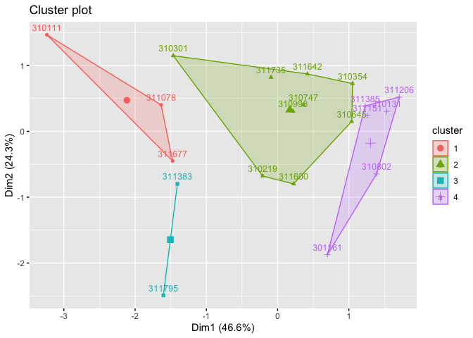

Data of 10 cultivars of rice inoculated with _B. glumae_ or mock inoculated.  Discoloration of spikelets were recorded and presented as percentage.


```r
library(tidyverse)
library(readxl)
library(ggplot2)
```


```r
rice_data <- read_excel("Spray-Data-06.18.20.xlsx", 
                        col_types = c("text", "numeric", "numeric",
                                      "numeric", "numeric","numeric"))
rice_data
```

```
## # A tibble: 320 x 6
##    Genotype   Rep `Mock_30C-22C` `Mock_30C-28C` `Pathogen_30C-2…
##    <chr>    <dbl>          <dbl>          <dbl>            <dbl>
##  1 310111       1           5.88           18.6             86.5
##  2 310111       2           2.48           79.7             82.6
##  3 310111       3           2.9            61.7            100  
##  4 310111       4           0              67.2             86.1
##  5 310111       5           1.76           75.4             98.6
##  6 310111       6           0              76.6             93.8
##  7 310111       7          NA              NA               85.7
##  8 310111       8          NA              NA              100  
##  9 310111       9          NA              NA              100  
## 10 310111      10          NA              NA              100  
## # … with 310 more rows, and 1 more variable: `Pathogen_30C-28C` <dbl>
```

We still have to "reshape" the table to make it in longer format coding a column for treatment (Mock vs Inoculated) and temperature profile (30-22 vs 30-28).


```r
rice_data_long <- rice_data %>% 
  pivot_longer(cols = c("Mock_30C-22C", "Mock_30C-28C", 
                        "Pathogen_30C-22C", "Pathogen_30C-28C"),
               names_to = "Inoculation", 
               values_to = "DiscPerc") %>%
  separate(col = Inoculation, 
            sep = "_",
            into = c("Inoculation", "TempProfile")) %>% 
  unite("Inoc_Temp", Inoculation:TempProfile, remove = FALSE)

#kableExtra::kable(rice_data_long, format = "markdown")
```

# Data Exploration
 
Separating mock from pathogen inoculated:


```r
ggplot(data = rice_data_long, aes(x = Genotype, y = DiscPerc)) +
  geom_boxplot(aes(fill = TempProfile)) +
  facet_grid(. ~ Inoculation) +
  coord_flip()
```

<!-- -->

Looking at genotype effect:


```r
ggplot(data = rice_data_long, aes(x = Inoc_Temp, y = DiscPerc)) +
  geom_boxplot(aes(fill = TempProfile)) +
  facet_wrap(Genotype ~ ., ncol = 5) +
  theme(axis.text.x = element_text(angle = 60, hjust = 1))
```

<!-- -->

# Clustering analysis

Since we are dealing with continous data on four different conditions with need to scale them to estimate their relationships.

## Kmeans


```r
library(FactoMineR)
library(factoextra)
```

```
## Welcome! Want to learn more? See two factoextra-related books at https://goo.gl/ve3WBa
```

```r
library(RColorBrewer)
```


```r
#Need to remove NAs
rice_data_NoNAs <- na.omit(rice_data)

#Scaling data
rice_matrix <- rice_data_NoNAs[,3:6]
row.names(rice_matrix) <- paste0(rice_data_NoNAs$Genotype,"_",rice_data_NoNAs$Rep)
```

```
## Warning: Setting row names on a tibble is deprecated.
```

```r
#K-means
set.seed(123)
(km.res <- kmeans(scale(rice_matrix), 3, nstart = 10))
```

```
## K-means clustering with 3 clusters of sizes 73, 61, 13
## 
## Cluster means:
##   Mock_30C-22C Mock_30C-28C Pathogen_30C-22C Pathogen_30C-28C
## 1   -0.2352621   -0.3567814       -0.7556317       -0.5798089
## 2    0.4009338   -0.1933930        0.7816750        0.4881734
## 3   -0.5602173    2.9109243        0.5753030        0.9651899
## 
## Clustering vector:
## 310111_1 310111_2 310111_3 310111_4 310111_5 310111_6 310131_1 310131_2 
##        2        3        3        3        3        3        1        1 
## 310131_3 310131_4 310131_5 310131_6 310219_1 310219_2 310219_3 310219_4 
##        1        1        1        1        2        1        2        1 
## 310219_5 310219_6 310219_7 310219_8 310301_1 310301_2 310301_3 310301_4 
##        2        2        1        1        2        2        2        2 
## 310301_5 310301_6 310301_7 310354_1 310354_2 310354_3 310354_4 310354_5 
##        2        2        2        1        1        1        1        1 
## 310354_6 310354_7 310645_1 310645_2 310645_3 310645_4 310645_5 310645_6 
##        2        2        2        1        2        1        1        1 
## 310645_7 310645_8 310747_1 310747_2 310747_3 310747_4 310747_5 310747_6 
##        1        1        2        2        2        2        1        2 
## 310747_7 310747_8 310802_1 310802_2 310802_3 310802_4 310802_5 310802_6 
##        1        2        2        1        1        1        1        1 
## 310802_7 310802_8 310998_1 310998_2 310998_3 310998_4 310998_5 310998_6 
##        1        1        2        2        2        2        1        1 
## 310998_7 310998_8 311078_1 311078_2 311078_3 311078_4 311078_5 311078_6 
##        2        2        2        2        3        3        3        2 
## 311151_1 311151_2 311151_3 311151_4 311151_5 311151_6 311151_7 311151_8 
##        2        1        1        1        1        1        1        1 
## 311206_1 311206_2 311206_3 311206_4 311206_5 311206_6 311206_7 311206_8 
##        1        1        1        1        1        1        1        1 
## 311383_1 311383_2 311383_3 311383_4 311383_5 311383_6 311383_7 311383_8 
##        2        2        2        2        2        2        2        2 
## 311385_1 311385_2 311385_3 311385_4 311385_5 311385_6 311385_7 311385_8 
##        1        1        1        1        1        1        1        1 
## 311600_1 311600_2 311600_3 311600_4 311600_5 311600_6 311600_7 311600_8 
##        2        1        1        1        1        1        2        2 
## 311642_1 311642_2 311642_3 311642_4 311642_5 311642_6 311642_7 311642_8 
##        1        1        2        2        2        2        2        1 
## 311677_1 311677_2 311677_3 311677_4 311677_5 311677_6 311677_7 311735_1 
##        2        2        1        1        3        3        3        2 
## 311735_2 311735_3 311735_4 311795_1 311795_2 311795_3 311795_4 311795_5 
##        2        2        2        2        2        2        2        2 
## 311795_6 311795_7 311795_8 301161_1 301161_2 301161_3 301161_4 301161_5 
##        2        1        3        3        1        1        1        1 
## 301161_6 301161_7 301161_8 
##        1        1        1 
## 
## Within cluster sum of squares by cluster:
## [1] 111.86268 173.12423  24.91307
##  (between_SS / total_SS =  46.9 %)
## 
## Available components:
## 
## [1] "cluster"      "centers"      "totss"        "withinss"     "tot.withinss"
## [6] "betweenss"    "size"         "iter"         "ifault"
```

```r
fviz_cluster(km.res, data = rice_matrix, labelsize = 8)
```

<!-- -->

## Hierarchical clustering

```r
#Clustering
rice_hc <- hcut(rice_matrix, 3, stand = T)

#Graphical view
p <- fviz_dend(rice_hc, rect = T, cex=0.4)
```

## PCA

This first one is using FactoMiner, 

```r
#Need to remove NAs
rice_data_NoNAs <- na.omit(rice_data)

#Creating Matrix for analysis
rice_matrix <- rice_data_NoNAs[,3:6]
row.names(rice_matrix) <- paste0(rice_data_NoNAs$Genotype,"_",rice_data_NoNAs$Rep)
```

```
## Warning: Setting row names on a tibble is deprecated.
```

```r
#PCA
rice_PCA <- prcomp(rice_matrix, center = T, scale. = T)


#Since we have 20 cultivars we need a palette with 20 colors
colors_n <- length(unique(rice_data_NoNAs$Genotype))
getPalette <- colorRampPalette(brewer.pal(9, "Dark2"))
```

```
## Warning in brewer.pal(9, "Dark2"): n too large, allowed maximum for palette Dark2 is 8
## Returning the palette you asked for with that many colors
```

```r
(PCA_rice <- fviz_pca_biplot(rice_PCA, col.var = "blue",
                label = "var", repel = T,
                habillage = rice_data_NoNAs$Genotype, addEllipses = TRUE, ellipse.level = 0.95,
             ellipse.type ="confidence") +
  scale_color_manual(values = getPalette(colors_n)) +
  scale_shape_manual(values = c(rep(19, 5), rep(16,5), rep(17,5), rep(18,5))))
```

```
## Scale for 'shape' is already present. Adding another scale for 'shape', which
## will replace the existing scale.
```

<!-- -->


## Scratch


```r
rice_wider <- rice_data %>% pivot_wider(names_from = Rep, names_sep = "_", 
                          values_from = c("Mock_30C-22C", "Mock_30C-28C", 
                          "Pathogen_30C-22C", "Pathogen_30C-28C")) %>%
  column_to_rownames("Genotype")

rice_wider_NoNAs <- rice_data %>% 
  pivot_wider(names_from = Rep, names_sep = "_", 
                          values_from = c("Mock_30C-22C", "Mock_30C-28C", 
                          "Pathogen_30C-22C", "Pathogen_30C-28C")) %>%
  column_to_rownames("Genotype") 
```

