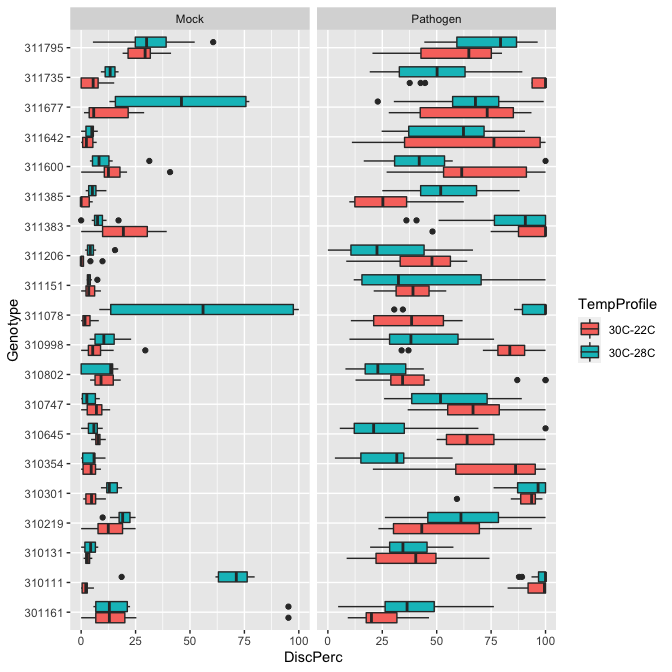
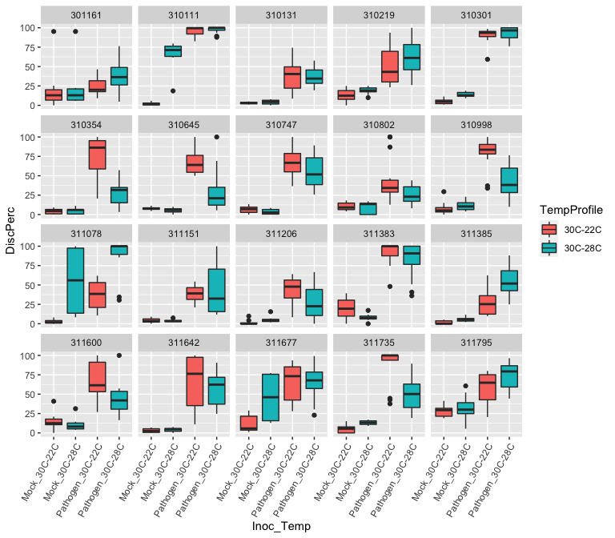
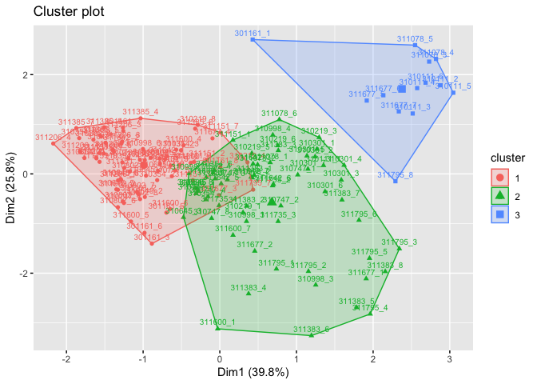
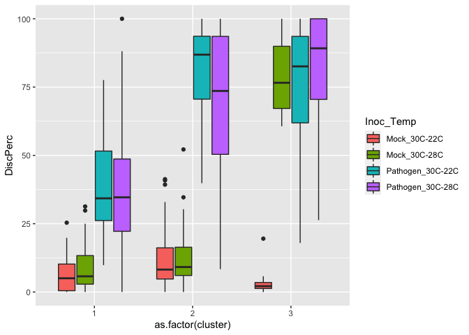
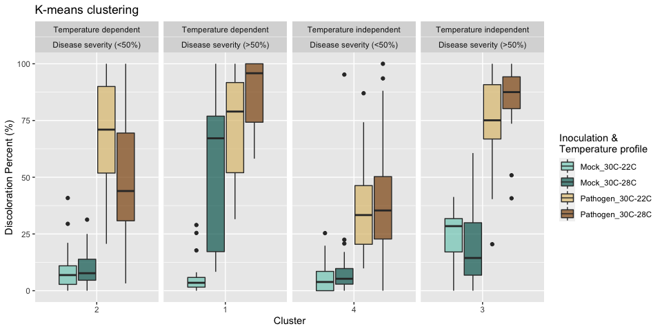
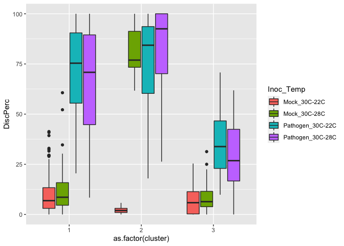
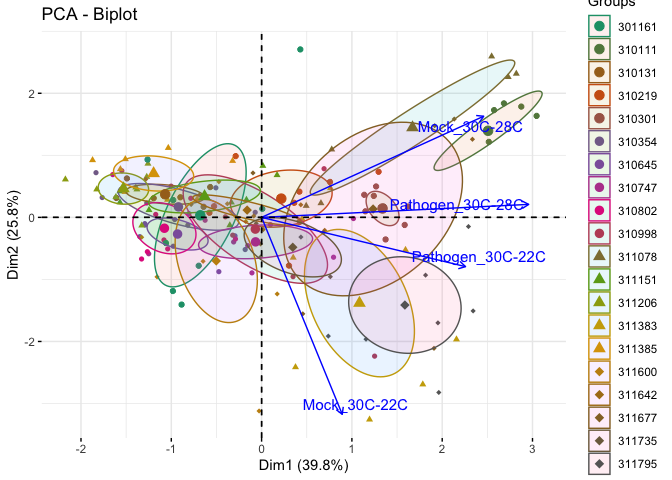

Data of 10 cultivars of rice inoculated with _B. glumae_ or mock inoculated.  Discoloration of spikelets were recorded and presented as percentage.


```r
library(tidyverse)
library(readxl)
library(ggplot2)
```


```r
rice_data <- read_excel("Spray-Data-06.18.20.xlsx", 
                        col_types = c("text", "numeric", "numeric",
                                      "numeric", "numeric","numeric"))
rice_data
```

```
## # A tibble: 320 x 6
##    Genotype   Rep `Mock_30C-22C` `Mock_30C-28C` `Pathogen_30C-2…
##    <chr>    <dbl>          <dbl>          <dbl>            <dbl>
##  1 310111       1           5.88           18.6             86.5
##  2 310111       2           2.48           79.7             82.6
##  3 310111       3           2.9            61.7            100  
##  4 310111       4           0              67.2             86.1
##  5 310111       5           1.76           75.4             98.6
##  6 310111       6           0              76.6             93.8
##  7 310111       7          NA              NA               85.7
##  8 310111       8          NA              NA              100  
##  9 310111       9          NA              NA              100  
## 10 310111      10          NA              NA              100  
## # … with 310 more rows, and 1 more variable: `Pathogen_30C-28C` <dbl>
```

We still have to "reshape" the table to make it in longer format coding a column for treatment (Mock vs Inoculated) and temperature profile (30-22 vs 30-28).


```r
rice_data_long <- rice_data %>% 
  pivot_longer(cols = c("Mock_30C-22C", "Mock_30C-28C", 
                        "Pathogen_30C-22C", "Pathogen_30C-28C"),
               names_to = "Inoculation", 
               values_to = "DiscPerc") %>%
  separate(col = Inoculation, 
            sep = "_",
            into = c("Inoculation", "TempProfile")) %>% 
  unite("Inoc_Temp", Inoculation:TempProfile, remove = FALSE)

#kableExtra::kable(rice_data_long, format = "markdown")
```

# Data Exploration
 
Separating mock from pathogen inoculated:


```r
ggplot(data = rice_data_long, aes(x = Genotype, y = DiscPerc)) +
  geom_boxplot(aes(fill = TempProfile)) +
  facet_grid(. ~ Inoculation) +
  coord_flip()
```

<!-- -->

Looking at genotype effect:


```r
ggplot(data = rice_data_long, aes(x = Inoc_Temp, y = DiscPerc)) +
  geom_boxplot(aes(fill = TempProfile)) +
  facet_wrap(Genotype ~ ., ncol = 5) +
  theme(axis.text.x = element_text(angle = 60, hjust = 1))
```

<!-- -->

# Clustering analysis

Since we are dealing with continous data on four different conditions with need to scale them to estimate their relationships.

## Kmeans


```r
library(FactoMineR)
library(factoextra)
```

```
## Welcome! Want to learn more? See two factoextra-related books at https://goo.gl/ve3WBa
```

```r
library(RColorBrewer)
```


```r
#Need to remove NAs
rice_data_NoNAs <- na.omit(rice_data)

#Scaling data
rice_matrix <- rice_data_NoNAs[,3:6]
row.names(rice_matrix) <- paste0(rice_data_NoNAs$Genotype,"_",rice_data_NoNAs$Rep)
```

```
## Warning: Setting row names on a tibble is deprecated.
```

```r
#K-means
set.seed(123)
km.res <- kmeans(scale(rice_matrix), 3, nstart = 10)

fviz_cluster(km.res, data = rice_matrix, labelsize = 8)
```

<!-- -->


```r
#Data Clusters
rice_Kcluster <- cbind(rice_data_NoNAs, km.res$cluster)

rice_Kcluster_data <- rice_Kcluster %>%
  pivot_longer(cols = c("Mock_30C-22C", "Mock_30C-28C", 
                        "Pathogen_30C-22C", "Pathogen_30C-28C"),
               names_to = "Inoculation", 
               values_to = "DiscPerc") %>%
  separate(col = Inoculation, 
            sep = "_",
            into = c("Inoculation", "TempProfile")) %>% 
  unite("Inoc_Temp", Inoculation:TempProfile, remove = FALSE) %>%
  rename(cluster = `km.res$cluster`)

ggplot(rice_Kcluster_data, aes(x = as.factor(cluster), y = DiscPerc)) + 
  geom_boxplot(aes(fill = Inoc_Temp))
```

<!-- -->


```r
(Kmeans_tolerant <- tibble(rice_Kcluster_data) %>% 
  filter(cluster == 1) %>%
  group_by(Genotype) %>%
  count(Genotype))
```

```
## # A tibble: 15 x 2
## # Groups:   Genotype [15]
##    Genotype     n
##    <chr>    <int>
##  1 301161      28
##  2 310131      24
##  3 310219      16
##  4 310354      20
##  5 310645      24
##  6 310747       8
##  7 310802      28
##  8 310998       8
##  9 311151      28
## 10 311206      32
## 11 311385      32
## 12 311600      20
## 13 311642      12
## 14 311677       8
## 15 311795       4
```


## Hierarchical clustering

```r
#Clustering
rice_hc <- hcut(rice_matrix, 3, stand = T)

#Graphical view
p <- fviz_dend(rice_hc, rect = T, cex=0.4)
p
```

<!-- -->

```r
#Data Clusters
rice_cluster <- cbind(rice_data_NoNAs, rice_hc$cluster)

rice_cluster_data <- rice_cluster %>%
  pivot_longer(cols = c("Mock_30C-22C", "Mock_30C-28C", 
                        "Pathogen_30C-22C", "Pathogen_30C-28C"),
               names_to = "Inoculation", 
               values_to = "DiscPerc") %>%
  separate(col = Inoculation, 
            sep = "_",
            into = c("Inoculation", "TempProfile")) %>% 
  unite("Inoc_Temp", Inoculation:TempProfile, remove = FALSE) %>%
  rename(cluster = `rice_hc$cluster`)

ggplot(rice_cluster_data, aes(x = as.factor(cluster), y = DiscPerc)) + 
  geom_boxplot(aes(fill = Inoc_Temp))
```

<!-- -->


```r
(cluster_tolerant <- tibble(rice_cluster_data) %>% 
  filter(cluster == 3) %>%
  group_by(Genotype) %>%
  count(Genotype))
```

```
## # A tibble: 14 x 2
## # Groups:   Genotype [14]
##    Genotype     n
##    <chr>    <int>
##  1 301161      24
##  2 310131      16
##  3 310219       8
##  4 310354      12
##  5 310645      16
##  6 310747       4
##  7 310802      28
##  8 310998       8
##  9 311151      12
## 10 311206      32
## 11 311385      28
## 12 311600      16
## 13 311642       8
## 14 311677       4
```
### Comparing hierarchical clusters and kmean clustering


```r
full_join(Kmeans_tolerant, cluster_tolerant, by = "Genotype") %>%
  rename(Kmeans = n.x, H_cluster = n.y)
```

```
## # A tibble: 15 x 3
## # Groups:   Genotype [15]
##    Genotype Kmeans H_cluster
##    <chr>     <int>     <int>
##  1 301161       28        24
##  2 310131       24        16
##  3 310219       16         8
##  4 310354       20        12
##  5 310645       24        16
##  6 310747        8         4
##  7 310802       28        28
##  8 310998        8         8
##  9 311151       28        12
## 10 311206       32        32
## 11 311385       32        28
## 12 311600       20        16
## 13 311642       12         8
## 14 311677        8         4
## 15 311795        4        NA
```


## PCA

This first one is using FactoMiner, 

```r
#Need to remove NAs
rice_data_NoNAs <- na.omit(rice_data)

#Creating Matrix for analysis
rice_matrix <- rice_data_NoNAs[,3:6]
row.names(rice_matrix) <- paste0(rice_data_NoNAs$Genotype,"_",rice_data_NoNAs$Rep)
```

```
## Warning: Setting row names on a tibble is deprecated.
```

```r
#PCA
rice_PCA <- prcomp(rice_matrix, center = T, scale. = T)


#Since we have 20 cultivars we need a palette with 20 colors
colors_n <- length(unique(rice_data_NoNAs$Genotype))
getPalette <- colorRampPalette(brewer.pal(9, "Dark2"))
```

```
## Warning in brewer.pal(9, "Dark2"): n too large, allowed maximum for palette Dark2 is 8
## Returning the palette you asked for with that many colors
```

```r
(PCA_rice <- fviz_pca_biplot(rice_PCA, col.var = "blue",
                label = "var", repel = T,
                habillage = rice_data_NoNAs$Genotype, addEllipses = TRUE, ellipse.level = 0.95,
             ellipse.type ="confidence") +
  scale_color_manual(values = getPalette(colors_n)) +
  scale_shape_manual(values = c(rep(19, 5), rep(16,5), rep(17,5), rep(18,5))))
```

```
## Scale for 'shape' is already present. Adding another scale for 'shape', which
## will replace the existing scale.
```

<!-- -->

```r
plotly::ggplotly(PCA_rice)
```

```
## Warning in geom2trace.default(dots[[1L]][[1L]], dots[[2L]][[1L]], dots[[3L]][[1L]]): geom_GeomTextRepel() has yet to be implemented in plotly.
##   If you'd like to see this geom implemented,
##   Please open an issue with your example code at
##   https://github.com/ropensci/plotly/issues
```

<!--html_preserve--><div id="htmlwidget-44474b3e8cd160f85a98" style="width:672px;height:480px;" class="plotly html-widget"></div>
<script type="application/json" data-for="htmlwidget-44474b3e8cd160f85a98">{"x":{"data":[{"x":[0.428754866530684,-1.05894998139883,-0.886000758715872,-0.978775780794435,-0.696397324288273,-0.981963084093934,-1.26307309274025,0.00749206602812935],"y":[2.7067898098246,-0.41365615250887,-1.40564398496272,0.278277298892686,-0.779738294644403,-1.18689113237182,0.93160560972706,0.136753926279323],"text":["Groups: 301161<br />Groups: 301161<br />x:  0.428754867<br />y:  2.706789810<br />x:  0.428754867<br />y:  2.706789810","Groups: 301161<br />Groups: 301161<br />x: -1.058949981<br />y: -0.413656153<br />x: -1.058949981<br />y: -0.413656153","Groups: 301161<br />Groups: 301161<br />x: -0.886000759<br />y: -1.405643985<br />x: -0.886000759<br />y: -1.405643985","Groups: 301161<br />Groups: 301161<br />x: -0.978775781<br />y:  0.278277299<br />x: -0.978775781<br />y:  0.278277299","Groups: 301161<br />Groups: 301161<br />x: -0.696397324<br />y: -0.779738295<br />x: -0.696397324<br />y: -0.779738295","Groups: 301161<br />Groups: 301161<br />x: -0.981963084<br />y: -1.186891132<br />x: -0.981963084<br />y: -1.186891132","Groups: 301161<br />Groups: 301161<br />x: -1.263073093<br />y:  0.931605610<br />x: -1.263073093<br />y:  0.931605610","Groups: 301161<br />Groups: 301161<br />x:  0.007492066<br />y:  0.136753926<br />x:  0.007492066<br />y:  0.136753926"],"type":"scatter","mode":"markers","marker":{"autocolorscale":false,"color":"rgba(27,158,119,1)","opacity":1,"size":5.66929133858268,"symbol":"circle","line":{"width":1.88976377952756,"color":"rgba(27,158,119,1)"}},"hoveron":"points","name":"(301161,1)","legendgroup":"(301161,1)","showlegend":true,"xaxis":"x","yaxis":"y","hoverinfo":"text","frame":null},{"x":[1.3528569226858,2.87565273058424,2.51622698330187,2.57448549048662,3.04546292293709,2.68394339812711],"y":[0.170415529324422,1.78547947402771,1.21672954441363,1.72868930138733,1.63546822292412,1.83758364406896],"text":["Groups: 310111<br />Groups: 310111<br />x:  1.352856923<br />y:  0.170415529<br />x:  1.352856923<br />y:  0.170415529","Groups: 310111<br />Groups: 310111<br />x:  2.875652731<br />y:  1.785479474<br />x:  2.875652731<br />y:  1.785479474","Groups: 310111<br />Groups: 310111<br />x:  2.516226983<br />y:  1.216729544<br />x:  2.516226983<br />y:  1.216729544","Groups: 310111<br />Groups: 310111<br />x:  2.574485490<br />y:  1.728689301<br />x:  2.574485490<br />y:  1.728689301","Groups: 310111<br />Groups: 310111<br />x:  3.045462923<br />y:  1.635468223<br />x:  3.045462923<br />y:  1.635468223","Groups: 310111<br />Groups: 310111<br />x:  2.683943398<br />y:  1.837583644<br />x:  2.683943398<br />y:  1.837583644"],"type":"scatter","mode":"markers","marker":{"autocolorscale":false,"color":"rgba(97,134,75,1)","opacity":1,"size":5.66929133858268,"symbol":"circle","line":{"width":1.88976377952756,"color":"rgba(97,134,75,1)"}},"hoveron":"points","name":"(310111,1)","legendgroup":"(310111,1)","showlegend":true,"xaxis":"x","yaxis":"y","hoverinfo":"text","frame":null},{"x":[-1.19481188727825,-0.56911718428063,-1.60911027875657,-0.89947508361714,-0.642098132252635,-1.49138612870943],"y":[0.309279795958273,0.488324798431476,0.313160030985724,0.323671557462748,0.170383001975025,0.627803523979234],"text":["Groups: 310131<br />Groups: 310131<br />x: -1.194811887<br />y:  0.309279796<br />x: -1.194811887<br />y:  0.309279796","Groups: 310131<br />Groups: 310131<br />x: -0.569117184<br />y:  0.488324798<br />x: -0.569117184<br />y:  0.488324798","Groups: 310131<br />Groups: 310131<br />x: -1.609110279<br />y:  0.313160031<br />x: -1.609110279<br />y:  0.313160031","Groups: 310131<br />Groups: 310131<br />x: -0.899475084<br />y:  0.323671557<br />x: -0.899475084<br />y:  0.323671557","Groups: 310131<br />Groups: 310131<br />x: -0.642098132<br />y:  0.170383002<br />x: -0.642098132<br />y:  0.170383002","Groups: 310131<br />Groups: 310131<br />x: -1.491386129<br />y:  0.627803524<br />x: -1.491386129<br />y:  0.627803524"],"type":"scatter","mode":"markers","marker":{"autocolorscale":false,"color":"rgba(166,111,32,1)","opacity":1,"size":5.66929133858268,"symbol":"circle","line":{"width":1.88976377952756,"color":"rgba(166,111,32,1)"}},"hoveron":"points","name":"(310131,1)","legendgroup":"(310131,1)","showlegend":true,"xaxis":"x","yaxis":"y","hoverinfo":"text","frame":null},{"x":[0.303406347644788,-0.526356036010942,1.29567870045558,0.360862383597019,0.418270409535253,0.757298348761385,-0.577878329725624,-0.286868510000535],"y":[-0.777840020942401,0.180227338955452,0.734878103453366,0.234317204728849,0.414629887465309,0.571217817718755,0.074009876367719,0.987362246837734],"text":["Groups: 310219<br />Groups: 310219<br />x:  0.303406348<br />y: -0.777840021<br />x:  0.303406348<br />y: -0.777840021","Groups: 310219<br />Groups: 310219<br />x: -0.526356036<br />y:  0.180227339<br />x: -0.526356036<br />y:  0.180227339","Groups: 310219<br />Groups: 310219<br />x:  1.295678700<br />y:  0.734878103<br />x:  1.295678700<br />y:  0.734878103","Groups: 310219<br />Groups: 310219<br />x:  0.360862384<br />y:  0.234317205<br />x:  0.360862384<br />y:  0.234317205","Groups: 310219<br />Groups: 310219<br />x:  0.418270410<br />y:  0.414629887<br />x:  0.418270410<br />y:  0.414629887","Groups: 310219<br />Groups: 310219<br />x:  0.757298349<br />y:  0.571217818<br />x:  0.757298349<br />y:  0.571217818","Groups: 310219<br />Groups: 310219<br />x: -0.577878330<br />y:  0.074009876<br />x: -0.577878330<br />y:  0.074009876","Groups: 310219<br />Groups: 310219<br />x: -0.286868510<br />y:  0.987362247<br />x: -0.286868510<br />y:  0.987362247"],"type":"scatter","mode":"markers","marker":{"autocolorscale":false,"color":"rgba(206,96,20,1)","opacity":1,"size":5.66929133858268,"symbol":"circle","line":{"width":1.88976377952756,"color":"rgba(206,96,20,1)"}},"hoveron":"points","name":"(310219,1)","legendgroup":"(310219,1)","showlegend":true,"xaxis":"x","yaxis":"y","hoverinfo":"text","frame":null},{"x":[1.26782963993607,1.24263753213703,1.58467931789629,1.62146894469484,1.13671807870443,1.37300347855872,1.14977273131033],"y":[0.498365779911383,0.346500848448547,-0.12205927797113,0.175476834471188,0.36365648791736,-0.355737559125877,0.0978236451471574],"text":["Groups: 310301<br />Groups: 310301<br />x:  1.267829640<br />y:  0.498365780<br />x:  1.267829640<br />y:  0.498365780","Groups: 310301<br />Groups: 310301<br />x:  1.242637532<br />y:  0.346500848<br />x:  1.242637532<br />y:  0.346500848","Groups: 310301<br />Groups: 310301<br />x:  1.584679318<br />y: -0.122059278<br />x:  1.584679318<br />y: -0.122059278","Groups: 310301<br />Groups: 310301<br />x:  1.621468945<br />y:  0.175476834<br />x:  1.621468945<br />y:  0.175476834","Groups: 310301<br />Groups: 310301<br />x:  1.136718079<br />y:  0.363656488<br />x:  1.136718079<br />y:  0.363656488","Groups: 310301<br />Groups: 310301<br />x:  1.373003479<br />y: -0.355737559<br />x:  1.373003479<br />y: -0.355737559","Groups: 310301<br />Groups: 310301<br />x:  1.149772731<br />y:  0.097823645<br />x:  1.149772731<br />y:  0.097823645"],"type":"scatter","mode":"markers","marker":{"autocolorscale":false,"color":"rgba(169,103,85,1)","opacity":1,"size":5.66929133858268,"symbol":"circle","line":{"width":1.88976377952756,"color":"rgba(169,103,85,1)"}},"hoveron":"points","name":"(310301,1)","legendgroup":"(310301,1)","showlegend":true,"xaxis":"x","yaxis":"y","hoverinfo":"text","frame":null},{"x":[-1.76550352794835,-0.816774072947555,-0.506452467128616,-1.27149283311828,-1.8338298040957,-0.0708505305824824,-0.181746212675422],"y":[0.319713788145105,-0.125593188063343,0.476216264685864,0.232130106292,0.72047205729896,0.0807446897060464,-0.51847907530085],"text":["Groups: 310354<br />Groups: 310354<br />x: -1.765503528<br />y:  0.319713788<br />x: -1.765503528<br />y:  0.319713788","Groups: 310354<br />Groups: 310354<br />x: -0.816774073<br />y: -0.125593188<br />x: -0.816774073<br />y: -0.125593188","Groups: 310354<br />Groups: 310354<br />x: -0.506452467<br />y:  0.476216265<br />x: -0.506452467<br />y:  0.476216265","Groups: 310354<br />Groups: 310354<br />x: -1.271492833<br />y:  0.232130106<br />x: -1.271492833<br />y:  0.232130106","Groups: 310354<br />Groups: 310354<br />x: -1.833829804<br />y:  0.720472057<br />x: -1.833829804<br />y:  0.720472057","Groups: 310354<br />Groups: 310354<br />x: -0.070850531<br />y:  0.080744690<br />x: -0.070850531<br />y:  0.080744690","Groups: 310354<br />Groups: 310354<br />x: -0.181746213<br />y: -0.518479075<br />x: -0.181746213<br />y: -0.518479075"],"type":"scatter","mode":"markers","marker":{"autocolorscale":false,"color":"rgba(132,109,151,1)","opacity":1,"size":5.66929133858268,"symbol":"circle","line":{"width":1.88976377952756,"color":"rgba(132,109,151,1)"}},"hoveron":"points","name":"(310354,1)","legendgroup":"(310354,1)","showlegend":true,"xaxis":"x","yaxis":"y","hoverinfo":"text","frame":null},{"x":[-0.294516145364468,-0.977787320725916,-0.473378506998343,-0.805339181739089,-1.34905857857588,-1.29314020840002,-0.962442913170385,-1.28860673718334],"y":[-0.297634554055148,-0.465208041572824,-0.874833128618256,0.0616036912946782,-0.311025396628654,-0.101249418979878,-0.034657285373597,-0.122640165934315],"text":["Groups: 310645<br />Groups: 310645<br />x: -0.294516145<br />y: -0.297634554<br />x: -0.294516145<br />y: -0.297634554","Groups: 310645<br />Groups: 310645<br />x: -0.977787321<br />y: -0.465208042<br />x: -0.977787321<br />y: -0.465208042","Groups: 310645<br />Groups: 310645<br />x: -0.473378507<br />y: -0.874833129<br />x: -0.473378507<br />y: -0.874833129","Groups: 310645<br />Groups: 310645<br />x: -0.805339182<br />y:  0.061603691<br />x: -0.805339182<br />y:  0.061603691","Groups: 310645<br />Groups: 310645<br />x: -1.349058579<br />y: -0.311025397<br />x: -1.349058579<br />y: -0.311025397","Groups: 310645<br />Groups: 310645<br />x: -1.293140208<br />y: -0.101249419<br />x: -1.293140208<br />y: -0.101249419","Groups: 310645<br />Groups: 310645<br />x: -0.962442913<br />y: -0.034657285<br />x: -0.962442913<br />y: -0.034657285","Groups: 310645<br />Groups: 310645<br />x: -1.288606737<br />y: -0.122640166<br />x: -1.288606737<br />y: -0.122640166"],"type":"scatter","mode":"markers","marker":{"autocolorscale":false,"color":"rgba(141,97,170,1)","opacity":1,"size":5.66929133858268,"symbol":"circle","line":{"width":1.88976377952756,"color":"rgba(141,97,170,1)"}},"hoveron":"points","name":"(310645,1)","legendgroup":"(310645,1)","showlegend":true,"xaxis":"x","yaxis":"y","hoverinfo":"text","frame":null},{"x":[1.01716160843285,0.796714785688927,0.098216914231189,-0.153476695998194,-0.625613558587407,-0.309557174001524,-1.25017456589362,-0.106845321820667],"y":[-0.0188657883465358,-0.642278535823435,-0.11789795011927,-0.45575138103411,-0.0460608735272305,-0.396295662675752,-0.586352651894407,-0.894310106426142],"text":["Groups: 310747<br />Groups: 310747<br />x:  1.017161608<br />y: -0.018865788<br />x:  1.017161608<br />y: -0.018865788","Groups: 310747<br />Groups: 310747<br />x:  0.796714786<br />y: -0.642278536<br />x:  0.796714786<br />y: -0.642278536","Groups: 310747<br />Groups: 310747<br />x:  0.098216914<br />y: -0.117897950<br />x:  0.098216914<br />y: -0.117897950","Groups: 310747<br />Groups: 310747<br />x: -0.153476696<br />y: -0.455751381<br />x: -0.153476696<br />y: -0.455751381","Groups: 310747<br />Groups: 310747<br />x: -0.625613559<br />y: -0.046060874<br />x: -0.625613559<br />y: -0.046060874","Groups: 310747<br />Groups: 310747<br />x: -0.309557174<br />y: -0.396295663<br />x: -0.309557174<br />y: -0.396295663","Groups: 310747<br />Groups: 310747<br />x: -1.250174566<br />y: -0.586352652<br />x: -1.250174566<br />y: -0.586352652","Groups: 310747<br />Groups: 310747<br />x: -0.106845322<br />y: -0.894310106<br />x: -0.106845322<br />y: -0.894310106"],"type":"scatter","mode":"markers","marker":{"autocolorscale":false,"color":"rgba(183,70,155,1)","opacity":1,"size":5.66929133858268,"symbol":"circle","line":{"width":1.88976377952756,"color":"rgba(183,70,155,1)"}},"hoveron":"points","name":"(310747,1)","legendgroup":"(310747,1)","showlegend":true,"xaxis":"x","yaxis":"y","hoverinfo":"text","frame":null},{"x":[-0.289310374010833,-0.784036132557426,-1.1723804054039,-1.64848899329752,-1.26496486614237,-1.32909003907714,-1.08113274793371,-1.03981897225133],"y":[-0.348250971428404,0.307077828226004,0.0474954560207584,0.689214632478021,-0.553535555613558,-0.670872307029813,-0.363886195690034,-0.507816221849851],"text":["Groups: 310802<br />Groups: 310802<br />x: -0.289310374<br />y: -0.348250971<br />x: -0.289310374<br />y: -0.348250971","Groups: 310802<br />Groups: 310802<br />x: -0.784036133<br />y:  0.307077828<br />x: -0.784036133<br />y:  0.307077828","Groups: 310802<br />Groups: 310802<br />x: -1.172380405<br />y:  0.047495456<br />x: -1.172380405<br />y:  0.047495456","Groups: 310802<br />Groups: 310802<br />x: -1.648488993<br />y:  0.689214632<br />x: -1.648488993<br />y:  0.689214632","Groups: 310802<br />Groups: 310802<br />x: -1.264964866<br />y: -0.553535556<br />x: -1.264964866<br />y: -0.553535556","Groups: 310802<br />Groups: 310802<br />x: -1.329090039<br />y: -0.670872307<br />x: -1.329090039<br />y: -0.670872307","Groups: 310802<br />Groups: 310802<br />x: -1.081132748<br />y: -0.363886196<br />x: -1.081132748<br />y: -0.363886196","Groups: 310802<br />Groups: 310802<br />x: -1.039818972<br />y: -0.507816222<br />x: -1.039818972<br />y: -0.507816222"],"type":"scatter","mode":"markers","marker":{"autocolorscale":false,"color":"rgba(225,44,140,1)","opacity":1,"size":5.66929133858268,"symbol":"circle","line":{"width":1.88976377952756,"color":"rgba(225,44,140,1)"}},"hoveron":"points","name":"(310802,1)","legendgroup":"(310802,1)","showlegend":true,"xaxis":"x","yaxis":"y","hoverinfo":"text","frame":null},{"x":[0.348272011443129,0.424820185809269,1.25145555885951,0.691812229772235,-1.54782162415284,-1.002004307799,-0.401314007699105,-0.319931770904661],"y":[-0.955488950416689,-0.0783895084657741,-2.23640227635641,0.784221900921103,0.750766971928643,0.50255619350889,0.00880164169150266,-0.287068388378689],"text":["Groups: 310998<br />Groups: 310998<br />x:  0.348272011<br />y: -0.955488950<br />x:  0.348272011<br />y: -0.955488950","Groups: 310998<br />Groups: 310998<br />x:  0.424820186<br />y: -0.078389508<br />x:  0.424820186<br />y: -0.078389508","Groups: 310998<br />Groups: 310998<br />x:  1.251455559<br />y: -2.236402276<br />x:  1.251455559<br />y: -2.236402276","Groups: 310998<br />Groups: 310998<br />x:  0.691812230<br />y:  0.784221901<br />x:  0.691812230<br />y:  0.784221901","Groups: 310998<br />Groups: 310998<br />x: -1.547821624<br />y:  0.750766972<br />x: -1.547821624<br />y:  0.750766972","Groups: 310998<br />Groups: 310998<br />x: -1.002004308<br />y:  0.502556194<br />x: -1.002004308<br />y:  0.502556194","Groups: 310998<br />Groups: 310998<br />x: -0.401314008<br />y:  0.008801642<br />x: -0.401314008<br />y:  0.008801642","Groups: 310998<br />Groups: 310998<br />x: -0.319931771<br />y: -0.287068388<br />x: -0.319931771<br />y: -0.287068388"],"type":"scatter","mode":"markers","marker":{"autocolorscale":false,"color":"rgba(190,80,103,1)","opacity":1,"size":5.66929133858268,"symbol":"circle","line":{"width":1.88976377952756,"color":"rgba(190,80,103,1)"}},"hoveron":"points","name":"(310998,1)","legendgroup":"(310998,1)","showlegend":true,"xaxis":"x","yaxis":"y","hoverinfo":"text","frame":null},{"x":[0.657269977791302,0.493545802802014,2.73088704639769,2.82055402028565,2.54750413606004,0.776688146561565],"y":[0.229050975236979,0.186275969579854,2.26237789485355,2.31593058471477,2.5944303222713,1.09507130265855],"text":["Groups: 311078<br />Groups: 311078<br />x:  0.657269978<br />y:  0.229050975<br />x:  0.657269978<br />y:  0.229050975","Groups: 311078<br />Groups: 311078<br />x:  0.493545803<br />y:  0.186275970<br />x:  0.493545803<br />y:  0.186275970","Groups: 311078<br />Groups: 311078<br />x:  2.730887046<br />y:  2.262377895<br />x:  2.730887046<br />y:  2.262377895","Groups: 311078<br />Groups: 311078<br />x:  2.820554020<br />y:  2.315930585<br />x:  2.820554020<br />y:  2.315930585","Groups: 311078<br />Groups: 311078<br />x:  2.547504136<br />y:  2.594430322<br />x:  2.547504136<br />y:  2.594430322","Groups: 311078<br />Groups: 311078<br />x:  0.776688147<br />y:  1.095071303<br />x:  0.776688147<br />y:  1.095071303"],"type":"scatter","mode":"markers","marker":{"autocolorscale":false,"color":"rgba(142,126,64,1)","opacity":1,"size":5.66929133858268,"symbol":"triangle-up","line":{"width":1.88976377952756,"color":"rgba(142,126,64,1)"}},"hoveron":"points","name":"(311078,1)","legendgroup":"(311078,1)","showlegend":true,"xaxis":"x","yaxis":"y","hoverinfo":"text","frame":null},{"x":[0.17121778649188,-0.167688162320216,-0.351926500171095,-0.334739880983711,-1.24715261595089,-1.56916423192777,0.0137554715466038,-1.56838729985801],"y":[0.681721133296401,0.283871645271781,-0.127027338756261,0.24173491510298,0.118365290426215,0.420630664977949,0.831040045071636,0.242893197229209],"text":["Groups: 311151<br />Groups: 311151<br />x:  0.171217786<br />y:  0.681721133<br />x:  0.171217786<br />y:  0.681721133","Groups: 311151<br />Groups: 311151<br />x: -0.167688162<br />y:  0.283871645<br />x: -0.167688162<br />y:  0.283871645","Groups: 311151<br />Groups: 311151<br />x: -0.351926500<br />y: -0.127027339<br />x: -0.351926500<br />y: -0.127027339","Groups: 311151<br />Groups: 311151<br />x: -0.334739881<br />y:  0.241734915<br />x: -0.334739881<br />y:  0.241734915","Groups: 311151<br />Groups: 311151<br />x: -1.247152616<br />y:  0.118365290<br />x: -1.247152616<br />y:  0.118365290","Groups: 311151<br />Groups: 311151<br />x: -1.569164232<br />y:  0.420630665<br />x: -1.569164232<br />y:  0.420630665","Groups: 311151<br />Groups: 311151<br />x:  0.013755472<br />y:  0.831040045<br />x:  0.013755472<br />y:  0.831040045","Groups: 311151<br />Groups: 311151<br />x: -1.568387300<br />y:  0.242893197<br />x: -1.568387300<br />y:  0.242893197"],"type":"scatter","mode":"markers","marker":{"autocolorscale":false,"color":"rgba(108,166,28,1)","opacity":1,"size":5.66929133858268,"symbol":"triangle-up","line":{"width":1.88976377952756,"color":"rgba(108,166,28,1)"}},"hoveron":"points","name":"(311151,1)","legendgroup":"(311151,1)","showlegend":true,"xaxis":"x","yaxis":"y","hoverinfo":"text","frame":null},{"x":[-1.32694676953112,-1.61354851567289,-1.25843758350842,-2.17276618441533,-1.3805796917523,-1.3931731385214,-1.82565995893801,-1.27187224011682],"y":[-0.130395500593232,0.327922414295456,0.866194983017397,0.611908373516926,0.451374997968667,0.48276233042243,0.451127760081995,0.653500890862853],"text":["Groups: 311206<br />Groups: 311206<br />x: -1.326946770<br />y: -0.130395501<br />x: -1.326946770<br />y: -0.130395501","Groups: 311206<br />Groups: 311206<br />x: -1.613548516<br />y:  0.327922414<br />x: -1.613548516<br />y:  0.327922414","Groups: 311206<br />Groups: 311206<br />x: -1.258437584<br />y:  0.866194983<br />x: -1.258437584<br />y:  0.866194983","Groups: 311206<br />Groups: 311206<br />x: -2.172766184<br />y:  0.611908374<br />x: -2.172766184<br />y:  0.611908374","Groups: 311206<br />Groups: 311206<br />x: -1.380579692<br />y:  0.451374998<br />x: -1.380579692<br />y:  0.451374998","Groups: 311206<br />Groups: 311206<br />x: -1.393173139<br />y:  0.482762330<br />x: -1.393173139<br />y:  0.482762330","Groups: 311206<br />Groups: 311206<br />x: -1.825659959<br />y:  0.451127760<br />x: -1.825659959<br />y:  0.451127760","Groups: 311206<br />Groups: 311206<br />x: -1.271872240<br />y:  0.653500891<br />x: -1.271872240<br />y:  0.653500891"],"type":"scatter","mode":"markers","marker":{"autocolorscale":false,"color":"rgba(155,168,18,1)","opacity":1,"size":5.66929133858268,"symbol":"triangle-up","line":{"width":1.88976377952756,"color":"rgba(155,168,18,1)"}},"hoveron":"points","name":"(311206,1)","legendgroup":"(311206,1)","showlegend":true,"xaxis":"x","yaxis":"y","hoverinfo":"text","frame":null},{"x":[0.448216529981207,0.350147534432796,0.7633020568351,0.375473048583077,1.78503668608275,1.19536340163168,1.59371098879207,2.1580623860643],"y":[-0.0247555656886448,-0.648671685346454,0.471758212800782,-2.41388651562285,-2.69160086096874,-3.25773675378479,-0.523791437322451,-1.96616534910016],"text":["Groups: 311383<br />Groups: 311383<br />x:  0.448216530<br />y: -0.024755566<br />x:  0.448216530<br />y: -0.024755566","Groups: 311383<br />Groups: 311383<br />x:  0.350147534<br />y: -0.648671685<br />x:  0.350147534<br />y: -0.648671685","Groups: 311383<br />Groups: 311383<br />x:  0.763302057<br />y:  0.471758213<br />x:  0.763302057<br />y:  0.471758213","Groups: 311383<br />Groups: 311383<br />x:  0.375473049<br />y: -2.413886516<br />x:  0.375473049<br />y: -2.413886516","Groups: 311383<br />Groups: 311383<br />x:  1.785036686<br />y: -2.691600861<br />x:  1.785036686<br />y: -2.691600861","Groups: 311383<br />Groups: 311383<br />x:  1.195363402<br />y: -3.257736754<br />x:  1.195363402<br />y: -3.257736754","Groups: 311383<br />Groups: 311383<br />x:  1.593710989<br />y: -0.523791437<br />x:  1.593710989<br />y: -0.523791437","Groups: 311383<br />Groups: 311383<br />x:  2.158062386<br />y: -1.966165349<br />x:  2.158062386<br />y: -1.966165349"],"type":"scatter","mode":"markers","marker":{"autocolorscale":false,"color":"rgba(203,169,7,1)","opacity":1,"size":5.66929133858268,"symbol":"triangle-up","line":{"width":1.88976377952756,"color":"rgba(203,169,7,1)"}},"hoveron":"points","name":"(311383,1)","legendgroup":"(311383,1)","showlegend":true,"xaxis":"x","yaxis":"y","hoverinfo":"text","frame":null},{"x":[-1.56362694479038,-0.713498349662398,-1.04155156431131,-1.03328868965119,-1.51303335494073,-0.320978156088206,-1.8718856203315,-1.50886110001735],"y":[0.777728811106357,0.296795743087847,0.284780587505163,1.11974413606436,0.410548894992883,0.91084603272642,0.922733838857772,0.93899375053994],"text":["Groups: 311385<br />Groups: 311385<br />x: -1.563626945<br />y:  0.777728811<br />x: -1.563626945<br />y:  0.777728811","Groups: 311385<br />Groups: 311385<br />x: -0.713498350<br />y:  0.296795743<br />x: -0.713498350<br />y:  0.296795743","Groups: 311385<br />Groups: 311385<br />x: -1.041551564<br />y:  0.284780588<br />x: -1.041551564<br />y:  0.284780588","Groups: 311385<br />Groups: 311385<br />x: -1.033288690<br />y:  1.119744136<br />x: -1.033288690<br />y:  1.119744136","Groups: 311385<br />Groups: 311385<br />x: -1.513033355<br />y:  0.410548895<br />x: -1.513033355<br />y:  0.410548895","Groups: 311385<br />Groups: 311385<br />x: -0.320978156<br />y:  0.910846033<br />x: -0.320978156<br />y:  0.910846033","Groups: 311385<br />Groups: 311385<br />x: -1.871885620<br />y:  0.922733839<br />x: -1.871885620<br />y:  0.922733839","Groups: 311385<br />Groups: 311385<br />x: -1.508861100<br />y:  0.938993751<br />x: -1.508861100<br />y:  0.938993751"],"type":"scatter","mode":"markers","marker":{"autocolorscale":false,"color":"rgba(219,162,6,1)","opacity":1,"size":5.66929133858268,"symbol":"triangle-up","line":{"width":1.88976377952756,"color":"rgba(219,162,6,1)"}},"hoveron":"points","name":"(311385,1)","legendgroup":"(311385,1)","showlegend":true,"xaxis":"x","yaxis":"y","hoverinfo":"text","frame":null},{"x":[-0.02774664875313,-1.32839492456719,-0.379002054257243,-0.473243459376887,-1.15799733552391,-0.64790697534989,0.172638533418399,-0.17531758326075],"y":[-3.12059604219205,-0.320500929346188,0.219063653392994,0.574960144756754,-0.958689900154794,-0.707620159208328,-1.23430570828678,-0.0672860823810725],"text":["Groups: 311600<br />Groups: 311600<br />x: -0.027746649<br />y: -3.120596042<br />x: -0.027746649<br />y: -3.120596042","Groups: 311600<br />Groups: 311600<br />x: -1.328394925<br />y: -0.320500929<br />x: -1.328394925<br />y: -0.320500929","Groups: 311600<br />Groups: 311600<br />x: -0.379002054<br />y:  0.219063653<br />x: -0.379002054<br />y:  0.219063653","Groups: 311600<br />Groups: 311600<br />x: -0.473243459<br />y:  0.574960145<br />x: -0.473243459<br />y:  0.574960145","Groups: 311600<br />Groups: 311600<br />x: -1.157997336<br />y: -0.958689900<br />x: -1.157997336<br />y: -0.958689900","Groups: 311600<br />Groups: 311600<br />x: -0.647906975<br />y: -0.707620159<br />x: -0.647906975<br />y: -0.707620159","Groups: 311600<br />Groups: 311600<br />x:  0.172638533<br />y: -1.234305708<br />x:  0.172638533<br />y: -1.234305708","Groups: 311600<br />Groups: 311600<br />x: -0.175317583<br />y: -0.067286082<br />x: -0.175317583<br />y: -0.067286082"],"type":"scatter","mode":"markers","marker":{"autocolorscale":false,"color":"rgba(196,143,16,1)","opacity":1,"size":5.66929133858268,"symbol":"diamond","line":{"width":1.88976377952756,"color":"rgba(196,143,16,1)"}},"hoveron":"points","name":"(311600,1)","legendgroup":"(311600,1)","showlegend":true,"xaxis":"x","yaxis":"y","hoverinfo":"text","frame":null},{"x":[-0.689839445981954,-1.28280033928178,0.43438883765719,-0.0864094422755991,0.0177777481367047,0.698708465981013,0.408317637642044,-0.780238309839212],"y":[0.358743356891693,0.613455774661957,0.202847051153419,0.0223468423177106,-0.196323400213738,-0.209112674675827,-0.0619612843107179,0.207684092785825],"text":["Groups: 311642<br />Groups: 311642<br />x: -0.689839446<br />y:  0.358743357<br />x: -0.689839446<br />y:  0.358743357","Groups: 311642<br />Groups: 311642<br />x: -1.282800339<br />y:  0.613455775<br />x: -1.282800339<br />y:  0.613455775","Groups: 311642<br />Groups: 311642<br />x:  0.434388838<br />y:  0.202847051<br />x:  0.434388838<br />y:  0.202847051","Groups: 311642<br />Groups: 311642<br />x: -0.086409442<br />y:  0.022346842<br />x: -0.086409442<br />y:  0.022346842","Groups: 311642<br />Groups: 311642<br />x:  0.017777748<br />y: -0.196323400<br />x:  0.017777748<br />y: -0.196323400","Groups: 311642<br />Groups: 311642<br />x:  0.698708466<br />y: -0.209112675<br />x:  0.698708466<br />y: -0.209112675","Groups: 311642<br />Groups: 311642<br />x:  0.408317638<br />y: -0.061961284<br />x:  0.408317638<br />y: -0.061961284","Groups: 311642<br />Groups: 311642<br />x: -0.780238310<br />y:  0.207684093<br />x: -0.780238310<br />y:  0.207684093"],"type":"scatter","mode":"markers","marker":{"autocolorscale":false,"color":"rgba(172,123,26,1)","opacity":1,"size":5.66929133858268,"symbol":"diamond","line":{"width":1.88976377952756,"color":"rgba(172,123,26,1)"}},"hoveron":"points","name":"(311642,1)","legendgroup":"(311642,1)","showlegend":true,"xaxis":"x","yaxis":"y","hoverinfo":"text","frame":null},{"x":[1.90903781407036,0.456186696917122,-0.0111631578961717,-0.0954311566417627,1.91670924629464,2.13333149532609,2.33485252959904],"y":[-2.11053319097271,-1.55467316671884,-0.428643392324997,0.71573167847203,1.47726735307839,1.5843100662677,1.25866486341498],"text":["Groups: 311677<br />Groups: 311677<br />x:  1.909037814<br />y: -2.110533191<br />x:  1.909037814<br />y: -2.110533191","Groups: 311677<br />Groups: 311677<br />x:  0.456186697<br />y: -1.554673167<br />x:  0.456186697<br />y: -1.554673167","Groups: 311677<br />Groups: 311677<br />x: -0.011163158<br />y: -0.428643392<br />x: -0.011163158<br />y: -0.428643392","Groups: 311677<br />Groups: 311677<br />x: -0.095431157<br />y:  0.715731678<br />x: -0.095431157<br />y:  0.715731678","Groups: 311677<br />Groups: 311677<br />x:  1.916709246<br />y:  1.477267353<br />x:  1.916709246<br />y:  1.477267353","Groups: 311677<br />Groups: 311677<br />x:  2.133331495<br />y:  1.584310066<br />x:  2.133331495<br />y:  1.584310066","Groups: 311677<br />Groups: 311677<br />x:  2.334852530<br />y:  1.258664863<br />x:  2.334852530<br />y:  1.258664863"],"type":"scatter","mode":"markers","marker":{"autocolorscale":false,"color":"rgba(149,113,48,1)","opacity":1,"size":5.66929133858268,"symbol":"diamond","line":{"width":1.88976377952756,"color":"rgba(149,113,48,1)"}},"hoveron":"points","name":"(311677,1)","legendgroup":"(311677,1)","showlegend":true,"xaxis":"x","yaxis":"y","hoverinfo":"text","frame":null},{"x":[-0.0596684610645926,0.688801927949436,0.761220019212874,-0.00927172168549006],"y":[-0.0974455379206951,-0.237090770714695,-0.956392421175375,-0.636716114171889],"text":["Groups: 311735<br />Groups: 311735<br />x: -0.059668461<br />y: -0.097445538<br />x: -0.059668461<br />y: -0.097445538","Groups: 311735<br />Groups: 311735<br />x:  0.688801928<br />y: -0.237090771<br />x:  0.688801928<br />y: -0.237090771","Groups: 311735<br />Groups: 311735<br />x:  0.761220019<br />y: -0.956392421<br />x:  0.761220019<br />y: -0.956392421","Groups: 311735<br />Groups: 311735<br />x: -0.009271722<br />y: -0.636716114<br />x: -0.009271722<br />y: -0.636716114"],"type":"scatter","mode":"markers","marker":{"autocolorscale":false,"color":"rgba(125,107,75,1)","opacity":1,"size":5.66929133858268,"symbol":"diamond","line":{"width":1.88976377952756,"color":"rgba(125,107,75,1)"}},"hoveron":"points","name":"(311735,1)","legendgroup":"(311735,1)","showlegend":true,"xaxis":"x","yaxis":"y","hoverinfo":"text","frame":null},{"x":[0.738698777842468,1.15630283235559,2.34235750353028,1.96235583272096,1.95282521924222,1.81584317782391,0.435357537203536,2.29093831865104],"y":[-1.91358192345003,-1.9632701423592,-1.50790717163673,-2.82162936692172,-1.70014409690787,-0.931173361931344,-0.317227856943222,-0.147821234782014],"text":["Groups: 311795<br />Groups: 311795<br />x:  0.738698778<br />y: -1.913581923<br />x:  0.738698778<br />y: -1.913581923","Groups: 311795<br />Groups: 311795<br />x:  1.156302832<br />y: -1.963270142<br />x:  1.156302832<br />y: -1.963270142","Groups: 311795<br />Groups: 311795<br />x:  2.342357504<br />y: -1.507907172<br />x:  2.342357504<br />y: -1.507907172","Groups: 311795<br />Groups: 311795<br />x:  1.962355833<br />y: -2.821629367<br />x:  1.962355833<br />y: -2.821629367","Groups: 311795<br />Groups: 311795<br />x:  1.952825219<br />y: -1.700144097<br />x:  1.952825219<br />y: -1.700144097","Groups: 311795<br />Groups: 311795<br />x:  1.815843178<br />y: -0.931173362<br />x:  1.815843178<br />y: -0.931173362","Groups: 311795<br />Groups: 311795<br />x:  0.435357537<br />y: -0.317227857<br />x:  0.435357537<br />y: -0.317227857","Groups: 311795<br />Groups: 311795<br />x:  2.290938319<br />y: -0.147821235<br />x:  2.290938319<br />y: -0.147821235"],"type":"scatter","mode":"markers","marker":{"autocolorscale":false,"color":"rgba(102,102,102,1)","opacity":1,"size":5.66929133858268,"symbol":"diamond","line":{"width":1.88976377952756,"color":"rgba(102,102,102,1)"}},"hoveron":"points","name":"(311795,1)","legendgroup":"(311795,1)","showlegend":true,"xaxis":"x","yaxis":"y","hoverinfo":"text","frame":null},{"x":[-0.224535959676488,-0.239846238756088,-0.256923281298235,-0.275698324079848,-0.296095766630179,-0.31803347564723,-0.341423115719564,-0.36617050502184,-0.392175994551774,-0.419334869381504,-0.447537770307646,-0.476671134202209,-0.506617651291229,-0.537256737519826,-0.56846502010163,-0.600116834297454,-0.632084729422842,-0.664239982046993,-0.696453114316586,-0.728594415317396,-0.760534463374364,-0.792144647187007,-0.823297683701726,-0.853868130635749,-0.883732891588921,-0.912771711709463,-0.940867661917822,-0.9679076097388,-0.993782674846101,-1.01838866748498,-1.04162650800762,-1.06340262583188,-1.08362933621702,-1.10222519333923,-1.11911531824515,-1.13423170036306,-1.1475134713574,-1.1589071502241,-1.16836685863969,-1.17585450569712,-1.1813399412844,-1.1848010774885,-1.18622397753548,-1.18560291190907,-1.18294038142135,-1.17824710714287,-1.17154198723267,-1.16285202084212,-1.15221219939879,-1.13966536570839,-1.12526204144184,-1.10906022370242,-1.09112515149183,-1.07152904301579,-1.0503508048868,-1.02767571439508,-1.00359507612703,-0.978205854313814,-0.951610282390724,-0.923915451339149,-0.895232878469015,-0.865678058377935,-0.835369997895225,-0.80443073688341,-0.772984856826765,-0.741158979185649,-0.709081255536577,-0.676880851551054,-0.644687426890996,-0.612630613115041,-0.580839491698011,-0.549442074265375,-0.518564787135612,-0.488331962246046,-0.458865336512021,-0.430283561635307,-0.402701726335571,-0.37623089292873,-0.350977650118196,-0.327043683799794,-0.304525367608543,-0.283513374856045,-0.264092313421064,-0.246340385063456,-0.230329070533283,-0.216122841743066,-0.203778902162142,-0.193346956478487,-0.18486901045548,-0.178379201789516,-0.173903662649557,-0.171460414452104,-0.17105929529532,-0.172701920344477,-0.176381675328256,-0.182083743172083,-0.189785163661262,-0.199454925893651,-0.211054093149621,-0.224535959676488,-0.224535959676488],"y":[1.06559140411827,1.09623671325428,1.12260250359726,1.14458260941516,1.16208852457957,1.17504975894874,1.18341412220645,1.18714793401401,1.1862361596291,1.18068247044535,1.17050922920898,1.15575739997186,1.13648638314376,1.11277377630786,1.08471506176268,1.05242322204854,1.01602828500675,0.975676800203439,0.931531248826086,0.883769389429196,0.832583542163309,0.778179814369638,0.720777270658553,0.660607050813707,0.597911439073712,0.532942888539019,0.465963004632387,0.397241491706174,0.327055067038104,0.255686346588456,0.183422707005334,0.110555128460338,0.0373770229741115,-0.0358169470503095,-0.108732055328991,-0.18107469845583,-0.252553578139838,-0.322880874160553,-0.391773403318481,-0.458953759713892,-0.524151431762469,-0.587103891449986,-0.647557651439958,-0.705269285777684,-0.760006410080648,-0.811548617268408,-0.859688365064121,-0.904231811694037,-0.944999596419909,-0.981827561761382,-1.01456741450023,-1.04308732280479,-1.06727244707026,-1.08702540233719,-1.10226665042642,-1.1129348202112,-1.11898695473706,-1.12039868419433,-1.11716432404675,-1.10929689792109,-1.09682808516559,-1.07980809328843,-1.0583054557898,-1.03240675620168,-1.00221627944654,-0.967855591918723,-0.929463051979513,-0.88719325283684,-0.841216400052987,-0.791717626186873,-0.738896245330571,-0.682964950541813,-0.624148957404112,-0.562685097163094,-0.498820863090664,-0.432813413916948,-0.364928538342852,-0.295439584802767,-0.224626360786905,-0.152774006155295,-0.0801718449801951,-0.00711222054017721,0.0661106818430763,0.139202019385236,0.211867479067153,0.283814462729508,0.354753265262332,0.424398241145235,0.492468954641096,0.558691309011802,0.622798650209068,0.68453284059618,0.743645298377147,0.79989799854786,0.85306443133877,0.902930514289789,0.949295454284797,0.991972556074651,1.03078997403306,1.06559140411827,1.06559140411827],"text":"Groups: 301161<br />Groups: 301161","type":"scatter","mode":"lines","line":{"width":1.88976377952756,"color":"rgba(27,158,119,0.1)","dash":"solid"},"fill":"toself","fillcolor":"rgba(248,118,109,0.1)","hoveron":"fills","name":"(301161,1)","legendgroup":"(301161,1)","showlegend":false,"xaxis":"x","yaxis":"y","hoverinfo":"text","frame":null},{"x":[3.09632260007223,3.0881167889245,3.07757547397284,3.06474110137207,3.04966535061085,3.03240892641658,3.01304131431896,2.99164050085623,2.96829265955092,2.94309180391948,2.91613940891307,2.88754400231369,2.85742072773114,2.82589088096035,2.79308142156601,2.7591244616612,2.72415673393855,2.68831904109597,2.65175568887384,2.61461390498675,2.57704324628947,2.53919499656422,2.50122155735435,2.46327583429706,2.42551062142642,2.38807798592564,2.35112865580627,2.31481141297967,2.27927249416476,2.24465500204437,2.21109832904123,2.17873759603391,2.14770310827271,2.11811983068641,2.09010688469264,2.06377706853789,2.03923640309889,2.01658370497389,1.9959101885831,1.97729909888045,1.96082537615549,1.94655535427534,1.9345464935816,1.92484714951783,1.91749637791925,1.91252377774867,1.90994937191195,1.90978352663276,1.9120269097115,1.91667048783632,1.92369556295701,1.93307384757553,1.94476757864972,1.95872966965178,1.97490390016908,1.99322514228391,2.01361962282065,2.03600522040429,2.0602917961342,2.08638155654172,2.11416944736991,2.14354357658997,2.17438566495094,2.20657152224851,2.23997154739515,2.27445125027793,2.30987179330272,2.34609055044423,2.38296168155063,2.4203367195904,2.45806516847663,2.49599510906168,2.53397381086196,2.57184834704965,2.60946621023511,2.64667592656029,2.68332766563047,2.71927384382844,2.75436971858155,2.78847397118906,2.8214492758626,2.85316285268867,2.8834870022865,2.91229962000839,2.939484687612,2.96493274042489,2.98854130812012,3.01021532732807,3.02986752442311,3.04741876694365,3.06279838223066,3.07594444200153,3.08680401171337,3.09533336371178,3.10149815330663,3.10527355706606,3.10664437277163,3.10560508063231,3.10215986551073,3.09632260007223,3.09632260007223],"y":[2.02437731622623,2.03061581288876,2.03429783887577,2.03540856796816,2.0339435276519,2.02990861712726,2.02332008355484,2.01420445663395,2.0025984417769,1.98854877230923,1.97211202129116,1.95335437371779,1.9323513600155,1.90918755190759,1.88395622187378,1.85675896757488,1.82770530275485,1.79691221626762,1.76450370100423,1.73061025461727,1.69536835405286,1.65891990600616,1.62141167551321,1.5829946949799,1.5438236560278,1.50405628660561,1.46385271587434,1.42337482942373,1.38278561741609,1.34224851828247,1.30192676061376,1.26198270589679,1.22257719474189,1.18386889923456,1.14601368401895,1.10916397868596,1.07346816399312,1.03906997438756,1.0061079192382,0.974714725107371,0.945016801307815,0.917133730896971,0.891177789158228,0.86725349150798,0.845457172648932,0.825876598664254,0.808590613614543,0.793668822060611,0.781171308790494,0.771148396879211,0.763640445055504,0.758677685191482,0.756280100569543,0.756457345416746,0.75920870603065,0.764523103653138,0.772379139080668,0.782745178831311,0.795579482521621,0.810830370940425,0.828436434142766,0.848326778726079,0.870421313292899,0.894631070950655,0.920858567549942,0.948998194218785,0.978936642612297,1.01055336116538,1.04372104051136,1.07830612611181,1.11416935603364,1.15116632170763,1.18914804941087,1.22796160013132,1.26745068539922,1.30745629660563,1.34781734527395,1.38837131170636,1.42895489939333,1.46940469255096,1.5095578141387,1.54925258170772,1.58832915843903,1.62663019674997,1.66400147187738,1.70029250288628,1.73535715860348,1.76905424603628,1.80124807890674,1.83180902401252,1.86061402321397,1.88754708894585,1.91249977125832,1.93537159450659,1.95607046193092,1.97451302649772,1.99062502650867,2.00434158462635,2.01560746911241,2.02437731622623,2.02437731622623],"text":"Groups: 310111<br />Groups: 310111","type":"scatter","mode":"lines","line":{"width":1.88976377952756,"color":"rgba(97,134,75,0.1)","dash":"solid"},"fill":"toself","fillcolor":"rgba(234,131,49,0.1)","hoveron":"fills","name":"(310111,1)","legendgroup":"(310111,1)","showlegend":false,"xaxis":"x","yaxis":"y","hoverinfo":"text","frame":null},{"x":[-0.810147240574765,-0.832889187581834,-0.856576499758064,-0.881113796657609,-0.906402275246141,-0.932340107745795,-0.958822851659692,-0.985743870325008,-1.01299476230119,-1.04046579786427,-1.06804636084978,-1.09562539406495,-1.12309184647689,-1.15033512037583,-1.17724551671314,-1.20371467682061,-1.22963601873263,-1.25490516635408,-1.27942036974609,-1.30308291483708,-1.32579752090952,-1.34747272426174,-1.36802124649995,-1.38736034597759,-1.40541215096667,-1.42210397321977,-1.43736860065996,-1.45114456802008,-1.46337640434172,-1.47401485633716,-1.483017086715,-1.49034684667077,-1.49597462184814,-1.49987775118275,-1.50204051815036,-1.50245421405172,-1.50111717307944,-1.49803477902564,-1.49321944360324,-1.48669055646845,-1.47847440714544,-1.46860407916768,-1.45711931686227,-1.44406636531355,-1.42949778415044,-1.41347223590739,-1.39605424981107,-1.37731396194391,-1.35732683283088,-1.33617334358659,-1.31393867184624,-1.29071234878534,-1.26658789860926,-1.24166246196429,-1.21603640478652,-1.18981291416365,-1.163097582837,-1.13599798401682,-1.10862323822291,-1.08108357389484,-1.05348988354092,-1.02595327721317,-0.998584635106395,-0.971494161082779,-0.944790938919796,-0.918582493068361,-0.89297435568981,-0.868069641715134,-0.843968633637545,-0.820768377710271,-0.798562293175545,-0.77743979609829,-0.757485939319181,-0.73878106997688,-0.72140050597846,-0.705414232720781,-0.690886621283997,-0.677876169231932,-0.666435265063044,-0.656609977260425,-0.64843986879028,-0.641957837795831,-0.637189985128101,-0.634155509246997,-0.632866628915894,-0.633328534000983,-0.635539364573513,-0.639490218399067,-0.645165186783719,-0.652541418632729,-0.661589212463835,-0.672272136004642,-0.684547172892523,-0.698364895886328,-0.71366966589244,-0.730399856003768,-0.74848809964955,-0.767861561856757,-0.788442232530823,-0.810147240574764,-0.810147240574765],"y":[0.467286249053581,0.475308703625923,0.482915588415682,0.490076273182611,0.496761924376472,0.502945621239568,0.508602464207127,0.513709675169067,0.518246689189403,0.522195237313985,0.525539420133131,0.528265771802936,0.530363314267476,0.531823601463561,0.53264075333005,0.532811479484786,0.532335092473801,0.53121351053945,0.529451249896328,0.527055406546065,0.524035627704235,0.520404072954421,0.516175365285868,0.511366532211859,0.505996937205937,0.500088201732025,0.493664118182425,0.486750554074251,0.479375347890067,0.471568196982145,0.463360537991704,0.454785420264658,0.445877372773558,0.436672265081613,0.42720716290861,0.417520178880354,0.407650319062564,0.397637325897221,0.387521518173779,0.377343628679629,0.367144640183541,0.356965620412519,0.346847556686559,0.336831190877179,0.326956855354279,0.317264310581924,0.30779258501699,0.29857981795534,0.289663105958342,0.28107835347811,0.272860128282948,0.265041522265145,0.257654018191606,0.250727362933862,0.244289447687917,0.238366195666243,0.232981457714156,0.228156916270881,0.223911998062018,0.220263795874975,0.217226999732351,0.214813837740392,0.213034026850731,0.211894733733647,0.211400545920415,0.21155345333094,0.212352840261047,0.213795487861707,0.215875587100205,0.218584762151066,0.221912104122547,0.225844214982893,0.230365261509484,0.235457039043632,0.241099044794319,0.247268560395696,0.25394074338593,0.261088727239025,0.26868372954684,0.27669516791569,0.285090783110851,0.293836768953113,0.302897908444329,0.312237715573842,0.321818582234767,0.331601929658569,0.341548363758143,0.351617833753902,0.36176979344413,0.371963364470225,0.382157500919422,0.392311154602198,0.40238344033884,0.412333800589639,0.422122168765781,0.431709130563364,0.441056082670889,0.450125388211167,0.458880528291741,0.467286249053581,0.467286249053581],"text":"Groups: 310131<br />Groups: 310131","type":"scatter","mode":"lines","line":{"width":1.88976377952756,"color":"rgba(166,111,32,0.1)","dash":"solid"},"fill":"toself","fillcolor":"rgba(216,144,0,0.1)","hoveron":"fills","name":"(310131,1)","legendgroup":"(310131,1)","showlegend":false,"xaxis":"x","yaxis":"y","hoverinfo":"text","frame":null},{"x":[0.652188739158759,0.628581268273575,0.603320739566983,0.576508868272539,0.548253616332861,0.518668757674997,0.487873420082969,0.455991605512238,0.423151690777594,0.389485910625029,0.35512982526909,0.320221774539738,0.284902320836684,0.249313683134206,0.213599164315546,0.17790257414277,0.142367650185613,0.107137479041021,0.0723539201739255,0.0381570346992423,0.00468452140520079,-0.027928837711079,-0.0595517201631176,-0.0900567917643799,-0.119321219358103,-0.147227165423064,-0.173662262563688,-0.198520065973894,-0.221700482052756,-0.243110171446107,-0.262662924891177,-0.280280010350865,-0.295890490039865,-0.309431506066092,-0.320848533537224,-0.330095600113205,-0.337135471120627,-0.341939799483622,-0.344489239867531,-0.344773526575735,-0.342791514885999,-0.338551185659858,-0.332069613206509,-0.32337289653059,-0.312496054240703,-0.299482883541836,-0.284385783879476,-0.267265545945535,-0.248191106895693,-0.227239272763799,-0.204494409191082,-0.180048101715493,-0.153998786989063,-0.126451356408252,-0.0975167337533162,-0.067311428537391,-0.0359570668638067,-0.00357990168069719,0.0296896955950649,0.0637177600375462,0.0983672726412305,0.133498712048192,0.168970616351363,0.2046401527117,0.240363692495623,0.27599738961682,0.311397759753678,0.346422258109994,0.380929853392567,0.414781595694433,0.447841175997106,0.479975475038879,0.511055099339111,0.540954902220105,0.569554487728609,0.596738695427825,0.622398064107845,0.646429272547309,0.668735555551497,0.689227093591614,0.707821374476334,0.724443525599269,0.739026615424531,0.751511922996406,0.761849174387912,0.769996745136165,0.775921827849396,0.77960056431074,0.781018141546853,0.780168851474532,0.777056113885145,0.771692462674344,0.764099495372487,0.754307786179009,0.742356762850908,0.728294547941089,0.712177765025821,0.694071310701587,0.67404809326939,0.652188739158759,0.652188739158759],"y":[0.657248659552334,0.675118243180483,0.691486821895041,0.706288485206712,0.719463632041496,0.730959210733173,0.740728932643647,0.748733458550947,0.754940557054389,0.75932523435906,0.761869834916995,0.762564112519851,0.761405271556761,0.758397978271278,0.753554341972057,0.746893866272944,0.738443370558806,0.728236881993333,0.716315498503663,0.70272722329353,0.687526771551308,0.670775350131259,0.652540411095132,0.632895380106516,0.611919360771611,0.589696816116925,0.566317228486472,0.541874739227961,0.516467769618812,0.490198624558408,0.463173080622378,0.435499960137654,0.407290692993372,0.378658867952038,0.34971977526767,0.320589942452633,0.291386665062482,0.262227534388152,0.233229963957336,0.204510716751645,0.176185435043298,0.148368174744503,0.121170946144555,0.0947032628839331,0.0690717009815238,0.0443794696906081,0.0207259959116255,-0.00179347616486242,-0.0230882685729108,-0.0430726346993567,-0.0616661045551665,-0.0787938087996801,-0.0943867802130214,-0.108382231402751,-0.120723807626535,-0.131361813712803,-0.140253414165663,-0.147362805648327,-0.152661361150509,-0.156127745259294,-0.157748000069316,-0.157515601386312,-0.155431484997755,-0.151504042904767,-0.145749089530489,-0.138189798040985,-0.128856607035078,-0.117787097978858,-0.105025843878379,-0.0906242297998999,-0.0746402459603534,-0.0571382542212146,-0.038188728925998,-0.0178679731249505,0.00374218867040166,0.0265547399656797,0.0504778226683659,0.0754151069679193,0.101266179221925,0.127926946286391,0.155290054662099,0.183245322769261,0.211680184609845,0.240480143031128,0.269529230765312,0.298710477388786,0.327906380320737,0.35699937796457,0.385872323086966,0.414408954528442,0.44249436534601,0.470015465502879,0.496861437242117,0.522924181310649,0.548098752236794,0.572283780908641,0.595381882751683,0.61730004986213,0.637950025516907,0.657248659552334,0.657248659552334],"text":"Groups: 310219<br />Groups: 310219","type":"scatter","mode":"lines","line":{"width":1.88976377952756,"color":"rgba(206,96,20,0.1)","dash":"solid"},"fill":"toself","fillcolor":"rgba(192,155,0,0.1)","hoveron":"fills","name":"(310219,1)","legendgroup":"(310219,1)","showlegend":false,"xaxis":"x","yaxis":"y","hoverinfo":"text","frame":null},{"x":[1.43621160161145,1.42623515632813,1.41590923468194,1.40527541551488,1.3943765174636,1.38325642654385,1.371959919437,1.36053248319013,1.34902013205578,1.33746922220873,1.32592626508614,1.31443774010231,1.30304990749255,1.29180862203952,1.28075914843219,1.26994597900094,1.25941265456262,1.24920158909709,1.23935389896103,1.22990923732695,1.2209056345138,1.21237934485236,1.20436470070179,1.19689397420536,1.18999724734193,1.18370229079642,1.17803445213707,1.17301655374974,1.1686688009402,1.1650087005745,1.16205099058499,1.15980758062592,1.15828750411737,1.15749688187096,1.15743889744341,1.15811378431756,1.15951882496216,1.16164836177444,1.16449381986126,1.16804374156718,1.17228383261043,1.17719701964089,1.18276351898845,1.18896091632492,1.19576425691855,1.20314614611796,1.21107685966075,1.21952446336257,1.22845494170484,1.23783233480323,1.24761888320544,1.25777517993514,1.26826032917001,1.27903211091474,1.29004715100609,1.3012610957653,1.3126287905947,1.32410446179939,1.33564190090169,1.34719465070639,1.35871619236751,1.37016013270323,1.38148039100489,1.39263138458773,1.40356821233625,1.41424683550521,1.42462425504804,1.43465868475891,1.44430971953094,1.4535384980534,1.4623078592924,1.47058249212534,1.47832907752626,1.48551642272988,1.49211558683379,1.49809999733326,1.50344555711939,1.50813074150959,1.51213668491994,1.51544725683018,1.51804912673569,1.51993181782467,1.52108774916459,1.52151226622792,1.52120365963428,1.52016317203349,1.5183949931019,1.515906242672,1.51270694206337,1.50880997373039,1.50423102938913,1.49898854683235,1.49310363568699,1.4865999924132,1.47950380488702,1.47184364695106,1.46365036335772,1.45495694556828,1.44579839890787,1.43621160161145,1.43621160161145],"y":[0.290736555280223,0.305330062849755,0.319271665648061,0.332505225761276,0.344977456313525,0.356638136034371,0.367440311482142,0.37734048610887,0.386298795405539,0.39427916742239,0.401249468017935,0.407181630251798,0.412051767400384,0.41584026914028,0.418531880512108,0.42011576334686,0.420585539907383,0.419939318569273,0.418179701437777,0.415313773870039,0.411353075944863,0.406313555994889,0.400215506388289,0.393083481818561,0.384946200431442,0.375836428187077,0.365790846923055,0.354849906649602,0.343057662671662,0.330461598193735,0.317112433121772,0.303063919832012,0.288372626729139,0.273097710465276,0.257300677737033,0.241045137619742,0.224396545436162,0.207421939191002,0.190189669632528,0.17276912502823,0.155230451762757,0.137644271883184,0.120081398728954,0.102612551791551,0.0853080719520716,0.0682376382433214,0.0514699872769425,0.0350726364653381,0.0191116121528841,0.00365118375114265,-0.0112463950513747,-0.0255211369628373,-0.0391155626357491,-0.0519749321159931,-0.064047465261307,-0.0752845502416394,-0.0856409392818341,-0.0950749308584488,-0.103548537617074,-0.111027639333998,-0.117482120306309,-0.122885990617202,-0.127217490788197,-0.13045917939688,-0.132598003307359,-0.13362535023063,-0.13353708340323,-0.132333558244519,-0.130019620925534,-0.126604588855169,-0.122102213162258,-0.11653062332463,-0.109912254168103,-0.102273755529359,-0.0936458849464546,-0.0840633838090752,-0.0735648374672165,-0.0621925198616006,-0.0499922233014364,-0.0370130740749536,-0.0233073346351771,-0.00893019315747542,0.00606045868374289,0.0216042588243706,0.0376386178673288,0.0540989711079789,0.0709190385133993,0.0880310916086866,0.105366226195619,0.122854639805542,0.140425912769275,0.158009291772266,0.175533974753211,0.192929395998977,0.21012551028781,0.227053074936731,0.243643928617377,0.259831265817616,0.275549905843761,0.290736555280223,0.290736555280223],"text":"Groups: 310301<br />Groups: 310301","type":"scatter","mode":"lines","line":{"width":1.88976377952756,"color":"rgba(169,103,85,0.1)","dash":"solid"},"fill":"toself","fillcolor":"rgba(163,165,0,0.1)","hoveron":"fills","name":"(310301,1)","legendgroup":"(310301,1)","showlegend":false,"xaxis":"x","yaxis":"y","hoverinfo":"text","frame":null},{"x":[-0.640771045744765,-0.679745047450798,-0.719690296051718,-0.760445946129835,-0.801847889066737,-0.843729413850775,-0.885921878363467,-0.928255388441788,-0.970559481982,-1.01266381533038,-1.05439884919701,-1.09559653133061,-1.13609097320571,-1.17571911799712,-1.2143213971523,-1.2517423729175,-1.28783136423082,-1.32244305346164,-1.35543807155339,-1.38668355921361,-1.41605370189139,-1.44343023638817,-1.46870292706192,-1.49177000970713,-1.51253860132337,-1.53092507412235,-1.54685539226749,-1.56026540999014,-1.5711011298819,-1.57931892032317,-1.58488569117226,-1.58777902700773,-1.58798727738734,-1.58550960376032,-1.58035598284388,-1.57254716645052,-1.56211459792777,-1.54910028554698,-1.53355663335078,-1.51554623014052,-1.49514159745327,-1.47242489754318,-1.44748760254307,-1.42043012613844,-1.39136141923701,-1.36039853126184,-1.32766613883466,-1.29329604374707,-1.25742664224129,-1.22020236773729,-1.18177310925042,-1.14229360784125,-1.10192283352791,-1.06082334516994,-1.01916063590115,-0.977102466747176,-0.934818191111028,-0.892478072846725,-0.850252600666834,-0.808311801644607,-0.766824556574962,-0.725957919951131,-0.685876447295173,-0.646741532550967,-0.608710758207764,-0.571937260771119,-0.536569114136233,-0.502748733346638,-0.47061230113908,-0.440289219583707,-0.411901589027597,-0.385563716439765,-0.361381655137333,-0.339452777746258,-0.319865384116133,-0.302698345767859,-0.288020788305864,-0.275891813073696,-0.266360259173768,-0.259464506809533,-0.255232322741949,-0.253680748482532,-0.254816031673208,-0.258633600929257,-0.265118084246675,-0.274243370899799,-0.285972716579989,-0.300258891351993,-0.317044369832218,-0.336261562823156,-0.35783308947122,-0.381672088852135,-0.407682569729219,-0.435759797076218,-0.465790713808288,-0.497654396022973,-0.531222539918085,-0.566359978425823,-0.602925225482857,-0.640771045744765,-0.640771045744765],"y":[0.327299723069297,0.348639887829446,0.369257974352413,0.389070960880795,0.407999067510711,0.425966077437322,0.442899643852996,0.458731581262375,0.473398140041294,0.486840263134021,0.499003823855176,0.509839843838787,0.519304690256886,0.527360251513507,0.533974090706627,0.539119576240132,0.542775989059843,0.544928606081844,0.545568759477141,0.544693871573948,0.542307465237065,0.538419149682545,0.533044581784768,0.526205403031738,0.517929152382448,0.508249155377211,0.497204389947475,0.484839329465442,0.471203763665502,0.456352598158545,0.44034563334644,0.423247323626927,0.405126517858506,0.386056182130378,0.366113105953767,0.34537759305765,0.32393313803399,0.301866090134481,0.279265305572587,0.256221789730932,0.232828330714746,0.209179125726911,0.185369401769073,0.161495032196118,0.137652150668005,0.113936764053452,0.0904443658441575,0.0672695516362146,0.0445056382270328,0.0222442878615293,0.000575139140621017,-0.0204145539217837,-0.040640273239904,-0.0600205769805876,-0.0784774275008283,-0.0959365055778111,-0.112327509666193,-0.127584438977613,-0.141645859242572,-0.154455150084553,-0.165960733010296,-0.176116279098182,-0.184880895548452,-0.192219290344078,-0.198101914359258,-0.202505080343318,-0.205411058300911,-0.206808146884449,-0.206690720511299,-0.205059252016021,-0.201920310746428,-0.197286536111145,-0.191176586685164,-0.183615065078357,-0.17463241886944,-0.16426481800433,-0.15255400915253,-0.139547147608028,-0.125296607411574,-0.1098597704589,-0.0932987954440782,-0.0756803675684004,-0.0570754300226081,-0.0375588983237013,-0.0172093586565932,0.00389124856472037,0.0256579586422863,0.0480031247170473,0.0708367706918074,0.0940669535332196,0.117600133493929,0.141341550764124,0.165195607035842,0.189066250443619,0.212857362331444,0.236473144288671,0.259818503896402,0.282799437631094,0.305323409383577,0.327299723069297,0.327299723069297],"text":"Groups: 310354<br />Groups: 310354","type":"scatter","mode":"lines","line":{"width":1.88976377952756,"color":"rgba(132,109,151,0.1)","dash":"solid"},"fill":"toself","fillcolor":"rgba(124,174,0,0.1)","hoveron":"fills","name":"(310354,1)","legendgroup":"(310354,1)","showlegend":false,"xaxis":"x","yaxis":"y","hoverinfo":"text","frame":null},{"x":[-0.749612006396246,-0.768077973216752,-0.78719809190733,-0.806895372498341,-0.827090500992876,-0.847702158736232,-0.868647349857434,-0.889841735464311,-0.911199973246451,-0.932636061118561,-0.954063683520515,-0.975396558979645,-0.996548787535784,-1.01743519663008,-1.03797168406484,-1.0580755566534,-1.07766586319637,-1.09666372044357,-1.11499263072906,-1.13257879000019,-1.14935138500049,-1.16524287840969,-1.18018928079263,-1.19413040826214,-1.20701012481836,-1.21877656838852,-1.22938235965725,-1.23878479284637,-1.24694600767595,-1.25383314181432,-1.25941846320308,-1.26367948172431,-1.26659903976031,-1.26816538128132,-1.26837219918285,-1.26721866068223,-1.26470941067185,-1.26085455301588,-1.25566960986555,-1.24917545915694,-1.24139825054289,-1.23236930009755,-1.22212496421767,-1.21070649322816,-1.19815986528161,-1.18453560122051,-1.16988856114764,-1.15427772352379,-1.13776594768232,-1.12041972071681,-1.10230888976102,-1.08350638073909,-1.06408790471864,-1.04413165304896,-1.0237179825121,-1.00292909175442,-0.981848690301704,-0.960561661490401,-0.939153720672411,-0.917711070069609,-0.896320051667921,-0.875066799548625,-0.854036893056802,-0.833315012203521,-0.812984596689319,-0.793127509921979,-0.773823709381476,-0.755150924659432,-0.737184344469479,-0.71999631388885,-0.703656043050285,-0.688229328457254,-0.67377828804466,-0.66036111105184,-0.648031823715034,-0.636840071722804,-0.626830920310363,-0.618044672797782,-0.610516708302741,-0.604277339281314,-0.599351689470404,-0.595759592723323,-0.593515513145863,-0.592628486854448,-0.593102085590883,-0.59493440234021,-0.598118059009585,-0.602640236137252,-0.608482724511992,-0.61562199849519,-0.624029310750277,-0.633670807998111,-0.644507667332182,-0.656496252544753,-0.669588289834469,-0.683731062187917,-0.698867621652435,-0.714937018645412,-0.731874547376751,-0.749612006396246,-0.749612006396246],"y":[-0.130102087269846,-0.116562504187821,-0.103633534079414,-0.091367237344052,-0.0798130060293754,-0.0690173649468944,-0.0590237843329941,-0.0498725048096345,-0.0416003753495692,-0.0342407048985373,-0.0278231282518952,-0.0223734867257554,-0.0179137241031264,-0.0144617982740444,-0.0120316089254872,-0.0106329415722413,-0.0102714281540873,-0.0109485243579662,-0.0126615037564419,-0.015403468786062,-0.0191633785214119,-0.0239260931330239,-0.0296724348501275,-0.0363792651827635,-0.0440195780923164,-0.0525626087353001,-0.0619739573425248,-0.0722157277348261,-0.0832466799176032,-0.0950223961397219,-0.107495459748121,-0.120615646117941,-0.134330124889357,-0.148583672696797,-0.163318895533941,-0.178476459859129,-0.193995331510592,-0.209813021469478,-0.225865837481078,-0.242089140521054,-0.258417605073978,-0.274785482176126,-0.291126864163347,-0.307375950057968,-0.323467310526104,-0.339336151338497,-0.354918574274002,-0.370151834415178,-0.38497459279992,-0.399327163411813,-0.413151753514654,-0.426392696363401,-0.438996675354511,-0.450912938713082,-0.462093503852341,-0.472493350582581,-0.482070602391583,-0.490786695066541,-0.498606531978545,-0.505498625404313,-0.511435223316141,-0.516392421129523,-0.520350257958476,-0.523292796990984,-0.525208189660915,-0.526088723358011,-0.525930852483855,-0.524735212728736,-0.522506618511955,-0.519254043595854,-0.514990584951644,-0.509733410022526,-0.50350368759645,-0.496326502566885,-0.488230754924802,-0.479249043388613,-0.469417534140635,-0.458775815198638,-0.447366737008875,-0.435236239902452,-0.422433169109833,-0.409009078078337,-0.395018020884597,-0.380516334577878,-0.365562412330655,-0.350216468309924,-0.334540295216003,-0.318597015465133,-0.302450827017789,-0.286166744876151,-0.26981033929164,-0.253447471736652,-0.23714402970366,-0.22096566139953,-0.204977511403372,-0.1892439583523,-0.173828355711392,-0.158792776671642,-0.14419776420313,-0.130102087269847,-0.130102087269846],"text":"Groups: 310645<br />Groups: 310645","type":"scatter","mode":"lines","line":{"width":1.88976377952756,"color":"rgba(141,97,170,0.1)","dash":"solid"},"fill":"toself","fillcolor":"rgba(57,182,0,0.1)","hoveron":"fills","name":"(310645,1)","legendgroup":"(310645,1)","showlegend":false,"xaxis":"x","yaxis":"y","hoverinfo":"text","frame":null},{"x":[0.419476513026139,0.392926327437867,0.364525401933854,0.334388097017173,0.302635764977951,0.269396261250523,0.234803429584721,0.198996563104341,0.162119843422889,0.124321760075112,0.0857545126020553,0.0465733976972225,0.006936183881605,-0.032997523774469,-0.0730669263246222,-0.113110678427031,-0.152967538025171,-0.192477015612672,-0.231480020467912,-0.269819501256208,-0.307341078420104,-0.34389366581137,-0.379330079061588,-0.413507628241661,-0.446288692423795,-0.477541273832399,-0.507139529352545,-0.534964277255774,-0.56090347710285,-0.584852680891069,-0.606715453629497,-0.626403761648647,-0.643838327080989,-0.658948947084951,-0.671674776526975,-0.681964572983401,-0.689776903075617,-0.695080309307656,-0.697853436734425,-0.698085118950535,-0.695774423053473,-0.690930653400069,-0.683573314141141,-0.673732030685157,-0.661446430407173,-0.646765983083385,-0.629749801693792,-0.610466404395094,-0.58899343862226,-0.565417368429706,-0.539833126331071,-0.512343731039487,-0.483059872647583,-0.452099466917547,-0.419587180475973,-0.385653928825351,-0.350436349193549,-0.314076250343919,-0.276720041561457,-0.23851814311429,-0.199624380564343,-0.160195365366093,-0.120389864247518,-0.0803681599125191,-0.0402914056390422,-0.000320976371705778,0.039382181078145,0.0786581961084406,0.117348918068879,0.155298553077776,0.192354291349037,0.228366922503235,0.263191436385146,0.296687606968463,0.328720556996513,0.359161301085361,0.387887265102433,0.414782779729283,0.439739546221112,0.462657072487593,0.483443077739048,0.502013864068623,0.518294653474209,0.532219888963075,0.543733498526731,0.552789120923123,0.559350292356984,0.563390593306675,0.564893754906271,0.563853724454542,0.560274689787045,0.554171062413188,0.545567419486168,0.534498404839449,0.521008589488276,0.505152292157919,0.486993360561348,0.466604914307021,0.444069050472027,0.419476513026139,0.419476513026139],"y":[-0.185463621366203,-0.174878283834108,-0.165178197952541,-0.156402422543764,-0.148586294557993,-0.141761286783972,-0.135954881119163,-0.131190457909845,-0.127487201806707,-0.124860024515035,-0.123319504750538,-0.12287184564259,-0.12351884975642,-0.125257911834818,-0.128082029288586,-0.131979830393491,-0.136935620080189,-0.142929443132727,-0.149937164541154,-0.15793056668469,-0.166877462954126,-0.176741827355935,-0.187483939576237,-0.199060544920482,-0.21142502848484,-0.224527602857965,-0.238315508597327,-0.252733226672871,-0.26772270202255,-0.283223577319571,-0.299173436010053,-0.31550805364245,-0.33216165647676,-0.349067186332153,-0.366156570606604,-0.383360996381231,-0.400611187505634,-0.417837683548503,-0.434971119490258,-0.4519425050315,-0.4686835023926,-0.485126701485816,-0.501205891351923,-0.516856326768381,-0.532014988955492,-0.546620839330782,-0.560615065289836,-0.57394131702389,-0.586545934420629,-0.598378163134517,-0.609390358956636,-0.619538179661095,-0.628780763555527,-0.637080894016702,-0.644405149348733,-0.650724037360447,-0.656012114120033,-0.660248086408775,-0.663414897461325,-0.665499795647282,-0.666494385817501,-0.666394663108403,-0.665201029068139,-0.662918290039706,-0.65955563780749,-0.655126612585205,-0.649649048494224,-0.643145001751869,-0.635640661858809,-0.627166246143183,-0.617755878086085,-0.607447449918351,-0.596282470041918,-0.584305895890136,-0.571565952900058,-0.558113940325622,-0.544004024673662,-0.529293021594499,-0.514040167105378,-0.498306879067927,-0.482156509880106,-0.465654091378461,-0.448866072977875,-0.431860054103218,-0.414704511990332,-0.397468525952363,-0.380221499221752,-0.363032879487913,-0.345971879255897,-0.329107197152065,-0.312506741298966,-0.296237355873291,-0.280364551947972,-0.264952243702208,-0.250062491061628,-0.23575524980487,-0.222088130142823,-0.20911616474264,-0.196891587130616,-0.185463621366203,-0.185463621366203],"text":"Groups: 310747<br />Groups: 310747","type":"scatter","mode":"lines","line":{"width":1.88976377952756,"color":"rgba(183,70,155,0.1)","dash":"solid"},"fill":"toself","fillcolor":"rgba(0,187,78,0.1)","hoveron":"fills","name":"(310747,1)","legendgroup":"(310747,1)","showlegend":false,"xaxis":"x","yaxis":"y","hoverinfo":"text","frame":null},{"x":[-0.860853220365471,-0.878754920584475,-0.897451472459306,-0.916867591574395,-0.936925096070866,-0.957543221457281,-0.978638945819748,-1.00012732412186,-1.0219218302484,-1.04393470541541,-1.06607731154391,-1.08826048817411,-1.11039491148314,-1.13239145396054,-1.1541615432933,-1.17561751901529,-1.19667298548503,-1.21724315977044,-1.23724521303979,-1.25659860408417,-1.27522540362849,-1.29305060812521,-1.31000244176711,-1.32601264550316,-1.34101675189362,-1.35495434469765,-1.36776930214823,-1.37941002293466,-1.38982963398285,-1.39898617919664,-1.40684278840022,-1.41336782580125,-1.41853501737709,-1.422323556671,-1.42471818857237,-1.42570927074372,-1.42529281244694,-1.42347049061259,-1.42024964308754,-1.41564323908798,-1.40966982697702,-1.40235345957696,-1.39372359731704,-1.38381498960673,-1.3726675349121,-1.36032612009878,-1.34684043968839,-1.33226479575627,-1.31665787927615,-1.30008253379232,-1.28260550237088,-1.26429715884897,-1.24523122446412,-1.2254844710049,-1.20513641167801,-1.18426898093662,-1.1629662045593,-1.14131386130784,-1.11939913752646,-1.09731027607316,-1.07513622099689,-1.05296625939123,-1.03088966186684,-1.00899532309014,-0.98737140383591,-0.966104975994968,-0.945281671966373,-0.924985339845992,-0.905297705799811,-0.886298044981506,-0.868062862319379,-0.850665584458019,-0.83417626409511,-0.818661297903952,-0.804183159177486,-0.790800146270395,-0.778566147852204,-0.767530425916631,-0.757737417420919,-0.749226555353901,-0.742032109953264,-0.736183050711402,-0.731702929725493,-0.728609786861516,-0.72691607711408,-0.726628620454552,-0.727748574369446,-0.730271429199625,-0.734187026299115,-0.739479598940382,-0.74612783580138,-0.754104966778724,-0.763378870781446,-0.773912205071295,-0.785662555628758,-0.798582607939356,-0.812620337512485,-0.827719219365682,-0.843818455630782,-0.860853220365471,-0.860853220365471],"y":[0.0792959387317555,0.0994218116944894,0.118442396299844,0.136281103366809,0.152866102718089,0.168130612414866,0.182013167664105,0.19445786831558,0.205414603952046,0.214839255666207,0.222693873711982,0.228946830314739,0.233572947025181,0.236553596104074,0.237876775529579,0.237537157325157,0.235536109013452,0.231881688109756,0.226588609677245,0.219678187074606,0.211178246134671,0.201123013119603,0.189552976903821,0.176514725939595,0.162060760661788,0.146249282087137,0.129143957459299,0.110813663883333,0.091332210981906,0.0707780436899948,0.0492339263848188,0.0267866096229038,0.00352648082620965,-0.0204527996761171,-0.045054675784831,-0.0701800844279213,-0.0957278544526385,-0.12159511400602,-0.147677704763531,-0.17387060133788,-0.200068334179181,-0.22616541426361,-0.252056757860468,-0.277638109667278,-0.302806462609093,-0.327460472611631,-0.35150086667809,-0.374830842626472,-0.397356458877801,-0.418987012725711,-0.439635405564225,-0.459218493603103,-0.477657422658541,-0.49487794567114,-0.510810721672603,-0.525391594997346,-0.53856185361472,-0.550268465541632,-0.560464292383629,-0.569108279144572,-0.576165619540614,-0.581607896152827,-0.58541319485411,-0.58756619304965,-0.588058221375599,-0.58688729860755,-0.584058139638217,-0.579582136492237,-0.573477312454501,-0.565768249496749,-0.556485989294647,-0.545667908233913,-0.533357566908803,-0.519604534718977,-0.504464190271014,-0.487997498388318,-0.470270764627282,-0.451355368288224,-0.431327474996128,-0.410267730008562,-0.388260933485686,-0.365395699029934,-0.341764096870319,-0.31746128312811,-0.292585116656721,-0.267235764998643,-0.241515301046109,-0.215527292029578,-0.189376382489053,-0.163167872907453,-0.137007295702734,-0.110999990286086,-0.085250678897306,-0.0598630449252967,-0.034939315411657,-0.010579849418463,0.0131172660822527,0.0360566111701175,0.0581458171987616,0.0792959387317555,0.0792959387317555],"text":"Groups: 310802<br />Groups: 310802","type":"scatter","mode":"lines","line":{"width":1.88976377952756,"color":"rgba(225,44,140,0.1)","dash":"solid"},"fill":"toself","fillcolor":"rgba(0,191,125,0.1)","hoveron":"fills","name":"(310802,1)","legendgroup":"(310802,1)","showlegend":false,"xaxis":"x","yaxis":"y","hoverinfo":"text","frame":null},{"x":[0.260794043881357,0.213961480107818,0.165988165428605,0.117067271450049,0.0673957853458766,0.0171737166593884,-0.0333967080643817,-0.0841118595735868,-0.134767525852697,-0.185159734412207,-0.235085573613864,-0.284344009724217,-0.332736696406509,-0.380068773391365,-0.42614965111033,-0.470793778132788,-0.513821388316087,-0.555059224660345,-0.594341236953241,-0.631509250395613,-0.666413602515547,-0.698913745806331,-0.728878813661654,-0.756188147329248,-0.780731781761093,-0.802410888403854,-0.821138173146586,-0.836838227823309,-0.849447833855076,-0.858916216808879,-0.86520525084837,-0.868289612253148,-0.868156881388441,-0.864807592714595,-0.858255232634989,-0.848526185191048,-0.835659625823025,-0.81970736362432,-0.800733632724556,-0.778814833641408,-0.754039225642679,-0.726506571357384,-0.696327735066851,-0.663624236293388,-0.628527760484063,-0.591179628759875,-0.551730228865489,-0.510338409610857,-0.467170841243135,-0.422401344324415,-0.376210189817673,-0.32878337319923,-0.280311865520606,-0.230990844435507,-0.181018908288296,-0.130597276428556,-0.0799289789717825,-0.0292180392687758,0.0213313476243915,0.0715156371677901,0.121132754939662,0.169982910318792,0.217869400970828,0.26459940489915,0.309984756871003,0.353842706092475,0.395996652081441,0.436276855775374,0.474521123010647,0.510575457621179,0.544294681526647,0.575543019313371,0.604194644953993,0.630134188464469,0.653257200458284,0.673470572727261,0.690692913155456,0.704854873456484,0.715899428414587,0.723782105505057,0.72847116396939,0.729947722624127,0.728205835888706,0.723252517726223,0.715107713400674,0.703804219164422,0.689387550199258,0.671915757342831,0.651459193338414,0.628100229549234,0.601932924278072,0.573062644027666,0.541605639226999,0.50768857613185,0.471448026784487,0.433029919086256,0.392588949197424,0.350287958630348,0.306297278544169,0.260794043881358,0.260794043881357],"y":[0.172349308976516,0.222137993432546,0.270271672412668,0.316556528580111,0.360806189155041,0.402842476371965,0.442496124938705,0.479607463607992,0.514027058117219,0.545616312907481,0.574248029198966,0.599806917175556,0.622190060216218,0.641307329303919,0.657081745943363,0.669449792126226,0.678361666095754,0.683781482880862,0.685687418792247,0.684071799298682,0.678941129929645,0.670316070079847,0.658231349821142,0.642735630056785,0.62389130658115,0.601774258833886,0.576473544360198,0.548091040207542,0.516741032702711,0.482549757261139,0.445654890081431,0.406204993771906,0.364358919141408,0.320285165563162,0.274161202487271,0.226172754833877,0.176513055144456,0.125382065502575,0.0729856723571595,0.0195348574904241,-0.0347551515312939,-0.0896657480029854,-0.144975826333011,-0.200462672357283,-0.255902860130599,-0.311073151584065,-0.365751395426007,-0.41971742166682,-0.472753928165805,-0.524647355630194,-0.575188747543051,-0.624174591557412,-0.67140763896868,-0.716697698965538,-0.759862404461224,-0.800727946421421,-0.839129773731894,-0.874913255787748,-0.907934305136302,-0.938059957666404,-0.965168908007975,-0.989151997985925,-1.00991265616159,-1.02736728669186,-1.04144560594007,-1.05209092548347,-1.05926038037746,-1.0629251017576,-1.06307033308433,-1.05969548956235,-1.0528141604954,-1.04245405456691,-1.02865688826691,-1.01147821791448,-0.990987215952019,-0.967266392412255,-0.940411262679468,-0.910529962882742,-0.877742814469938,-0.842181839715697,-0.803990230114328,-0.763321769798206,-0.720340216303344,-0.675218641175595,-0.62813873307262,-0.579290066167787,-0.528869336801892,-0.477079571456408,-0.424129309237506,-0.370231762162676,-0.315603956631187,-0.260465859535369,-0.20503949253158,-0.149548038037352,-0.0942149405545713,-0.0392630069373294,0.015086490772641,0.0686147063303767,0.121106100504278,0.172349308976516,0.172349308976516],"text":"Groups: 310998<br />Groups: 310998","type":"scatter","mode":"lines","line":{"width":1.88976377952756,"color":"rgba(190,80,103,0.1)","dash":"solid"},"fill":"toself","fillcolor":"rgba(0,193,163,0.1)","hoveron":"fills","name":"(310998,1)","legendgroup":"(310998,1)","showlegend":false,"xaxis":"x","yaxis":"y","hoverinfo":"text","frame":null},{"x":[2.79145131897362,2.77852324939096,2.76113587599104,2.73935921158976,2.71328094312873,2.68300607859089,2.6486565241704,2.61037059339944,2.56830245020847,2.52262148816241,2.47351164837261,2.4211706788309,2.3658093381482,2.307650546904,2.24692849002386,2.18388767379937,2.11878194134758,2.05187345047444,1.98343161805774,1.91373203520052,1.84305535752289,1.77168617506099,1.69991186632327,1.62802144111873,1.55630437681638,1.48504945272209,1.4145435872662,1.34507068268429,1.27691048184308,1.21033744181465,1.14561962873465,1.08301763839461,1.02278354691463,0.965159895721871,0.91037871492177,0.858660588994732,0.810213768580277,0.765233331925209,0.723900399372375,0.686381404052962,0.652827421719027,0.62337356241476,0.598138426436022,0.577223626768816,0.560713379929655,0.548674166855369,0.541154465207845,0.538184554171584,0.539776392530119,0.545923570512209,0.556601335601728,0.571766692207312,0.591358574790428,0.615298093754745,0.643488853106701,0.675817338608136,0.712153374858074,0.752350649463114,0.796247302185799,0.843666576698665,0.894417532319587,0.948295812862511,1.0050844695077,1.06455483437803,1.12646744130389,1.19057299006883,1.25661335025365,1.3243226006364,1.39342809996336,1.4636515847791,1.53471028989519,1.60631808698587,1.67818663672578,1.75002654983066,1.82154855232591,1.89246465035071,1.96248928980771,2.03134050618858,2.09874105994557,2.16441955283729,2.22811152075369,2.28956049861965,2.34851905308934,2.40474977887297,2.45802625468408,2.50813395495819,2.5548711136715,2.59804953678144,2.63749536001773,2.67304974897233,2.70456953866964,2.73192781004124,2.75501440098427,2.77373634994526,2.78801827024354,2.79780265362679,2.80305010183645,2.80373948525064,2.79986802796567,2.79145131897362,2.79145131897362],"y":[2.52366690462786,2.531753826545,2.53547359074246,2.53481121904269,2.52976937858274,2.52036837107465,2.50664605105764,2.4886576734712,2.46647567116299,2.4401893632273,2.40990459534861,2.37574331359834,2.33784307340108,2.29635648564747,2.25145060218394,2.20330624315396,2.15211726889909,2.09808979935182,2.04144138406336,1.98240012620838,1.921203764094,1.85809871387159,1.79333907730587,1.72718561859676,1.65990471437405,1.59176728109266,1.52304768414773,1.45402263310201,1.38497006747409,1.31616803757409,1.24789358489317,1.18042162655522,1.11402384832267,1.04896761061379,0.985514871936621,0.923921134074578,0.864434413270903,0.807294241554805,0.752730702230518,0.700963503413038,0.652201093341095,0.606639821029658,0.564463145641759,0.525840897763189,0.490928595554676,0.459866818535131,0.432780641517553,0.409779130976894,0.390954905877861,0.376383764731036,0.366124380379022,0.36021806374162,0.358688597471331,0.36154214018901,0.368767201685273,0.380334689187514,0.396198024506236,0.416293331588973,0.44053969372662,0.468839479376448,0.501078735289879,0.537127645361995,0.576841053355173,0.620059047392024,0.666607603864084,0.716299288163463,0.768934009415858,0.824299826175881,0.882173799840461,0.942322892343908,1.00450490451996,1.06846945135233,1.13395897018683,1.20070975784521,1.26845303246486,1.33691601578844,1.4058230315457,1.47489661550449,1.54385863272129,1.61243139749248,1.68033879149666,1.74730737562568,1.81306749102737,1.87735434492666,1.93990907685252,2.00047980097779,2.05882262037449,2.11470260910064,2.16789475816412,2.2181848815545,2.26537047869448,2.30926154983822,2.34968136113332,2.38646715626562,2.41947081182142,2.44855943372824,2.47361589237231,2.4945392942382,2.51124538817136,2.52366690462786,2.52366690462786],"text":"Groups: 311078<br />Groups: 311078","type":"scatter","mode":"lines","line":{"width":1.88976377952756,"color":"rgba(142,126,64,0.1)","dash":"solid"},"fill":"toself","fillcolor":"rgba(0,191,196,0.1)","hoveron":"fills","name":"(311078,1)","legendgroup":"(311078,1)","showlegend":false,"xaxis":"x","yaxis":"y","hoverinfo":"text","frame":null},{"x":[-0.120739906787019,-0.14389233621913,-0.169009239278119,-0.195989479060222,-0.224724415662342,-0.255098343636602,-0.286988957895336,-0.320267846190518,-0.35480100618456,-0.39044938503043,-0.427069439288388,-0.464513712924758,-0.502631431065329,-0.54126910711256,-0.580271160781935,-0.619480544568861,-0.658739376123534,-0.697889573987445,-0.736773494131613,-0.775234564733455,-0.813117916636253,-0.850271006952588,-0.886544233300706,-0.921791536200514,-0.95587098720355,-0.988645360388754,-1.01998268492282,-1.04975677646016,-1.07784774524275,-1.10414247885381,-1.12853509768166,-1.15092738125951,-1.1712291637646,-1.18935869708418,-1.20524297998627,-1.21881805206988,-1.23002925131097,-1.23883143416712,-1.24518915735464,-1.24907682056618,-1.25047876955411,-1.24938935916466,-1.24581297606897,-1.23976402109951,-1.23126685126299,-1.22035568166334,-1.20707444772948,-1.19147662830295,-1.17362503029743,-1.15359153579746,-1.13145681261472,-1.10730998946713,-1.08124829708905,-1.05337667671737,-1.02380735753021,-0.992659404739633,-0.96005824015805,-0.926135137168852,-0.891026692134828,-0.854874274372826,-0.817823456909401,-0.780023430309623,-0.741626401939326,-0.702786983079765,-0.663661566362558,-0.624407696031751,-0.585183433568757,-0.546146721234558,-0.507454746091958,-0.469263307068765,-0.431726187610493,-0.394994536448711,-0.359216258978439,-0.32453542169533,-0.291091672090736,-0.259019676340554,-0.228448577052057,-0.199501473252203,-0.172294924711291,-0.146938482597916,-0.12353424835507,-0.102176462573669,-0.0829511255189581,-0.0659356508377942,-0.051198553841212,-0.0387991756174499,-0.0287874440863326,-0.021203672957157,-0.0160783993996156,-0.0134322610813913,-0.0132759130675537,-0.0156099849163722,-0.0204250781443079,-0.0277018040703892,-0.0374108618875866,-0.0495131566468217,-0.0639599566785288,-0.0806930898178879,-0.0996451776436023,-0.120739906787019,-0.120739906787019],"y":[0.555092570616344,0.564109638383868,0.572210821342829,0.579363498888712,0.585538869713534,0.590712067778541,0.594862262440974,0.597972742331713,0.600030982646061,0.601028695576717,0.600961863685845,0.599830756081881,0.59763992733593,0.594398199142112,0.590118624795716,0.584818436632185,0.578518976638586,0.571245610516958,0.563027625545583,0.553898112649455,0.543893833154801,0.533055070764199,0.521425469348321,0.509051857207474,0.495984058510561,0.482274692670735,0.467978962465597,0.453154431755096,0.437860793692177,0.422159630359525,0.406114164800252,0.389789006441019,0.373249890932675,0.356563415455995,0.339796770558337,0.323017469601018,0.306293076906847,0.28969093570243,0.273277896950778,0.257120050166061,0.241282457294473,0.225828890732725,0.210821576539123,0.196320943871186,0.182385381658761,0.169071003492406,0.156431421673771,0.144517531337777,0.133377305515875,0.123055601965576,0.113593982544095,0.105030545853425,0.097399773830706,0.0907323929016405,0.0850552502560193,0.0803912057435641,0.0767590398253812,0.0741733779516728,0.0726446316702111,0.07217895670271,0.0727782281579065,0.0744400329811598,0.0771576796709702,0.0809202252232943,0.0857125191951601,0.0915152647101529,0.0983050961601269,0.106054673290262,0.114732791288619,0.124304506436907,0.134731276816502,0.145971117503147,0.15797876962543,0.170705882606281,0.18410120885368,0.198110810116626,0.212678274675435,0.227744944491824,0.24325015140413,0.259131461416584,0.275324926098974,0.291765340084407,0.308386503628305,0.325121489171413,0.341902910833458,0.358663195752306,0.375334856176025,0.391850761212248,0.408144407140581,0.424150185199611,0.439803645770233,0.455041757891521,0.469803163064159,0.484028422319463,0.497660255559129,0.510643772201971,0.52292669220892,0.534459556596287,0.545195926589638,0.555092570616344,0.555092570616344],"text":"Groups: 311151<br />Groups: 311151","type":"scatter","mode":"lines","line":{"width":1.88976377952756,"color":"rgba(108,166,28,0.1)","dash":"solid"},"fill":"toself","fillcolor":"rgba(0,186,224,0.1)","hoveron":"fills","name":"(311151,1)","legendgroup":"(311151,1)","showlegend":false,"xaxis":"x","yaxis":"y","hoverinfo":"text","frame":null},{"x":[-1.33911289068183,-1.35242519150218,-1.36645402538329,-1.3811429031625,-1.39643267791334,-1.41226178310933,-1.42856648053062,-1.44528111691535,-1.4623383883221,-1.47966961113919,-1.49720499864929,-1.51487394203588,-1.53260529470011,-1.55032765874295,-1.56796967245941,-1.5854602976869,-1.60272910585081,-1.61970656155561,-1.63632430257925,-1.65251541514376,-1.66821470335339,-1.68335895171548,-1.69788717968697,-1.71174088722144,-1.72486429032824,-1.73720454569487,-1.74871196346841,-1.75934020733893,-1.76904648111956,-1.77779170107153,-1.78554065328069,-1.79226213545141,-1.79792908254732,-1.80251867577256,-1.80601243445509,-1.80839629046179,-1.8096606448459,-1.80980040649854,-1.80881501264888,-1.80670843113016,-1.80348914440265,-1.79917011539778,-1.79376873532097,-1.7873067536234,-1.77981019042467,-1.7713092317389,-1.76183810792636,-1.75143495585987,-1.74014166536108,-1.72800371052493,-1.71506996661152,-1.70139251324271,-1.68702642469585,-1.67202954813909,-1.65646227070128,-1.64038727631427,-1.62386929330691,-1.60697483376683,-1.58977192571982,-1.57232983920491,-1.55471880734844,-1.53700974355998,-1.5192739559891,-1.50158286039262,-1.48400769256854,-1.46661922151465,-1.44948746446671,-1.43268140496383,-1.41626871507602,-1.40031548291271,-1.38488594650922,-1.37004223516289,-1.35584411926032,-1.34234876960311,-1.32961052720123,-1.31768068446094,-1.30660727864841,-1.29643489846055,-1.2872045044821,-1.27895326425179,-1.27171440260182,-1.26551706787313,-1.26038621454537,-1.25634250275398,-1.25340221509915,-1.2515771910815,-1.25087477942863,-1.25129780850435,-1.25284457491987,-1.25550885039276,-1.25927990682604,-1.26414255950641,-1.27007722824778,-1.27706001623373,-1.28506280624157,-1.29405337386047,-1.3039955172478,-1.31484920290115,-1.32657072685914,-1.33911289068183,-1.33911289068183],"y":[0.636519197011375,0.647812755053538,0.658367370113077,0.668140542480335,0.677092919039567,0.685188451730056,0.692394542698925,0.698682175561186,0.704026032238485,0.708404594906063,0.711800232637444,0.714199272397953,0.7155920541012,0.715972969506841,0.715340484802978,0.713697146782282,0.711049572586957,0.707408423063842,0.702788359836946,0.697207986270261,0.690689772558583,0.683259965247965,0.674948481550142,0.66578878887648,0.655817770076519,0.645075574923757,0.633605458446684,0.621453606756047,0.608668951069684,0.595302970683778,0.581409485683906,0.567044440230541,0.552265677291672,0.537132705729581,0.521706460679661,0.50604905818613,0.490223545082648,0.474293645124966,0.458323502397854,0.442377423029513,0.426519616253489,0.410813935860754,0.39532362308303,0.380111051942662,0.36523747809445,0.350762792170746,0.336745278623015,0.323241381030918,0.310305474823943,0.297989648330738,0.286343493037798,0.275413903902047,0.265244890521407,0.25587739992367,0.247349151687277,0.239694486057883,0.232944225672311,0.227125551446672,0.222261893128407,0.218372834952967,0.215474036785005,0.21357717106163,0.212689875791624,0.212815723799874,0.213954208340867,0.216100745139179,0.219246690848728,0.223379377856486,0.228482165290477,0.234534506026701,0.241512029425151,0.249386639461774,0.258126627861247,0.26769680177501,0.278058625490445,0.289170375600591,0.300987309009578,0.313461843097281,0.326543747317738,0.340180345459829,0.354316727755788,0.368895971983459,0.383859372671989,0.399146677488045,0.414696329850691,0.430445716798016,0.446331421107432,0.462289476654443,0.47825562598166,0.494165579040894,0.509955272066494,0.52556112553752,0.540920300190033,0.555970950048632,0.57065247145837,0.584905747114282,0.598673384105905,0.611899945018276,0.624532171158833,0.636519197011375,0.636519197011375],"text":"Groups: 311206<br />Groups: 311206","type":"scatter","mode":"lines","line":{"width":1.88976377952756,"color":"rgba(155,168,18,0.1)","dash":"solid"},"fill":"toself","fillcolor":"rgba(0,176,246,0.1)","hoveron":"fills","name":"(311206,1)","legendgroup":"(311206,1)","showlegend":false,"xaxis":"x","yaxis":"y","hoverinfo":"text","frame":null},{"x":[1.42216653002416,1.38938688452257,1.35537620118631,1.3202714290333,1.284213922591,1.24734887271159,1.20982472193962,1.17179256678635,1.13340554931738,1.09481824050357,1.05618601781839,1.01766443958758,0.979408618610723,0.941572597576742,0.904308728788353,0.867767060693115,0.832094733691294,0.797435387653402,0.763928583533132,0.731709241404659,0.700907097187119,0.67164618024385,0.644044313959925,0.618212641308963,0.594255177319601,0.572268390243686,0.552340813112674,0.534552687246357,0.518975639149391,0.50567239209664,0.494696513568687,0.486092199554497,0.479894096589766,0.47612716224755,0.47480656464293,0.475937621356363,0.479515778021663,0.485526626664828,0.493945963719863,0.504739887487999,0.517864934647871,0.53326825526697,0.550887825609668,0.570652697884913,0.592483285927941,0.616291685665672,0.64198202907539,0.66945087021143,0.698587601745494,0.72927490034332,0.761389199084348,0.794801185022088,0.829376319881722,0.864975381798248,0.901455025913794,0.938668361576772,0.976465543818682,1.01469437672691,1.05320092628398,1.09183014020545,1.13042647228081,1.16883450870313,1.20689959386561,1.24446845310513,1.28138980988524,1.31751499493334,1.3526985448794,1.38679878798561,1.41967841460844,1.45120503009615,1.48125168789528,1.50969740071967,1.53642762772349,1.56133473571689,1.58431843256677,1.60528617103787,1.62415352144781,1.64084451163559,1.65529193287472,1.66743761049898,1.67723263815133,1.68463757471251,1.6896226031165,1.69216765041337,1.6922624685959,1.68990667586473,1.68510975816575,1.67789103099347,1.66827956161442,1.65631405202347,1.6420426831046,1.62552292062345,1.60682128383299,1.58601307762395,1.5631820892986,1.53842025118887,1.5118272704773,1.48351022771138,1.45358314562801,1.42216653002416,1.42216653002416],"y":[-0.721348857608097,-0.660046770683784,-0.601651155751886,-0.546397151343365,-0.494507245832419,-0.446190381554321,-0.401641113468382,-0.361038825753799,-0.324547009492873,-0.292312604350128,-0.264465406898141,-0.241117547972557,-0.222363041160788,-0.208277404242478,-0.19891735510606,-0.194320583365835,-0.194505598599198,-0.199471655815106,-0.209198758453888,-0.223647738906339,-0.242760416227854,-0.266459830412559,-0.294650552284094,-0.327219067755222,-0.364034234908994,-0.404947812060967,-0.449795054676141,-0.49839537873706,-0.550553087891913,-0.60605816145467,-0.664687100084266,-0.726203825737556,-0.79036063227228,-0.856899182872269,-0.925551550278621,-0.996041295638219,-1.06808458162541,-1.14139131535476,-1.2156663164827,-1.29061050579457,-1.36592210949111,-1.44129787432499,-1.51643428869463,-1.59102880477829,-1.66478105678738,-1.73739407043345,-1.80857545873886,-1.87803859937593,-1.9455037887939,-2.0106993684864,-2.07336281886439,-2.13324181632985,-2.19009524929393,-2.24369418904814,-2.29382281157949,-2.34027926661765,-2.38287649041469,-2.4214429589848,-2.45582337877084,-2.4858793119567,-2.51148973390749,-2.53255152049304,-2.54897986333242,-2.56070861128728,-2.56769053682919,-2.56989752620824,-2.56732069265712,-2.55997041217508,-2.54787628174738,-2.53108700016871,-2.5096701719503,-2.48371203510047,-2.45331711387453,-2.41860779789258,-2.37972384931962,-2.33682184009273,-2.29007452146105,-2.23967012837755,-2.18581162154325,-2.12871587015615,-2.06861277865549,-2.00574436097775,-1.94036376605189,-1.872734258458,-1.80312815835375,-1.73182574493722,-1.6591141278615,-1.58528609114544,-1.51063891423574,-1.43547317496758,-1.3600915392437,-1.28479754230568,-1.20989436650465,-1.13568362049294,-1.06246412475253,-0.990530708350399,-0.920173021765945,-0.851674370570739,-0.785310574656971,-0.721348857608098,-0.721348857608097],"text":"Groups: 311383<br />Groups: 311383","type":"scatter","mode":"lines","line":{"width":1.88976377952756,"color":"rgba(203,169,7,0.1)","dash":"solid"},"fill":"toself","fillcolor":"rgba(53,162,255,0.1)","hoveron":"fills","name":"(311383,1)","legendgroup":"(311383,1)","showlegend":false,"xaxis":"x","yaxis":"y","hoverinfo":"text","frame":null},{"x":[-0.905449062058138,-0.927301610466863,-0.950235470093773,-0.974158294380513,-0.998973754557094,-1.02458192752384,-1.05087969820647,-1.07776117476408,-1.10511811497821,-1.13284036210608,-1.16081628844291,-1.18893324480727,-1.21707801413958,-1.24513726738725,-1.27299801984082,-1.30054808608341,-1.32767653172189,-1.3542741200805,-1.38023375205837,-1.40545089737981,-1.42982401550085,-1.45325496447716,-1.47564939614701,-1.49691713603804,-1.51697254646804,-1.53573487137762,-1.55312856150644,-1.56908357860332,-1.58353567744565,-1.59642666453217,-1.60770463240767,-1.617324168676,-1.62524653885978,-1.63143984237041,-1.63587914096056,-1.63854655914162,-1.63943135616202,-1.63852996925645,-1.63584602799184,-1.63139033965237,-1.62518084572239,-1.61724254964235,-1.60760741612879,-1.59631424246371,-1.58340850227161,-1.56894216241323,-1.55297347373338,-1.53556673650533,-1.51679204151629,-1.49672498783658,-1.47544637840881,-1.45304189468302,-1.42960175160762,-1.40522033436574,-1.37999581831934,-1.3540297736917,-1.32742675657999,-1.30029388794475,-1.27274042227158,-1.24487730764194,-1.21681673898432,-1.18867170630491,-1.1605555397167,-1.13258145309909,-1.10486208822564,-1.0775090611953,-1.05063251299385,-1.02434066599498,-0.998739388187008,-0.973931766879865,-0.950017693608855,-0.927093461906717,-0.905251379563552,-0.884579396935928,-0.865160752801839,-0.847073639187525,-0.830390886515775,-0.815179670343525,-0.801501240869596,-0.789410676301765,-0.778956661076256,-0.770181289822702,-0.76311989786393,-0.757800918933082,-0.754245770681014,-0.752468768434968,-0.752477067555807,-0.754270634625901,-0.757842247583688,-0.763177524804364,-0.770254983009615,-0.779046123773193,-0.789515548274022,-0.801621099834754,-0.815314033671834,-0.830539213173535,-0.847235331915637,-0.865335160520755,-0.88476581736732,-0.905449062058138,-0.905449062058138],"y":[0.893420757595676,0.906643702263137,0.919065858659546,0.930637207145417,0.941311153984434,0.951044718959978,0.959798708441294,0.967537873202406,0.974231050358313,0.979851288846922,0.984375957951467,0.987786838426419,0.990070195859954,0.991216835977584,0.991222141664254,0.990086091555837,0.987813260125157,0.984412799262205,0.979898401422704,0.974288244493426,0.967604918596253,0.959875335125737,0.951130618386404,0.94140598026617,0.930740578450496,0.919177358748206,0.906762882163874,0.893547137413094,0.879583339635562,0.864927716116493,0.849639279879188,0.833779592060414,0.817412514025442,0.800603950220859,0.783421582800629,0.765934599093943,0.748213413012266,0.730329381517367,0.712354517292019,0.69436119877034,0.676421878695388,0.658608792377533,0.64099366682836,0.623647431941306,0.606639934882015,0.590039658838457,0.573913447263293,0.558326234718892,0.543340785408759,0.529017440448247,0.515413874892175,0.502584865497744,0.490582070157867,0.479453819893065,0.469244924239509,0.459996490816829,0.451745759802241,0.444525953977497,0.438366144952467,0.43329113610403,0.429321362701625,0.426472809621636,0.424756946981939,0.424180683955779,0.424746340950976,0.426451640266453,0.429289715263743,0.433249138016513,0.43831396532679,0.444463802922595,0.451673887578478,0.459915186828282,0.469154515868645,0.479354671182484,0.490474580344432,0.502469467404997,0.515291033187505,0.528887649771844,0.543204568381868,0.558184139839402,0.573766046697133,0.589887546115683,0.606483722506875,0.623487748925898,0.64083115615983,0.658444108428986,0.67625568459096,0.694194163715033,0.712187313877046,0.730162683011867,0.748047890652286,0.765770919379606,0.783260404812374,0.80044592296556,0.81725827382308,0.833629759981846,0.849494459245312,0.864788490068888,0.879450268788383,0.893420757595676,0.893420757595676],"text":"Groups: 311385<br />Groups: 311385","type":"scatter","mode":"lines","line":{"width":1.88976377952756,"color":"rgba(219,162,6,0.1)","dash":"solid"},"fill":"toself","fillcolor":"rgba(149,144,255,0.1)","hoveron":"fills","name":"(311385,1)","legendgroup":"(311385,1)","showlegend":false,"xaxis":"x","yaxis":"y","hoverinfo":"text","frame":null},{"x":[-0.233989575972995,-0.257865261670227,-0.282724480249161,-0.308467132410484,-0.334989561579654,-0.36218497129533,-0.389943855241039,-0.418154438188456,-0.446703126076802,-0.475474963416032,-0.50435409617202,-0.53322423826987,-0.561969139836889,-0.590473055299801,-0.618621209451317,-0.646300259609383,-0.673398752008162,-0.699807570583007,-0.725420376342346,-0.750134035557266,-0.773849035044641,-0.796469882871596,-0.817905492867819,-0.838069551397421,-0.856880864913481,-0.874263686895807,-0.890148022855434,-0.90446991217773,-0.917171685669216,-0.928202197771054,-0.937517032504159,-0.945078682316675,-0.950856699113644,-0.95482781686074,-0.956976045268375,-0.957292734178957,-0.955776608398015,-0.952433772828963,-0.947277687890805,-0.940329115317777,-0.931616034559177,-0.921173530115991,-0.909043650267995,-0.895275237760173,-0.879923733130217,-0.863050951469053,-0.84472483351329,-0.825019172071845,-0.804013314888353,-0.781791845135805,-0.758444240829965,-0.734064514532982,-0.708750834797981,-0.68260513087895,-0.655732682297606,-0.628241694919924,-0.600242865249302,-0.571848934690809,-0.543174235581345,-0.514334230813666,-0.485445048908073,-0.456623016403843,-0.427984189453312,-0.399643886504716,-0.371716223955495,-0.34431365664584,-0.317546525042742,-0.291522610937874,-0.266346703448359,-0.242120177067977,-0.218940583467859,-0.196901258690341,-0.17609094731766,-0.156593445128843,-0.138487261683683,-0.121845304192449,-0.106734583944283,-0.0932159464763899,-0.0813438265705336,-0.0711660290633847,-0.0627235363533141,-0.05605034337874,-0.0511733207325094,-0.0481121064635037,-0.0468790270011477,-0.0474790475212286,-0.0499097519528856,-0.0541613527072742,-0.0602167300887328,-0.0680515012297538,-0.077634118272186,-0.0889259953993243,-0.101881664207376,-0.116448956790673,-0.132569215803417,-0.15017753065211,-0.169202998867601,-0.189569011604306,-0.211193562116992,-0.233989575972994,-0.233989575972995],"y":[-0.116724857893529,-0.066976849415769,-0.0197853391355814,0.0246596493910851,0.0661791518820153,0.104605983954728,0.139785414318977,0.171575787825046,0.199849095859042,0.224491491788398,0.245403749382087,0.262501662359631,0.275716383460071,0.284994701665589,0.290299256463495,0.291608688283829,0.288917724506805,0.282237200693795,0.271594016956344,0.257031029638918,0.238606878751528,0.216395751847109,0.190487085294426,0.160985204149384,0.128008902074849,0.0916909630004956,0.0521776264487849,0.00962799868002495,-0.0357865879723851,-0.0838832649967918,-0.13446836405024,-0.187338196792537,-0.242279875067308,-0.299072168127463,-0.357486393453334,-0.417287337576472,-0.478234203201263,-0.540081578810653,-0.602580426851708,-0.665479086521946,-0.728524287118564,-0.791462167870173,-0.854039300144516,-0.916003707916134,-0.977105882384883,-1.03709978665981,-1.09574384646287,-1.1528019228633,-1.20804426312572,-1.26124842584333,-1.31220017663096,-1.36069435077127,-1.40653567934073,-1.4495395754886,-1.48953287770304,-1.52635454707143,-1.5598563157272,-1.5899032838722,-1.61637446297062,-1.63916326292706,-1.65817792128726,-1.67334187273311,-1.68459405738416,-1.6918891666642,-1.69519782574294,-1.69450671181802,-1.68981860776131,-1.6811523909132,-1.66854295707025,-1.65204107997212,-1.63171320685366,-1.60764119088532,-1.57992196157933,-1.54866713448878,-1.51400256177117,-1.47606782542618,-1.43501567524825,-1.39101141375705,-1.34423223058256,-1.29486648898502,-1.2431129673825,-1.18918005894041,-1.13328493244577,-1.07565265784514,-1.01651529996737,-0.956110984080484,-0.894682937045227,-0.832478507926366,-0.769748172005295,-0.706744522204486,-0.643721251984944,-0.580932133812172,-0.518629997304023,-0.457065711175063,-0.396487173076805,-0.337138311401351,-0.279258103067858,-0.223079611246826,-0.168829046896971,-0.116724857893529,-0.116724857893529],"text":"Groups: 311600<br />Groups: 311600","type":"scatter","mode":"lines","line":{"width":1.88976377952756,"color":"rgba(196,143,16,0.1)","dash":"solid"},"fill":"toself","fillcolor":"rgba(199,124,255,0.1)","hoveron":"fills","name":"(311600,1)","legendgroup":"(311600,1)","showlegend":false,"xaxis":"x","yaxis":"y","hoverinfo":"text","frame":null},{"x":[0.0197684706836133,-0.0169704760828591,-0.0542854000006748,-0.0920260470412866,-0.130040448939388,-0.168175535115482,-0.206277749037078,-0.244193666536654,-0.281770613596624,-0.318857281113728,-0.355304334167383,-0.390965013338702,-0.425695725658876,-0.459356622807381,-0.491812164231803,-0.522931662921808,-0.552589811639604,-0.580667187487962,-0.607050732784078,-0.631634210302951,-0.654318631057198,-0.675012652890766,-0.693632948281558,-0.710104539871952,-0.724361102376159,-0.73634522964874,-0.746008665838892,-0.753312499699725,-0.758227321270126,-0.760733340298285,-0.760820465930061,-0.758488347341283,-0.753746375150404,-0.746613643605785,-0.737118873699904,-0.725300297520053,-0.711205504301213,-0.694891248801009,-0.676423222768325,-0.655875790425819,-0.633331689031447,-0.608881695724724,-0.582624261999223,-0.554665117273158,-0.525116843154338,-0.494098420113757,-0.461734748393242,-0.428156145076255,-0.393497819346994,-0.357899328050732,-0.321504013747652,-0.284458427522953,-0.246911738877355,-0.209015135074162,-0.17092121236152,-0.132783361521181,-0.0947551502179607,-0.0569897046369579,-0.0196390928984479,0.0171462872667631,0.0532183141159214,0.0884317383283016,0.12264476787296,0.155719638955194,0.187523170742728,0.21792730163791,0.246809604936575,0.274053781797166,0.29955012953513,0.323195983356902,0.3448961297548,0.364563189898209,0.3821179714773,0.397489787582503,0.41061674133575,0.421445975127353,0.429933883454944,0.436046288507442,0.439758577787035,0.441055803215025,0.43993274132246,0.436393914283204,0.430453571704737,0.422135633250017,0.411473592321434,0.398510381194708,0.383298198145762,0.365898297266689,0.346380741817141,0.324824122104314,0.301315239027519,0.275948754561591,0.248826810586531,0.220058617598207,0.189760014956227,0.158053004439729,0.125065258989268,0.0909296086129574,0.0557835055268959,0.0197684706836132,0.0197684706836133],"y":[0.190814009172093,0.205558959804991,0.219948160237471,0.233923670237969,0.247429215360282,0.260410413540902,0.272814994076387,0.28459300809904,0.295697029703369,0.306082346913469,0.315707141722368,0.324532658478381,0.332523359940443,0.339647070374035,0.34587510511151,0.351182386055125,0.355547542657694,0.358952997974232,0.361385039438113,0.362833874076737,0.363293667944371,0.362762569613391,0.361242717629328,0.358740231899701,0.355265189051304,0.350831581855195,0.345457262882738,0.339163872619602,0.331976752327164,0.323924842002193,0.315040563845696,0.305359691710158,0.294921207050866,0.283767141961344,0.27194240992495,0.25949462496413,0.246473909915551,0.232932694603136,0.218925504721659,0.204508742281022,0.189740458495268,0.174680120030828,0.159388369555246,0.143926781550559,0.12835761437459,0.112743559568517,0.0971474894201602,0.0816322037994715,0.0662601772856219,0.051093307603922,0.0361926663855274,0.0216182532535365,0.00742875422568327,-0.00631869459354217,-0.0195687370798215,-0.032268019988582,-0.0443654077896833,-0.0558121885721476,-0.0665622701898343,-0.0765723658582428,-0.0858021684551178,-0.0942145128230026,-0.101775525420212,-0.108454760717631,-0.114225323792109,-0.119063978622831,-0.122951241654566,-0.12587146025107,-0.12781287572273,-0.12876767067465,-0.128732000484548,-0.12770600878369,-0.125693826878538,-0.122703557115438,-0.118747240255327,-0.113840806989845,-0.108004013794056,-0.1012603633741,-0.0936370100300894,-0.0851646503153245,-0.0758773994321105,-0.0658126538618766,-0.0550109407827452,-0.0435157548808885,-0.0313733832127789,-0.0186327188235492,-0.00534506387195754,0.00843607694530153,0.0226552118381246,0.0372550853688534,0.0521769089997141,0.0673605978135098,0.0827450124543757,0.0982682053143868,0.113867669974709,0.12948059289689,0.145044106350805,0.160495541560822,0.175772681050836,0.190814009172093,0.190814009172093],"text":"Groups: 311642<br />Groups: 311642","type":"scatter","mode":"lines","line":{"width":1.88976377952756,"color":"rgba(172,123,26,0.1)","dash":"solid"},"fill":"toself","fillcolor":"rgba(231,107,243,0.1)","hoveron":"fills","name":"(311642,1)","legendgroup":"(311642,1)","showlegend":false,"xaxis":"x","yaxis":"y","hoverinfo":"text","frame":null},{"x":[2.04125862416079,2.00325804442642,1.96216311134553,1.91813929970943,1.87136387786965,1.82202519394084,1.77032191738941,1.71646223906167,1.66066303287283,1.60314898253221,1.54415167682131,1.48390867706751,1.42266256056841,1.36065994381872,1.29815048947267,1.23538590104056,1.17261890936766,1.11010225497621,1.04808767036858,0.98682486638933,0.92656052672775,0.867537314609739,0.809992895678619,0.754158980999484,0.700260394040514,0.648514165388221,0.599128658841881,0.552302732406048,0.50822493755956,0.46707276002528,0.429011905097737,0.39419563040638,0.362764128801204,0.334843963845621,0.310547560189659,0.289972750875576,0.273202383398729,0.260303986109951,0.251329496302715,0.246315051079983,0.245280841842852,0.248231032986901,0.255153745133645,0.266021102964596,0.280789347465336,0.29939901212762,0.321775162400019,0.347827697422908,0.37745171283283,0.410527923175341,0.446923142225434,0.486490819281459,0.529071629273078,0.574494114307086,0.622575374067833,0.673121802292245,0.725929866353908,0.780786926817123,0.837472093660863,0.895757115724924,0.955407299796791,1.01618245563836,1.07783786314729,1.14012525775841,1.20279383011758,1.26559123600239,1.32826461242329,1.39056159581362,1.4522313382086,1.51302551732155,1.57269933645011,1.63101251018615,1.68773023196032,1.74262411952518,1.79547313456998,1.84606447276385,1.8941944206438,1.93966917589686,1.98230562773368,2.02193209421096,2.05838901353413,2.09152958655631,2.1212203678867,2.14734180322806,2.16978871077966,2.1884707047673,2.20331255939487,2.21425451175213,2.22125250245884,2.22427835307631,2.22331987957207,2.21838094138062,2.2094814258629,2.19665716822687,2.17995980723178,2.15945657725714,2.13523003757356,2.10737773990575,2.07601183562612,2.04125862416079,2.04125862416079],"y":[1.27455529085766,1.32367987739044,1.36801641533892,1.40738637711308,1.44163123377224,1.47061309336515,1.4942152561722,1.51234268461398,1.52492238593414,1.53190370611538,1.53325853384535,1.52898141371096,1.51908956816539,1.50362282817941,1.48264347285605,1.45623597865465,1.42450667923401,1.38758333728424,1.3456146300715,1.29876955076715,1.24723672797186,1.19122366617485,1.13095591020651,1.066676137049,0.998643178661664,0.927130979756136,0.852427494717617,0.774833528114229,0.694661523463176,0.612234305130978,0.527883778433687,0.441949593171318,0.35477777597799,0.266719336994789,0.178128856475824,0.0893630570186863,0.000779367168454365,-0.0872655178209072,-0.174417072272438,-0.260324367635962,-0.344641485553493,-0.42702891075038,-0.507154898143483,-0.584696808661537,-0.659342408398821,-0.730791125870891,-0.798755262309868,-0.862961150125831,-0.923150254869612,-0.979080216259776,-1.03052582408194,-1.07727992503081,-1.11915425684343,-1.15598020636487,-1.18760948849391,-1.21391474327477,-1.23479004873072,-1.2501513473745,-1.25993678467815,-1.26410695813934,-1.2626450759414,-1.25555702456797,-1.24287134510025,-1.22463911829212,-1.20093375888598,-1.17185071999751,-1.13750710875964,-1.09804121477346,-1.05361195326479,-1.00439822518872,-0.950598196858528,-0.892428501999908,-0.830123369443427,-0.763933679967683,-0.694125956090954,-0.620981288879094,-0.544794206091008,-0.465871486219328,-0.384530923201695,-0.301100046776737,-0.215914803637409,-0.12931820469223,-0.0416589438814265,0.0467100058905087,0.135432814052114,0.224152225169086,0.312510997485818,0.400153341411869,0.486726352161068,0.571881430774535,0.655275687805645,0.736573324014818,0.815446982514534,0.891579066919981,0.964663020197603,1.03440455906208,1.10052285895124,1.16275168480747,1.22084046311233,1.27455529085766,1.27455529085766],"text":"Groups: 311677<br />Groups: 311677","type":"scatter","mode":"lines","line":{"width":1.88976377952756,"color":"rgba(149,113,48,0.1)","dash":"solid"},"fill":"toself","fillcolor":"rgba(250,98,219,0.1)","hoveron":"fills","name":"(311677,1)","legendgroup":"(311677,1)","showlegend":false,"xaxis":"x","yaxis":"y","hoverinfo":"text","frame":null},{"x":[0.636339818300783,0.607022180140592,0.576650560110942,0.545347254006219,0.513238309191799,0.480453017055798,0.447123392398283,0.413383641854267,0.379369623490955,0.345218299755261,0.311067185974372,0.27705379663006,0.243315091636402,0.20998692485054,0.177203497037153,0.14509681548934,0.113796162481838,0.0834275746969401,0.0541133357192513,0.0259714836428572,-0.000884664226422305,-0.0263469676598273,-0.0503128989481931,-0.0726859557448473,-0.0933760496465009,-0.112299868947452,-0.129381214106419,-0.144551304575201,-0.15774905575367,-0.168921324955895,-0.178023125396979,-0.185017807338972,-0.189877205666421,-0.192581753297357,-0.193120559973023,-0.191491456109105,-0.18770100153188,-0.181764459064114,-0.173705733067058,-0.163557273186027,-0.151359943687124,-0.137162858911271,-0.121023185508088,-0.103005912245971,-0.0831835883252638,-0.0616360312482282,-0.038450005422138,-0.0137188727896314,0.0124577831068798,0.0399745581129876,0.0687206518876173,0.0985803140568923,0.129433310300039,0.161155406490559,0.19361886894321,0.226692978752471,0.260244558151441,0.294138506771701,0.328238345644817,0.362406766754971,0.396506185929884,0.430399296843716,0.46394962390118,0.497022071776593,0.529483469395077,0.56120310616547,0.592053258305745,0.621909703141601,0.650652219307333,0.678165070834831,0.704337473181486,0.729064039320431,0.752245204096914,0.773787625142028,0.793604558729487,0.811616209061997,0.82775004958077,0.841941115004374,0.854132262920997,0.864274403880768,0.872326699061648,0.878256724712951,0.882040602714345,0.883663096724613,0.883117673533027,0.880406529366274,0.875540581045034,0.868539422025788,0.859431243504893,0.848252720902577,0.83504886618397,0.819872846611805,0.802785770660619,0.783856441954488,0.763161082219125,0.740783024363886,0.716812376929556,0.691345661253065,0.664485422810122,0.636339818300783,0.636339818300783],"y":[-0.223741632267453,-0.19877734736334,-0.174953142597741,-0.152364949634643,-0.131103723154747,-0.111255074613069,-0.0928989275118299,-0.076109195576719,-0.0609534851324074,-0.047492822875741,-0.0357814101427703,-0.0258664046591009,-0.0177877306523763,-0.0115779180915036,-0.00726197169995108,-0.00485727027055094,-0.00437349668723513,-0.0058125989354787,-0.00916878225845019,-0.0144285324904521,-0.0215706704736959,-0.0305664373392965,-0.0413796103090858,-0.0539666485519565,-0.0682768685074215,-0.0842526479704228,-0.101829658115615,-0.120937122526839,-0.141498102188772,-0.163429805293185,-0.186643920612334,-0.211046973097106,-0.236540700268051,-0.263022447883703,-0.290385583292982,-0.318519924807244,-0.347312185363049,-0.376646428689189,-0.406404536141129,-0.436466682323098,-0.466711817582667,-0.49701815543498,-0.527263662953937,-0.557326552155724,-0.587085770396034,-0.616421487806344,-0.645215579806502,-0.673352102750718,-0.700717760791706,-0.727202362083073,-0.752699262482995,-0.777105794972533,-0.800323683059485,-0.822259436503133,-0.842824727766449,-0.861936747679906,-0.87951853888478,-0.895499305713273,-0.90981469925768,-0.922407076480725,-0.933225732323733,-0.942227103878001,-0.949374945797258,-0.954640476244881,-0.958002492788194,-0.959447457773179,-0.958969552835835,-0.956570702330669,-0.952260565582006,-0.946056497989299,-0.937983481143055,-0.928074022232793,-0.916368023152063,-0.902912619827605,-0.887761992419603,-0.870977147157312,-0.852625670688496,-0.832781457931856,-0.81152441452827,-0.788940135088985,-0.765119558536322,-0.740158601924734,-0.714157774216683,-0.687221771568517,-0.659459055756008,-0.630981417437054,-0.601903526010161,-0.572342467881245,-0.542417274997999,-0.512248445550254,-0.481957458766296,-0.451666285758888,-0.421496898390651,-0.391570778136418,-0.362008426920218,-0.332928881896548,-0.304449236129776,-0.276684167101691,-0.24974547494576,-0.223741632267453,-0.223741632267453],"text":"Groups: 311735<br />Groups: 311735","type":"scatter","mode":"lines","line":{"width":1.88976377952756,"color":"rgba(125,107,75,0.1)","dash":"solid"},"fill":"toself","fillcolor":"rgba(255,98,188,0.1)","hoveron":"fills","name":"(311735,1)","legendgroup":"(311735,1)","showlegend":false,"xaxis":"x","yaxis":"y","hoverinfo":"text","frame":null},{"x":[2.01209770060556,1.98238907636468,1.95108769506364,1.91831959631731,1.88421672569406,1.84891640341748,1.81256077142635,1.77529622101922,1.73727280338827,1.69864362541618,1.65956423316872,1.62019198556563,1.58068542075183,1.54120361772022,1.50190555575676,1.46294947428697,1.42449223570162,1.38668869372724,1.34969106988486,1.31364834054759,1.27870563706543,1.24500366137249,1.21267811942998,1.1818591747862,1.15267092445388,1.12523089921529,1.0996495903673,1.07603000481186,1.05446725028362,1.03504815238463,1.01785090496827,1.00294475528023,0.990389725124273,0.980236369175616,0.9725255714151,0.967288380503829,0.964545884761169,0.964309127249527,0.966579061307842,0.971346546712821,0.97859238648339,0.988287404180169,1.00039256138869,1.01485911491331,1.03162881304887,1.05063413013973,1.07179853848179,1.09503681647248,1.12025539176816,1.14735271806684,1.17621968399935,1.20674005248229,1.23879092876376,1.27224325527714,1.30696233131033,1.34280835539804,1.3796369882529,1.41729993396883,1.45564553715635,1.49451939360525,1.5337649720159,1.57322424429553,1.61273832188157,1.65214809552982,1.69129487599124,1.73002103299753,1.76817062998257,1.80559005198398,1.84212862419629,1.87763921868527,1.91197884682017,1.94500923503843,1.97659738162458,2.00661609226115,2.03494449219532,2.06146851295889,2.08608135168173,2.10868390114926,2.1291851488722,2.14750254356175,2.16356232753451,2.17729983370863,2.1886597459953,2.19759632203717,2.20407357739661,2.2080654304524,2.20955580742119,2.20853870708094,2.20501822493574,2.19900853672466,2.19053384134104,2.17962826339211,2.16633571579121,2.15070972293599,2.1328132051846,2.11271822549756,2.09050569926567,2.06626506849228,2.04009394164195,2.01209770060556,2.01209770060556],"y":[-0.881302412048126,-0.846309514870198,-0.813597853697047,-0.783299146842839,-0.755535396506336,-0.730418397511102,-0.708049287147201,-0.688518137927031,-0.671903594895104,-0.65827255895221,-0.647679917469102,-0.640168323274426,-0.635768022906833,-0.634496734822844,-0.636359578050882,-0.641349051578746,-0.649445064557542,-0.660615017200442,-0.674813932050519,-0.691984635089089,-0.712057985955309,-0.734953156350005,-0.760577955502706,-0.788829201391335,-0.819593136219802,-0.852745884480491,-0.888153951757211,-0.925674762260097,-0.96515723292799,-1.0064423817866,-1.04936396811281,-1.0937491618274,-1.13941923942075,-1.18619030360935,-1.23387402382529,-1.28227839455692,-1.33120850848733,-1.3804673413173,-1.42985654511261,-1.47917724698121,-1.52823084986409,-1.57681983221561,-1.62474854335303,-1.67182399127272,-1.71785661976091,-1.7626610716696,-1.8060569352844,-1.84786947077885,-1.88793031382998,-1.92607815356203,-1.96215938208847,-1.99602871303665,-2.02754976656482,-2.05659561851558,-2.08304931149467,-2.10680432581714,-2.12776500842448,-2.1458469580458,-2.16097736505186,-2.17309530463384,-2.182151982126,-2.18811092948457,-2.19094815213171,-2.19065222557321,-2.18722434140086,-2.18067830249439,-2.17104046744207,-2.15834964440406,-2.14265693484558,-2.12402552776938,-2.10253044527592,-2.07825824047584,-2.05130664897114,-2.02178419530843,-1.98980975598883,-1.95551208079431,-1.91902927435773,-1.88050824006422,-1.84010408852312,-1.7979795129923,-1.75430413426982,-1.70925381769083,-1.66300996497997,-1.61575878381064,-1.56769053801238,-1.51899878144564,-1.46987957862866,-1.42053071525488,-1.37115090177971,-1.32193897328373,-1.27309308883395,-1.2248099335672,-1.1772839267085,-1.13070643871345,-1.08526502068699,-1.04114264918123,-0.998516989413526,-0.957559679871288,-0.918435641184419,-0.881302412048126,-0.881302412048126],"text":"Groups: 311795<br />Groups: 311795","type":"scatter","mode":"lines","line":{"width":1.88976377952756,"color":"rgba(102,102,102,0.1)","dash":"solid"},"fill":"toself","fillcolor":"rgba(255,106,152,0.1)","hoveron":"fills","name":"(311795,1)","legendgroup":"(311795,1)","showlegend":false,"xaxis":"x","yaxis":"y","hoverinfo":"text","frame":null},{"x":[-0.678614136184097],"y":[0.0334371350294825],"text":"Groups: 301161<br />Groups: 301161<br />x: -0.67861414<br />y:  0.03343714","type":"scatter","mode":"markers","marker":{"autocolorscale":false,"color":"rgba(27,158,119,1)","opacity":1,"size":11.3385826771654,"symbol":"circle","line":{"width":1.88976377952756,"color":"rgba(27,158,119,1)"}},"hoveron":"points","name":"(301161,1)","legendgroup":"(301161,1)","showlegend":false,"xaxis":"x","yaxis":"y","hoverinfo":"text","frame":null},{"x":[2.50810474135379],"y":[1.3957276193577],"text":"Groups: 310111<br />Groups: 310111<br />x:  2.50810474<br />y:  1.39572762","type":"scatter","mode":"markers","marker":{"autocolorscale":false,"color":"rgba(97,134,75,1)","opacity":1,"size":11.3385826771654,"symbol":"circle","line":{"width":1.88976377952756,"color":"rgba(97,134,75,1)"}},"hoveron":"points","name":"(310111,1)","legendgroup":"(310111,1)","showlegend":false,"xaxis":"x","yaxis":"y","hoverinfo":"text","frame":null},{"x":[-1.06766644914911],"y":[0.372103784798747],"text":"Groups: 310131<br />Groups: 310131<br />x: -1.06766645<br />y:  0.37210378","type":"scatter","mode":"markers","marker":{"autocolorscale":false,"color":"rgba(166,111,32,1)","opacity":1,"size":11.3385826771654,"symbol":"circle","line":{"width":1.88976377952756,"color":"rgba(166,111,32,1)"}},"hoveron":"points","name":"(310131,1)","legendgroup":"(310131,1)","showlegend":false,"xaxis":"x","yaxis":"y","hoverinfo":"text","frame":null},{"x":[0.218051664282115],"y":[0.302350306823098],"text":"Groups: 310219<br />Groups: 310219<br />x:  0.21805166<br />y:  0.30235031","type":"scatter","mode":"markers","marker":{"autocolorscale":false,"color":"rgba(206,96,20,1)","opacity":1,"size":11.3385826771654,"symbol":"circle","line":{"width":1.88976377952756,"color":"rgba(206,96,20,1)"}},"hoveron":"points","name":"(310219,1)","legendgroup":"(310219,1)","showlegend":false,"xaxis":"x","yaxis":"y","hoverinfo":"text","frame":null},{"x":[1.33944424617682],"y":[0.14343239411409],"text":"Groups: 310301<br />Groups: 310301<br />x:  1.33944425<br />y:  0.14343239","type":"scatter","mode":"markers","marker":{"autocolorscale":false,"color":"rgba(169,103,85,1)","opacity":1,"size":11.3385826771654,"symbol":"circle","line":{"width":1.88976377952756,"color":"rgba(169,103,85,1)"}},"hoveron":"points","name":"(310301,1)","legendgroup":"(310301,1)","showlegend":false,"xaxis":"x","yaxis":"y","hoverinfo":"text","frame":null},{"x":[-0.920949921213772],"y":[0.169314948966255],"text":"Groups: 310354<br />Groups: 310354<br />x: -0.92094992<br />y:  0.16931495","type":"scatter","mode":"markers","marker":{"autocolorscale":false,"color":"rgba(132,109,151,1)","opacity":1,"size":11.3385826771654,"symbol":"circle","line":{"width":1.88976377952756,"color":"rgba(132,109,151,1)"}},"hoveron":"points","name":"(310354,1)","legendgroup":"(310354,1)","showlegend":false,"xaxis":"x","yaxis":"y","hoverinfo":"text","frame":null},{"x":[-0.93053369901968],"y":[-0.268205537483499],"text":"Groups: 310645<br />Groups: 310645<br />x: -0.93053370<br />y: -0.26820554","type":"scatter","mode":"markers","marker":{"autocolorscale":false,"color":"rgba(141,97,170,1)","opacity":1,"size":11.3385826771654,"symbol":"circle","line":{"width":1.88976377952756,"color":"rgba(141,97,170,1)"}},"hoveron":"points","name":"(310645,1)","legendgroup":"(310645,1)","showlegend":false,"xaxis":"x","yaxis":"y","hoverinfo":"text","frame":null},{"x":[-0.066696750993556],"y":[-0.39472661873086],"text":"Groups: 310747<br />Groups: 310747<br />x: -0.06669675<br />y: -0.39472662","type":"scatter","mode":"markers","marker":{"autocolorscale":false,"color":"rgba(183,70,155,1)","opacity":1,"size":11.3385826771654,"symbol":"circle","line":{"width":1.88976377952756,"color":"rgba(183,70,155,1)"}},"hoveron":"points","name":"(310747,1)","legendgroup":"(310747,1)","showlegend":false,"xaxis":"x","yaxis":"y","hoverinfo":"text","frame":null},{"x":[-1.07615281633428],"y":[-0.175071666860859],"text":"Groups: 310802<br />Groups: 310802<br />x: -1.07615282<br />y: -0.17507167","type":"scatter","mode":"markers","marker":{"autocolorscale":false,"color":"rgba(225,44,140,1)","opacity":1,"size":11.3385826771654,"symbol":"circle","line":{"width":1.88976377952756,"color":"rgba(225,44,140,1)"}},"hoveron":"points","name":"(310802,1)","legendgroup":"(310802,1)","showlegend":false,"xaxis":"x","yaxis":"y","hoverinfo":"text","frame":null},{"x":[-0.0693389655839322],"y":[-0.188875301945928],"text":"Groups: 310998<br />Groups: 310998<br />x: -0.06933897<br />y: -0.18887530","type":"scatter","mode":"markers","marker":{"autocolorscale":false,"color":"rgba(190,80,103,1)","opacity":1,"size":11.3385826771654,"symbol":"circle","line":{"width":1.88976377952756,"color":"rgba(190,80,103,1)"}},"hoveron":"points","name":"(310998,1)","legendgroup":"(310998,1)","showlegend":false,"xaxis":"x","yaxis":"y","hoverinfo":"text","frame":null},{"x":[1.67107485498304],"y":[1.44718950821917],"text":"Groups: 311078<br />Groups: 311078<br />x:  1.67107485<br />y:  1.44718951","type":"scatter","mode":"markers","marker":{"autocolorscale":false,"color":"rgba(142,126,64,1)","opacity":1,"size":11.3385826771654,"symbol":"triangle-up","line":{"width":1.88976377952756,"color":"rgba(142,126,64,1)"}},"hoveron":"points","name":"(311078,1)","legendgroup":"(311078,1)","showlegend":false,"xaxis":"x","yaxis":"y","hoverinfo":"text","frame":null},{"x":[-0.631760679146652],"y":[0.336653694077489],"text":"Groups: 311151<br />Groups: 311151<br />x: -0.63176068<br />y:  0.33665369","type":"scatter","mode":"markers","marker":{"autocolorscale":false,"color":"rgba(108,166,28,1)","opacity":1,"size":11.3385826771654,"symbol":"triangle-up","line":{"width":1.88976377952756,"color":"rgba(108,166,28,1)"}},"hoveron":"points","name":"(311151,1)","legendgroup":"(311151,1)","showlegend":false,"xaxis":"x","yaxis":"y","hoverinfo":"text","frame":null},{"x":[-1.53037301030704],"y":[0.464299531196561],"text":"Groups: 311206<br />Groups: 311206<br />x: -1.53037301<br />y:  0.46429953","type":"scatter","mode":"markers","marker":{"autocolorscale":false,"color":"rgba(155,168,18,1)","opacity":1,"size":11.3385826771654,"symbol":"triangle-up","line":{"width":1.88976377952756,"color":"rgba(155,168,18,1)"}},"hoveron":"points","name":"(311206,1)","legendgroup":"(311206,1)","showlegend":false,"xaxis":"x","yaxis":"y","hoverinfo":"text","frame":null},{"x":[1.08366407905037],"y":[-1.38185624437916],"text":"Groups: 311383<br />Groups: 311383<br />x:  1.08366408<br />y: -1.38185624","type":"scatter","mode":"markers","marker":{"autocolorscale":false,"color":"rgba(203,169,7,1)","opacity":1,"size":11.3385826771654,"symbol":"triangle-up","line":{"width":1.88976377952756,"color":"rgba(203,169,7,1)"}},"hoveron":"points","name":"(311383,1)","legendgroup":"(311383,1)","showlegend":false,"xaxis":"x","yaxis":"y","hoverinfo":"text","frame":null},{"x":[-1.19584047247413],"y":[0.707771474360093],"text":"Groups: 311385<br />Groups: 311385<br />x: -1.19584047<br />y:  0.70777147","type":"scatter","mode":"markers","marker":{"autocolorscale":false,"color":"rgba(219,162,6,1)","opacity":1,"size":11.3385826771654,"symbol":"triangle-up","line":{"width":1.88976377952756,"color":"rgba(219,162,6,1)"}},"hoveron":"points","name":"(311385,1)","legendgroup":"(311385,1)","showlegend":false,"xaxis":"x","yaxis":"y","hoverinfo":"text","frame":null},{"x":[-0.502121305958825],"y":[-0.701871877927433],"text":"Groups: 311600<br />Groups: 311600<br />x: -0.50212131<br />y: -0.70187188","type":"scatter","mode":"markers","marker":{"autocolorscale":false,"color":"rgba(196,143,16,1)","opacity":1,"size":11.3385826771654,"symbol":"diamond","line":{"width":1.88976377952756,"color":"rgba(196,143,16,1)"}},"hoveron":"points","name":"(311600,1)","legendgroup":"(311600,1)","showlegend":false,"xaxis":"x","yaxis":"y","hoverinfo":"text","frame":null},{"x":[-0.160011855995199],"y":[0.11720996982629],"text":"Groups: 311642<br />Groups: 311642<br />x: -0.16001186<br />y:  0.11720997","type":"scatter","mode":"markers","marker":{"autocolorscale":false,"color":"rgba(172,123,26,1)","opacity":1,"size":11.3385826771654,"symbol":"diamond","line":{"width":1.88976377952756,"color":"rgba(172,123,26,1)"}},"hoveron":"points","name":"(311642,1)","legendgroup":"(311642,1)","showlegend":false,"xaxis":"x","yaxis":"y","hoverinfo":"text","frame":null},{"x":[1.2347890668099],"y":[0.134589173030936],"text":"Groups: 311677<br />Groups: 311677<br />x:  1.23478907<br />y:  0.13458917","type":"scatter","mode":"markers","marker":{"autocolorscale":false,"color":"rgba(149,113,48,1)","opacity":1,"size":11.3385826771654,"symbol":"diamond","line":{"width":1.88976377952756,"color":"rgba(149,113,48,1)"}},"hoveron":"points","name":"(311677,1)","legendgroup":"(311677,1)","showlegend":false,"xaxis":"x","yaxis":"y","hoverinfo":"text","frame":null},{"x":[0.345270441103057],"y":[-0.481911210995664],"text":"Groups: 311735<br />Groups: 311735<br />x:  0.34527044<br />y: -0.48191121","type":"scatter","mode":"markers","marker":{"autocolorscale":false,"color":"rgba(125,107,75,1)","opacity":1,"size":11.3385826771654,"symbol":"diamond","line":{"width":1.88976377952756,"color":"rgba(125,107,75,1)"}},"hoveron":"points","name":"(311735,1)","legendgroup":"(311735,1)","showlegend":false,"xaxis":"x","yaxis":"y","hoverinfo":"text","frame":null},{"x":[1.58683489992125],"y":[-1.41284439436652],"text":"Groups: 311795<br />Groups: 311795<br />x:  1.58683490<br />y: -1.41284439","type":"scatter","mode":"markers","marker":{"autocolorscale":false,"color":"rgba(102,102,102,1)","opacity":1,"size":11.3385826771654,"symbol":"diamond","line":{"width":1.88976377952756,"color":"rgba(102,102,102,1)"}},"hoveron":"points","name":"(311795,1)","legendgroup":"(311795,1)","showlegend":false,"xaxis":"x","yaxis":"y","hoverinfo":"text","frame":null},{"x":[-2.43673671227468,3.37061490063097],"y":[0,0],"text":"yintercept: 0","type":"scatter","mode":"lines","line":{"width":1.88976377952756,"color":"rgba(0,0,0,1)","dash":"dash"},"hoveron":"points","showlegend":false,"xaxis":"x","yaxis":"y","hoverinfo":"text","frame":null},{"x":[0,0],"y":[-3.55596308196526,3.00501613800507],"text":"xintercept: 0","type":"scatter","mode":"lines","line":{"width":1.88976377952756,"color":"rgba(0,0,0,1)","dash":"dash"},"hoveron":"points","showlegend":false,"xaxis":"x","yaxis":"y","hoverinfo":"text","frame":null},{"showlegend":false,"xaxis":"x","yaxis":"y","hoverinfo":"text","mode":"","frame":null},{"x":[0,0.89318956936682,null,0,2.45932606240345,null,0,2.25823441254543,null,0,2.95768241444067],"y":[0,-3.17419419102532,null,0,1.62998808642912,null,0,-0.793676935696461,null,0,0.209215677051209],"text":["x: 0.8931896<br />y: -3.1741942<br />xstart: 0<br />ystart: 0<br />x: 0<br />y: 0","x: 0.8931896<br />y: -3.1741942<br />xstart: 0<br />ystart: 0<br />x: 0<br />y: 0",null,"x: 2.4593261<br />y:  1.6299881<br />xstart: 0<br />ystart: 0<br />x: 0<br />y: 0","x: 2.4593261<br />y:  1.6299881<br />xstart: 0<br />ystart: 0<br />x: 0<br />y: 0",null,"x: 2.2582344<br />y: -0.7936769<br />xstart: 0<br />ystart: 0<br />x: 0<br />y: 0","x: 2.2582344<br />y: -0.7936769<br />xstart: 0<br />ystart: 0<br />x: 0<br />y: 0",null,"x: 2.9576824<br />y:  0.2092157<br />xstart: 0<br />ystart: 0<br />x: 0<br />y: 0","x: 2.9576824<br />y:  0.2092157<br />xstart: 0<br />ystart: 0<br />x: 0<br />y: 0"],"type":"scatter","mode":"lines","line":{"width":1.88976377952756,"color":"rgba(0,0,255,1)","dash":"solid"},"hoveron":"points","showlegend":false,"xaxis":"x","yaxis":"y","hoverinfo":"text","frame":null}],"layout":{"margin":{"t":43.7625570776256,"r":7.30593607305936,"b":40.1826484018265,"l":37.2602739726027},"font":{"color":"rgba(0,0,0,1)","family":"","size":14.6118721461187},"title":{"text":"PCA - Biplot","font":{"color":"rgba(0,0,0,1)","family":"","size":17.5342465753425},"x":0,"xref":"paper"},"xaxis":{"domain":[0,1],"automargin":true,"type":"linear","autorange":false,"range":[-2.43673671227468,3.37061490063097],"tickmode":"array","ticktext":["-2","-1","0","1","2","3"],"tickvals":[-2,-1,0,1,2,3],"categoryorder":"array","categoryarray":["-2","-1","0","1","2","3"],"nticks":null,"ticks":"outside","tickcolor":"rgba(0,0,0,1)","ticklen":3.65296803652968,"tickwidth":0.66417600664176,"showticklabels":true,"tickfont":{"color":"rgba(77,77,77,1)","family":"","size":11.689497716895},"tickangle":-0,"showline":false,"linecolor":null,"linewidth":0,"showgrid":true,"gridcolor":"rgba(235,235,235,1)","gridwidth":0.66417600664176,"zeroline":false,"anchor":"y","title":{"text":"Dim1 (39.8%)","font":{"color":"rgba(0,0,0,1)","family":"","size":14.6118721461187}},"hoverformat":".2f"},"yaxis":{"domain":[0,1],"automargin":true,"type":"linear","autorange":false,"range":[-3.55596308196526,3.00501613800507],"tickmode":"array","ticktext":["-2","0","2"],"tickvals":[-2,0,2],"categoryorder":"array","categoryarray":["-2","0","2"],"nticks":null,"ticks":"outside","tickcolor":"rgba(0,0,0,1)","ticklen":3.65296803652968,"tickwidth":0.66417600664176,"showticklabels":true,"tickfont":{"color":"rgba(77,77,77,1)","family":"","size":11.689497716895},"tickangle":-0,"showline":false,"linecolor":null,"linewidth":0,"showgrid":true,"gridcolor":"rgba(235,235,235,1)","gridwidth":0.66417600664176,"zeroline":false,"anchor":"x","title":{"text":"Dim2 (25.8%)","font":{"color":"rgba(0,0,0,1)","family":"","size":14.6118721461187}},"hoverformat":".2f"},"shapes":[{"type":"rect","fillcolor":null,"line":{"color":null,"width":0,"linetype":[]},"yref":"paper","xref":"paper","x0":0,"x1":1,"y0":0,"y1":1}],"showlegend":true,"legend":{"bgcolor":null,"bordercolor":null,"borderwidth":0,"font":{"color":"rgba(0,0,0,1)","family":"","size":11.689497716895},"y":0.913385826771654},"annotations":[{"text":"Groups","x":1.02,"y":1,"showarrow":false,"ax":0,"ay":0,"font":{"color":"rgba(0,0,0,1)","family":"","size":14.6118721461187},"xref":"paper","yref":"paper","textangle":-0,"xanchor":"left","yanchor":"bottom","legendTitle":true}],"hovermode":"closest","barmode":"relative"},"config":{"doubleClick":"reset","showSendToCloud":false},"source":"A","attrs":{"528649ba17e":{"colour":{},"shape":{},"x":{},"y":{},"x.1":{},"y.1":{},"type":"scatter"},"52825878acc":{"colour":{},"fill":{},"x":{},"y":{},"x.1":{},"y.1":{}},"52865a96a53":{"colour":{},"shape":{},"x":{},"y":{}},"5285583a349":{"yintercept":{}},"5283555397b":{"xintercept":{}},"5286e30d597":{"label":{},"x":{},"y":{},"x.1":{},"y.1":{}},"5284816e505":{"xend":{},"yend":{},"x":{},"y":{},"x.1":{},"y.1":{}},"5285715d03c":{"yintercept":{}},"528591a3fce":{"xintercept":{}}},"cur_data":"528649ba17e","visdat":{"528649ba17e":["function (y) ","x"],"52825878acc":["function (y) ","x"],"52865a96a53":["function (y) ","x"],"5285583a349":["function (y) ","x"],"5283555397b":["function (y) ","x"],"5286e30d597":["function (y) ","x"],"5284816e505":["function (y) ","x"],"5285715d03c":["function (y) ","x"],"528591a3fce":["function (y) ","x"]},"highlight":{"on":"plotly_click","persistent":false,"dynamic":false,"selectize":false,"opacityDim":0.2,"selected":{"opacity":1},"debounce":0},"shinyEvents":["plotly_hover","plotly_click","plotly_selected","plotly_relayout","plotly_brushed","plotly_brushing","plotly_clickannotation","plotly_doubleclick","plotly_deselect","plotly_afterplot","plotly_sunburstclick"],"base_url":"https://plot.ly"},"evals":[],"jsHooks":[]}</script><!--/html_preserve-->


```r
library(viridis)
```

```
## Loading required package: viridisLite
```

```r
#PCA
rice_PCA <- prcomp(rice_matrix, center = T, scale. = T)

#PCA
biplot <- ggbiplot::ggbiplot(rice_PCA, obs.scale = 1, var.scale = 1) +
  geom_text(aes(label=rice_data_NoNAs$Genotype), size = 2, nudge_y = 0.2, alpha=0.5) +
  geom_point(aes(colour=rice_data_NoNAs$`Pathogen_30C-22C`)) +
  scale_color_viridis(name = "Mock_30C-22C", option = "D")
```

```
## ------------------------------------------------------------------------------
```

```
## You have loaded plyr after dplyr - this is likely to cause problems.
## If you need functions from both plyr and dplyr, please load plyr first, then dplyr:
## library(plyr); library(dplyr)
```

```
## ------------------------------------------------------------------------------
```

```
## 
## Attaching package: 'plyr'
```

```
## The following objects are masked from 'package:dplyr':
## 
##     arrange, count, desc, failwith, id, mutate, rename, summarise,
##     summarize
```

```
## The following object is masked from 'package:purrr':
## 
##     compact
```

```
## 
## Attaching package: 'scales'
```

```
## The following object is masked from 'package:viridis':
## 
##     viridis_pal
```

```
## The following object is masked from 'package:purrr':
## 
##     discard
```

```
## The following object is masked from 'package:readr':
## 
##     col_factor
```

```r
plotly::ggplotly(biplot)
```

<!--html_preserve--><div id="htmlwidget-2514ce28ae593bde0f73" style="width:672px;height:480px;" class="plotly html-widget"></div>
<script type="application/json" data-for="htmlwidget-2514ce28ae593bde0f73">{"x":{"data":[{"x":[0,0.427392867815145,null,0,1.17679208843455,null,0,1.08056936050075,null,0,1.41525652845491],"y":[0,-1.51885781566638,null,0,0.779952326645857,null,0,-0.379775887784397,null,0,0.100110090034069],"text":["x: 0<br />y: 0<br />xvar: 0.4273929<br />yvar: -1.5188578<br />xvar: 0<br />yvar: 0","x: 0<br />y: 0<br />xvar: 0.4273929<br />yvar: -1.5188578<br />xvar: 0<br />yvar: 0",null,"x: 0<br />y: 0<br />xvar: 1.1767921<br />yvar:  0.7799523<br />xvar: 0<br />yvar: 0","x: 0<br />y: 0<br />xvar: 1.1767921<br />yvar:  0.7799523<br />xvar: 0<br />yvar: 0",null,"x: 0<br />y: 0<br />xvar: 1.0805694<br />yvar: -0.3797759<br />xvar: 0<br />yvar: 0","x: 0<br />y: 0<br />xvar: 1.0805694<br />yvar: -0.3797759<br />xvar: 0<br />yvar: 0",null,"x: 0<br />y: 0<br />xvar: 1.4152565<br />yvar:  0.1001101<br />xvar: 0<br />yvar: 0","x: 0<br />y: 0<br />xvar: 1.4152565<br />yvar:  0.1001101<br />xvar: 0<br />yvar: 0"],"type":"scatter","mode":"lines","line":{"width":1.88976377952756,"color":"rgba(131,36,36,1)","dash":"solid"},"hoveron":"points","showlegend":false,"xaxis":"x","yaxis":"y","hoverinfo":"text","frame":null},{"x":[1.3528569226858,2.87565273058424,2.51622698330187,2.57448549048662,3.04546292293709,2.68394339812711,-1.19481188727825,-0.56911718428063,-1.60911027875657,-0.89947508361714,-0.642098132252635,-1.49138612870943,0.303406347644788,-0.526356036010942,1.29567870045558,0.360862383597019,0.418270409535253,0.757298348761385,-0.577878329725624,-0.286868510000535,1.26782963993607,1.24263753213703,1.58467931789629,1.62146894469484,1.13671807870443,1.37300347855872,1.14977273131033,-1.76550352794835,-0.816774072947555,-0.506452467128616,-1.27149283311828,-1.8338298040957,-0.0708505305824824,-0.181746212675422,-0.294516145364468,-0.977787320725916,-0.473378506998343,-0.805339181739089,-1.34905857857588,-1.29314020840002,-0.962442913170385,-1.28860673718334,1.01716160843285,0.796714785688927,0.098216914231189,-0.153476695998194,-0.625613558587407,-0.309557174001524,-1.25017456589362,-0.106845321820667,-0.289310374010833,-0.784036132557426,-1.1723804054039,-1.64848899329752,-1.26496486614237,-1.32909003907714,-1.08113274793371,-1.03981897225133,0.348272011443129,0.424820185809269,1.25145555885951,0.691812229772235,-1.54782162415284,-1.002004307799,-0.401314007699105,-0.319931770904661,0.657269977791302,0.493545802802015,2.73088704639769,2.82055402028565,2.54750413606004,0.776688146561565,0.17121778649188,-0.167688162320216,-0.351926500171095,-0.334739880983711,-1.24715261595089,-1.56916423192777,0.0137554715466038,-1.56838729985801,-1.32694676953112,-1.61354851567289,-1.25843758350842,-2.17276618441533,-1.3805796917523,-1.3931731385214,-1.82565995893801,-1.27187224011682,0.448216529981207,0.350147534432796,0.7633020568351,0.375473048583077,1.78503668608275,1.19536340163168,1.59371098879207,2.1580623860643,-1.56362694479038,-0.713498349662399,-1.04155156431131,-1.03328868965119,-1.51303335494073,-0.320978156088206,-1.8718856203315,-1.50886110001735,-0.02774664875313,-1.32839492456719,-0.379002054257243,-0.473243459376887,-1.15799733552391,-0.64790697534989,0.172638533418399,-0.17531758326075,-0.689839445981954,-1.28280033928178,0.43438883765719,-0.0864094422755991,0.0177777481367047,0.698708465981013,0.408317637642044,-0.780238309839212,1.90903781407036,0.456186696917122,-0.0111631578961717,-0.0954311566417627,1.91670924629464,2.13333149532609,2.33485252959904,-0.0596684610645926,0.688801927949436,0.761220019212874,-0.00927172168549006,0.738698777842468,1.15630283235559,2.34235750353028,1.96235583272096,1.95282521924222,1.81584317782391,0.435357537203536,2.29093831865104,0.428754866530684,-1.05894998139883,-0.886000758715872,-0.978775780794435,-0.696397324288273,-0.981963084093934,-1.26307309274025,0.00749206602812935],"y":[0.170415529324422,1.78547947402771,1.21672954441363,1.72868930138733,1.63546822292412,1.83758364406897,0.309279795958273,0.488324798431476,0.313160030985724,0.323671557462748,0.170383001975025,0.627803523979235,-0.777840020942401,0.180227338955452,0.734878103453366,0.234317204728849,0.414629887465309,0.571217817718756,0.074009876367719,0.987362246837734,0.498365779911383,0.346500848448547,-0.12205927797113,0.175476834471188,0.36365648791736,-0.355737559125877,0.0978236451471574,0.319713788145105,-0.125593188063343,0.476216264685864,0.232130106292,0.72047205729896,0.0807446897060464,-0.51847907530085,-0.297634554055148,-0.465208041572824,-0.874833128618256,0.0616036912946782,-0.311025396628654,-0.101249418979878,-0.034657285373597,-0.122640165934315,-0.0188657883465358,-0.642278535823436,-0.11789795011927,-0.45575138103411,-0.0460608735272305,-0.396295662675752,-0.586352651894407,-0.894310106426142,-0.348250971428404,0.307077828226004,0.0474954560207584,0.689214632478021,-0.553535555613558,-0.670872307029813,-0.363886195690034,-0.507816221849851,-0.955488950416689,-0.0783895084657741,-2.23640227635641,0.784221900921103,0.750766971928643,0.50255619350889,0.00880164169150266,-0.287068388378689,0.229050975236979,0.186275969579854,2.26237789485355,2.31593058471477,2.5944303222713,1.09507130265855,0.681721133296401,0.283871645271781,-0.127027338756261,0.24173491510298,0.118365290426216,0.420630664977949,0.831040045071636,0.242893197229209,-0.130395500593232,0.327922414295456,0.866194983017398,0.611908373516926,0.451374997968667,0.48276233042243,0.451127760081995,0.653500890862853,-0.0247555656886448,-0.648671685346454,0.471758212800782,-2.41388651562285,-2.69160086096874,-3.25773675378479,-0.523791437322451,-1.96616534910016,0.777728811106357,0.296795743087847,0.284780587505163,1.11974413606436,0.410548894992883,0.91084603272642,0.922733838857772,0.93899375053994,-3.12059604219205,-0.320500929346189,0.219063653392994,0.574960144756754,-0.958689900154794,-0.707620159208328,-1.23430570828678,-0.0672860823810725,0.358743356891693,0.613455774661957,0.202847051153419,0.0223468423177106,-0.196323400213739,-0.209112674675827,-0.0619612843107179,0.207684092785825,-2.11053319097271,-1.55467316671884,-0.428643392324998,0.71573167847203,1.47726735307839,1.5843100662677,1.25866486341498,-0.0974455379206951,-0.237090770714696,-0.956392421175375,-0.636716114171889,-1.91358192345003,-1.9632701423592,-1.50790717163673,-2.82162936692172,-1.70014409690787,-0.931173361931344,-0.317227856943222,-0.147821234782014,2.7067898098246,-0.41365615250887,-1.40564398496272,0.278277298892686,-0.779738294644403,-1.18689113237182,0.93160560972706,0.136753926279323],"text":["xvar:  1.352856923<br />yvar:  0.170415529","xvar:  2.875652731<br />yvar:  1.785479474","xvar:  2.516226983<br />yvar:  1.216729544","xvar:  2.574485490<br />yvar:  1.728689301","xvar:  3.045462923<br />yvar:  1.635468223","xvar:  2.683943398<br />yvar:  1.837583644","xvar: -1.194811887<br />yvar:  0.309279796","xvar: -0.569117184<br />yvar:  0.488324798","xvar: -1.609110279<br />yvar:  0.313160031","xvar: -0.899475084<br />yvar:  0.323671557","xvar: -0.642098132<br />yvar:  0.170383002","xvar: -1.491386129<br />yvar:  0.627803524","xvar:  0.303406348<br />yvar: -0.777840021","xvar: -0.526356036<br />yvar:  0.180227339","xvar:  1.295678700<br />yvar:  0.734878103","xvar:  0.360862384<br />yvar:  0.234317205","xvar:  0.418270410<br />yvar:  0.414629887","xvar:  0.757298349<br />yvar:  0.571217818","xvar: -0.577878330<br />yvar:  0.074009876","xvar: -0.286868510<br />yvar:  0.987362247","xvar:  1.267829640<br />yvar:  0.498365780","xvar:  1.242637532<br />yvar:  0.346500848","xvar:  1.584679318<br />yvar: -0.122059278","xvar:  1.621468945<br />yvar:  0.175476834","xvar:  1.136718079<br />yvar:  0.363656488","xvar:  1.373003479<br />yvar: -0.355737559","xvar:  1.149772731<br />yvar:  0.097823645","xvar: -1.765503528<br />yvar:  0.319713788","xvar: -0.816774073<br />yvar: -0.125593188","xvar: -0.506452467<br />yvar:  0.476216265","xvar: -1.271492833<br />yvar:  0.232130106","xvar: -1.833829804<br />yvar:  0.720472057","xvar: -0.070850531<br />yvar:  0.080744690","xvar: -0.181746213<br />yvar: -0.518479075","xvar: -0.294516145<br />yvar: -0.297634554","xvar: -0.977787321<br />yvar: -0.465208042","xvar: -0.473378507<br />yvar: -0.874833129","xvar: -0.805339182<br />yvar:  0.061603691","xvar: -1.349058579<br />yvar: -0.311025397","xvar: -1.293140208<br />yvar: -0.101249419","xvar: -0.962442913<br />yvar: -0.034657285","xvar: -1.288606737<br />yvar: -0.122640166","xvar:  1.017161608<br />yvar: -0.018865788","xvar:  0.796714786<br />yvar: -0.642278536","xvar:  0.098216914<br />yvar: -0.117897950","xvar: -0.153476696<br />yvar: -0.455751381","xvar: -0.625613559<br />yvar: -0.046060874","xvar: -0.309557174<br />yvar: -0.396295663","xvar: -1.250174566<br />yvar: -0.586352652","xvar: -0.106845322<br />yvar: -0.894310106","xvar: -0.289310374<br />yvar: -0.348250971","xvar: -0.784036133<br />yvar:  0.307077828","xvar: -1.172380405<br />yvar:  0.047495456","xvar: -1.648488993<br />yvar:  0.689214632","xvar: -1.264964866<br />yvar: -0.553535556","xvar: -1.329090039<br />yvar: -0.670872307","xvar: -1.081132748<br />yvar: -0.363886196","xvar: -1.039818972<br />yvar: -0.507816222","xvar:  0.348272011<br />yvar: -0.955488950","xvar:  0.424820186<br />yvar: -0.078389508","xvar:  1.251455559<br />yvar: -2.236402276","xvar:  0.691812230<br />yvar:  0.784221901","xvar: -1.547821624<br />yvar:  0.750766972","xvar: -1.002004308<br />yvar:  0.502556194","xvar: -0.401314008<br />yvar:  0.008801642","xvar: -0.319931771<br />yvar: -0.287068388","xvar:  0.657269978<br />yvar:  0.229050975","xvar:  0.493545803<br />yvar:  0.186275970","xvar:  2.730887046<br />yvar:  2.262377895","xvar:  2.820554020<br />yvar:  2.315930585","xvar:  2.547504136<br />yvar:  2.594430322","xvar:  0.776688147<br />yvar:  1.095071303","xvar:  0.171217786<br />yvar:  0.681721133","xvar: -0.167688162<br />yvar:  0.283871645","xvar: -0.351926500<br />yvar: -0.127027339","xvar: -0.334739881<br />yvar:  0.241734915","xvar: -1.247152616<br />yvar:  0.118365290","xvar: -1.569164232<br />yvar:  0.420630665","xvar:  0.013755472<br />yvar:  0.831040045","xvar: -1.568387300<br />yvar:  0.242893197","xvar: -1.326946770<br />yvar: -0.130395501","xvar: -1.613548516<br />yvar:  0.327922414","xvar: -1.258437584<br />yvar:  0.866194983","xvar: -2.172766184<br />yvar:  0.611908374","xvar: -1.380579692<br />yvar:  0.451374998","xvar: -1.393173139<br />yvar:  0.482762330","xvar: -1.825659959<br />yvar:  0.451127760","xvar: -1.271872240<br />yvar:  0.653500891","xvar:  0.448216530<br />yvar: -0.024755566","xvar:  0.350147534<br />yvar: -0.648671685","xvar:  0.763302057<br />yvar:  0.471758213","xvar:  0.375473049<br />yvar: -2.413886516","xvar:  1.785036686<br />yvar: -2.691600861","xvar:  1.195363402<br />yvar: -3.257736754","xvar:  1.593710989<br />yvar: -0.523791437","xvar:  2.158062386<br />yvar: -1.966165349","xvar: -1.563626945<br />yvar:  0.777728811","xvar: -0.713498350<br />yvar:  0.296795743","xvar: -1.041551564<br />yvar:  0.284780588","xvar: -1.033288690<br />yvar:  1.119744136","xvar: -1.513033355<br />yvar:  0.410548895","xvar: -0.320978156<br />yvar:  0.910846033","xvar: -1.871885620<br />yvar:  0.922733839","xvar: -1.508861100<br />yvar:  0.938993751","xvar: -0.027746649<br />yvar: -3.120596042","xvar: -1.328394925<br />yvar: -0.320500929","xvar: -0.379002054<br />yvar:  0.219063653","xvar: -0.473243459<br />yvar:  0.574960145","xvar: -1.157997336<br />yvar: -0.958689900","xvar: -0.647906975<br />yvar: -0.707620159","xvar:  0.172638533<br />yvar: -1.234305708","xvar: -0.175317583<br />yvar: -0.067286082","xvar: -0.689839446<br />yvar:  0.358743357","xvar: -1.282800339<br />yvar:  0.613455775","xvar:  0.434388838<br />yvar:  0.202847051","xvar: -0.086409442<br />yvar:  0.022346842","xvar:  0.017777748<br />yvar: -0.196323400","xvar:  0.698708466<br />yvar: -0.209112675","xvar:  0.408317638<br />yvar: -0.061961284","xvar: -0.780238310<br />yvar:  0.207684093","xvar:  1.909037814<br />yvar: -2.110533191","xvar:  0.456186697<br />yvar: -1.554673167","xvar: -0.011163158<br />yvar: -0.428643392","xvar: -0.095431157<br />yvar:  0.715731678","xvar:  1.916709246<br />yvar:  1.477267353","xvar:  2.133331495<br />yvar:  1.584310066","xvar:  2.334852530<br />yvar:  1.258664863","xvar: -0.059668461<br />yvar: -0.097445538","xvar:  0.688801928<br />yvar: -0.237090771","xvar:  0.761220019<br />yvar: -0.956392421","xvar: -0.009271722<br />yvar: -0.636716114","xvar:  0.738698778<br />yvar: -1.913581923","xvar:  1.156302832<br />yvar: -1.963270142","xvar:  2.342357504<br />yvar: -1.507907172","xvar:  1.962355833<br />yvar: -2.821629367","xvar:  1.952825219<br />yvar: -1.700144097","xvar:  1.815843178<br />yvar: -0.931173362","xvar:  0.435357537<br />yvar: -0.317227857","xvar:  2.290938319<br />yvar: -0.147821235","xvar:  0.428754867<br />yvar:  2.706789810","xvar: -1.058949981<br />yvar: -0.413656153","xvar: -0.886000759<br />yvar: -1.405643985","xvar: -0.978775781<br />yvar:  0.278277299","xvar: -0.696397324<br />yvar: -0.779738295","xvar: -0.981963084<br />yvar: -1.186891132","xvar: -1.263073093<br />yvar:  0.931605610","xvar:  0.007492066<br />yvar:  0.136753926"],"type":"scatter","mode":"markers","marker":{"autocolorscale":false,"color":"rgba(0,0,0,1)","opacity":1,"size":5.66929133858268,"symbol":"circle","line":{"width":1.88976377952756,"color":"rgba(0,0,0,1)"}},"hoveron":"points","showlegend":false,"xaxis":"x","yaxis":"y","hoverinfo":"text","frame":null},{"x":[0.427392867815145,1.17679208843455,1.08056936050075,1.41525652845491],"y":[-1.51885781566638,0.779952326645857,-0.379775887784397,0.100110090034069],"text":["Mock_30C-22C","Mock_30C-28C","Pathogen_30C-22C","Pathogen_30C-28C"],"hovertext":["xvar: 0.4273929<br />yvar: -1.5188578<br />varname: Mock_30C-22C<br />angle: -74.283878<br />hjust: -0.25<br />xvar: 0.4273929<br />yvar: -1.5188578","xvar: 1.1767921<br />yvar:  0.7799523<br />varname: Mock_30C-28C<br />angle:  33.535556<br />hjust: -0.25<br />xvar: 1.1767921<br />yvar:  0.7799523","xvar: 1.0805694<br />yvar: -0.3797759<br />varname: Pathogen_30C-22C<br />angle: -19.364487<br />hjust: -0.25<br />xvar: 1.0805694<br />yvar: -0.3797759","xvar: 1.4152565<br />yvar:  0.1001101<br />varname: Pathogen_30C-28C<br />angle:   4.046155<br />hjust: -0.25<br />xvar: 1.4152565<br />yvar:  0.1001101"],"textfont":{"size":11.3385826771654,"color":"rgba(139,0,0,1)"},"type":"scatter","mode":"text","hoveron":"points","showlegend":false,"xaxis":"x","yaxis":"y","hoverinfo":"text","frame":null},{"x":[1.3528569226858,2.87565273058424,2.51622698330187,2.57448549048662,3.04546292293709,2.68394339812711,-1.19481188727825,-0.56911718428063,-1.60911027875657,-0.89947508361714,-0.642098132252635,-1.49138612870943,0.303406347644788,-0.526356036010942,1.29567870045558,0.360862383597019,0.418270409535253,0.757298348761385,-0.577878329725624,-0.286868510000535,1.26782963993607,1.24263753213703,1.58467931789629,1.62146894469484,1.13671807870443,1.37300347855872,1.14977273131033,-1.76550352794835,-0.816774072947555,-0.506452467128616,-1.27149283311828,-1.8338298040957,-0.0708505305824824,-0.181746212675422,-0.294516145364468,-0.977787320725916,-0.473378506998343,-0.805339181739089,-1.34905857857588,-1.29314020840002,-0.962442913170385,-1.28860673718334,1.01716160843285,0.796714785688927,0.098216914231189,-0.153476695998194,-0.625613558587407,-0.309557174001524,-1.25017456589362,-0.106845321820667,-0.289310374010833,-0.784036132557426,-1.1723804054039,-1.64848899329752,-1.26496486614237,-1.32909003907714,-1.08113274793371,-1.03981897225133,0.348272011443129,0.424820185809269,1.25145555885951,0.691812229772235,-1.54782162415284,-1.002004307799,-0.401314007699105,-0.319931770904661,0.657269977791302,0.493545802802015,2.73088704639769,2.82055402028565,2.54750413606004,0.776688146561565,0.17121778649188,-0.167688162320216,-0.351926500171095,-0.334739880983711,-1.24715261595089,-1.56916423192777,0.0137554715466038,-1.56838729985801,-1.32694676953112,-1.61354851567289,-1.25843758350842,-2.17276618441533,-1.3805796917523,-1.3931731385214,-1.82565995893801,-1.27187224011682,0.448216529981207,0.350147534432796,0.7633020568351,0.375473048583077,1.78503668608275,1.19536340163168,1.59371098879207,2.1580623860643,-1.56362694479038,-0.713498349662399,-1.04155156431131,-1.03328868965119,-1.51303335494073,-0.320978156088206,-1.8718856203315,-1.50886110001735,-0.02774664875313,-1.32839492456719,-0.379002054257243,-0.473243459376887,-1.15799733552391,-0.64790697534989,0.172638533418399,-0.17531758326075,-0.689839445981954,-1.28280033928178,0.43438883765719,-0.0864094422755991,0.0177777481367047,0.698708465981013,0.408317637642044,-0.780238309839212,1.90903781407036,0.456186696917122,-0.0111631578961717,-0.0954311566417627,1.91670924629464,2.13333149532609,2.33485252959904,-0.0596684610645926,0.688801927949436,0.761220019212874,-0.00927172168549006,0.738698777842468,1.15630283235559,2.34235750353028,1.96235583272096,1.95282521924222,1.81584317782391,0.435357537203536,2.29093831865104,0.428754866530684,-1.05894998139883,-0.886000758715872,-0.978775780794435,-0.696397324288273,-0.981963084093934,-1.26307309274025,0.00749206602812935],"y":[0.370415529324422,1.98547947402771,1.41672954441363,1.92868930138733,1.83546822292412,2.03758364406896,0.509279795958273,0.688324798431476,0.513160030985724,0.523671557462748,0.370383001975025,0.827803523979235,-0.577840020942401,0.380227338955452,0.934878103453366,0.434317204728849,0.61462988746531,0.771217817718756,0.274009876367719,1.18736224683773,0.698365779911383,0.546500848448547,0.0779407220288697,0.375476834471188,0.56365648791736,-0.155737559125877,0.297823645147157,0.519713788145105,0.0744068119366573,0.676216264685864,0.432130106292,0.92047205729896,0.280744689706046,-0.31847907530085,-0.0976345540551481,-0.265208041572824,-0.674833128618256,0.261603691294678,-0.111025396628654,0.0987505810201224,0.165342714626403,0.0773598340656845,0.181134211653464,-0.442278535823436,0.0821020498807296,-0.25575138103411,0.153939126472769,-0.196295662675752,-0.386352651894407,-0.694310106426142,-0.148250971428404,0.507077828226004,0.247495456020758,0.889214632478021,-0.353535555613558,-0.470872307029813,-0.163886195690034,-0.307816221849851,-0.755488950416689,0.121610491534226,-2.03640227635641,0.984221900921103,0.950766971928643,0.70255619350889,0.208801641691503,-0.0870683883786887,0.429050975236979,0.386275969579854,2.46237789485355,2.51593058471477,2.7944303222713,1.29507130265855,0.881721133296401,0.483871645271781,0.0729726612437388,0.44173491510298,0.318365290426216,0.620630664977949,1.03104004507164,0.442893197229209,0.0696044994067682,0.527922414295456,1.0661949830174,0.811908373516926,0.651374997968667,0.68276233042243,0.651127760081995,0.853500890862853,0.175244434311355,-0.448671685346454,0.671758212800782,-2.21388651562285,-2.49160086096874,-3.05773675378479,-0.323791437322451,-1.76616534910016,0.977728811106357,0.496795743087847,0.484780587505163,1.31974413606436,0.610548894992883,1.11084603272642,1.12273383885777,1.13899375053994,-2.92059604219205,-0.120500929346189,0.419063653392994,0.774960144756754,-0.758689900154794,-0.507620159208328,-1.03430570828678,0.132713917618928,0.558743356891693,0.813455774661957,0.402847051153419,0.222346842317711,0.0036765997862615,-0.00911267467582699,0.138038715689282,0.407684092785825,-1.91053319097271,-1.35467316671884,-0.228643392324998,0.91573167847203,1.67726735307839,1.7843100662677,1.45866486341498,0.102554462079305,-0.0370907707146955,-0.756392421175375,-0.436716114171889,-1.71358192345003,-1.7632701423592,-1.30790717163673,-2.62162936692172,-1.50014409690787,-0.731173361931344,-0.117227856943222,0.0521787652179855,2.9067898098246,-0.21365615250887,-1.20564398496272,0.478277298892686,-0.579738294644403,-0.986891132371819,1.13160560972706,0.336753926279323],"text":["310111","310111","310111","310111","310111","310111","310131","310131","310131","310131","310131","310131","310219","310219","310219","310219","310219","310219","310219","310219","310301","310301","310301","310301","310301","310301","310301","310354","310354","310354","310354","310354","310354","310354","310645","310645","310645","310645","310645","310645","310645","310645","310747","310747","310747","310747","310747","310747","310747","310747","310802","310802","310802","310802","310802","310802","310802","310802","310998","310998","310998","310998","310998","310998","310998","310998","311078","311078","311078","311078","311078","311078","311151","311151","311151","311151","311151","311151","311151","311151","311206","311206","311206","311206","311206","311206","311206","311206","311383","311383","311383","311383","311383","311383","311383","311383","311385","311385","311385","311385","311385","311385","311385","311385","311600","311600","311600","311600","311600","311600","311600","311600","311642","311642","311642","311642","311642","311642","311642","311642","311677","311677","311677","311677","311677","311677","311677","311735","311735","311735","311735","311795","311795","311795","311795","311795","311795","311795","311795","301161","301161","301161","301161","301161","301161","301161","301161"],"hovertext":["rice_data_NoNAs$Genotype: 310111<br />xvar:  1.352856923<br />yvar:  0.170415529","rice_data_NoNAs$Genotype: 310111<br />xvar:  2.875652731<br />yvar:  1.785479474","rice_data_NoNAs$Genotype: 310111<br />xvar:  2.516226983<br />yvar:  1.216729544","rice_data_NoNAs$Genotype: 310111<br />xvar:  2.574485490<br />yvar:  1.728689301","rice_data_NoNAs$Genotype: 310111<br />xvar:  3.045462923<br />yvar:  1.635468223","rice_data_NoNAs$Genotype: 310111<br />xvar:  2.683943398<br />yvar:  1.837583644","rice_data_NoNAs$Genotype: 310131<br />xvar: -1.194811887<br />yvar:  0.309279796","rice_data_NoNAs$Genotype: 310131<br />xvar: -0.569117184<br />yvar:  0.488324798","rice_data_NoNAs$Genotype: 310131<br />xvar: -1.609110279<br />yvar:  0.313160031","rice_data_NoNAs$Genotype: 310131<br />xvar: -0.899475084<br />yvar:  0.323671557","rice_data_NoNAs$Genotype: 310131<br />xvar: -0.642098132<br />yvar:  0.170383002","rice_data_NoNAs$Genotype: 310131<br />xvar: -1.491386129<br />yvar:  0.627803524","rice_data_NoNAs$Genotype: 310219<br />xvar:  0.303406348<br />yvar: -0.777840021","rice_data_NoNAs$Genotype: 310219<br />xvar: -0.526356036<br />yvar:  0.180227339","rice_data_NoNAs$Genotype: 310219<br />xvar:  1.295678700<br />yvar:  0.734878103","rice_data_NoNAs$Genotype: 310219<br />xvar:  0.360862384<br />yvar:  0.234317205","rice_data_NoNAs$Genotype: 310219<br />xvar:  0.418270410<br />yvar:  0.414629887","rice_data_NoNAs$Genotype: 310219<br />xvar:  0.757298349<br />yvar:  0.571217818","rice_data_NoNAs$Genotype: 310219<br />xvar: -0.577878330<br />yvar:  0.074009876","rice_data_NoNAs$Genotype: 310219<br />xvar: -0.286868510<br />yvar:  0.987362247","rice_data_NoNAs$Genotype: 310301<br />xvar:  1.267829640<br />yvar:  0.498365780","rice_data_NoNAs$Genotype: 310301<br />xvar:  1.242637532<br />yvar:  0.346500848","rice_data_NoNAs$Genotype: 310301<br />xvar:  1.584679318<br />yvar: -0.122059278","rice_data_NoNAs$Genotype: 310301<br />xvar:  1.621468945<br />yvar:  0.175476834","rice_data_NoNAs$Genotype: 310301<br />xvar:  1.136718079<br />yvar:  0.363656488","rice_data_NoNAs$Genotype: 310301<br />xvar:  1.373003479<br />yvar: -0.355737559","rice_data_NoNAs$Genotype: 310301<br />xvar:  1.149772731<br />yvar:  0.097823645","rice_data_NoNAs$Genotype: 310354<br />xvar: -1.765503528<br />yvar:  0.319713788","rice_data_NoNAs$Genotype: 310354<br />xvar: -0.816774073<br />yvar: -0.125593188","rice_data_NoNAs$Genotype: 310354<br />xvar: -0.506452467<br />yvar:  0.476216265","rice_data_NoNAs$Genotype: 310354<br />xvar: -1.271492833<br />yvar:  0.232130106","rice_data_NoNAs$Genotype: 310354<br />xvar: -1.833829804<br />yvar:  0.720472057","rice_data_NoNAs$Genotype: 310354<br />xvar: -0.070850531<br />yvar:  0.080744690","rice_data_NoNAs$Genotype: 310354<br />xvar: -0.181746213<br />yvar: -0.518479075","rice_data_NoNAs$Genotype: 310645<br />xvar: -0.294516145<br />yvar: -0.297634554","rice_data_NoNAs$Genotype: 310645<br />xvar: -0.977787321<br />yvar: -0.465208042","rice_data_NoNAs$Genotype: 310645<br />xvar: -0.473378507<br />yvar: -0.874833129","rice_data_NoNAs$Genotype: 310645<br />xvar: -0.805339182<br />yvar:  0.061603691","rice_data_NoNAs$Genotype: 310645<br />xvar: -1.349058579<br />yvar: -0.311025397","rice_data_NoNAs$Genotype: 310645<br />xvar: -1.293140208<br />yvar: -0.101249419","rice_data_NoNAs$Genotype: 310645<br />xvar: -0.962442913<br />yvar: -0.034657285","rice_data_NoNAs$Genotype: 310645<br />xvar: -1.288606737<br />yvar: -0.122640166","rice_data_NoNAs$Genotype: 310747<br />xvar:  1.017161608<br />yvar: -0.018865788","rice_data_NoNAs$Genotype: 310747<br />xvar:  0.796714786<br />yvar: -0.642278536","rice_data_NoNAs$Genotype: 310747<br />xvar:  0.098216914<br />yvar: -0.117897950","rice_data_NoNAs$Genotype: 310747<br />xvar: -0.153476696<br />yvar: -0.455751381","rice_data_NoNAs$Genotype: 310747<br />xvar: -0.625613559<br />yvar: -0.046060874","rice_data_NoNAs$Genotype: 310747<br />xvar: -0.309557174<br />yvar: -0.396295663","rice_data_NoNAs$Genotype: 310747<br />xvar: -1.250174566<br />yvar: -0.586352652","rice_data_NoNAs$Genotype: 310747<br />xvar: -0.106845322<br />yvar: -0.894310106","rice_data_NoNAs$Genotype: 310802<br />xvar: -0.289310374<br />yvar: -0.348250971","rice_data_NoNAs$Genotype: 310802<br />xvar: -0.784036133<br />yvar:  0.307077828","rice_data_NoNAs$Genotype: 310802<br />xvar: -1.172380405<br />yvar:  0.047495456","rice_data_NoNAs$Genotype: 310802<br />xvar: -1.648488993<br />yvar:  0.689214632","rice_data_NoNAs$Genotype: 310802<br />xvar: -1.264964866<br />yvar: -0.553535556","rice_data_NoNAs$Genotype: 310802<br />xvar: -1.329090039<br />yvar: -0.670872307","rice_data_NoNAs$Genotype: 310802<br />xvar: -1.081132748<br />yvar: -0.363886196","rice_data_NoNAs$Genotype: 310802<br />xvar: -1.039818972<br />yvar: -0.507816222","rice_data_NoNAs$Genotype: 310998<br />xvar:  0.348272011<br />yvar: -0.955488950","rice_data_NoNAs$Genotype: 310998<br />xvar:  0.424820186<br />yvar: -0.078389508","rice_data_NoNAs$Genotype: 310998<br />xvar:  1.251455559<br />yvar: -2.236402276","rice_data_NoNAs$Genotype: 310998<br />xvar:  0.691812230<br />yvar:  0.784221901","rice_data_NoNAs$Genotype: 310998<br />xvar: -1.547821624<br />yvar:  0.750766972","rice_data_NoNAs$Genotype: 310998<br />xvar: -1.002004308<br />yvar:  0.502556194","rice_data_NoNAs$Genotype: 310998<br />xvar: -0.401314008<br />yvar:  0.008801642","rice_data_NoNAs$Genotype: 310998<br />xvar: -0.319931771<br />yvar: -0.287068388","rice_data_NoNAs$Genotype: 311078<br />xvar:  0.657269978<br />yvar:  0.229050975","rice_data_NoNAs$Genotype: 311078<br />xvar:  0.493545803<br />yvar:  0.186275970","rice_data_NoNAs$Genotype: 311078<br />xvar:  2.730887046<br />yvar:  2.262377895","rice_data_NoNAs$Genotype: 311078<br />xvar:  2.820554020<br />yvar:  2.315930585","rice_data_NoNAs$Genotype: 311078<br />xvar:  2.547504136<br />yvar:  2.594430322","rice_data_NoNAs$Genotype: 311078<br />xvar:  0.776688147<br />yvar:  1.095071303","rice_data_NoNAs$Genotype: 311151<br />xvar:  0.171217786<br />yvar:  0.681721133","rice_data_NoNAs$Genotype: 311151<br />xvar: -0.167688162<br />yvar:  0.283871645","rice_data_NoNAs$Genotype: 311151<br />xvar: -0.351926500<br />yvar: -0.127027339","rice_data_NoNAs$Genotype: 311151<br />xvar: -0.334739881<br />yvar:  0.241734915","rice_data_NoNAs$Genotype: 311151<br />xvar: -1.247152616<br />yvar:  0.118365290","rice_data_NoNAs$Genotype: 311151<br />xvar: -1.569164232<br />yvar:  0.420630665","rice_data_NoNAs$Genotype: 311151<br />xvar:  0.013755472<br />yvar:  0.831040045","rice_data_NoNAs$Genotype: 311151<br />xvar: -1.568387300<br />yvar:  0.242893197","rice_data_NoNAs$Genotype: 311206<br />xvar: -1.326946770<br />yvar: -0.130395501","rice_data_NoNAs$Genotype: 311206<br />xvar: -1.613548516<br />yvar:  0.327922414","rice_data_NoNAs$Genotype: 311206<br />xvar: -1.258437584<br />yvar:  0.866194983","rice_data_NoNAs$Genotype: 311206<br />xvar: -2.172766184<br />yvar:  0.611908374","rice_data_NoNAs$Genotype: 311206<br />xvar: -1.380579692<br />yvar:  0.451374998","rice_data_NoNAs$Genotype: 311206<br />xvar: -1.393173139<br />yvar:  0.482762330","rice_data_NoNAs$Genotype: 311206<br />xvar: -1.825659959<br />yvar:  0.451127760","rice_data_NoNAs$Genotype: 311206<br />xvar: -1.271872240<br />yvar:  0.653500891","rice_data_NoNAs$Genotype: 311383<br />xvar:  0.448216530<br />yvar: -0.024755566","rice_data_NoNAs$Genotype: 311383<br />xvar:  0.350147534<br />yvar: -0.648671685","rice_data_NoNAs$Genotype: 311383<br />xvar:  0.763302057<br />yvar:  0.471758213","rice_data_NoNAs$Genotype: 311383<br />xvar:  0.375473049<br />yvar: -2.413886516","rice_data_NoNAs$Genotype: 311383<br />xvar:  1.785036686<br />yvar: -2.691600861","rice_data_NoNAs$Genotype: 311383<br />xvar:  1.195363402<br />yvar: -3.257736754","rice_data_NoNAs$Genotype: 311383<br />xvar:  1.593710989<br />yvar: -0.523791437","rice_data_NoNAs$Genotype: 311383<br />xvar:  2.158062386<br />yvar: -1.966165349","rice_data_NoNAs$Genotype: 311385<br />xvar: -1.563626945<br />yvar:  0.777728811","rice_data_NoNAs$Genotype: 311385<br />xvar: -0.713498350<br />yvar:  0.296795743","rice_data_NoNAs$Genotype: 311385<br />xvar: -1.041551564<br />yvar:  0.284780588","rice_data_NoNAs$Genotype: 311385<br />xvar: -1.033288690<br />yvar:  1.119744136","rice_data_NoNAs$Genotype: 311385<br />xvar: -1.513033355<br />yvar:  0.410548895","rice_data_NoNAs$Genotype: 311385<br />xvar: -0.320978156<br />yvar:  0.910846033","rice_data_NoNAs$Genotype: 311385<br />xvar: -1.871885620<br />yvar:  0.922733839","rice_data_NoNAs$Genotype: 311385<br />xvar: -1.508861100<br />yvar:  0.938993751","rice_data_NoNAs$Genotype: 311600<br />xvar: -0.027746649<br />yvar: -3.120596042","rice_data_NoNAs$Genotype: 311600<br />xvar: -1.328394925<br />yvar: -0.320500929","rice_data_NoNAs$Genotype: 311600<br />xvar: -0.379002054<br />yvar:  0.219063653","rice_data_NoNAs$Genotype: 311600<br />xvar: -0.473243459<br />yvar:  0.574960145","rice_data_NoNAs$Genotype: 311600<br />xvar: -1.157997336<br />yvar: -0.958689900","rice_data_NoNAs$Genotype: 311600<br />xvar: -0.647906975<br />yvar: -0.707620159","rice_data_NoNAs$Genotype: 311600<br />xvar:  0.172638533<br />yvar: -1.234305708","rice_data_NoNAs$Genotype: 311600<br />xvar: -0.175317583<br />yvar: -0.067286082","rice_data_NoNAs$Genotype: 311642<br />xvar: -0.689839446<br />yvar:  0.358743357","rice_data_NoNAs$Genotype: 311642<br />xvar: -1.282800339<br />yvar:  0.613455775","rice_data_NoNAs$Genotype: 311642<br />xvar:  0.434388838<br />yvar:  0.202847051","rice_data_NoNAs$Genotype: 311642<br />xvar: -0.086409442<br />yvar:  0.022346842","rice_data_NoNAs$Genotype: 311642<br />xvar:  0.017777748<br />yvar: -0.196323400","rice_data_NoNAs$Genotype: 311642<br />xvar:  0.698708466<br />yvar: -0.209112675","rice_data_NoNAs$Genotype: 311642<br />xvar:  0.408317638<br />yvar: -0.061961284","rice_data_NoNAs$Genotype: 311642<br />xvar: -0.780238310<br />yvar:  0.207684093","rice_data_NoNAs$Genotype: 311677<br />xvar:  1.909037814<br />yvar: -2.110533191","rice_data_NoNAs$Genotype: 311677<br />xvar:  0.456186697<br />yvar: -1.554673167","rice_data_NoNAs$Genotype: 311677<br />xvar: -0.011163158<br />yvar: -0.428643392","rice_data_NoNAs$Genotype: 311677<br />xvar: -0.095431157<br />yvar:  0.715731678","rice_data_NoNAs$Genotype: 311677<br />xvar:  1.916709246<br />yvar:  1.477267353","rice_data_NoNAs$Genotype: 311677<br />xvar:  2.133331495<br />yvar:  1.584310066","rice_data_NoNAs$Genotype: 311677<br />xvar:  2.334852530<br />yvar:  1.258664863","rice_data_NoNAs$Genotype: 311735<br />xvar: -0.059668461<br />yvar: -0.097445538","rice_data_NoNAs$Genotype: 311735<br />xvar:  0.688801928<br />yvar: -0.237090771","rice_data_NoNAs$Genotype: 311735<br />xvar:  0.761220019<br />yvar: -0.956392421","rice_data_NoNAs$Genotype: 311735<br />xvar: -0.009271722<br />yvar: -0.636716114","rice_data_NoNAs$Genotype: 311795<br />xvar:  0.738698778<br />yvar: -1.913581923","rice_data_NoNAs$Genotype: 311795<br />xvar:  1.156302832<br />yvar: -1.963270142","rice_data_NoNAs$Genotype: 311795<br />xvar:  2.342357504<br />yvar: -1.507907172","rice_data_NoNAs$Genotype: 311795<br />xvar:  1.962355833<br />yvar: -2.821629367","rice_data_NoNAs$Genotype: 311795<br />xvar:  1.952825219<br />yvar: -1.700144097","rice_data_NoNAs$Genotype: 311795<br />xvar:  1.815843178<br />yvar: -0.931173362","rice_data_NoNAs$Genotype: 311795<br />xvar:  0.435357537<br />yvar: -0.317227857","rice_data_NoNAs$Genotype: 311795<br />xvar:  2.290938319<br />yvar: -0.147821235","rice_data_NoNAs$Genotype: 301161<br />xvar:  0.428754867<br />yvar:  2.706789810","rice_data_NoNAs$Genotype: 301161<br />xvar: -1.058949981<br />yvar: -0.413656153","rice_data_NoNAs$Genotype: 301161<br />xvar: -0.886000759<br />yvar: -1.405643985","rice_data_NoNAs$Genotype: 301161<br />xvar: -0.978775781<br />yvar:  0.278277299","rice_data_NoNAs$Genotype: 301161<br />xvar: -0.696397324<br />yvar: -0.779738295","rice_data_NoNAs$Genotype: 301161<br />xvar: -0.981963084<br />yvar: -1.186891132","rice_data_NoNAs$Genotype: 301161<br />xvar: -1.263073093<br />yvar:  0.931605610","rice_data_NoNAs$Genotype: 301161<br />xvar:  0.007492066<br />yvar:  0.136753926"],"textfont":{"size":7.55905511811024,"color":"rgba(0,0,0,0.5)"},"type":"scatter","mode":"text","hoveron":"points","showlegend":false,"xaxis":"x","yaxis":"y","hoverinfo":"text","frame":null},{"x":[1.3528569226858,2.87565273058424,2.51622698330187,2.57448549048662,3.04546292293709,2.68394339812711,-1.19481188727825,-0.56911718428063,-1.60911027875657,-0.89947508361714,-0.642098132252635,-1.49138612870943,0.303406347644788,-0.526356036010942,1.29567870045558,0.360862383597019,0.418270409535253,0.757298348761385,-0.577878329725624,-0.286868510000535,1.26782963993607,1.24263753213703,1.58467931789629,1.62146894469484,1.13671807870443,1.37300347855872,1.14977273131033,-1.76550352794835,-0.816774072947555,-0.506452467128616,-1.27149283311828,-1.8338298040957,-0.0708505305824824,-0.181746212675422,-0.294516145364468,-0.977787320725916,-0.473378506998343,-0.805339181739089,-1.34905857857588,-1.29314020840002,-0.962442913170385,-1.28860673718334,1.01716160843285,0.796714785688927,0.098216914231189,-0.153476695998194,-0.625613558587407,-0.309557174001524,-1.25017456589362,-0.106845321820667,-0.289310374010833,-0.784036132557426,-1.1723804054039,-1.64848899329752,-1.26496486614237,-1.32909003907714,-1.08113274793371,-1.03981897225133,0.348272011443129,0.424820185809269,1.25145555885951,0.691812229772235,-1.54782162415284,-1.002004307799,-0.401314007699105,-0.319931770904661,0.657269977791302,0.493545802802015,2.73088704639769,2.82055402028565,2.54750413606004,0.776688146561565,0.17121778649188,-0.167688162320216,-0.351926500171095,-0.334739880983711,-1.24715261595089,-1.56916423192777,0.0137554715466038,-1.56838729985801,-1.32694676953112,-1.61354851567289,-1.25843758350842,-2.17276618441533,-1.3805796917523,-1.3931731385214,-1.82565995893801,-1.27187224011682,0.448216529981207,0.350147534432796,0.7633020568351,0.375473048583077,1.78503668608275,1.19536340163168,1.59371098879207,2.1580623860643,-1.56362694479038,-0.713498349662399,-1.04155156431131,-1.03328868965119,-1.51303335494073,-0.320978156088206,-1.8718856203315,-1.50886110001735,-0.02774664875313,-1.32839492456719,-0.379002054257243,-0.473243459376887,-1.15799733552391,-0.64790697534989,0.172638533418399,-0.17531758326075,-0.689839445981954,-1.28280033928178,0.43438883765719,-0.0864094422755991,0.0177777481367047,0.698708465981013,0.408317637642044,-0.780238309839212,1.90903781407036,0.456186696917122,-0.0111631578961717,-0.0954311566417627,1.91670924629464,2.13333149532609,2.33485252959904,-0.0596684610645926,0.688801927949436,0.761220019212874,-0.00927172168549006,0.738698777842468,1.15630283235559,2.34235750353028,1.96235583272096,1.95282521924222,1.81584317782391,0.435357537203536,2.29093831865104,0.428754866530684,-1.05894998139883,-0.886000758715872,-0.978775780794435,-0.696397324288273,-0.981963084093934,-1.26307309274025,0.00749206602812935],"y":[0.170415529324422,1.78547947402771,1.21672954441363,1.72868930138733,1.63546822292412,1.83758364406897,0.309279795958273,0.488324798431476,0.313160030985724,0.323671557462748,0.170383001975025,0.627803523979235,-0.777840020942401,0.180227338955452,0.734878103453366,0.234317204728849,0.414629887465309,0.571217817718756,0.074009876367719,0.987362246837734,0.498365779911383,0.346500848448547,-0.12205927797113,0.175476834471188,0.36365648791736,-0.355737559125877,0.0978236451471574,0.319713788145105,-0.125593188063343,0.476216264685864,0.232130106292,0.72047205729896,0.0807446897060464,-0.51847907530085,-0.297634554055148,-0.465208041572824,-0.874833128618256,0.0616036912946782,-0.311025396628654,-0.101249418979878,-0.034657285373597,-0.122640165934315,-0.0188657883465358,-0.642278535823436,-0.11789795011927,-0.45575138103411,-0.0460608735272305,-0.396295662675752,-0.586352651894407,-0.894310106426142,-0.348250971428404,0.307077828226004,0.0474954560207584,0.689214632478021,-0.553535555613558,-0.670872307029813,-0.363886195690034,-0.507816221849851,-0.955488950416689,-0.0783895084657741,-2.23640227635641,0.784221900921103,0.750766971928643,0.50255619350889,0.00880164169150266,-0.287068388378689,0.229050975236979,0.186275969579854,2.26237789485355,2.31593058471477,2.5944303222713,1.09507130265855,0.681721133296401,0.283871645271781,-0.127027338756261,0.24173491510298,0.118365290426216,0.420630664977949,0.831040045071636,0.242893197229209,-0.130395500593232,0.327922414295456,0.866194983017398,0.611908373516926,0.451374997968667,0.48276233042243,0.451127760081995,0.653500890862853,-0.0247555656886448,-0.648671685346454,0.471758212800782,-2.41388651562285,-2.69160086096874,-3.25773675378479,-0.523791437322451,-1.96616534910016,0.777728811106357,0.296795743087847,0.284780587505163,1.11974413606436,0.410548894992883,0.91084603272642,0.922733838857772,0.93899375053994,-3.12059604219205,-0.320500929346189,0.219063653392994,0.574960144756754,-0.958689900154794,-0.707620159208328,-1.23430570828678,-0.0672860823810725,0.358743356891693,0.613455774661957,0.202847051153419,0.0223468423177106,-0.196323400213739,-0.209112674675827,-0.0619612843107179,0.207684092785825,-2.11053319097271,-1.55467316671884,-0.428643392324998,0.71573167847203,1.47726735307839,1.5843100662677,1.25866486341498,-0.0974455379206951,-0.237090770714696,-0.956392421175375,-0.636716114171889,-1.91358192345003,-1.9632701423592,-1.50790717163673,-2.82162936692172,-1.70014409690787,-0.931173361931344,-0.317227856943222,-0.147821234782014,2.7067898098246,-0.41365615250887,-1.40564398496272,0.278277298892686,-0.779738294644403,-1.18689113237182,0.93160560972706,0.136753926279323],"text":["rice_data_NoNAs$`Pathogen_30C-22C`:  86.486486<br />xvar:  1.352856923<br />yvar:  0.170415529","rice_data_NoNAs$`Pathogen_30C-22C`:  82.568807<br />xvar:  2.875652731<br />yvar:  1.785479474","rice_data_NoNAs$`Pathogen_30C-22C`: 100.000000<br />xvar:  2.516226983<br />yvar:  1.216729544","rice_data_NoNAs$`Pathogen_30C-22C`:  86.111111<br />xvar:  2.574485490<br />yvar:  1.728689301","rice_data_NoNAs$`Pathogen_30C-22C`:  98.648649<br />xvar:  3.045462923<br />yvar:  1.635468223","rice_data_NoNAs$`Pathogen_30C-22C`:  93.814433<br />xvar:  2.683943398<br />yvar:  1.837583644","rice_data_NoNAs$`Pathogen_30C-22C`:  20.168067<br />xvar: -1.194811887<br />yvar:  0.309279796","rice_data_NoNAs$`Pathogen_30C-22C`:  51.592357<br />xvar: -0.569117184<br />yvar:  0.488324798","rice_data_NoNAs$`Pathogen_30C-22C`:  40.601504<br />xvar: -1.609110279<br />yvar:  0.313160031","rice_data_NoNAs$`Pathogen_30C-22C`:  43.842365<br />xvar: -0.899475084<br />yvar:  0.323671557","rice_data_NoNAs$`Pathogen_30C-22C`:  74.242424<br />xvar: -0.642098132<br />yvar:  0.170383002","rice_data_NoNAs$`Pathogen_30C-22C`:  28.000000<br />xvar: -1.491386129<br />yvar:  0.627803524","rice_data_NoNAs$`Pathogen_30C-22C`:  75.000000<br />xvar:  0.303406348<br />yvar: -0.777840021","rice_data_NoNAs$`Pathogen_30C-22C`:  39.062500<br />xvar: -0.526356036<br />yvar:  0.180227339","rice_data_NoNAs$`Pathogen_30C-22C`:  70.588235<br />xvar:  1.295678700<br />yvar:  0.734878103","rice_data_NoNAs$`Pathogen_30C-22C`:  24.561404<br />xvar:  0.360862384<br />yvar:  0.234317205","rice_data_NoNAs$`Pathogen_30C-22C`:  93.684211<br />xvar:  0.418270410<br />yvar:  0.414629887","rice_data_NoNAs$`Pathogen_30C-22C`:  86.868687<br />xvar:  0.757298349<br />yvar:  0.571217818","rice_data_NoNAs$`Pathogen_30C-22C`:  30.588235<br />xvar: -0.577878330<br />yvar:  0.074009876","rice_data_NoNAs$`Pathogen_30C-22C`:  28.260870<br />xvar: -0.286868510<br />yvar:  0.987362247","rice_data_NoNAs$`Pathogen_30C-22C`:  88.321168<br />xvar:  1.267829640<br />yvar:  0.498365780","rice_data_NoNAs$`Pathogen_30C-22C`:  84.042553<br />xvar:  1.242637532<br />yvar:  0.346500848","rice_data_NoNAs$`Pathogen_30C-22C`:  91.891892<br />xvar:  1.584679318<br />yvar: -0.122059278","rice_data_NoNAs$`Pathogen_30C-22C`:  96.800000<br />xvar:  1.621468945<br />yvar:  0.175476834","rice_data_NoNAs$`Pathogen_30C-22C`:  92.481203<br />xvar:  1.136718079<br />yvar:  0.363656488","rice_data_NoNAs$`Pathogen_30C-22C`:  87.943262<br />xvar:  1.373003479<br />yvar: -0.355737559","rice_data_NoNAs$`Pathogen_30C-22C`:  89.473684<br />xvar:  1.149772731<br />yvar:  0.097823645","rice_data_NoNAs$`Pathogen_30C-22C`:  54.545455<br />xvar: -1.765503528<br />yvar:  0.319713788","rice_data_NoNAs$`Pathogen_30C-22C`:  62.204724<br />xvar: -0.816774073<br />yvar: -0.125593188","rice_data_NoNAs$`Pathogen_30C-22C`:  57.627119<br />xvar: -0.506452467<br />yvar:  0.476216265","rice_data_NoNAs$`Pathogen_30C-22C`:  20.661157<br />xvar: -1.271492833<br />yvar:  0.232130106","rice_data_NoNAs$`Pathogen_30C-22C`:  33.333333<br />xvar: -1.833829804<br />yvar:  0.720472057","rice_data_NoNAs$`Pathogen_30C-22C`:  83.333333<br />xvar: -0.070850531<br />yvar:  0.080744690","rice_data_NoNAs$`Pathogen_30C-22C`:  89.142857<br />xvar: -0.181746213<br />yvar: -0.518479075","rice_data_NoNAs$`Pathogen_30C-22C`:  78.125000<br />xvar: -0.294516145<br />yvar: -0.297634554","rice_data_NoNAs$`Pathogen_30C-22C`:  70.754717<br />xvar: -0.977787321<br />yvar: -0.465208042","rice_data_NoNAs$`Pathogen_30C-22C`: 100.000000<br />xvar: -0.473378507<br />yvar: -0.874833129","rice_data_NoNAs$`Pathogen_30C-22C`:  55.445545<br />xvar: -0.805339182<br />yvar:  0.061603691","rice_data_NoNAs$`Pathogen_30C-22C`:  63.207547<br />xvar: -1.349058579<br />yvar: -0.311025397","rice_data_NoNAs$`Pathogen_30C-22C`:  50.000000<br />xvar: -1.293140208<br />yvar: -0.101249419","rice_data_NoNAs$`Pathogen_30C-22C`:  64.835165<br />xvar: -0.962442913<br />yvar: -0.034657285","rice_data_NoNAs$`Pathogen_30C-22C`:  52.000000<br />xvar: -1.288606737<br />yvar: -0.122640166","rice_data_NoNAs$`Pathogen_30C-22C`:  87.640449<br />xvar:  1.017161608<br />yvar: -0.018865788","rice_data_NoNAs$`Pathogen_30C-22C`:  72.566372<br />xvar:  0.796714786<br />yvar: -0.642278536","rice_data_NoNAs$`Pathogen_30C-22C`:  55.000000<br />xvar:  0.098216914<br />yvar: -0.117897950","rice_data_NoNAs$`Pathogen_30C-22C`:  51.785714<br />xvar: -0.153476696<br />yvar: -0.455751381","rice_data_NoNAs$`Pathogen_30C-22C`:  65.068493<br />xvar: -0.625613559<br />yvar: -0.046060874","rice_data_NoNAs$`Pathogen_30C-22C`:  63.953488<br />xvar: -0.309557174<br />yvar: -0.396295663","rice_data_NoNAs$`Pathogen_30C-22C`:  36.666667<br />xvar: -1.250174566<br />yvar: -0.586352652","rice_data_NoNAs$`Pathogen_30C-22C`:  80.748663<br />xvar: -0.106845322<br />yvar: -0.894310106","rice_data_NoNAs$`Pathogen_30C-22C`:  87.012987<br />xvar: -0.289310374<br />yvar: -0.348250971","rice_data_NoNAs$`Pathogen_30C-22C`:  36.734694<br />xvar: -0.784036133<br />yvar:  0.307077828","rice_data_NoNAs$`Pathogen_30C-22C`:  31.578947<br />xvar: -1.172380405<br />yvar:  0.047495456","rice_data_NoNAs$`Pathogen_30C-22C`:  13.761468<br />xvar: -1.648488993<br />yvar:  0.689214632","rice_data_NoNAs$`Pathogen_30C-22C`:  46.745562<br />xvar: -1.264964866<br />yvar: -0.553535556","rice_data_NoNAs$`Pathogen_30C-22C`:  21.323529<br />xvar: -1.329090039<br />yvar: -0.670872307","rice_data_NoNAs$`Pathogen_30C-22C`:  33.766234<br />xvar: -1.081132748<br />yvar: -0.363886196","rice_data_NoNAs$`Pathogen_30C-22C`:  12.698413<br />xvar: -1.039818972<br />yvar: -0.507816222","rice_data_NoNAs$`Pathogen_30C-22C`:  81.395349<br />xvar:  0.348272011<br />yvar: -0.955488950","rice_data_NoNAs$`Pathogen_30C-22C`:  71.212121<br />xvar:  0.424820186<br />yvar: -0.078389508","rice_data_NoNAs$`Pathogen_30C-22C`: 100.000000<br />xvar:  1.251455559<br />yvar: -2.236402276","rice_data_NoNAs$`Pathogen_30C-22C`:  82.692308<br />xvar:  0.691812230<br />yvar:  0.784221901","rice_data_NoNAs$`Pathogen_30C-22C`:  33.870968<br />xvar: -1.547821624<br />yvar:  0.750766972","rice_data_NoNAs$`Pathogen_30C-22C`:  37.037037<br />xvar: -1.002004308<br />yvar:  0.502556194","rice_data_NoNAs$`Pathogen_30C-22C`:  90.476190<br />xvar: -0.401314008<br />yvar:  0.008801642","rice_data_NoNAs$`Pathogen_30C-22C`:  90.163934<br />xvar: -0.319931771<br />yvar: -0.287068388","rice_data_NoNAs$`Pathogen_30C-22C`:  54.794521<br />xvar:  0.657269978<br />yvar:  0.229050975","rice_data_NoNAs$`Pathogen_30C-22C`:  39.826840<br />xvar:  0.493545803<br />yvar:  0.186275970","rice_data_NoNAs$`Pathogen_30C-22C`:  61.904762<br />xvar:  2.730887046<br />yvar:  2.262377895","rice_data_NoNAs$`Pathogen_30C-22C`:  55.555556<br />xvar:  2.820554020<br />yvar:  2.315930585","rice_data_NoNAs$`Pathogen_30C-22C`:  37.113402<br />xvar:  2.547504136<br />yvar:  2.594430322","rice_data_NoNAs$`Pathogen_30C-22C`:  49.206349<br />xvar:  0.776688147<br />yvar:  1.095071303","rice_data_NoNAs$`Pathogen_30C-22C`:  50.000000<br />xvar:  0.171217786<br />yvar:  0.681721133","rice_data_NoNAs$`Pathogen_30C-22C`:  54.400000<br />xvar: -0.167688162<br />yvar:  0.283871645","rice_data_NoNAs$`Pathogen_30C-22C`:  41.228070<br />xvar: -0.351926500<br />yvar: -0.127027339","rice_data_NoNAs$`Pathogen_30C-22C`:  30.693069<br />xvar: -0.334739881<br />yvar:  0.241734915","rice_data_NoNAs$`Pathogen_30C-22C`:  36.764706<br />xvar: -1.247152616<br />yvar:  0.118365290","rice_data_NoNAs$`Pathogen_30C-22C`:  40.707965<br />xvar: -1.569164232<br />yvar:  0.420630665","rice_data_NoNAs$`Pathogen_30C-22C`:  33.333333<br />xvar:  0.013755472<br />yvar:  0.831040045","rice_data_NoNAs$`Pathogen_30C-22C`:  46.666667<br />xvar: -1.568387300<br />yvar:  0.242893197","rice_data_NoNAs$`Pathogen_30C-22C`:  32.014388<br />xvar: -1.326946770<br />yvar: -0.130395501","rice_data_NoNAs$`Pathogen_30C-22C`:  32.857143<br />xvar: -1.613548516<br />yvar:  0.327922414","rice_data_NoNAs$`Pathogen_30C-22C`:  22.000000<br />xvar: -1.258437584<br />yvar:  0.866194983","rice_data_NoNAs$`Pathogen_30C-22C`:  34.285714<br />xvar: -2.172766184<br />yvar:  0.611908374","rice_data_NoNAs$`Pathogen_30C-22C`:  60.396040<br />xvar: -1.380579692<br />yvar:  0.451374998","rice_data_NoNAs$`Pathogen_30C-22C`:  57.142857<br />xvar: -1.393173139<br />yvar:  0.482762330","rice_data_NoNAs$`Pathogen_30C-22C`:  53.750000<br />xvar: -1.825659959<br />yvar:  0.451127760","rice_data_NoNAs$`Pathogen_30C-22C`:  64.044944<br />xvar: -1.271872240<br />yvar:  0.653500891","rice_data_NoNAs$`Pathogen_30C-22C`:  48.064516<br />xvar:  0.448216530<br />yvar: -0.024755566","rice_data_NoNAs$`Pathogen_30C-22C`:  74.796748<br />xvar:  0.350147534<br />yvar: -0.648671685","rice_data_NoNAs$`Pathogen_30C-22C`:  87.537092<br />xvar:  0.763302057<br />yvar:  0.471758213","rice_data_NoNAs$`Pathogen_30C-22C`:  87.730061<br />xvar:  0.375473049<br />yvar: -2.413886516","rice_data_NoNAs$`Pathogen_30C-22C`: 100.000000<br />xvar:  1.785036686<br />yvar: -2.691600861","rice_data_NoNAs$`Pathogen_30C-22C`: 100.000000<br />xvar:  1.195363402<br />yvar: -3.257736754","rice_data_NoNAs$`Pathogen_30C-22C`: 100.000000<br />xvar:  1.593710989<br />yvar: -0.523791437","rice_data_NoNAs$`Pathogen_30C-22C`: 100.000000<br />xvar:  2.158062386<br />yvar: -1.966165349","rice_data_NoNAs$`Pathogen_30C-22C`:  31.451613<br />xvar: -1.563626945<br />yvar:  0.777728811","rice_data_NoNAs$`Pathogen_30C-22C`:  45.864662<br />xvar: -0.713498350<br />yvar:  0.296795743","rice_data_NoNAs$`Pathogen_30C-22C`:  37.746479<br />xvar: -1.041551564<br />yvar:  0.284780588","rice_data_NoNAs$`Pathogen_30C-22C`:   9.836066<br />xvar: -1.033288690<br />yvar:  1.119744136","rice_data_NoNAs$`Pathogen_30C-22C`:  12.000000<br />xvar: -1.513033355<br />yvar:  0.410548895","rice_data_NoNAs$`Pathogen_30C-22C`:  26.151316<br />xvar: -0.320978156<br />yvar:  0.910846033","rice_data_NoNAs$`Pathogen_30C-22C`:  13.574661<br />xvar: -1.871885620<br />yvar:  0.922733839","rice_data_NoNAs$`Pathogen_30C-22C`:  11.673152<br />xvar: -1.508861100<br />yvar:  0.938993751","rice_data_NoNAs$`Pathogen_30C-22C`:  51.769912<br />xvar: -0.027746649<br />yvar: -3.120596042","rice_data_NoNAs$`Pathogen_30C-22C`:  26.984127<br />xvar: -1.328394925<br />yvar: -0.320500929","rice_data_NoNAs$`Pathogen_30C-22C`:  31.092437<br />xvar: -0.379002054<br />yvar:  0.219063653","rice_data_NoNAs$`Pathogen_30C-22C`:  77.572559<br />xvar: -0.473243459<br />yvar:  0.574960145","rice_data_NoNAs$`Pathogen_30C-22C`:  47.461929<br />xvar: -1.157997336<br />yvar: -0.958689900","rice_data_NoNAs$`Pathogen_30C-22C`:  61.654135<br />xvar: -0.647906975<br />yvar: -0.707620159","rice_data_NoNAs$`Pathogen_30C-22C`:  59.943978<br />xvar:  0.172638533<br />yvar: -1.234305708","rice_data_NoNAs$`Pathogen_30C-22C`:  64.545455<br />xvar: -0.175317583<br />yvar: -0.067286082","rice_data_NoNAs$`Pathogen_30C-22C`:  70.344828<br />xvar: -0.689839446<br />yvar:  0.358743357","rice_data_NoNAs$`Pathogen_30C-22C`:  48.905109<br />xvar: -1.282800339<br />yvar:  0.613455775","rice_data_NoNAs$`Pathogen_30C-22C`:  93.596059<br />xvar:  0.434388838<br />yvar:  0.202847051","rice_data_NoNAs$`Pathogen_30C-22C`:  98.295455<br />xvar: -0.086409442<br />yvar:  0.022346842","rice_data_NoNAs$`Pathogen_30C-22C`:  97.080292<br />xvar:  0.017777748<br />yvar: -0.196323400","rice_data_NoNAs$`Pathogen_30C-22C`:  97.674419<br />xvar:  0.698708466<br />yvar: -0.209112675","rice_data_NoNAs$`Pathogen_30C-22C`:  98.611111<br />xvar:  0.408317638<br />yvar: -0.061961284","rice_data_NoNAs$`Pathogen_30C-22C`:  25.751073<br />xvar: -0.780238310<br />yvar:  0.207684093","rice_data_NoNAs$`Pathogen_30C-22C`:  91.525424<br />xvar:  1.909037814<br />yvar: -2.110533191","rice_data_NoNAs$`Pathogen_30C-22C`:  60.144928<br />xvar:  0.456186697<br />yvar: -1.554673167","rice_data_NoNAs$`Pathogen_30C-22C`:  31.521739<br />xvar: -0.011163158<br />yvar: -0.428643392","rice_data_NoNAs$`Pathogen_30C-22C`:  32.710280<br />xvar: -0.095431157<br />yvar:  0.715731678","rice_data_NoNAs$`Pathogen_30C-22C`:  93.548387<br />xvar:  1.916709246<br />yvar:  1.477267353","rice_data_NoNAs$`Pathogen_30C-22C`:  78.947368<br />xvar:  2.133331495<br />yvar:  1.584310066","rice_data_NoNAs$`Pathogen_30C-22C`:  91.935484<br />xvar:  2.334852530<br />yvar:  1.258664863","rice_data_NoNAs$`Pathogen_30C-22C`: 100.000000<br />xvar: -0.059668461<br />yvar: -0.097445538","rice_data_NoNAs$`Pathogen_30C-22C`: 100.000000<br />xvar:  0.688801928<br />yvar: -0.237090771","rice_data_NoNAs$`Pathogen_30C-22C`: 100.000000<br />xvar:  0.761220019<br />yvar: -0.956392421","rice_data_NoNAs$`Pathogen_30C-22C`:  93.577982<br />xvar: -0.009271722<br />yvar: -0.636716114","rice_data_NoNAs$`Pathogen_30C-22C`:  40.350877<br />xvar:  0.738698778<br />yvar: -1.913581923","rice_data_NoNAs$`Pathogen_30C-22C`:  60.606061<br />xvar:  1.156302832<br />yvar: -1.963270142","rice_data_NoNAs$`Pathogen_30C-22C`:  74.107143<br />xvar:  2.342357504<br />yvar: -1.507907172","rice_data_NoNAs$`Pathogen_30C-22C`:  68.932039<br />xvar:  1.962355833<br />yvar: -2.821629367","rice_data_NoNAs$`Pathogen_30C-22C`:  78.846154<br />xvar:  1.952825219<br />yvar: -1.700144097","rice_data_NoNAs$`Pathogen_30C-22C`:  75.384615<br />xvar:  1.815843178<br />yvar: -0.931173362","rice_data_NoNAs$`Pathogen_30C-22C`:  20.481928<br />xvar:  0.435357537<br />yvar: -0.317227857","rice_data_NoNAs$`Pathogen_30C-22C`:  74.242424<br />xvar:  2.290938319<br />yvar: -0.147821235","rice_data_NoNAs$`Pathogen_30C-22C`:  17.961165<br />xvar:  0.428754867<br />yvar:  2.706789810","rice_data_NoNAs$`Pathogen_30C-22C`:  18.750000<br />xvar: -1.058949981<br />yvar: -0.413656153","rice_data_NoNAs$`Pathogen_30C-22C`:  13.207547<br />xvar: -0.886000759<br />yvar: -1.405643985","rice_data_NoNAs$`Pathogen_30C-22C`:  18.110236<br />xvar: -0.978775781<br />yvar:  0.278277299","rice_data_NoNAs$`Pathogen_30C-22C`:  26.086957<br />xvar: -0.696397324<br />yvar: -0.779738295","rice_data_NoNAs$`Pathogen_30C-22C`:  46.464646<br />xvar: -0.981963084<br />yvar: -1.186891132","rice_data_NoNAs$`Pathogen_30C-22C`:  17.500000<br />xvar: -1.263073093<br />yvar:  0.931605610","rice_data_NoNAs$`Pathogen_30C-22C`:  33.333333<br />xvar:  0.007492066<br />yvar:  0.136753926"],"type":"scatter","mode":"markers","marker":{"autocolorscale":false,"color":["rgba(154,217,60,1)","rgba(126,211,79,1)","rgba(253,231,37,1)","rgba(151,216,63,1)","rgba(244,230,30,1)","rgba(209,226,27,1)","rgba(72,41,121,1)","rgba(36,135,142,1)","rgba(48,106,142,1)","rgba(44,114,142,1)","rgba(74,193,109,1)","rgba(65,68,135,1)","rgba(79,195,107,1)","rgba(49,102,142,1)","rgba(56,185,119,1)","rgba(68,57,131,1)","rgba(208,225,28,1)","rgba(157,217,59,1)","rgba(61,77,138,1)","rgba(64,69,136,1)","rgba(168,219,52,1)","rgba(137,213,72,1)","rgba(194,223,35,1)","rgba(231,228,25,1)","rgba(199,224,32,1)","rgba(165,219,54,1)","rgba(176,221,47,1)","rgba(33,143,141,1)","rgba(32,163,134,1)","rgba(31,151,139,1)","rgba(71,43,122,1)","rgba(58,84,140,1)","rgba(132,212,75,1)","rgba(174,220,48,1)","rgba(96,202,96,1)","rgba(57,185,119,1)","rgba(253,231,37,1)","rgba(32,146,140,1)","rgba(33,166,133,1)","rgba(37,131,142,1)","rgba(37,171,130,1)","rgba(35,136,142,1)","rgba(162,218,55,1)","rgba(65,189,114,1)","rgba(33,145,140,1)","rgba(35,136,142,1)","rgba(37,171,130,1)","rgba(34,168,132,1)","rgba(53,95,141,1)","rgba(114,208,86,1)","rgba(158,217,58,1)","rgba(53,95,141,1)","rgba(60,79,138,1)","rgba(71,17,100,1)","rgba(41,122,142,1)","rgba(71,45,123,1)","rgba(57,86,140,1)","rgba(71,13,96,1)","rgba(118,208,84,1)","rgba(59,187,117,1)","rgba(253,231,37,1)","rgba(127,211,78,1)","rgba(57,86,140,1)","rgba(52,96,141,1)","rgba(184,222,41,1)","rgba(182,222,43,1)","rgba(33,144,141,1)","rgba(49,104,142,1)","rgba(31,162,135,1)","rgba(32,146,140,1)","rgba(52,96,141,1)","rgba(38,129,142,1)","rgba(37,131,142,1)","rgba(33,143,141,1)","rgba(47,108,142,1)","rgba(61,77,138,1)","rgba(53,95,141,1)","rgba(48,106,142,1)","rgba(58,84,140,1)","rgba(41,122,142,1)","rgba(59,81,139,1)","rgba(58,83,139,1)","rgba(71,47,125,1)","rgba(56,88,140,1)","rgba(31,159,136,1)","rgba(31,150,139,1)","rgba(34,141,141,1)","rgba(34,168,132,1)","rgba(39,126,142,1)","rgba(77,195,107,1)","rgba(162,218,56,1)","rgba(163,218,55,1)","rgba(253,231,37,1)","rgba(253,231,37,1)","rgba(253,231,37,1)","rgba(253,231,37,1)","rgba(60,79,138,1)","rgba(42,120,142,1)","rgba(51,98,141,1)","rgba(68,1,84,1)","rgba(70,10,93,1)","rgba(67,62,133,1)","rgba(71,17,100,1)","rgba(70,8,92,1)","rgba(35,136,142,1)","rgba(66,64,134,1)","rgba(61,78,138,1)","rgba(93,201,98,1)","rgba(40,124,142,1)","rgba(31,162,135,1)","rgba(31,158,137,1)","rgba(36,170,131,1)","rgba(55,184,120,1)","rgba(39,128,142,1)","rgba(208,225,28,1)","rgba(242,229,29,1)","rgba(233,229,26,1)","rgba(237,229,27,1)","rgba(244,230,30,1)","rgba(67,61,132,1)","rgba(192,223,37,1)","rgba(31,158,137,1)","rgba(60,79,138,1)","rgba(58,83,139,1)","rgba(207,225,28,1)","rgba(102,203,93,1)","rgba(195,223,35,1)","rgba(253,231,37,1)","rgba(253,231,37,1)","rgba(253,231,37,1)","rgba(208,225,28,1)","rgba(48,105,142,1)","rgba(31,160,136,1)","rgba(74,193,109,1)","rgba(49,181,123,1)","rgba(101,203,94,1)","rgba(81,196,106,1)","rgba(71,42,122,1)","rgba(74,193,109,1)","rgba(72,33,115,1)","rgba(72,36,117,1)","rgba(71,15,98,1)","rgba(72,34,115,1)","rgba(67,62,133,1)","rgba(41,122,142,1)","rgba(72,32,113,1)","rgba(58,84,140,1)"],"opacity":1,"size":5.66929133858268,"symbol":"circle","line":{"width":1.88976377952756,"color":["rgba(154,217,60,1)","rgba(126,211,79,1)","rgba(253,231,37,1)","rgba(151,216,63,1)","rgba(244,230,30,1)","rgba(209,226,27,1)","rgba(72,41,121,1)","rgba(36,135,142,1)","rgba(48,106,142,1)","rgba(44,114,142,1)","rgba(74,193,109,1)","rgba(65,68,135,1)","rgba(79,195,107,1)","rgba(49,102,142,1)","rgba(56,185,119,1)","rgba(68,57,131,1)","rgba(208,225,28,1)","rgba(157,217,59,1)","rgba(61,77,138,1)","rgba(64,69,136,1)","rgba(168,219,52,1)","rgba(137,213,72,1)","rgba(194,223,35,1)","rgba(231,228,25,1)","rgba(199,224,32,1)","rgba(165,219,54,1)","rgba(176,221,47,1)","rgba(33,143,141,1)","rgba(32,163,134,1)","rgba(31,151,139,1)","rgba(71,43,122,1)","rgba(58,84,140,1)","rgba(132,212,75,1)","rgba(174,220,48,1)","rgba(96,202,96,1)","rgba(57,185,119,1)","rgba(253,231,37,1)","rgba(32,146,140,1)","rgba(33,166,133,1)","rgba(37,131,142,1)","rgba(37,171,130,1)","rgba(35,136,142,1)","rgba(162,218,55,1)","rgba(65,189,114,1)","rgba(33,145,140,1)","rgba(35,136,142,1)","rgba(37,171,130,1)","rgba(34,168,132,1)","rgba(53,95,141,1)","rgba(114,208,86,1)","rgba(158,217,58,1)","rgba(53,95,141,1)","rgba(60,79,138,1)","rgba(71,17,100,1)","rgba(41,122,142,1)","rgba(71,45,123,1)","rgba(57,86,140,1)","rgba(71,13,96,1)","rgba(118,208,84,1)","rgba(59,187,117,1)","rgba(253,231,37,1)","rgba(127,211,78,1)","rgba(57,86,140,1)","rgba(52,96,141,1)","rgba(184,222,41,1)","rgba(182,222,43,1)","rgba(33,144,141,1)","rgba(49,104,142,1)","rgba(31,162,135,1)","rgba(32,146,140,1)","rgba(52,96,141,1)","rgba(38,129,142,1)","rgba(37,131,142,1)","rgba(33,143,141,1)","rgba(47,108,142,1)","rgba(61,77,138,1)","rgba(53,95,141,1)","rgba(48,106,142,1)","rgba(58,84,140,1)","rgba(41,122,142,1)","rgba(59,81,139,1)","rgba(58,83,139,1)","rgba(71,47,125,1)","rgba(56,88,140,1)","rgba(31,159,136,1)","rgba(31,150,139,1)","rgba(34,141,141,1)","rgba(34,168,132,1)","rgba(39,126,142,1)","rgba(77,195,107,1)","rgba(162,218,56,1)","rgba(163,218,55,1)","rgba(253,231,37,1)","rgba(253,231,37,1)","rgba(253,231,37,1)","rgba(253,231,37,1)","rgba(60,79,138,1)","rgba(42,120,142,1)","rgba(51,98,141,1)","rgba(68,1,84,1)","rgba(70,10,93,1)","rgba(67,62,133,1)","rgba(71,17,100,1)","rgba(70,8,92,1)","rgba(35,136,142,1)","rgba(66,64,134,1)","rgba(61,78,138,1)","rgba(93,201,98,1)","rgba(40,124,142,1)","rgba(31,162,135,1)","rgba(31,158,137,1)","rgba(36,170,131,1)","rgba(55,184,120,1)","rgba(39,128,142,1)","rgba(208,225,28,1)","rgba(242,229,29,1)","rgba(233,229,26,1)","rgba(237,229,27,1)","rgba(244,230,30,1)","rgba(67,61,132,1)","rgba(192,223,37,1)","rgba(31,158,137,1)","rgba(60,79,138,1)","rgba(58,83,139,1)","rgba(207,225,28,1)","rgba(102,203,93,1)","rgba(195,223,35,1)","rgba(253,231,37,1)","rgba(253,231,37,1)","rgba(253,231,37,1)","rgba(208,225,28,1)","rgba(48,105,142,1)","rgba(31,160,136,1)","rgba(74,193,109,1)","rgba(49,181,123,1)","rgba(101,203,94,1)","rgba(81,196,106,1)","rgba(71,42,122,1)","rgba(74,193,109,1)","rgba(72,33,115,1)","rgba(72,36,117,1)","rgba(71,15,98,1)","rgba(72,34,115,1)","rgba(67,62,133,1)","rgba(41,122,142,1)","rgba(72,32,113,1)","rgba(58,84,140,1)"]}},"hoveron":"points","showlegend":false,"xaxis":"x","yaxis":"y","hoverinfo":"text","frame":null},{"x":[-2],"y":[-2],"name":"99_7182cca784f7d1cc30180e98054a035f","type":"scatter","mode":"markers","opacity":0,"hoverinfo":"skip","showlegend":false,"marker":{"color":[0,1],"colorscale":[[0,"#440154"],[0.00334448160535117,"#440256"],[0.00668896321070234,"#450357"],[0.0100334448160535,"#450558"],[0.0133779264214047,"#450659"],[0.0167224080267559,"#46075B"],[0.020066889632107,"#46085C"],[0.0234113712374582,"#460A5D"],[0.0267558528428094,"#460B5E"],[0.0301003344481605,"#470C5F"],[0.0334448160535117,"#470E61"],[0.0367892976588629,"#470F62"],[0.040133779264214,"#471063"],[0.0434782608695652,"#471164"],[0.0468227424749164,"#471365"],[0.0501672240802676,"#481467"],[0.0535117056856187,"#481568"],[0.0568561872909699,"#481768"],[0.0602006688963211,"#481769"],[0.0635451505016723,"#48186A"],[0.0668896321070234,"#481A6C"],[0.0702341137123746,"#481B6D"],[0.0735785953177257,"#481C6E"],[0.0769230769230769,"#481D6F"],[0.0802675585284281,"#481E6F"],[0.0836120401337792,"#481F70"],[0.0869565217391304,"#482071"],[0.0903010033444816,"#482173"],[0.0936454849498328,"#482374"],[0.0969899665551839,"#482475"],[0.100334448160535,"#482576"],[0.103678929765886,"#482576"],[0.107023411371237,"#482777"],[0.110367892976589,"#482878"],[0.11371237458194,"#482979"],[0.117056856187291,"#472A7A"],[0.120401337792642,"#472B7A"],[0.123745819397993,"#472D7B"],[0.127090301003344,"#472D7B"],[0.130434782608696,"#472E7C"],[0.133779264214047,"#472F7D"],[0.137123745819398,"#46307E"],[0.140468227424749,"#46327E"],[0.1438127090301,"#46337F"],[0.147157190635452,"#463480"],[0.150501672240803,"#463480"],[0.153846153846154,"#453581"],[0.157190635451505,"#453781"],[0.160535117056856,"#453882"],[0.163879598662207,"#443983"],[0.167224080267559,"#443A83"],[0.17056856187291,"#443A83"],[0.173913043478261,"#443C84"],[0.177257525083612,"#433D84"],[0.180602006688963,"#433E85"],[0.183946488294314,"#423F85"],[0.187290969899666,"#424086"],[0.190635451505017,"#424186"],[0.193979933110368,"#424186"],[0.197324414715719,"#414387"],[0.20066889632107,"#414487"],[0.204013377926421,"#404588"],[0.207357859531773,"#404688"],[0.210702341137124,"#3F4788"],[0.214046822742475,"#3F4889"],[0.217391304347826,"#3F4889"],[0.220735785953177,"#3E4989"],[0.224080267558528,"#3E4A89"],[0.22742474916388,"#3E4C8A"],[0.230769230769231,"#3D4D8A"],[0.234113712374582,"#3D4E8A"],[0.237458193979933,"#3C4F8A"],[0.240802675585284,"#3C4F8A"],[0.244147157190635,"#3C508B"],[0.247491638795987,"#3B518B"],[0.250836120401338,"#3B528B"],[0.254180602006689,"#3A538B"],[0.25752508361204,"#3A548C"],[0.260869565217391,"#39558C"],[0.264214046822742,"#39558C"],[0.267558528428094,"#39568C"],[0.270903010033445,"#38588C"],[0.274247491638796,"#38598C"],[0.277591973244147,"#375A8C"],[0.280936454849498,"#375B8D"],[0.28428093645485,"#375B8D"],[0.287625418060201,"#365C8D"],[0.290969899665552,"#365D8D"],[0.294314381270903,"#355E8D"],[0.297658862876254,"#355F8D"],[0.301003344481605,"#34608D"],[0.304347826086957,"#34618D"],[0.307692307692308,"#34618D"],[0.311036789297659,"#33628D"],[0.31438127090301,"#33638D"],[0.317725752508361,"#32648E"],[0.321070234113712,"#32658E"],[0.324414715719064,"#31668E"],[0.327759197324415,"#31678E"],[0.331103678929766,"#31678E"],[0.334448160535117,"#31688E"],[0.337792642140468,"#30698E"],[0.341137123745819,"#306A8E"],[0.344481605351171,"#2F6B8E"],[0.347826086956522,"#2F6C8E"],[0.351170568561873,"#2E6D8E"],[0.354515050167224,"#2E6D8E"],[0.357859531772575,"#2E6E8E"],[0.361204013377926,"#2E6F8E"],[0.364548494983278,"#2D708E"],[0.367892976588629,"#2D718E"],[0.37123745819398,"#2C718E"],[0.374581939799331,"#2C728E"],[0.377926421404682,"#2C728E"],[0.381270903010033,"#2C738E"],[0.384615384615385,"#2B748E"],[0.387959866220736,"#2B758E"],[0.391304347826087,"#2A768E"],[0.394648829431438,"#2A778E"],[0.397993311036789,"#2A778E"],[0.40133779264214,"#2A788E"],[0.404682274247492,"#29798E"],[0.408026755852843,"#297A8E"],[0.411371237458194,"#297B8E"],[0.414715719063545,"#287C8E"],[0.418060200668896,"#287D8E"],[0.421404682274248,"#287D8E"],[0.424749163879599,"#277E8E"],[0.42809364548495,"#277F8E"],[0.431438127090301,"#27808E"],[0.434782608695652,"#26818E"],[0.438127090301003,"#26828E"],[0.441471571906355,"#26828E"],[0.444816053511706,"#26828E"],[0.448160535117057,"#25838E"],[0.451505016722408,"#25848E"],[0.454849498327759,"#25858E"],[0.45819397993311,"#24868E"],[0.461538461538462,"#24878E"],[0.464882943143813,"#23888E"],[0.468227424749164,"#23888E"],[0.471571906354515,"#23898E"],[0.474916387959866,"#238A8D"],[0.478260869565217,"#228B8D"],[0.481605351170569,"#228C8D"],[0.48494983277592,"#228D8D"],[0.488294314381271,"#218E8D"],[0.491638795986622,"#218E8D"],[0.494983277591973,"#218F8D"],[0.498327759197324,"#21908D"],[0.501672240802676,"#21918C"],[0.505016722408027,"#20928C"],[0.508361204013378,"#20928C"],[0.511705685618729,"#20928C"],[0.51505016722408,"#20938C"],[0.518394648829432,"#1F948C"],[0.521739130434783,"#1F958B"],[0.525083612040134,"#1F968B"],[0.528428093645485,"#1F978B"],[0.531772575250836,"#1F988B"],[0.535117056856187,"#1F988B"],[0.538461538461538,"#1F998A"],[0.54180602006689,"#1F9A8A"],[0.545150501672241,"#1E9B8A"],[0.548494983277592,"#1E9C89"],[0.551839464882943,"#1E9D89"],[0.555183946488294,"#1F9E89"],[0.558528428093645,"#1F9E89"],[0.561872909698997,"#1F9F88"],[0.565217391304348,"#1FA088"],[0.568561872909699,"#1FA188"],[0.57190635451505,"#1FA187"],[0.575250836120401,"#1FA287"],[0.578595317725753,"#20A386"],[0.581939799331104,"#20A386"],[0.585284280936455,"#20A486"],[0.588628762541806,"#21A585"],[0.591973244147157,"#21A685"],[0.595317725752508,"#22A785"],[0.59866220735786,"#22A884"],[0.602006688963211,"#23A983"],[0.605351170568562,"#23A983"],[0.608695652173913,"#24AA83"],[0.612040133779264,"#25AB82"],[0.615384615384615,"#25AC82"],[0.618729096989967,"#26AD81"],[0.622073578595318,"#27AD81"],[0.625418060200669,"#27AD81"],[0.62876254180602,"#28AE80"],[0.632107023411371,"#29AF7F"],[0.635451505016723,"#2AB07F"],[0.638795986622074,"#2CB17E"],[0.642140468227425,"#2DB27D"],[0.645484949832776,"#2EB37C"],[0.648829431438127,"#2EB37C"],[0.652173913043478,"#30B47C"],[0.655518394648829,"#31B57B"],[0.658862876254181,"#32B67A"],[0.662207357859532,"#34B679"],[0.665551839464883,"#35B779"],[0.668896321070234,"#36B878"],[0.672240802675585,"#37B878"],[0.675585284280936,"#39B977"],[0.678929765886288,"#3ABA76"],[0.682274247491639,"#3BBB75"],[0.68561872909699,"#3DBC74"],[0.688963210702341,"#3EBC73"],[0.692307692307692,"#40BD72"],[0.695652173913044,"#41BD72"],[0.698996655518395,"#42BE71"],[0.702341137123746,"#44BF70"],[0.705685618729097,"#46C06F"],[0.709030100334448,"#48C16E"],[0.712374581939799,"#49C16D"],[0.715719063545151,"#4BC26C"],[0.719063545150502,"#4DC26C"],[0.722408026755853,"#4EC36B"],[0.725752508361204,"#50C46A"],[0.729096989966555,"#52C569"],[0.732441471571906,"#54C568"],[0.735785953177258,"#55C667"],[0.739130434782609,"#57C666"],[0.74247491638796,"#59C765"],[0.745819397993311,"#5AC864"],[0.749163879598662,"#5CC863"],[0.752508361204013,"#5EC962"],[0.755852842809364,"#5FCA61"],[0.759197324414716,"#62CB5F"],[0.762541806020067,"#64CB5F"],[0.765886287625418,"#66CB5D"],[0.769230769230769,"#67CC5C"],[0.77257525083612,"#69CD5B"],[0.775919732441472,"#6CCD5A"],[0.779264214046823,"#6DCE59"],[0.782608695652174,"#6FCF57"],[0.785953177257525,"#71CF57"],[0.789297658862876,"#74D055"],[0.792642140468227,"#75D054"],[0.795986622073579,"#77D153"],[0.79933110367893,"#79D151"],[0.802675585284281,"#7BD250"],[0.806020066889632,"#7ED34F"],[0.809364548494983,"#80D34E"],[0.812709030100334,"#82D34D"],[0.816053511705686,"#84D44B"],[0.819397993311037,"#86D549"],[0.822742474916388,"#88D548"],[0.826086956521739,"#8AD647"],[0.82943143812709,"#8DD645"],[0.832775919732441,"#8FD644"],[0.836120401337793,"#91D743"],[0.839464882943144,"#93D741"],[0.842809364548495,"#95D840"],[0.846153846153846,"#97D83E"],[0.849498327759197,"#9AD93D"],[0.852842809364549,"#9CD93C"],[0.8561872909699,"#9ED93A"],[0.859531772575251,"#A0DA39"],[0.862876254180602,"#A2DA37"],[0.866220735785953,"#A5DB36"],[0.869565217391304,"#A7DB35"],[0.872909698996656,"#A9DC33"],[0.876254180602007,"#ABDC31"],[0.879598662207358,"#AEDC30"],[0.882943143812709,"#B0DD2F"],[0.88628762541806,"#B2DD2D"],[0.889632107023411,"#B5DE2B"],[0.892976588628763,"#B7DE2A"],[0.896321070234114,"#B9DE28"],[0.899665551839465,"#BBDE27"],[0.903010033444816,"#BEDF26"],[0.906354515050167,"#C0DF25"],[0.909698996655518,"#C2DF23"],[0.91304347826087,"#C4E021"],[0.916387959866221,"#C7E020"],[0.919732441471572,"#C9E11F"],[0.923076923076923,"#CBE11E"],[0.926421404682274,"#CEE11D"],[0.929765886287625,"#D0E11C"],[0.933110367892977,"#D2E21B"],[0.936454849498328,"#D4E21A"],[0.939799331103679,"#D7E219"],[0.94314381270903,"#D9E319"],[0.946488294314381,"#DBE319"],[0.949832775919732,"#DDE318"],[0.953177257525084,"#DFE318"],[0.956521739130435,"#E2E418"],[0.959866220735786,"#E4E419"],[0.963210702341137,"#E6E419"],[0.966555183946488,"#E8E419"],[0.969899665551839,"#EBE51A"],[0.973244147157191,"#EDE51B"],[0.976588628762542,"#EFE51C"],[0.979933110367893,"#F1E51D"],[0.983277591973244,"#F3E61E"],[0.986622073578595,"#F5E61F"],[0.989966555183946,"#F7E620"],[0.993311036789298,"#F9E622"],[0.996655518394649,"#FBE723"],[1,"#FDE725"]],"colorbar":{"bgcolor":"rgba(255,255,255,1)","bordercolor":"transparent","borderwidth":1.88976377952756,"thickness":23.04,"title":"Mock_30C-22C","titlefont":{"color":"rgba(0,0,0,1)","family":"","size":14.6118721461187},"tickmode":"array","ticktext":["25","50","75","100"],"tickvals":[0.168181818181818,0.445454545454545,0.722727272727273,1],"tickfont":{"color":"rgba(0,0,0,1)","family":"","size":11.689497716895},"ticklen":2,"len":0.5}},"xaxis":"x","yaxis":"y","frame":null}],"layout":{"margin":{"t":26.2283105022831,"r":7.30593607305936,"b":40.1826484018265,"l":37.2602739726027},"plot_bgcolor":"rgba(235,235,235,1)","paper_bgcolor":"rgba(255,255,255,1)","font":{"color":"rgba(0,0,0,1)","family":"","size":14.6118721461187},"xaxis":{"domain":[0,1],"automargin":true,"type":"linear","autorange":false,"range":[-2.43367763978295,3.30637437830471],"tickmode":"array","ticktext":["-2","-1","0","1","2","3"],"tickvals":[-2,-1,0,1,2,3],"categoryorder":"array","categoryarray":["-2","-1","0","1","2","3"],"nticks":null,"ticks":"outside","tickcolor":"rgba(51,51,51,1)","ticklen":3.65296803652968,"tickwidth":0.66417600664176,"showticklabels":true,"tickfont":{"color":"rgba(77,77,77,1)","family":"","size":11.689497716895},"tickangle":-0,"showline":false,"linecolor":null,"linewidth":0,"showgrid":true,"gridcolor":"rgba(255,255,255,1)","gridwidth":0.66417600664176,"zeroline":false,"anchor":"y","title":{"text":"PC1 (39.8% explained var.)","font":{"color":"rgba(0,0,0,1)","family":"","size":14.6118721461187}},"scaleanchor":"y","scaleratio":1,"hoverformat":".2f"},"yaxis":{"domain":[0,1],"automargin":true,"type":"linear","autorange":false,"range":[-3.56596308196526,3.21501613800507],"tickmode":"array","ticktext":["-2","0","2"],"tickvals":[-2,0,2],"categoryorder":"array","categoryarray":["-2","0","2"],"nticks":null,"ticks":"outside","tickcolor":"rgba(51,51,51,1)","ticklen":3.65296803652968,"tickwidth":0.66417600664176,"showticklabels":true,"tickfont":{"color":"rgba(77,77,77,1)","family":"","size":11.689497716895},"tickangle":-0,"showline":false,"linecolor":null,"linewidth":0,"showgrid":true,"gridcolor":"rgba(255,255,255,1)","gridwidth":0.66417600664176,"zeroline":false,"anchor":"x","title":{"text":"PC2 (25.8% explained var.)","font":{"color":"rgba(0,0,0,1)","family":"","size":14.6118721461187}},"scaleanchor":"x","scaleratio":1,"hoverformat":".2f"},"shapes":[{"type":"rect","fillcolor":null,"line":{"color":null,"width":0,"linetype":[]},"yref":"paper","xref":"paper","x0":0,"x1":1,"y0":0,"y1":1}],"showlegend":false,"legend":{"bgcolor":"rgba(255,255,255,1)","bordercolor":"transparent","borderwidth":1.88976377952756,"font":{"color":"rgba(0,0,0,1)","family":"","size":11.689497716895}},"hovermode":"closest","barmode":"relative"},"config":{"doubleClick":"reset","showSendToCloud":false},"source":"A","attrs":{"528580c9f2d":{"x":{},"y":{},"xend":{},"yend":{},"x.1":{},"y.1":{},"type":"scatter"},"52824a67084":{"x":{},"y":{}},"5282b24fce8":{"x":{},"y":{},"label":{},"angle":{},"hjust":{},"x.1":{},"y.1":{}},"528957f979":{"label":{},"x":{},"y":{}},"5286ebb7bb9":{"colour":{},"x":{},"y":{}}},"cur_data":"528580c9f2d","visdat":{"528580c9f2d":["function (y) ","x"],"52824a67084":["function (y) ","x"],"5282b24fce8":["function (y) ","x"],"528957f979":["function (y) ","x"],"5286ebb7bb9":["function (y) ","x"]},"highlight":{"on":"plotly_click","persistent":false,"dynamic":false,"selectize":false,"opacityDim":0.2,"selected":{"opacity":1},"debounce":0},"shinyEvents":["plotly_hover","plotly_click","plotly_selected","plotly_relayout","plotly_brushed","plotly_brushing","plotly_clickannotation","plotly_doubleclick","plotly_deselect","plotly_afterplot","plotly_sunburstclick"],"base_url":"https://plot.ly"},"evals":[],"jsHooks":[]}</script><!--/html_preserve-->


## Scratch


```r
rice_wider <- rice_data %>% pivot_wider(names_from = Rep, names_sep = "_", 
                          values_from = c("Mock_30C-22C", "Mock_30C-28C", 
                          "Pathogen_30C-22C", "Pathogen_30C-28C")) %>%
  column_to_rownames("Genotype")

rice_wider_NoNAs <- rice_data %>% 
  pivot_wider(names_from = Rep, names_sep = "_", 
                          values_from = c("Mock_30C-22C", "Mock_30C-28C", 
                          "Pathogen_30C-22C", "Pathogen_30C-28C")) %>%
  column_to_rownames("Genotype") 
```

