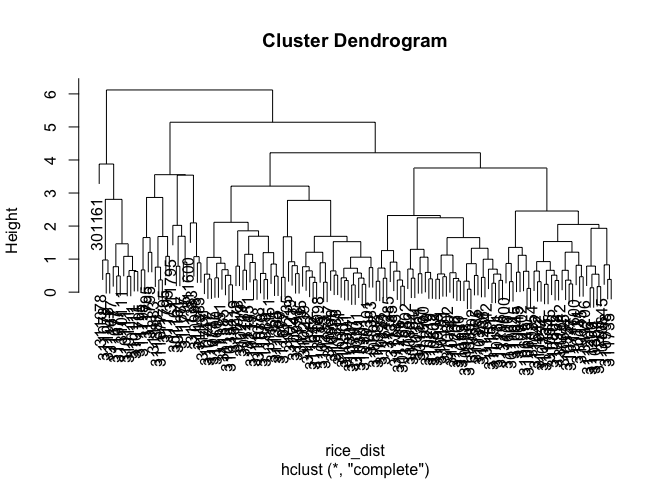

Data of 10 cultivars of rice inoculated with _B. glumae_ or mock inoculated.  Discoloration of spikelets were recorded and presented as percentage.


```r
library(tidyverse)
library(readxl)
library(ggplot2)
```


```r
rice_data <- read_excel("Spray-Data-06.18.20.xlsx", 
                        col_types = c("text", "numeric", "numeric",
                                      "numeric", "numeric","numeric"))
rice_data
```

```
## # A tibble: 320 x 6
##    Genotype   Rep `Mock_30C-22C` `Mock_30C-28C` `Pathogen_30C-2…
##    <chr>    <dbl>          <dbl>          <dbl>            <dbl>
##  1 310111       1           5.88           18.6             86.5
##  2 310111       2           2.48           79.7             82.6
##  3 310111       3           2.9            61.7            100  
##  4 310111       4           0              67.2             86.1
##  5 310111       5           1.76           75.4             98.6
##  6 310111       6           0              76.6             93.8
##  7 310111       7          NA              NA               85.7
##  8 310111       8          NA              NA              100  
##  9 310111       9          NA              NA              100  
## 10 310111      10          NA              NA              100  
## # … with 310 more rows, and 1 more variable: `Pathogen_30C-28C` <dbl>
```

We still have to "reshape" the table to make it in longer format coding a column for treatment (Mock vs Inoculated) and temperature profile (30-22 vs 30-28).


```r
rice_data_long <- rice_data %>% 
  pivot_longer(cols = c("Mock_30C-22C", "Mock_30C-28C", 
                        "Pathogen_30C-22C", "Pathogen_30C-28C"),
               names_to = "Inoculation", 
               values_to = "DiscPerc") %>%
  separate(col = Inoculation, 
            sep = "_",
            into = c("Inoculation", "TempProfile")) %>% 
  unite("Inoc_Temp", Inoculation:TempProfile, remove = FALSE)

kableExtra::kable(rice_data_long, format = "markdown")
```


|Genotype | Rep|Inoc_Temp        |Inoculation |TempProfile |    DiscPerc|
|:--------|---:|:----------------|:-----------|:-----------|-----------:|
|310111   |   1|Mock_30C-22C     |Mock        |30C-22C     |   5.8800000|
|310111   |   1|Mock_30C-28C     |Mock        |30C-28C     |  18.6000000|
|310111   |   1|Pathogen_30C-22C |Pathogen    |30C-22C     |  86.4864865|
|310111   |   1|Pathogen_30C-28C |Pathogen    |30C-28C     |  93.6170213|
|310111   |   2|Mock_30C-22C     |Mock        |30C-22C     |   2.4800000|
|310111   |   2|Mock_30C-28C     |Mock        |30C-28C     |  79.7200000|
|310111   |   2|Pathogen_30C-22C |Pathogen    |30C-22C     |  82.5688073|
|310111   |   2|Pathogen_30C-28C |Pathogen    |30C-28C     | 100.0000000|
|310111   |   3|Mock_30C-22C     |Mock        |30C-22C     |   2.9000000|
|310111   |   3|Mock_30C-28C     |Mock        |30C-28C     |  61.7000000|
|310111   |   3|Pathogen_30C-22C |Pathogen    |30C-22C     | 100.0000000|
|310111   |   3|Pathogen_30C-28C |Pathogen    |30C-28C     |  89.1891892|
|310111   |   4|Mock_30C-22C     |Mock        |30C-22C     |   0.0000000|
|310111   |   4|Mock_30C-28C     |Mock        |30C-28C     |  67.1600000|
|310111   |   4|Pathogen_30C-22C |Pathogen    |30C-22C     |  86.1111111|
|310111   |   4|Pathogen_30C-28C |Pathogen    |30C-28C     | 100.0000000|
|310111   |   5|Mock_30C-22C     |Mock        |30C-22C     |   1.7600000|
|310111   |   5|Mock_30C-28C     |Mock        |30C-28C     |  75.4000000|
|310111   |   5|Pathogen_30C-22C |Pathogen    |30C-22C     |  98.6486486|
|310111   |   5|Pathogen_30C-28C |Pathogen    |30C-28C     | 100.0000000|
|310111   |   6|Mock_30C-22C     |Mock        |30C-22C     |   0.0000000|
|310111   |   6|Mock_30C-28C     |Mock        |30C-28C     |  76.5700000|
|310111   |   6|Pathogen_30C-22C |Pathogen    |30C-22C     |  93.8144330|
|310111   |   6|Pathogen_30C-28C |Pathogen    |30C-28C     |  87.8048780|
|310111   |   7|Mock_30C-22C     |Mock        |30C-22C     |          NA|
|310111   |   7|Mock_30C-28C     |Mock        |30C-28C     |          NA|
|310111   |   7|Pathogen_30C-22C |Pathogen    |30C-22C     |  85.7142857|
|310111   |   7|Pathogen_30C-28C |Pathogen    |30C-28C     | 100.0000000|
|310111   |   8|Mock_30C-22C     |Mock        |30C-22C     |          NA|
|310111   |   8|Mock_30C-28C     |Mock        |30C-28C     |          NA|
|310111   |   8|Pathogen_30C-22C |Pathogen    |30C-22C     | 100.0000000|
|310111   |   8|Pathogen_30C-28C |Pathogen    |30C-28C     |  97.8494624|
|310111   |   9|Mock_30C-22C     |Mock        |30C-22C     |          NA|
|310111   |   9|Mock_30C-28C     |Mock        |30C-28C     |          NA|
|310111   |   9|Pathogen_30C-22C |Pathogen    |30C-22C     | 100.0000000|
|310111   |   9|Pathogen_30C-28C |Pathogen    |30C-28C     |  98.1981982|
|310111   |  10|Mock_30C-22C     |Mock        |30C-22C     |          NA|
|310111   |  10|Mock_30C-28C     |Mock        |30C-28C     |          NA|
|310111   |  10|Pathogen_30C-22C |Pathogen    |30C-22C     | 100.0000000|
|310111   |  10|Pathogen_30C-28C |Pathogen    |30C-28C     |  93.5483871|
|310111   |  11|Mock_30C-22C     |Mock        |30C-22C     |          NA|
|310111   |  11|Mock_30C-28C     |Mock        |30C-28C     |          NA|
|310111   |  11|Pathogen_30C-22C |Pathogen    |30C-22C     | 100.0000000|
|310111   |  11|Pathogen_30C-28C |Pathogen    |30C-28C     | 100.0000000|
|310111   |  12|Mock_30C-22C     |Mock        |30C-22C     |          NA|
|310111   |  12|Mock_30C-28C     |Mock        |30C-28C     |          NA|
|310111   |  12|Pathogen_30C-22C |Pathogen    |30C-22C     | 100.0000000|
|310111   |  12|Pathogen_30C-28C |Pathogen    |30C-28C     | 100.0000000|
|310111   |  13|Mock_30C-22C     |Mock        |30C-22C     |          NA|
|310111   |  13|Mock_30C-28C     |Mock        |30C-28C     |          NA|
|310111   |  13|Pathogen_30C-22C |Pathogen    |30C-22C     |  94.7368421|
|310111   |  13|Pathogen_30C-28C |Pathogen    |30C-28C     | 100.0000000|
|310111   |  14|Mock_30C-22C     |Mock        |30C-22C     |          NA|
|310111   |  14|Mock_30C-28C     |Mock        |30C-28C     |          NA|
|310111   |  14|Pathogen_30C-22C |Pathogen    |30C-22C     |  99.0000000|
|310111   |  14|Pathogen_30C-28C |Pathogen    |30C-28C     | 100.0000000|
|310111   |  15|Mock_30C-22C     |Mock        |30C-22C     |          NA|
|310111   |  15|Mock_30C-28C     |Mock        |30C-28C     |          NA|
|310111   |  15|Pathogen_30C-22C |Pathogen    |30C-22C     | 100.0000000|
|310111   |  15|Pathogen_30C-28C |Pathogen    |30C-28C     | 100.0000000|
|310111   |  16|Mock_30C-22C     |Mock        |30C-22C     |          NA|
|310111   |  16|Mock_30C-28C     |Mock        |30C-28C     |          NA|
|310111   |  16|Pathogen_30C-22C |Pathogen    |30C-22C     | 100.0000000|
|310111   |  16|Pathogen_30C-28C |Pathogen    |30C-28C     | 100.0000000|
|310131   |   1|Mock_30C-22C     |Mock        |30C-22C     |   5.1282051|
|310131   |   1|Mock_30C-28C     |Mock        |30C-28C     |   0.0000000|
|310131   |   1|Pathogen_30C-22C |Pathogen    |30C-22C     |  20.1680672|
|310131   |   1|Pathogen_30C-28C |Pathogen    |30C-28C     |  54.1666667|
|310131   |   2|Mock_30C-22C     |Mock        |30C-22C     |   1.1111111|
|310131   |   2|Mock_30C-28C     |Mock        |30C-28C     |   2.4390244|
|310131   |   2|Pathogen_30C-22C |Pathogen    |30C-22C     |  51.5923567|
|310131   |   2|Pathogen_30C-28C |Pathogen    |30C-28C     |  57.6923077|
|310131   |   3|Mock_30C-22C     |Mock        |30C-22C     |   2.7932961|
|310131   |   3|Mock_30C-28C     |Mock        |30C-28C     |   0.8130081|
|310131   |   3|Pathogen_30C-22C |Pathogen    |30C-22C     |  40.6015038|
|310131   |   3|Pathogen_30C-28C |Pathogen    |30C-28C     |  19.4029851|
|310131   |   4|Mock_30C-22C     |Mock        |30C-22C     |   4.2105263|
|310131   |   4|Mock_30C-28C     |Mock        |30C-28C     |   6.9620253|
|310131   |   4|Pathogen_30C-22C |Pathogen    |30C-22C     |  43.8423645|
|310131   |   4|Pathogen_30C-28C |Pathogen    |30C-28C     |  40.8450704|
|310131   |   5|Mock_30C-22C     |Mock        |30C-22C     |   2.8901734|
|310131   |   5|Mock_30C-28C     |Mock        |30C-28C     |   6.4039409|
|310131   |   5|Pathogen_30C-22C |Pathogen    |30C-22C     |  74.2424242|
|310131   |   5|Pathogen_30C-28C |Pathogen    |30C-28C     |  29.1666667|
|310131   |   6|Mock_30C-22C     |Mock        |30C-22C     |   1.9108280|
|310131   |   6|Mock_30C-28C     |Mock        |30C-28C     |   6.2893082|
|310131   |   6|Pathogen_30C-22C |Pathogen    |30C-22C     |  28.0000000|
|310131   |   6|Pathogen_30C-28C |Pathogen    |30C-28C     |  29.9065421|
|310131   |   7|Mock_30C-22C     |Mock        |30C-22C     |          NA|
|310131   |   7|Mock_30C-28C     |Mock        |30C-28C     |   2.0270270|
|310131   |   7|Pathogen_30C-22C |Pathogen    |30C-22C     |  42.2619048|
|310131   |   7|Pathogen_30C-28C |Pathogen    |30C-28C     |  26.4705882|
|310131   |   8|Mock_30C-22C     |Mock        |30C-22C     |          NA|
|310131   |   8|Mock_30C-28C     |Mock        |30C-28C     |   7.8431373|
|310131   |   8|Pathogen_30C-22C |Pathogen    |30C-22C     |  18.0555556|
|310131   |   8|Pathogen_30C-28C |Pathogen    |30C-28C     |  34.1176471|
|310131   |   9|Mock_30C-22C     |Mock        |30C-22C     |          NA|
|310131   |   9|Mock_30C-28C     |Mock        |30C-28C     |          NA|
|310131   |   9|Pathogen_30C-22C |Pathogen    |30C-22C     |  52.8846154|
|310131   |   9|Pathogen_30C-28C |Pathogen    |30C-28C     |  46.6666667|
|310131   |  10|Mock_30C-22C     |Mock        |30C-22C     |          NA|
|310131   |  10|Mock_30C-28C     |Mock        |30C-28C     |          NA|
|310131   |  10|Pathogen_30C-22C |Pathogen    |30C-22C     |  40.1459854|
|310131   |  10|Pathogen_30C-28C |Pathogen    |30C-28C     |  34.8484848|
|310131   |  11|Mock_30C-22C     |Mock        |30C-22C     |          NA|
|310131   |  11|Mock_30C-28C     |Mock        |30C-28C     |          NA|
|310131   |  11|Pathogen_30C-22C |Pathogen    |30C-22C     |  16.5354331|
|310131   |  11|Pathogen_30C-28C |Pathogen    |30C-28C     |  42.2680412|
|310131   |  12|Mock_30C-22C     |Mock        |30C-22C     |          NA|
|310131   |  12|Mock_30C-28C     |Mock        |30C-28C     |          NA|
|310131   |  12|Pathogen_30C-22C |Pathogen    |30C-22C     |  36.1111111|
|310131   |  12|Pathogen_30C-28C |Pathogen    |30C-28C     |  46.8085106|
|310131   |  13|Mock_30C-22C     |Mock        |30C-22C     |          NA|
|310131   |  13|Mock_30C-28C     |Mock        |30C-28C     |          NA|
|310131   |  13|Pathogen_30C-22C |Pathogen    |30C-22C     |  56.3106796|
|310131   |  13|Pathogen_30C-28C |Pathogen    |30C-28C     |  27.7310924|
|310131   |  14|Mock_30C-22C     |Mock        |30C-22C     |          NA|
|310131   |  14|Mock_30C-28C     |Mock        |30C-28C     |          NA|
|310131   |  14|Pathogen_30C-22C |Pathogen    |30C-22C     |   8.6206897|
|310131   |  14|Pathogen_30C-28C |Pathogen    |30C-28C     |  28.1250000|
|310131   |  15|Mock_30C-22C     |Mock        |30C-22C     |          NA|
|310131   |  15|Mock_30C-28C     |Mock        |30C-28C     |          NA|
|310131   |  15|Pathogen_30C-22C |Pathogen    |30C-22C     |          NA|
|310131   |  15|Pathogen_30C-28C |Pathogen    |30C-28C     |          NA|
|310131   |  16|Mock_30C-22C     |Mock        |30C-22C     |          NA|
|310131   |  16|Mock_30C-28C     |Mock        |30C-28C     |          NA|
|310131   |  16|Pathogen_30C-22C |Pathogen    |30C-22C     |          NA|
|310131   |  16|Pathogen_30C-28C |Pathogen    |30C-28C     |          NA|
|310219   |   1|Mock_30C-22C     |Mock        |30C-22C     |  16.1764706|
|310219   |   1|Mock_30C-28C     |Mock        |30C-28C     |  18.9655172|
|310219   |   1|Pathogen_30C-22C |Pathogen    |30C-22C     |  75.0000000|
|310219   |   1|Pathogen_30C-28C |Pathogen    |30C-28C     |  44.7368421|
|310219   |   2|Mock_30C-22C     |Mock        |30C-22C     |   9.4339623|
|310219   |   2|Mock_30C-28C     |Mock        |30C-28C     |  21.7391304|
|310219   |   2|Pathogen_30C-22C |Pathogen    |30C-22C     |  39.0625000|
|310219   |   2|Pathogen_30C-28C |Pathogen    |30C-28C     |  40.0000000|
|310219   |   3|Mock_30C-22C     |Mock        |30C-22C     |   2.7027027|
|310219   |   3|Mock_30C-28C     |Mock        |30C-28C     |  25.0000000|
|310219   |   3|Pathogen_30C-22C |Pathogen    |30C-22C     |  70.5882353|
|310219   |   3|Pathogen_30C-28C |Pathogen    |30C-28C     | 100.0000000|
|310219   |   4|Mock_30C-22C     |Mock        |30C-22C     |  11.6883117|
|310219   |   4|Mock_30C-28C     |Mock        |30C-28C     |  24.4897959|
|310219   |   4|Pathogen_30C-22C |Pathogen    |30C-22C     |  24.5614035|
|310219   |   4|Pathogen_30C-28C |Pathogen    |30C-28C     |  87.5000000|
|310219   |   5|Mock_30C-22C     |Mock        |30C-22C     |   0.0000000|
|310219   |   5|Mock_30C-28C     |Mock        |30C-28C     |   9.8765432|
|310219   |   5|Pathogen_30C-22C |Pathogen    |30C-22C     |  93.6842105|
|310219   |   5|Pathogen_30C-28C |Pathogen    |30C-28C     |  60.3773585|
|310219   |   6|Mock_30C-22C     |Mock        |30C-22C     |   0.0000000|
|310219   |   6|Mock_30C-28C     |Mock        |30C-28C     |  13.2352941|
|310219   |   6|Pathogen_30C-22C |Pathogen    |30C-22C     |  86.8686869|
|310219   |   6|Pathogen_30C-28C |Pathogen    |30C-28C     |  77.7777778|
|310219   |   7|Mock_30C-22C     |Mock        |30C-22C     |  10.8695652|
|310219   |   7|Mock_30C-28C     |Mock        |30C-28C     |  19.1780822|
|310219   |   7|Pathogen_30C-22C |Pathogen    |30C-22C     |  30.5882353|
|310219   |   7|Pathogen_30C-28C |Pathogen    |30C-28C     |  46.2686567|
|310219   |   8|Mock_30C-22C     |Mock        |30C-22C     |   1.6393443|
|310219   |   8|Mock_30C-28C     |Mock        |30C-28C     |  18.8405797|
|310219   |   8|Pathogen_30C-22C |Pathogen    |30C-22C     |  28.2608696|
|310219   |   8|Pathogen_30C-28C |Pathogen    |30C-28C     |  70.8333333|
|310219   |   9|Mock_30C-22C     |Mock        |30C-22C     |  18.9655172|
|310219   |   9|Mock_30C-28C     |Mock        |30C-28C     |          NA|
|310219   |   9|Pathogen_30C-22C |Pathogen    |30C-22C     |  23.2142857|
|310219   |   9|Pathogen_30C-28C |Pathogen    |30C-28C     |  61.9047619|
|310219   |  10|Mock_30C-22C     |Mock        |30C-22C     |  21.7391304|
|310219   |  10|Mock_30C-28C     |Mock        |30C-28C     |          NA|
|310219   |  10|Pathogen_30C-22C |Pathogen    |30C-22C     |  45.0980392|
|310219   |  10|Pathogen_30C-28C |Pathogen    |30C-28C     |  70.8333333|
|310219   |  11|Mock_30C-22C     |Mock        |30C-22C     |  25.0000000|
|310219   |  11|Mock_30C-28C     |Mock        |30C-28C     |          NA|
|310219   |  11|Pathogen_30C-22C |Pathogen    |30C-22C     |  30.0000000|
|310219   |  11|Pathogen_30C-28C |Pathogen    |30C-28C     |  44.8717949|
|310219   |  12|Mock_30C-22C     |Mock        |30C-22C     |  24.4897959|
|310219   |  12|Mock_30C-28C     |Mock        |30C-28C     |          NA|
|310219   |  12|Pathogen_30C-22C |Pathogen    |30C-22C     |  43.9024390|
|310219   |  12|Pathogen_30C-28C |Pathogen    |30C-28C     |  26.1904762|
|310219   |  13|Mock_30C-22C     |Mock        |30C-22C     |   9.8765432|
|310219   |  13|Mock_30C-28C     |Mock        |30C-28C     |          NA|
|310219   |  13|Pathogen_30C-22C |Pathogen    |30C-22C     |  42.3728814|
|310219   |  13|Pathogen_30C-28C |Pathogen    |30C-28C     |  54.1666667|
|310219   |  14|Mock_30C-22C     |Mock        |30C-22C     |  13.2352941|
|310219   |  14|Mock_30C-28C     |Mock        |30C-28C     |          NA|
|310219   |  14|Pathogen_30C-22C |Pathogen    |30C-22C     |  66.6666667|
|310219   |  14|Pathogen_30C-28C |Pathogen    |30C-28C     |  80.9523810|
|310219   |  15|Mock_30C-22C     |Mock        |30C-22C     |  19.1780822|
|310219   |  15|Mock_30C-28C     |Mock        |30C-28C     |          NA|
|310219   |  15|Pathogen_30C-22C |Pathogen    |30C-22C     |          NA|
|310219   |  15|Pathogen_30C-28C |Pathogen    |30C-28C     |  80.1242236|
|310219   |  16|Mock_30C-22C     |Mock        |30C-22C     |  18.8405797|
|310219   |  16|Mock_30C-28C     |Mock        |30C-28C     |          NA|
|310219   |  16|Pathogen_30C-22C |Pathogen    |30C-22C     |          NA|
|310219   |  16|Pathogen_30C-28C |Pathogen    |30C-28C     |  57.6923077|
|310301   |   1|Mock_30C-22C     |Mock        |30C-22C     |   0.9433962|
|310301   |   1|Mock_30C-28C     |Mock        |30C-28C     |  12.4324324|
|310301   |   1|Pathogen_30C-22C |Pathogen    |30C-22C     |  88.3211679|
|310301   |   1|Pathogen_30C-28C |Pathogen    |30C-28C     | 100.0000000|
|310301   |   2|Mock_30C-22C     |Mock        |30C-22C     |   3.0303030|
|310301   |   2|Mock_30C-28C     |Mock        |30C-28C     |  12.7906977|
|310301   |   2|Pathogen_30C-22C |Pathogen    |30C-22C     |  84.0425532|
|310301   |   2|Pathogen_30C-28C |Pathogen    |30C-28C     | 100.0000000|
|310301   |   3|Mock_30C-22C     |Mock        |30C-22C     |   8.2191781|
|310301   |   3|Mock_30C-28C     |Mock        |30C-28C     |  16.4062500|
|310301   |   3|Pathogen_30C-22C |Pathogen    |30C-22C     |  91.8918919|
|310301   |   3|Pathogen_30C-28C |Pathogen    |30C-28C     | 100.0000000|
|310301   |   4|Mock_30C-22C     |Mock        |30C-22C     |   4.7619048|
|310301   |   4|Mock_30C-28C     |Mock        |30C-28C     |  17.2043011|
|310301   |   4|Pathogen_30C-22C |Pathogen    |30C-22C     |  96.8000000|
|310301   |   4|Pathogen_30C-28C |Pathogen    |30C-28C     | 100.0000000|
|310301   |   5|Mock_30C-22C     |Mock        |30C-22C     |   1.3157895|
|310301   |   5|Mock_30C-28C     |Mock        |30C-28C     |   9.8039216|
|310301   |   5|Pathogen_30C-22C |Pathogen    |30C-22C     |  92.4812030|
|310301   |   5|Pathogen_30C-28C |Pathogen    |30C-28C     |  93.1623932|
|310301   |   6|Mock_30C-22C     |Mock        |30C-22C     |  11.3636364|
|310301   |   6|Mock_30C-28C     |Mock        |30C-28C     |  18.8118812|
|310301   |   6|Pathogen_30C-22C |Pathogen    |30C-22C     |  87.9432624|
|310301   |   6|Pathogen_30C-28C |Pathogen    |30C-28C     |  87.8048780|
|310301   |   7|Mock_30C-22C     |Mock        |30C-22C     |   5.0847458|
|310301   |   7|Mock_30C-28C     |Mock        |30C-28C     |  13.0841121|
|310301   |   7|Pathogen_30C-22C |Pathogen    |30C-22C     |  89.4736842|
|310301   |   7|Pathogen_30C-28C |Pathogen    |30C-28C     |  88.8888889|
|310301   |   8|Mock_30C-22C     |Mock        |30C-22C     |          NA|
|310301   |   8|Mock_30C-28C     |Mock        |30C-28C     |   9.0909091|
|310301   |   8|Pathogen_30C-22C |Pathogen    |30C-22C     |  59.3023256|
|310301   |   8|Pathogen_30C-28C |Pathogen    |30C-28C     |  85.2941176|
|310301   |   9|Mock_30C-22C     |Mock        |30C-22C     |          NA|
|310301   |   9|Mock_30C-28C     |Mock        |30C-28C     |          NA|
|310301   |   9|Pathogen_30C-22C |Pathogen    |30C-22C     |  95.3757225|
|310301   |   9|Pathogen_30C-28C |Pathogen    |30C-28C     |  80.6250000|
|310301   |  10|Mock_30C-22C     |Mock        |30C-22C     |          NA|
|310301   |  10|Mock_30C-28C     |Mock        |30C-28C     |          NA|
|310301   |  10|Pathogen_30C-22C |Pathogen    |30C-22C     |  95.9731544|
|310301   |  10|Pathogen_30C-28C |Pathogen    |30C-28C     |  90.8256881|
|310301   |  11|Mock_30C-22C     |Mock        |30C-22C     |          NA|
|310301   |  11|Mock_30C-28C     |Mock        |30C-28C     |          NA|
|310301   |  11|Pathogen_30C-22C |Pathogen    |30C-22C     |  95.1612903|
|310301   |  11|Pathogen_30C-28C |Pathogen    |30C-28C     |  83.1460674|
|310301   |  12|Mock_30C-22C     |Mock        |30C-22C     |          NA|
|310301   |  12|Mock_30C-28C     |Mock        |30C-28C     |          NA|
|310301   |  12|Pathogen_30C-22C |Pathogen    |30C-22C     |  98.5915493|
|310301   |  12|Pathogen_30C-28C |Pathogen    |30C-28C     |  76.1363636|
|310301   |  13|Mock_30C-22C     |Mock        |30C-22C     |          NA|
|310301   |  13|Mock_30C-28C     |Mock        |30C-28C     |          NA|
|310301   |  13|Pathogen_30C-22C |Pathogen    |30C-22C     |  94.7368421|
|310301   |  13|Pathogen_30C-28C |Pathogen    |30C-28C     | 100.0000000|
|310301   |  14|Mock_30C-22C     |Mock        |30C-22C     |          NA|
|310301   |  14|Mock_30C-28C     |Mock        |30C-28C     |          NA|
|310301   |  14|Pathogen_30C-22C |Pathogen    |30C-22C     |  95.0000000|
|310301   |  14|Pathogen_30C-28C |Pathogen    |30C-28C     | 100.0000000|
|310301   |  15|Mock_30C-22C     |Mock        |30C-22C     |          NA|
|310301   |  15|Mock_30C-28C     |Mock        |30C-28C     |          NA|
|310301   |  15|Pathogen_30C-22C |Pathogen    |30C-22C     |          NA|
|310301   |  15|Pathogen_30C-28C |Pathogen    |30C-28C     | 100.0000000|
|310301   |  16|Mock_30C-22C     |Mock        |30C-22C     |          NA|
|310301   |  16|Mock_30C-28C     |Mock        |30C-28C     |          NA|
|310301   |  16|Pathogen_30C-22C |Pathogen    |30C-22C     |          NA|
|310301   |  16|Pathogen_30C-28C |Pathogen    |30C-28C     | 100.0000000|
|310354   |   1|Mock_30C-22C     |Mock        |30C-22C     |   1.0101010|
|310354   |   1|Mock_30C-28C     |Mock        |30C-28C     |   0.0000000|
|310354   |   1|Pathogen_30C-22C |Pathogen    |30C-22C     |  54.5454545|
|310354   |   1|Pathogen_30C-28C |Pathogen    |30C-28C     |   3.2258065|
|310354   |   2|Mock_30C-22C     |Mock        |30C-22C     |   5.8333333|
|310354   |   2|Mock_30C-28C     |Mock        |30C-28C     |   0.0000000|
|310354   |   2|Pathogen_30C-22C |Pathogen    |30C-22C     |  62.2047244|
|310354   |   2|Pathogen_30C-28C |Pathogen    |30C-28C     |  35.7142857|
|310354   |   3|Mock_30C-22C     |Mock        |30C-22C     |   0.4830918|
|310354   |   3|Mock_30C-28C     |Mock        |30C-28C     |   1.3888889|
|310354   |   3|Pathogen_30C-22C |Pathogen    |30C-22C     |  57.6271186|
|310354   |   3|Pathogen_30C-28C |Pathogen    |30C-28C     |  57.3333333|
|310354   |   4|Mock_30C-22C     |Mock        |30C-22C     |   8.0000000|
|310354   |   4|Mock_30C-28C     |Mock        |30C-28C     |  11.1888112|
|310354   |   4|Pathogen_30C-22C |Pathogen    |30C-22C     |  20.6611570|
|310354   |   4|Pathogen_30C-28C |Pathogen    |30C-28C     |  34.6534653|
|310354   |   5|Mock_30C-22C     |Mock        |30C-22C     |   0.0000000|
|310354   |   5|Mock_30C-28C     |Mock        |30C-28C     |   5.9210526|
|310354   |   5|Pathogen_30C-22C |Pathogen    |30C-22C     |  33.3333333|
|310354   |   5|Pathogen_30C-28C |Pathogen    |30C-28C     |  12.0000000|
|310354   |   6|Mock_30C-22C     |Mock        |30C-22C     |   3.3898305|
|310354   |   6|Mock_30C-28C     |Mock        |30C-28C     |   6.0869565|
|310354   |   6|Pathogen_30C-22C |Pathogen    |30C-22C     |  83.3333333|
|310354   |   6|Pathogen_30C-28C |Pathogen    |30C-28C     |  47.6635514|
|310354   |   7|Mock_30C-22C     |Mock        |30C-22C     |   9.0909091|
|310354   |   7|Mock_30C-28C     |Mock        |30C-28C     |   6.3291139|
|310354   |   7|Pathogen_30C-22C |Pathogen    |30C-22C     |  89.1428571|
|310354   |   7|Pathogen_30C-28C |Pathogen    |30C-28C     |  31.9587629|
|310354   |   8|Mock_30C-22C     |Mock        |30C-22C     |   6.1403509|
|310354   |   8|Mock_30C-28C     |Mock        |30C-28C     |          NA|
|310354   |   8|Pathogen_30C-22C |Pathogen    |30C-22C     |  91.2568306|
|310354   |   8|Pathogen_30C-28C |Pathogen    |30C-28C     |  30.8510638|
|310354   |   9|Mock_30C-22C     |Mock        |30C-22C     |          NA|
|310354   |   9|Mock_30C-28C     |Mock        |30C-28C     |          NA|
|310354   |   9|Pathogen_30C-22C |Pathogen    |30C-22C     |  89.5161290|
|310354   |   9|Pathogen_30C-28C |Pathogen    |30C-28C     |  31.3725490|
|310354   |  10|Mock_30C-22C     |Mock        |30C-22C     |          NA|
|310354   |  10|Mock_30C-28C     |Mock        |30C-28C     |          NA|
|310354   |  10|Pathogen_30C-22C |Pathogen    |30C-22C     |  97.8571429|
|310354   |  10|Pathogen_30C-28C |Pathogen    |30C-28C     |  34.4827586|
|310354   |  11|Mock_30C-22C     |Mock        |30C-22C     |          NA|
|310354   |  11|Mock_30C-28C     |Mock        |30C-28C     |          NA|
|310354   |  11|Pathogen_30C-22C |Pathogen    |30C-22C     |  96.6216216|
|310354   |  11|Pathogen_30C-28C |Pathogen    |30C-28C     |  14.1935484|
|310354   |  12|Mock_30C-22C     |Mock        |30C-22C     |          NA|
|310354   |  12|Mock_30C-28C     |Mock        |30C-28C     |          NA|
|310354   |  12|Pathogen_30C-22C |Pathogen    |30C-22C     |  77.7777778|
|310354   |  12|Pathogen_30C-28C |Pathogen    |30C-28C     |  10.7142857|
|310354   |  13|Mock_30C-22C     |Mock        |30C-22C     |          NA|
|310354   |  13|Mock_30C-28C     |Mock        |30C-28C     |          NA|
|310354   |  13|Pathogen_30C-22C |Pathogen    |30C-22C     | 100.0000000|
|310354   |  13|Pathogen_30C-28C |Pathogen    |30C-28C     |  18.0555556|
|310354   |  14|Mock_30C-22C     |Mock        |30C-22C     |          NA|
|310354   |  14|Mock_30C-28C     |Mock        |30C-28C     |          NA|
|310354   |  14|Pathogen_30C-22C |Pathogen    |30C-22C     | 100.0000000|
|310354   |  14|Pathogen_30C-28C |Pathogen    |30C-28C     |  34.9315068|
|310354   |  15|Mock_30C-22C     |Mock        |30C-22C     |          NA|
|310354   |  15|Mock_30C-28C     |Mock        |30C-28C     |          NA|
|310354   |  15|Pathogen_30C-22C |Pathogen    |30C-22C     |          NA|
|310354   |  15|Pathogen_30C-28C |Pathogen    |30C-28C     |          NA|
|310354   |  16|Mock_30C-22C     |Mock        |30C-22C     |          NA|
|310354   |  16|Mock_30C-28C     |Mock        |30C-28C     |          NA|
|310354   |  16|Pathogen_30C-22C |Pathogen    |30C-22C     |          NA|
|310354   |  16|Pathogen_30C-28C |Pathogen    |30C-28C     |          NA|
|310645   |   1|Mock_30C-22C     |Mock        |30C-22C     |   7.7464789|
|310645   |   1|Mock_30C-28C     |Mock        |30C-28C     |   6.2500000|
|310645   |   1|Pathogen_30C-22C |Pathogen    |30C-22C     |  78.1250000|
|310645   |   1|Pathogen_30C-28C |Pathogen    |30C-28C     |  37.3737374|
|310645   |   2|Mock_30C-22C     |Mock        |30C-22C     |  10.3448276|
|310645   |   2|Mock_30C-28C     |Mock        |30C-28C     |   9.9236641|
|310645   |   2|Pathogen_30C-22C |Pathogen    |30C-22C     |  70.7547170|
|310645   |   2|Pathogen_30C-28C |Pathogen    |30C-28C     |   5.4726368|
|310645   |   3|Mock_30C-22C     |Mock        |30C-22C     |  11.3207547|
|310645   |   3|Mock_30C-28C     |Mock        |30C-28C     |   5.4347826|
|310645   |   3|Pathogen_30C-22C |Pathogen    |30C-22C     | 100.0000000|
|310645   |   3|Pathogen_30C-28C |Pathogen    |30C-28C     |   8.3870968|
|310645   |   4|Mock_30C-22C     |Mock        |30C-22C     |   4.5454545|
|310645   |   4|Mock_30C-28C     |Mock        |30C-28C     |   0.0000000|
|310645   |   4|Pathogen_30C-22C |Pathogen    |30C-22C     |  55.4455446|
|310645   |   4|Pathogen_30C-28C |Pathogen    |30C-28C     |  43.1250000|
|310645   |   5|Mock_30C-22C     |Mock        |30C-22C     |   7.2000000|
|310645   |   5|Mock_30C-28C     |Mock        |30C-28C     |   0.0000000|
|310645   |   5|Pathogen_30C-22C |Pathogen    |30C-22C     |  63.2075472|
|310645   |   5|Pathogen_30C-28C |Pathogen    |30C-28C     |   9.1397849|
|310645   |   6|Mock_30C-22C     |Mock        |30C-22C     |   8.0645161|
|310645   |   6|Mock_30C-28C     |Mock        |30C-28C     |   8.7301587|
|310645   |   6|Pathogen_30C-22C |Pathogen    |30C-22C     |  50.0000000|
|310645   |   6|Pathogen_30C-28C |Pathogen    |30C-28C     |  11.9047619|
|310645   |   7|Mock_30C-22C     |Mock        |30C-22C     |   5.3333333|
|310645   |   7|Mock_30C-28C     |Mock        |30C-28C     |   4.4444444|
|310645   |   7|Pathogen_30C-22C |Pathogen    |30C-22C     |  64.8351648|
|310645   |   7|Pathogen_30C-28C |Pathogen    |30C-28C     |  22.2222222|
|310645   |   8|Mock_30C-22C     |Mock        |30C-22C     |   7.7519380|
|310645   |   8|Mock_30C-28C     |Mock        |30C-28C     |   6.9767442|
|310645   |   8|Pathogen_30C-22C |Pathogen    |30C-22C     |  52.0000000|
|310645   |   8|Pathogen_30C-28C |Pathogen    |30C-28C     |  12.7516779|
|310645   |   9|Mock_30C-22C     |Mock        |30C-22C     |          NA|
|310645   |   9|Mock_30C-28C     |Mock        |30C-28C     |          NA|
|310645   |   9|Pathogen_30C-22C |Pathogen    |30C-22C     |  51.2195122|
|310645   |   9|Pathogen_30C-28C |Pathogen    |30C-28C     |  19.8275862|
|310645   |  10|Mock_30C-22C     |Mock        |30C-22C     |          NA|
|310645   |  10|Mock_30C-28C     |Mock        |30C-28C     |          NA|
|310645   |  10|Pathogen_30C-22C |Pathogen    |30C-22C     |  64.7619048|
|310645   |  10|Pathogen_30C-28C |Pathogen    |30C-28C     |  14.5038168|
|310645   |  11|Mock_30C-22C     |Mock        |30C-22C     |          NA|
|310645   |  11|Mock_30C-28C     |Mock        |30C-28C     |          NA|
|310645   |  11|Pathogen_30C-22C |Pathogen    |30C-22C     |  54.1666667|
|310645   |  11|Pathogen_30C-28C |Pathogen    |30C-28C     |  28.3132530|
|310645   |  12|Mock_30C-22C     |Mock        |30C-22C     |          NA|
|310645   |  12|Mock_30C-28C     |Mock        |30C-28C     |          NA|
|310645   |  12|Pathogen_30C-22C |Pathogen    |30C-22C     | 100.0000000|
|310645   |  12|Pathogen_30C-28C |Pathogen    |30C-28C     |  24.8322148|
|310645   |  13|Mock_30C-22C     |Mock        |30C-22C     |          NA|
|310645   |  13|Mock_30C-28C     |Mock        |30C-28C     |          NA|
|310645   |  13|Pathogen_30C-22C |Pathogen    |30C-22C     |  90.9090909|
|310645   |  13|Pathogen_30C-28C |Pathogen    |30C-28C     |  69.1666667|
|310645   |  14|Mock_30C-22C     |Mock        |30C-22C     |          NA|
|310645   |  14|Mock_30C-28C     |Mock        |30C-28C     |          NA|
|310645   |  14|Pathogen_30C-22C |Pathogen    |30C-22C     |  58.5365854|
|310645   |  14|Pathogen_30C-28C |Pathogen    |30C-28C     | 100.0000000|
|310645   |  15|Mock_30C-22C     |Mock        |30C-22C     |          NA|
|310645   |  15|Mock_30C-28C     |Mock        |30C-28C     |          NA|
|310645   |  15|Pathogen_30C-22C |Pathogen    |30C-22C     |          NA|
|310645   |  15|Pathogen_30C-28C |Pathogen    |30C-28C     |          NA|
|310645   |  16|Mock_30C-22C     |Mock        |30C-22C     |          NA|
|310645   |  16|Mock_30C-28C     |Mock        |30C-28C     |          NA|
|310645   |  16|Pathogen_30C-22C |Pathogen    |30C-22C     |          NA|
|310645   |  16|Pathogen_30C-28C |Pathogen    |30C-28C     |          NA|
|310747   |   1|Mock_30C-22C     |Mock        |30C-22C     |   5.5045872|
|310747   |   1|Mock_30C-28C     |Mock        |30C-28C     |   8.5714286|
|310747   |   1|Pathogen_30C-22C |Pathogen    |30C-22C     |  87.6404494|
|310747   |   1|Pathogen_30C-28C |Pathogen    |30C-28C     |  89.1025641|
|310747   |   2|Mock_30C-22C     |Mock        |30C-22C     |  13.3047210|
|310747   |   2|Mock_30C-28C     |Mock        |30C-28C     |   7.9545455|
|310747   |   2|Pathogen_30C-22C |Pathogen    |30C-22C     |  72.5663717|
|310747   |   2|Pathogen_30C-28C |Pathogen    |30C-28C     |  84.7826087|
|310747   |   3|Mock_30C-22C     |Mock        |30C-22C     |   8.5106383|
|310747   |   3|Mock_30C-28C     |Mock        |30C-28C     |   6.0606061|
|310747   |   3|Pathogen_30C-22C |Pathogen    |30C-22C     |  55.0000000|
|310747   |   3|Pathogen_30C-28C |Pathogen    |30C-28C     |  74.1935484|
|310747   |   4|Mock_30C-22C     |Mock        |30C-22C     |  11.0000000|
|310747   |   4|Mock_30C-28C     |Mock        |30C-28C     |   0.0000000|
|310747   |   4|Pathogen_30C-22C |Pathogen    |30C-22C     |  51.7857143|
|310747   |   4|Pathogen_30C-28C |Pathogen    |30C-28C     |  69.8795181|
|310747   |   5|Mock_30C-22C     |Mock        |30C-22C     |   5.0314465|
|310747   |   5|Mock_30C-28C     |Mock        |30C-28C     |   0.7812500|
|310747   |   5|Pathogen_30C-22C |Pathogen    |30C-22C     |  65.0684932|
|310747   |   5|Pathogen_30C-28C |Pathogen    |30C-28C     |  41.9689119|
|310747   |   6|Mock_30C-22C     |Mock        |30C-22C     |   8.9947090|
|310747   |   6|Mock_30C-28C     |Mock        |30C-28C     |   0.0000000|
|310747   |   6|Pathogen_30C-22C |Pathogen    |30C-22C     |  63.9534884|
|310747   |   6|Pathogen_30C-28C |Pathogen    |30C-28C     |  54.4827586|
|310747   |   7|Mock_30C-22C     |Mock        |30C-22C     |  13.3333333|
|310747   |   7|Mock_30C-28C     |Mock        |30C-28C     |   2.2727273|
|310747   |   7|Pathogen_30C-22C |Pathogen    |30C-22C     |  36.6666667|
|310747   |   7|Pathogen_30C-28C |Pathogen    |30C-28C     |  27.3437500|
|310747   |   8|Mock_30C-22C     |Mock        |30C-22C     |  13.3333333|
|310747   |   8|Mock_30C-28C     |Mock        |30C-28C     |   2.9585799|
|310747   |   8|Pathogen_30C-22C |Pathogen    |30C-22C     |  80.7486631|
|310747   |   8|Pathogen_30C-28C |Pathogen    |30C-28C     |  42.1875000|
|310747   |   9|Mock_30C-22C     |Mock        |30C-22C     |   8.5714286|
|310747   |   9|Mock_30C-28C     |Mock        |30C-28C     |          NA|
|310747   |   9|Pathogen_30C-22C |Pathogen    |30C-22C     |  55.2325581|
|310747   |   9|Pathogen_30C-28C |Pathogen    |30C-28C     |  25.8278146|
|310747   |  10|Mock_30C-22C     |Mock        |30C-22C     |   7.9545455|
|310747   |  10|Mock_30C-28C     |Mock        |30C-28C     |          NA|
|310747   |  10|Pathogen_30C-22C |Pathogen    |30C-22C     |  72.7272727|
|310747   |  10|Pathogen_30C-28C |Pathogen    |30C-28C     |  77.3195876|
|310747   |  11|Mock_30C-22C     |Mock        |30C-22C     |   6.0606061|
|310747   |  11|Mock_30C-28C     |Mock        |30C-28C     |          NA|
|310747   |  11|Pathogen_30C-22C |Pathogen    |30C-22C     |  52.3178808|
|310747   |  11|Pathogen_30C-28C |Pathogen    |30C-28C     |  31.0160428|
|310747   |  12|Mock_30C-22C     |Mock        |30C-22C     |   0.0000000|
|310747   |  12|Mock_30C-28C     |Mock        |30C-28C     |          NA|
|310747   |  12|Pathogen_30C-22C |Pathogen    |30C-22C     |  82.6347305|
|310747   |  12|Pathogen_30C-28C |Pathogen    |30C-28C     |  36.8750000|
|310747   |  13|Mock_30C-22C     |Mock        |30C-22C     |   0.7812500|
|310747   |  13|Mock_30C-28C     |Mock        |30C-28C     |          NA|
|310747   |  13|Pathogen_30C-22C |Pathogen    |30C-22C     |  68.3098592|
|310747   |  13|Pathogen_30C-28C |Pathogen    |30C-28C     |  39.0977444|
|310747   |  14|Mock_30C-22C     |Mock        |30C-22C     |   0.0000000|
|310747   |  14|Mock_30C-28C     |Mock        |30C-28C     |          NA|
|310747   |  14|Pathogen_30C-22C |Pathogen    |30C-22C     | 100.0000000|
|310747   |  14|Pathogen_30C-28C |Pathogen    |30C-28C     |  66.1538462|
|310747   |  15|Mock_30C-22C     |Mock        |30C-22C     |   2.2727273|
|310747   |  15|Mock_30C-28C     |Mock        |30C-28C     |          NA|
|310747   |  15|Pathogen_30C-22C |Pathogen    |30C-22C     |          NA|
|310747   |  15|Pathogen_30C-28C |Pathogen    |30C-28C     |  49.0196078|
|310747   |  16|Mock_30C-22C     |Mock        |30C-22C     |   2.9585799|
|310747   |  16|Mock_30C-28C     |Mock        |30C-28C     |          NA|
|310747   |  16|Pathogen_30C-22C |Pathogen    |30C-22C     |          NA|
|310747   |  16|Pathogen_30C-28C |Pathogen    |30C-28C     |  72.8205128|
|310802   |   1|Mock_30C-22C     |Mock        |30C-22C     |   6.1728395|
|310802   |   1|Mock_30C-28C     |Mock        |30C-28C     |   0.0000000|
|310802   |   1|Pathogen_30C-22C |Pathogen    |30C-22C     |  87.0129870|
|310802   |   1|Pathogen_30C-28C |Pathogen    |30C-28C     |  38.8625592|
|310802   |   2|Mock_30C-22C     |Mock        |30C-22C     |   6.4516129|
|310802   |   2|Mock_30C-28C     |Mock        |30C-28C     |  13.3333333|
|310802   |   2|Pathogen_30C-22C |Pathogen    |30C-22C     |  36.7346939|
|310802   |   2|Pathogen_30C-28C |Pathogen    |30C-28C     |  42.6229508|
|310802   |   3|Mock_30C-22C     |Mock        |30C-22C     |   6.7669173|
|310802   |   3|Mock_30C-28C     |Mock        |30C-28C     |   0.0000000|
|310802   |   3|Pathogen_30C-22C |Pathogen    |30C-22C     |  31.5789474|
|310802   |   3|Pathogen_30C-28C |Pathogen    |30C-28C     |  44.0860215|
|310802   |   4|Mock_30C-22C     |Mock        |30C-22C     |   4.1095890|
|310802   |   4|Mock_30C-28C     |Mock        |30C-28C     |  14.2857143|
|310802   |   4|Pathogen_30C-22C |Pathogen    |30C-22C     |  13.7614679|
|310802   |   4|Pathogen_30C-28C |Pathogen    |30C-28C     |  23.3160622|
|310802   |   5|Mock_30C-22C     |Mock        |30C-22C     |  11.5107914|
|310802   |   5|Mock_30C-28C     |Mock        |30C-28C     |   0.0000000|
|310802   |   5|Pathogen_30C-22C |Pathogen    |30C-22C     |  46.7455621|
|310802   |   5|Pathogen_30C-28C |Pathogen    |30C-28C     |  22.6027397|
|310802   |   6|Mock_30C-22C     |Mock        |30C-22C     |  18.1818182|
|310802   |   6|Mock_30C-28C     |Mock        |30C-28C     |  15.0000000|
|310802   |   6|Pathogen_30C-22C |Pathogen    |30C-22C     |  21.3235294|
|310802   |   6|Pathogen_30C-28C |Pathogen    |30C-28C     |  17.2932331|
|310802   |   7|Mock_30C-22C     |Mock        |30C-22C     |  13.6690647|
|310802   |   7|Mock_30C-28C     |Mock        |30C-28C     |  13.7931034|
|310802   |   7|Pathogen_30C-22C |Pathogen    |30C-22C     |  33.7662338|
|310802   |   7|Pathogen_30C-28C |Pathogen    |30C-28C     |  24.0000000|
|310802   |   8|Mock_30C-22C     |Mock        |30C-22C     |  18.0000000|
|310802   |   8|Mock_30C-28C     |Mock        |30C-28C     |  17.0731707|
|310802   |   8|Pathogen_30C-22C |Pathogen    |30C-22C     |  12.6984127|
|310802   |   8|Pathogen_30C-28C |Pathogen    |30C-28C     |  35.5704698|
|310802   |   9|Mock_30C-22C     |Mock        |30C-22C     |          NA|
|310802   |   9|Mock_30C-28C     |Mock        |30C-28C     |          NA|
|310802   |   9|Pathogen_30C-22C |Pathogen    |30C-22C     |  28.2352941|
|310802   |   9|Pathogen_30C-28C |Pathogen    |30C-28C     |  22.5000000|
|310802   |  10|Mock_30C-22C     |Mock        |30C-22C     |          NA|
|310802   |  10|Mock_30C-28C     |Mock        |30C-28C     |          NA|
|310802   |  10|Pathogen_30C-22C |Pathogen    |30C-22C     |  36.3636364|
|310802   |  10|Pathogen_30C-28C |Pathogen    |30C-28C     |  27.8350515|
|310802   |  11|Mock_30C-22C     |Mock        |30C-22C     |          NA|
|310802   |  11|Mock_30C-28C     |Mock        |30C-28C     |          NA|
|310802   |  11|Pathogen_30C-22C |Pathogen    |30C-22C     | 100.0000000|
|310802   |  11|Pathogen_30C-28C |Pathogen    |30C-28C     |  36.3636364|
|310802   |  12|Mock_30C-22C     |Mock        |30C-22C     |          NA|
|310802   |  12|Mock_30C-28C     |Mock        |30C-28C     |          NA|
|310802   |  12|Pathogen_30C-22C |Pathogen    |30C-22C     | 100.0000000|
|310802   |  12|Pathogen_30C-28C |Pathogen    |30C-28C     |  20.2380952|
|310802   |  13|Mock_30C-22C     |Mock        |30C-22C     |          NA|
|310802   |  13|Mock_30C-28C     |Mock        |30C-28C     |          NA|
|310802   |  13|Pathogen_30C-22C |Pathogen    |30C-22C     |  30.9859155|
|310802   |  13|Pathogen_30C-28C |Pathogen    |30C-28C     |  11.4427861|
|310802   |  14|Mock_30C-22C     |Mock        |30C-22C     |          NA|
|310802   |  14|Mock_30C-28C     |Mock        |30C-28C     |          NA|
|310802   |  14|Pathogen_30C-22C |Pathogen    |30C-22C     |  34.8837209|
|310802   |  14|Pathogen_30C-28C |Pathogen    |30C-28C     |   8.0645161|
|310802   |  15|Mock_30C-22C     |Mock        |30C-22C     |          NA|
|310802   |  15|Mock_30C-28C     |Mock        |30C-28C     |          NA|
|310802   |  15|Pathogen_30C-22C |Pathogen    |30C-22C     |          NA|
|310802   |  15|Pathogen_30C-28C |Pathogen    |30C-28C     |  16.6666667|
|310802   |  16|Mock_30C-22C     |Mock        |30C-22C     |          NA|
|310802   |  16|Mock_30C-28C     |Mock        |30C-28C     |          NA|
|310802   |  16|Pathogen_30C-22C |Pathogen    |30C-22C     |          NA|
|310802   |  16|Pathogen_30C-28C |Pathogen    |30C-28C     |  14.9425287|
|310998   |   1|Mock_30C-22C     |Mock        |30C-22C     |  14.9425287|
|310998   |   1|Mock_30C-28C     |Mock        |30C-28C     |   6.0606061|
|310998   |   1|Pathogen_30C-22C |Pathogen    |30C-22C     |  81.3953488|
|310998   |   1|Pathogen_30C-28C |Pathogen    |30C-28C     |  57.4257426|
|310998   |   2|Mock_30C-22C     |Mock        |30C-22C     |   6.8965517|
|310998   |   2|Mock_30C-28C     |Mock        |30C-28C     |   6.7796610|
|310998   |   2|Pathogen_30C-22C |Pathogen    |30C-22C     |  71.2121212|
|310998   |   2|Pathogen_30C-28C |Pathogen    |30C-28C     |  76.3636364|
|310998   |   3|Mock_30C-22C     |Mock        |30C-22C     |  29.4736842|
|310998   |   3|Mock_30C-28C     |Mock        |30C-28C     |  16.3934426|
|310998   |   3|Pathogen_30C-22C |Pathogen    |30C-22C     | 100.0000000|
|310998   |   3|Pathogen_30C-28C |Pathogen    |30C-28C     |  57.5000000|
|310998   |   4|Mock_30C-22C     |Mock        |30C-22C     |   0.0000000|
|310998   |   4|Mock_30C-28C     |Mock        |30C-28C     |  22.9729730|
|310998   |   4|Pathogen_30C-22C |Pathogen    |30C-22C     |  82.6923077|
|310998   |   4|Pathogen_30C-28C |Pathogen    |30C-28C     |  67.1052632|
|310998   |   5|Mock_30C-22C     |Mock        |30C-22C     |   0.0000000|
|310998   |   5|Mock_30C-28C     |Mock        |30C-28C     |   6.4814815|
|310998   |   5|Pathogen_30C-22C |Pathogen    |30C-22C     |  33.8709677|
|310998   |   5|Pathogen_30C-28C |Pathogen    |30C-28C     |  24.0310078|
|310998   |   6|Mock_30C-22C     |Mock        |30C-22C     |   4.4247788|
|310998   |   6|Mock_30C-28C     |Mock        |30C-28C     |  14.7540984|
|310998   |   6|Pathogen_30C-22C |Pathogen    |30C-22C     |  37.0370370|
|310998   |   6|Pathogen_30C-28C |Pathogen    |30C-28C     |  32.6923077|
|310998   |   7|Mock_30C-22C     |Mock        |30C-22C     |   4.6728972|
|310998   |   7|Mock_30C-28C     |Mock        |30C-28C     |  14.0625000|
|310998   |   7|Pathogen_30C-22C |Pathogen    |30C-22C     |  90.4761905|
|310998   |   7|Pathogen_30C-28C |Pathogen    |30C-28C     |  16.1616162|
|310998   |   8|Mock_30C-22C     |Mock        |30C-22C     |   5.9405941|
|310998   |   8|Mock_30C-28C     |Mock        |30C-28C     |   3.9215686|
|310998   |   8|Pathogen_30C-22C |Pathogen    |30C-22C     |  90.1639344|
|310998   |   8|Pathogen_30C-28C |Pathogen    |30C-28C     |  30.5555556|
|310998   |   9|Mock_30C-22C     |Mock        |30C-22C     |          NA|
|310998   |   9|Mock_30C-28C     |Mock        |30C-28C     |          NA|
|310998   |   9|Pathogen_30C-22C |Pathogen    |30C-22C     |  84.4827586|
|310998   |   9|Pathogen_30C-28C |Pathogen    |30C-28C     |  43.6170213|
|310998   |  10|Mock_30C-22C     |Mock        |30C-22C     |          NA|
|310998   |  10|Mock_30C-28C     |Mock        |30C-28C     |          NA|
|310998   |  10|Pathogen_30C-22C |Pathogen    |30C-22C     |  94.4444444|
|310998   |  10|Pathogen_30C-28C |Pathogen    |30C-28C     |  73.6842105|
|310998   |  11|Mock_30C-22C     |Mock        |30C-22C     |          NA|
|310998   |  11|Mock_30C-28C     |Mock        |30C-28C     |          NA|
|310998   |  11|Pathogen_30C-22C |Pathogen    |30C-22C     |  85.2459016|
|310998   |  11|Pathogen_30C-28C |Pathogen    |30C-28C     |  29.7872340|
|310998   |  12|Mock_30C-22C     |Mock        |30C-22C     |          NA|
|310998   |  12|Mock_30C-28C     |Mock        |30C-28C     |          NA|
|310998   |  12|Pathogen_30C-22C |Pathogen    |30C-22C     |  93.0693069|
|310998   |  12|Pathogen_30C-28C |Pathogen    |30C-28C     |  49.2537313|
|310998   |  13|Mock_30C-22C     |Mock        |30C-22C     |          NA|
|310998   |  13|Mock_30C-28C     |Mock        |30C-28C     |          NA|
|310998   |  13|Pathogen_30C-22C |Pathogen    |30C-22C     |  80.8988764|
|310998   |  13|Pathogen_30C-28C |Pathogen    |30C-28C     |   9.9009901|
|310998   |  14|Mock_30C-22C     |Mock        |30C-22C     |          NA|
|310998   |  14|Mock_30C-28C     |Mock        |30C-28C     |          NA|
|310998   |  14|Pathogen_30C-22C |Pathogen    |30C-22C     |  77.1929825|
|310998   |  14|Pathogen_30C-28C |Pathogen    |30C-28C     |  21.0526316|
|310998   |  15|Mock_30C-22C     |Mock        |30C-22C     |          NA|
|310998   |  15|Mock_30C-28C     |Mock        |30C-28C     |          NA|
|310998   |  15|Pathogen_30C-22C |Pathogen    |30C-22C     |          NA|
|310998   |  15|Pathogen_30C-28C |Pathogen    |30C-28C     |  66.6666667|
|310998   |  16|Mock_30C-22C     |Mock        |30C-22C     |          NA|
|310998   |  16|Mock_30C-28C     |Mock        |30C-28C     |          NA|
|310998   |  16|Pathogen_30C-22C |Pathogen    |30C-22C     |          NA|
|310998   |  16|Pathogen_30C-28C |Pathogen    |30C-28C     |  30.8139535|
|311078   |   1|Mock_30C-22C     |Mock        |30C-22C     |   5.8201058|
|311078   |   1|Mock_30C-28C     |Mock        |30C-28C     |   8.3333333|
|311078   |   1|Pathogen_30C-22C |Pathogen    |30C-22C     |  54.7945205|
|311078   |   1|Pathogen_30C-28C |Pathogen    |30C-28C     | 100.0000000|
|311078   |   2|Mock_30C-22C     |Mock        |30C-22C     |   8.1081081|
|311078   |   2|Mock_30C-28C     |Mock        |30C-28C     |  10.7692308|
|311078   |   2|Pathogen_30C-22C |Pathogen    |30C-22C     |  39.8268398|
|311078   |   2|Pathogen_30C-28C |Pathogen    |30C-28C     | 100.0000000|
|311078   |   3|Mock_30C-22C     |Mock        |30C-22C     |   1.3698630|
|311078   |   3|Mock_30C-28C     |Mock        |30C-28C     |  89.9224806|
|311078   |   3|Pathogen_30C-22C |Pathogen    |30C-22C     |  61.9047619|
|311078   |   3|Pathogen_30C-28C |Pathogen    |30C-28C     | 100.0000000|
|311078   |   4|Mock_30C-22C     |Mock        |30C-22C     |   3.4883721|
|311078   |   4|Mock_30C-28C     |Mock        |30C-28C     | 100.0000000|
|311078   |   4|Pathogen_30C-22C |Pathogen    |30C-22C     |  55.5555556|
|311078   |   4|Pathogen_30C-28C |Pathogen    |30C-28C     |  95.8333333|
|311078   |   5|Mock_30C-22C     |Mock        |30C-22C     |   2.1505376|
|311078   |   5|Mock_30C-28C     |Mock        |30C-28C     | 100.0000000|
|311078   |   5|Pathogen_30C-22C |Pathogen    |30C-22C     |  37.1134021|
|311078   |   5|Pathogen_30C-28C |Pathogen    |30C-28C     | 100.0000000|
|311078   |   6|Mock_30C-22C     |Mock        |30C-22C     |   0.0000000|
|311078   |   6|Mock_30C-28C     |Mock        |30C-28C     |  22.0779221|
|311078   |   6|Pathogen_30C-22C |Pathogen    |30C-22C     |  49.2063492|
|311078   |   6|Pathogen_30C-28C |Pathogen    |30C-28C     | 100.0000000|
|311078   |   7|Mock_30C-22C     |Mock        |30C-22C     |   0.0000000|
|311078   |   7|Mock_30C-28C     |Mock        |30C-28C     |          NA|
|311078   |   7|Pathogen_30C-22C |Pathogen    |30C-22C     |  16.9491525|
|311078   |   7|Pathogen_30C-28C |Pathogen    |30C-28C     | 100.0000000|
|311078   |   8|Mock_30C-22C     |Mock        |30C-22C     |   1.0869565|
|311078   |   8|Mock_30C-28C     |Mock        |30C-28C     |          NA|
|311078   |   8|Pathogen_30C-22C |Pathogen    |30C-22C     |  33.3333333|
|311078   |   8|Pathogen_30C-28C |Pathogen    |30C-28C     |  85.5345912|
|311078   |   9|Mock_30C-22C     |Mock        |30C-22C     |          NA|
|311078   |   9|Mock_30C-28C     |Mock        |30C-28C     |          NA|
|311078   |   9|Pathogen_30C-22C |Pathogen    |30C-22C     |  43.2692308|
|311078   |   9|Pathogen_30C-28C |Pathogen    |30C-28C     |  87.2727273|
|311078   |  10|Mock_30C-22C     |Mock        |30C-22C     |          NA|
|311078   |  10|Mock_30C-28C     |Mock        |30C-28C     |          NA|
|311078   |  10|Pathogen_30C-22C |Pathogen    |30C-22C     |  15.3284672|
|311078   |  10|Pathogen_30C-28C |Pathogen    |30C-28C     |  30.4878049|
|311078   |  11|Mock_30C-22C     |Mock        |30C-22C     |          NA|
|311078   |  11|Mock_30C-28C     |Mock        |30C-28C     |          NA|
|311078   |  11|Pathogen_30C-22C |Pathogen    |30C-22C     |  11.7948718|
|311078   |  11|Pathogen_30C-28C |Pathogen    |30C-28C     | 100.0000000|
|311078   |  12|Mock_30C-22C     |Mock        |30C-22C     |          NA|
|311078   |  12|Mock_30C-28C     |Mock        |30C-28C     |          NA|
|311078   |  12|Pathogen_30C-22C |Pathogen    |30C-22C     |  33.7349398|
|311078   |  12|Pathogen_30C-28C |Pathogen    |30C-28C     | 100.0000000|
|311078   |  13|Mock_30C-22C     |Mock        |30C-22C     |          NA|
|311078   |  13|Mock_30C-28C     |Mock        |30C-28C     |          NA|
|311078   |  13|Pathogen_30C-22C |Pathogen    |30C-22C     |  10.5590062|
|311078   |  13|Pathogen_30C-28C |Pathogen    |30C-28C     | 100.0000000|
|311078   |  14|Mock_30C-22C     |Mock        |30C-22C     |          NA|
|311078   |  14|Mock_30C-28C     |Mock        |30C-28C     |          NA|
|311078   |  14|Pathogen_30C-22C |Pathogen    |30C-22C     |  54.3778802|
|311078   |  14|Pathogen_30C-28C |Pathogen    |30C-28C     |  34.4594595|
|311078   |  15|Mock_30C-22C     |Mock        |30C-22C     |          NA|
|311078   |  15|Mock_30C-28C     |Mock        |30C-28C     |          NA|
|311078   |  15|Pathogen_30C-22C |Pathogen    |30C-22C     |          NA|
|311078   |  15|Pathogen_30C-28C |Pathogen    |30C-28C     |          NA|
|311078   |  16|Mock_30C-22C     |Mock        |30C-22C     |          NA|
|311078   |  16|Mock_30C-28C     |Mock        |30C-28C     |          NA|
|311078   |  16|Pathogen_30C-22C |Pathogen    |30C-22C     |          NA|
|311078   |  16|Pathogen_30C-28C |Pathogen    |30C-28C     |          NA|
|311151   |   1|Mock_30C-22C     |Mock        |30C-22C     |   0.0000000|
|311151   |   1|Mock_30C-28C     |Mock        |30C-28C     |   2.8846154|
|311151   |   1|Pathogen_30C-22C |Pathogen    |30C-22C     |  50.0000000|
|311151   |   1|Pathogen_30C-28C |Pathogen    |30C-28C     |  93.5483871|
|311151   |   2|Mock_30C-22C     |Mock        |30C-22C     |   3.3898305|
|311151   |   2|Mock_30C-28C     |Mock        |30C-28C     |   2.5641026|
|311151   |   2|Pathogen_30C-22C |Pathogen    |30C-22C     |  54.4000000|
|311151   |   2|Pathogen_30C-28C |Pathogen    |30C-28C     |  71.4285714|
|311151   |   3|Mock_30C-22C     |Mock        |30C-22C     |   9.0909091|
|311151   |   3|Mock_30C-28C     |Mock        |30C-28C     |   3.5398230|
|311151   |   3|Pathogen_30C-22C |Pathogen    |30C-22C     |  41.2280702|
|311151   |   3|Pathogen_30C-28C |Pathogen    |30C-28C     |  67.3758865|
|311151   |   4|Mock_30C-22C     |Mock        |30C-22C     |   6.1403509|
|311151   |   4|Mock_30C-28C     |Mock        |30C-28C     |   2.8846154|
|311151   |   4|Pathogen_30C-22C |Pathogen    |30C-22C     |  30.6930693|
|311151   |   4|Pathogen_30C-28C |Pathogen    |30C-28C     |  80.5555556|
|311151   |   5|Mock_30C-22C     |Mock        |30C-22C     |   6.3829787|
|311151   |   5|Mock_30C-28C     |Mock        |30C-28C     |   4.9382716|
|311151   |   5|Pathogen_30C-22C |Pathogen    |30C-22C     |  36.7647059|
|311151   |   5|Pathogen_30C-28C |Pathogen    |30C-28C     |  31.0344828|
|311151   |   6|Mock_30C-22C     |Mock        |30C-22C     |   2.9702970|
|311151   |   6|Mock_30C-28C     |Mock        |30C-28C     |   7.4380165|
|311151   |   6|Pathogen_30C-22C |Pathogen    |30C-22C     |  40.7079646|
|311151   |   6|Pathogen_30C-28C |Pathogen    |30C-28C     |  13.3858268|
|311151   |   7|Mock_30C-22C     |Mock        |30C-22C     |   0.0000000|
|311151   |   7|Mock_30C-28C     |Mock        |30C-28C     |   3.1007752|
|311151   |   7|Pathogen_30C-22C |Pathogen    |30C-22C     |  33.3333333|
|311151   |   7|Pathogen_30C-28C |Pathogen    |30C-28C     | 100.0000000|
|311151   |   8|Mock_30C-22C     |Mock        |30C-22C     |   3.5714286|
|311151   |   8|Mock_30C-28C     |Mock        |30C-28C     |   3.9473684|
|311151   |   8|Pathogen_30C-22C |Pathogen    |30C-22C     |  46.6666667|
|311151   |   8|Pathogen_30C-28C |Pathogen    |30C-28C     |  11.8644068|
|311151   |   9|Mock_30C-22C     |Mock        |30C-22C     |          NA|
|311151   |   9|Mock_30C-28C     |Mock        |30C-28C     |          NA|
|311151   |   9|Pathogen_30C-22C |Pathogen    |30C-22C     |  30.2083333|
|311151   |   9|Pathogen_30C-28C |Pathogen    |30C-28C     |  14.2857143|
|311151   |  10|Mock_30C-22C     |Mock        |30C-22C     |          NA|
|311151   |  10|Mock_30C-28C     |Mock        |30C-28C     |          NA|
|311151   |  10|Pathogen_30C-22C |Pathogen    |30C-22C     |  26.9841270|
|311151   |  10|Pathogen_30C-28C |Pathogen    |30C-28C     |  13.8297872|
|311151   |  11|Mock_30C-22C     |Mock        |30C-22C     |          NA|
|311151   |  11|Mock_30C-28C     |Mock        |30C-28C     |          NA|
|311151   |  11|Pathogen_30C-22C |Pathogen    |30C-22C     |  37.5000000|
|311151   |  11|Pathogen_30C-28C |Pathogen    |30C-28C     |  33.8235294|
|311151   |  12|Mock_30C-22C     |Mock        |30C-22C     |          NA|
|311151   |  12|Mock_30C-28C     |Mock        |30C-28C     |          NA|
|311151   |  12|Pathogen_30C-22C |Pathogen    |30C-22C     |  21.0526316|
|311151   |  12|Pathogen_30C-28C |Pathogen    |30C-28C     |  48.3870968|
|311151   |  13|Mock_30C-22C     |Mock        |30C-22C     |          NA|
|311151   |  13|Mock_30C-28C     |Mock        |30C-28C     |          NA|
|311151   |  13|Pathogen_30C-22C |Pathogen    |30C-22C     |  50.0000000|
|311151   |  13|Pathogen_30C-28C |Pathogen    |30C-28C     |  28.4403670|
|311151   |  14|Mock_30C-22C     |Mock        |30C-22C     |          NA|
|311151   |  14|Mock_30C-28C     |Mock        |30C-28C     |          NA|
|311151   |  14|Pathogen_30C-22C |Pathogen    |30C-22C     |  45.9259259|
|311151   |  14|Pathogen_30C-28C |Pathogen    |30C-28C     |  19.7368421|
|311151   |  15|Mock_30C-22C     |Mock        |30C-22C     |          NA|
|311151   |  15|Mock_30C-28C     |Mock        |30C-28C     |          NA|
|311151   |  15|Pathogen_30C-22C |Pathogen    |30C-22C     |          NA|
|311151   |  15|Pathogen_30C-28C |Pathogen    |30C-28C     |          NA|
|311151   |  16|Mock_30C-22C     |Mock        |30C-22C     |          NA|
|311151   |  16|Mock_30C-28C     |Mock        |30C-28C     |          NA|
|311151   |  16|Pathogen_30C-22C |Pathogen    |30C-22C     |          NA|
|311151   |  16|Pathogen_30C-28C |Pathogen    |30C-28C     |          NA|
|311206   |   1|Mock_30C-22C     |Mock        |30C-22C     |   9.8039216|
|311206   |   1|Mock_30C-28C     |Mock        |30C-28C     |   6.8965517|
|311206   |   1|Pathogen_30C-22C |Pathogen    |30C-22C     |  32.0143885|
|311206   |   1|Pathogen_30C-28C |Pathogen    |30C-28C     |  25.8064516|
|311206   |   2|Mock_30C-22C     |Mock        |30C-22C     |   4.2553191|
|311206   |   2|Mock_30C-28C     |Mock        |30C-28C     |   5.1282051|
|311206   |   2|Pathogen_30C-22C |Pathogen    |30C-22C     |  32.8571429|
|311206   |   2|Pathogen_30C-28C |Pathogen    |30C-28C     |  19.3181818|
|311206   |   3|Mock_30C-22C     |Mock        |30C-22C     |   0.0000000|
|311206   |   3|Mock_30C-28C     |Mock        |30C-28C     |   5.2083333|
|311206   |   3|Pathogen_30C-22C |Pathogen    |30C-22C     |  22.0000000|
|311206   |   3|Pathogen_30C-28C |Pathogen    |30C-28C     |  48.6842105|
|311206   |   4|Mock_30C-22C     |Mock        |30C-22C     |   0.0000000|
|311206   |   4|Mock_30C-28C     |Mock        |30C-28C     |   2.1276596|
|311206   |   4|Pathogen_30C-22C |Pathogen    |30C-22C     |  34.2857143|
|311206   |   4|Pathogen_30C-28C |Pathogen    |30C-28C     |   0.0000000|
|311206   |   5|Mock_30C-22C     |Mock        |30C-22C     |   0.0000000|
|311206   |   5|Mock_30C-28C     |Mock        |30C-28C     |   3.1746032|
|311206   |   5|Pathogen_30C-22C |Pathogen    |30C-22C     |  60.3960396|
|311206   |   5|Pathogen_30C-28C |Pathogen    |30C-28C     |  13.3333333|
|311206   |   6|Mock_30C-22C     |Mock        |30C-22C     |   0.0000000|
|311206   |   6|Mock_30C-28C     |Mock        |30C-28C     |   3.2520325|
|311206   |   6|Pathogen_30C-22C |Pathogen    |30C-22C     |  57.1428571|
|311206   |   6|Pathogen_30C-28C |Pathogen    |30C-28C     |  15.3846154|
|311206   |   7|Mock_30C-22C     |Mock        |30C-22C     |   0.0000000|
|311206   |   7|Mock_30C-28C     |Mock        |30C-28C     |   1.8348624|
|311206   |   7|Pathogen_30C-22C |Pathogen    |30C-22C     |  53.7500000|
|311206   |   7|Pathogen_30C-28C |Pathogen    |30C-28C     |   0.0000000|
|311206   |   8|Mock_30C-22C     |Mock        |30C-22C     |   0.0000000|
|311206   |   8|Mock_30C-28C     |Mock        |30C-28C     |  15.5555556|
|311206   |   8|Pathogen_30C-22C |Pathogen    |30C-22C     |  64.0449438|
|311206   |   8|Pathogen_30C-28C |Pathogen    |30C-28C     |   1.0869565|
|311206   |   9|Mock_30C-22C     |Mock        |30C-22C     |          NA|
|311206   |   9|Mock_30C-28C     |Mock        |30C-28C     |          NA|
|311206   |   9|Pathogen_30C-22C |Pathogen    |30C-22C     |  53.3333333|
|311206   |   9|Pathogen_30C-28C |Pathogen    |30C-28C     |  66.6666667|
|311206   |  10|Mock_30C-22C     |Mock        |30C-22C     |          NA|
|311206   |  10|Mock_30C-28C     |Mock        |30C-28C     |          NA|
|311206   |  10|Pathogen_30C-22C |Pathogen    |30C-22C     |  44.0000000|
|311206   |  10|Pathogen_30C-28C |Pathogen    |30C-28C     |  44.1860465|
|311206   |  11|Mock_30C-22C     |Mock        |30C-22C     |          NA|
|311206   |  11|Mock_30C-28C     |Mock        |30C-28C     |          NA|
|311206   |  11|Pathogen_30C-22C |Pathogen    |30C-22C     |  51.6129032|
|311206   |  11|Pathogen_30C-28C |Pathogen    |30C-28C     |  10.3092784|
|311206   |  12|Mock_30C-22C     |Mock        |30C-22C     |          NA|
|311206   |  12|Mock_30C-28C     |Mock        |30C-28C     |          NA|
|311206   |  12|Pathogen_30C-22C |Pathogen    |30C-22C     |  60.0000000|
|311206   |  12|Pathogen_30C-28C |Pathogen    |30C-28C     |  55.7377049|
|311206   |  13|Mock_30C-22C     |Mock        |30C-22C     |          NA|
|311206   |  13|Mock_30C-28C     |Mock        |30C-28C     |          NA|
|311206   |  13|Pathogen_30C-22C |Pathogen    |30C-22C     |  44.0366972|
|311206   |  13|Pathogen_30C-28C |Pathogen    |30C-28C     |  44.2622951|
|311206   |  14|Mock_30C-22C     |Mock        |30C-22C     |          NA|
|311206   |  14|Mock_30C-28C     |Mock        |30C-28C     |          NA|
|311206   |  14|Pathogen_30C-22C |Pathogen    |30C-22C     |   8.4337349|
|311206   |  14|Pathogen_30C-28C |Pathogen    |30C-28C     |  43.3333333|
|311206   |  15|Mock_30C-22C     |Mock        |30C-22C     |          NA|
|311206   |  15|Mock_30C-28C     |Mock        |30C-28C     |          NA|
|311206   |  15|Pathogen_30C-22C |Pathogen    |30C-22C     |          NA|
|311206   |  15|Pathogen_30C-28C |Pathogen    |30C-28C     |  31.7460317|
|311206   |  16|Mock_30C-22C     |Mock        |30C-22C     |          NA|
|311206   |  16|Mock_30C-28C     |Mock        |30C-28C     |          NA|
|311206   |  16|Pathogen_30C-22C |Pathogen    |30C-22C     |          NA|
|311206   |  16|Pathogen_30C-28C |Pathogen    |30C-28C     |  10.6870229|
|311383   |   1|Mock_30C-22C     |Mock        |30C-22C     |   8.6538462|
|311383   |   1|Mock_30C-28C     |Mock        |30C-28C     |   6.5868263|
|311383   |   1|Pathogen_30C-22C |Pathogen    |30C-22C     |  48.0645161|
|311383   |   1|Pathogen_30C-28C |Pathogen    |30C-28C     |  95.3051643|
|311383   |   2|Mock_30C-22C     |Mock        |30C-22C     |  11.1842105|
|311383   |   2|Mock_30C-28C     |Mock        |30C-28C     |   0.0000000|
|311383   |   2|Pathogen_30C-22C |Pathogen    |30C-22C     |  74.7967480|
|311383   |   2|Pathogen_30C-28C |Pathogen    |30C-28C     |  73.5849057|
|311383   |   3|Mock_30C-22C     |Mock        |30C-22C     |   0.0000000|
|311383   |   3|Mock_30C-28C     |Mock        |30C-28C     |   8.1395349|
|311383   |   3|Pathogen_30C-22C |Pathogen    |30C-22C     |  87.5370920|
|311383   |   3|Pathogen_30C-28C |Pathogen    |30C-28C     |  83.3333333|
|311383   |   4|Mock_30C-22C     |Mock        |30C-22C     |  29.5336788|
|311383   |   4|Mock_30C-28C     |Mock        |30C-28C     |   4.8507463|
|311383   |   4|Pathogen_30C-22C |Pathogen    |30C-22C     |  87.7300613|
|311383   |   4|Pathogen_30C-28C |Pathogen    |30C-28C     |  40.7272727|
|311383   |   5|Mock_30C-22C     |Mock        |30C-22C     |  32.9501916|
|311383   |   5|Mock_30C-28C     |Mock        |30C-28C     |   6.9343066|
|311383   |   5|Pathogen_30C-22C |Pathogen    |30C-22C     | 100.0000000|
|311383   |   5|Pathogen_30C-28C |Pathogen    |30C-28C     |  89.4736842|
|311383   |   6|Mock_30C-22C     |Mock        |30C-22C     |  39.3162393|
|311383   |   6|Mock_30C-28C     |Mock        |30C-28C     |  11.6666667|
|311383   |   6|Pathogen_30C-22C |Pathogen    |30C-22C     | 100.0000000|
|311383   |   6|Pathogen_30C-28C |Pathogen    |30C-28C     |  50.8710801|
|311383   |   7|Mock_30C-22C     |Mock        |30C-22C     |  10.2500000|
|311383   |   7|Mock_30C-28C     |Mock        |30C-28C     |   9.1503268|
|311383   |   7|Pathogen_30C-22C |Pathogen    |30C-22C     | 100.0000000|
|311383   |   7|Pathogen_30C-28C |Pathogen    |30C-28C     | 100.0000000|
|311383   |   8|Mock_30C-22C     |Mock        |30C-22C     |  27.6073620|
|311383   |   8|Mock_30C-28C     |Mock        |30C-28C     |  17.1717172|
|311383   |   8|Pathogen_30C-22C |Pathogen    |30C-22C     | 100.0000000|
|311383   |   8|Pathogen_30C-28C |Pathogen    |30C-28C     | 100.0000000|
|311383   |   9|Mock_30C-22C     |Mock        |30C-22C     |          NA|
|311383   |   9|Mock_30C-28C     |Mock        |30C-28C     |          NA|
|311383   |   9|Pathogen_30C-22C |Pathogen    |30C-22C     | 100.0000000|
|311383   |   9|Pathogen_30C-28C |Pathogen    |30C-28C     | 100.0000000|
|311383   |  10|Mock_30C-22C     |Mock        |30C-22C     |          NA|
|311383   |  10|Mock_30C-28C     |Mock        |30C-28C     |          NA|
|311383   |  10|Pathogen_30C-22C |Pathogen    |30C-22C     | 100.0000000|
|311383   |  10|Pathogen_30C-28C |Pathogen    |30C-28C     |  91.9708029|
|311383   |  11|Mock_30C-22C     |Mock        |30C-22C     |          NA|
|311383   |  11|Mock_30C-28C     |Mock        |30C-28C     |          NA|
|311383   |  11|Pathogen_30C-22C |Pathogen    |30C-22C     | 100.0000000|
|311383   |  11|Pathogen_30C-28C |Pathogen    |30C-28C     | 100.0000000|
|311383   |  12|Mock_30C-22C     |Mock        |30C-22C     |          NA|
|311383   |  12|Mock_30C-28C     |Mock        |30C-28C     |          NA|
|311383   |  12|Pathogen_30C-22C |Pathogen    |30C-22C     | 100.0000000|
|311383   |  12|Pathogen_30C-28C |Pathogen    |30C-28C     |  36.0869565|
|311383   |  13|Mock_30C-22C     |Mock        |30C-22C     |          NA|
|311383   |  13|Mock_30C-28C     |Mock        |30C-28C     |          NA|
|311383   |  13|Pathogen_30C-22C |Pathogen    |30C-22C     | 100.0000000|
|311383   |  13|Pathogen_30C-28C |Pathogen    |30C-28C     |  82.6086957|
|311383   |  14|Mock_30C-22C     |Mock        |30C-22C     |          NA|
|311383   |  14|Mock_30C-28C     |Mock        |30C-28C     |          NA|
|311383   |  14|Pathogen_30C-22C |Pathogen    |30C-22C     |  81.1965812|
|311383   |  14|Pathogen_30C-28C |Pathogen    |30C-28C     |  77.5000000|
|311383   |  15|Mock_30C-22C     |Mock        |30C-22C     |          NA|
|311383   |  15|Mock_30C-28C     |Mock        |30C-28C     |          NA|
|311383   |  15|Pathogen_30C-22C |Pathogen    |30C-22C     |          NA|
|311383   |  15|Pathogen_30C-28C |Pathogen    |30C-28C     | 100.0000000|
|311383   |  16|Mock_30C-22C     |Mock        |30C-22C     |          NA|
|311383   |  16|Mock_30C-28C     |Mock        |30C-28C     |          NA|
|311383   |  16|Pathogen_30C-22C |Pathogen    |30C-22C     |          NA|
|311383   |  16|Pathogen_30C-28C |Pathogen    |30C-28C     | 100.0000000|
|311385   |   1|Mock_30C-22C     |Mock        |30C-22C     |   0.0000000|
|311385   |   1|Mock_30C-28C     |Mock        |30C-28C     |   6.7669173|
|311385   |   1|Pathogen_30C-22C |Pathogen    |30C-22C     |  31.4516129|
|311385   |   1|Pathogen_30C-28C |Pathogen    |30C-28C     |  25.0000000|
|311385   |   2|Mock_30C-22C     |Mock        |30C-22C     |   3.5714286|
|311385   |   2|Mock_30C-28C     |Mock        |30C-28C     |   2.3746702|
|311385   |   2|Pathogen_30C-22C |Pathogen    |30C-22C     |  45.8646617|
|311385   |   2|Pathogen_30C-28C |Pathogen    |30C-28C     |  53.5593220|
|311385   |   3|Mock_30C-22C     |Mock        |30C-22C     |   4.1584158|
|311385   |   3|Mock_30C-28C     |Mock        |30C-28C     |   2.0869565|
|311385   |   3|Pathogen_30C-22C |Pathogen    |30C-22C     |  37.7464789|
|311385   |   3|Pathogen_30C-28C |Pathogen    |30C-28C     |  45.0549451|
|311385   |   4|Mock_30C-22C     |Mock        |30C-22C     |   0.0000000|
|311385   |   4|Mock_30C-28C     |Mock        |30C-28C     |  11.6094987|
|311385   |   4|Pathogen_30C-22C |Pathogen    |30C-22C     |   9.8360656|
|311385   |   4|Pathogen_30C-28C |Pathogen    |30C-28C     |  61.8421053|
|311385   |   5|Mock_30C-22C     |Mock        |30C-22C     |   5.3291536|
|311385   |   5|Mock_30C-28C     |Mock        |30C-28C     |   3.8216561|
|311385   |   5|Pathogen_30C-22C |Pathogen    |30C-22C     |  12.0000000|
|311385   |   5|Pathogen_30C-28C |Pathogen    |30C-28C     |  41.8181818|
|311385   |   6|Mock_30C-22C     |Mock        |30C-22C     |   0.0000000|
|311385   |   6|Mock_30C-28C     |Mock        |30C-28C     |   5.3125000|
|311385   |   6|Pathogen_30C-22C |Pathogen    |30C-22C     |  26.1513158|
|311385   |   6|Pathogen_30C-28C |Pathogen    |30C-28C     |  88.1081081|
|311385   |   7|Mock_30C-22C     |Mock        |30C-22C     |   0.0000000|
|311385   |   7|Mock_30C-28C     |Mock        |30C-28C     |   6.8403909|
|311385   |   7|Pathogen_30C-22C |Pathogen    |30C-22C     |  13.5746606|
|311385   |   7|Pathogen_30C-28C |Pathogen    |30C-28C     |  25.7075472|
|311385   |   8|Mock_30C-22C     |Mock        |30C-22C     |   0.0000000|
|311385   |   8|Mock_30C-28C     |Mock        |30C-28C     |   5.0000000|
|311385   |   8|Pathogen_30C-22C |Pathogen    |30C-22C     |  11.6731518|
|311385   |   8|Pathogen_30C-28C |Pathogen    |30C-28C     |  46.0606061|
|311385   |   9|Mock_30C-22C     |Mock        |30C-22C     |          NA|
|311385   |   9|Mock_30C-28C     |Mock        |30C-28C     |          NA|
|311385   |   9|Pathogen_30C-22C |Pathogen    |30C-22C     |  19.4779116|
|311385   |   9|Pathogen_30C-28C |Pathogen    |30C-28C     |  50.1285347|
|311385   |  10|Mock_30C-22C     |Mock        |30C-22C     |          NA|
|311385   |  10|Mock_30C-28C     |Mock        |30C-28C     |          NA|
|311385   |  10|Pathogen_30C-22C |Pathogen    |30C-22C     |  24.3809524|
|311385   |  10|Pathogen_30C-28C |Pathogen    |30C-28C     |  62.5683060|
|311385   |  11|Mock_30C-22C     |Mock        |30C-22C     |          NA|
|311385   |  11|Mock_30C-28C     |Mock        |30C-28C     |          NA|
|311385   |  11|Pathogen_30C-22C |Pathogen    |30C-22C     |  26.8472906|
|311385   |  11|Pathogen_30C-28C |Pathogen    |30C-28C     |  29.8013245|
|311385   |  12|Mock_30C-22C     |Mock        |30C-22C     |          NA|
|311385   |  12|Mock_30C-28C     |Mock        |30C-28C     |          NA|
|311385   |  12|Pathogen_30C-22C |Pathogen    |30C-22C     |  10.0574713|
|311385   |  12|Pathogen_30C-28C |Pathogen    |30C-28C     |  71.8840580|
|311385   |  13|Mock_30C-22C     |Mock        |30C-22C     |          NA|
|311385   |  13|Mock_30C-28C     |Mock        |30C-28C     |          NA|
|311385   |  13|Pathogen_30C-22C |Pathogen    |30C-22C     |  62.4497992|
|311385   |  13|Pathogen_30C-28C |Pathogen    |30C-28C     |  70.2380952|
|311385   |  14|Mock_30C-22C     |Mock        |30C-22C     |          NA|
|311385   |  14|Mock_30C-28C     |Mock        |30C-28C     |          NA|
|311385   |  14|Pathogen_30C-22C |Pathogen    |30C-22C     |  60.9090909|
|311385   |  14|Pathogen_30C-28C |Pathogen    |30C-28C     |  70.9677419|
|311385   |  15|Mock_30C-22C     |Mock        |30C-22C     |          NA|
|311385   |  15|Mock_30C-28C     |Mock        |30C-28C     |          NA|
|311385   |  15|Pathogen_30C-22C |Pathogen    |30C-22C     |          NA|
|311385   |  15|Pathogen_30C-28C |Pathogen    |30C-28C     |          NA|
|311385   |  16|Mock_30C-22C     |Mock        |30C-22C     |          NA|
|311385   |  16|Mock_30C-28C     |Mock        |30C-28C     |          NA|
|311385   |  16|Pathogen_30C-22C |Pathogen    |30C-22C     |          NA|
|311385   |  16|Pathogen_30C-28C |Pathogen    |30C-28C     |          NA|
|311600   |   1|Mock_30C-22C     |Mock        |30C-22C     |  40.8450704|
|311600   |   1|Mock_30C-28C     |Mock        |30C-28C     |   7.7669903|
|311600   |   1|Pathogen_30C-22C |Pathogen    |30C-22C     |  51.7699115|
|311600   |   1|Pathogen_30C-28C |Pathogen    |30C-28C     |  38.0434783|
|311600   |   2|Mock_30C-22C     |Mock        |30C-22C     |  11.7647059|
|311600   |   2|Mock_30C-28C     |Mock        |30C-28C     |   4.0201005|
|311600   |   2|Pathogen_30C-22C |Pathogen    |30C-22C     |  26.9841270|
|311600   |   2|Pathogen_30C-28C |Pathogen    |30C-28C     |  31.3513514|
|311600   |   3|Mock_30C-22C     |Mock        |30C-22C     |  11.8279570|
|311600   |   3|Mock_30C-28C     |Mock        |30C-28C     |  31.3131313|
|311600   |   3|Pathogen_30C-22C |Pathogen    |30C-22C     |  31.0924370|
|311600   |   3|Pathogen_30C-28C |Pathogen    |30C-28C     |  40.1459854|
|311600   |   4|Mock_30C-22C     |Mock        |30C-22C     |   0.0000000|
|311600   |   4|Mock_30C-28C     |Mock        |30C-28C     |  14.4927536|
|311600   |   4|Pathogen_30C-22C |Pathogen    |30C-22C     |  77.5725594|
|311600   |   4|Pathogen_30C-28C |Pathogen    |30C-28C     |  27.6450512|
|311600   |   5|Mock_30C-22C     |Mock        |30C-22C     |  16.7441860|
|311600   |   5|Mock_30C-28C     |Mock        |30C-28C     |   4.7120419|
|311600   |   5|Pathogen_30C-22C |Pathogen    |30C-22C     |  47.4619289|
|311600   |   5|Pathogen_30C-28C |Pathogen    |30C-28C     |  16.4772727|
|311600   |   6|Mock_30C-22C     |Mock        |30C-22C     |  13.2530120|
|311600   |   6|Mock_30C-28C     |Mock        |30C-28C     |   5.3691275|
|311600   |   6|Pathogen_30C-22C |Pathogen    |30C-22C     |  61.6541353|
|311600   |   6|Pathogen_30C-28C |Pathogen    |30C-28C     |  30.6306306|
|311600   |   7|Mock_30C-22C     |Mock        |30C-22C     |  21.0937500|
|311600   |   7|Mock_30C-28C     |Mock        |30C-28C     |  12.1951220|
|311600   |   7|Pathogen_30C-22C |Pathogen    |30C-22C     |  59.9439776|
|311600   |   7|Pathogen_30C-28C |Pathogen    |30C-28C     |  54.3408360|
|311600   |   8|Mock_30C-22C     |Mock        |30C-22C     |   7.2607261|
|311600   |   8|Mock_30C-28C     |Mock        |30C-28C     |   8.6614173|
|311600   |   8|Pathogen_30C-22C |Pathogen    |30C-22C     |  64.5454545|
|311600   |   8|Pathogen_30C-28C |Pathogen    |30C-28C     |  51.8918919|
|311600   |   9|Mock_30C-22C     |Mock        |30C-22C     |          NA|
|311600   |   9|Mock_30C-28C     |Mock        |30C-28C     |          NA|
|311600   |   9|Pathogen_30C-22C |Pathogen    |30C-22C     |  57.3333333|
|311600   |   9|Pathogen_30C-28C |Pathogen    |30C-28C     |  43.8016529|
|311600   |  10|Mock_30C-22C     |Mock        |30C-22C     |          NA|
|311600   |  10|Mock_30C-28C     |Mock        |30C-28C     |          NA|
|311600   |  10|Pathogen_30C-22C |Pathogen    |30C-22C     |  61.3333333|
|311600   |  10|Pathogen_30C-28C |Pathogen    |30C-28C     |  46.0000000|
|311600   |  11|Mock_30C-22C     |Mock        |30C-22C     |          NA|
|311600   |  11|Mock_30C-28C     |Mock        |30C-28C     |          NA|
|311600   |  11|Pathogen_30C-22C |Pathogen    |30C-22C     | 100.0000000|
|311600   |  11|Pathogen_30C-28C |Pathogen    |30C-28C     |  30.6666667|
|311600   |  12|Mock_30C-22C     |Mock        |30C-22C     |          NA|
|311600   |  12|Mock_30C-28C     |Mock        |30C-28C     |          NA|
|311600   |  12|Pathogen_30C-22C |Pathogen    |30C-22C     | 100.0000000|
|311600   |  12|Pathogen_30C-28C |Pathogen    |30C-28C     |  53.3536585|
|311600   |  13|Mock_30C-22C     |Mock        |30C-22C     |          NA|
|311600   |  13|Mock_30C-28C     |Mock        |30C-28C     |          NA|
|311600   |  13|Pathogen_30C-22C |Pathogen    |30C-22C     | 100.0000000|
|311600   |  13|Pathogen_30C-28C |Pathogen    |30C-28C     | 100.0000000|
|311600   |  14|Mock_30C-22C     |Mock        |30C-22C     |          NA|
|311600   |  14|Mock_30C-28C     |Mock        |30C-28C     |          NA|
|311600   |  14|Pathogen_30C-22C |Pathogen    |30C-22C     |  95.7627119|
|311600   |  14|Pathogen_30C-28C |Pathogen    |30C-28C     |  55.4838710|
|311600   |  15|Mock_30C-22C     |Mock        |30C-22C     |          NA|
|311600   |  15|Mock_30C-28C     |Mock        |30C-28C     |          NA|
|311600   |  15|Pathogen_30C-22C |Pathogen    |30C-22C     |          NA|
|311600   |  15|Pathogen_30C-28C |Pathogen    |30C-28C     |  25.0000000|
|311600   |  16|Mock_30C-22C     |Mock        |30C-22C     |          NA|
|311600   |  16|Mock_30C-28C     |Mock        |30C-28C     |          NA|
|311600   |  16|Pathogen_30C-22C |Pathogen    |30C-22C     |          NA|
|311600   |  16|Pathogen_30C-28C |Pathogen    |30C-28C     |  57.3770492|
|311642   |   1|Mock_30C-22C     |Mock        |30C-22C     |   0.0000000|
|311642   |   1|Mock_30C-28C     |Mock        |30C-28C     |   0.0000000|
|311642   |   1|Pathogen_30C-22C |Pathogen    |30C-22C     |  70.3448276|
|311642   |   1|Pathogen_30C-28C |Pathogen    |30C-28C     |  40.3508772|
|311642   |   2|Mock_30C-22C     |Mock        |30C-22C     |   0.0000000|
|311642   |   2|Mock_30C-28C     |Mock        |30C-28C     |   5.5555556|
|311642   |   2|Pathogen_30C-22C |Pathogen    |30C-22C     |  48.9051095|
|311642   |   2|Pathogen_30C-28C |Pathogen    |30C-28C     |  24.6913580|
|311642   |   3|Mock_30C-22C     |Mock        |30C-22C     |   0.9174312|
|311642   |   3|Mock_30C-28C     |Mock        |30C-28C     |   2.9411765|
|311642   |   3|Pathogen_30C-22C |Pathogen    |30C-22C     |  93.5960591|
|311642   |   3|Pathogen_30C-28C |Pathogen    |30C-28C     |  68.2539683|
|311642   |   4|Mock_30C-22C     |Mock        |30C-22C     |   2.1875000|
|311642   |   4|Mock_30C-28C     |Mock        |30C-28C     |   4.5801527|
|311642   |   4|Pathogen_30C-22C |Pathogen    |30C-22C     |  98.2954545|
|311642   |   4|Pathogen_30C-28C |Pathogen    |30C-28C     |  37.3333333|
|311642   |   5|Mock_30C-22C     |Mock        |30C-22C     |   5.3191489|
|311642   |   5|Mock_30C-28C     |Mock        |30C-28C     |   7.6470588|
|311642   |   5|Pathogen_30C-22C |Pathogen    |30C-22C     |  97.0802920|
|311642   |   5|Pathogen_30C-28C |Pathogen    |30C-28C     |  36.6013072|
|311642   |   6|Mock_30C-22C     |Mock        |30C-22C     |   5.5555556|
|311642   |   6|Mock_30C-28C     |Mock        |30C-28C     |   5.2173913|
|311642   |   6|Pathogen_30C-22C |Pathogen    |30C-22C     |  97.6744186|
|311642   |   6|Pathogen_30C-28C |Pathogen    |30C-28C     |  69.9029126|
|311642   |   7|Mock_30C-22C     |Mock        |30C-22C     |   2.6178010|
|311642   |   7|Mock_30C-28C     |Mock        |30C-28C     |   0.0000000|
|311642   |   7|Pathogen_30C-22C |Pathogen    |30C-22C     |  98.6111111|
|311642   |   7|Pathogen_30C-28C |Pathogen    |30C-28C     |  64.6017699|
|311642   |   8|Mock_30C-22C     |Mock        |30C-22C     |   7.1428571|
|311642   |   8|Mock_30C-28C     |Mock        |30C-28C     |   5.7471264|
|311642   |   8|Pathogen_30C-22C |Pathogen    |30C-22C     |  25.7510730|
|311642   |   8|Pathogen_30C-28C |Pathogen    |30C-28C     |  60.0000000|
|311642   |   9|Mock_30C-22C     |Mock        |30C-22C     |          NA|
|311642   |   9|Mock_30C-28C     |Mock        |30C-28C     |          NA|
|311642   |   9|Pathogen_30C-22C |Pathogen    |30C-22C     |  82.2429907|
|311642   |   9|Pathogen_30C-28C |Pathogen    |30C-28C     |  67.9012346|
|311642   |  10|Mock_30C-22C     |Mock        |30C-22C     |          NA|
|311642   |  10|Mock_30C-28C     |Mock        |30C-28C     |          NA|
|311642   |  10|Pathogen_30C-22C |Pathogen    |30C-22C     |  55.5555556|
|311642   |  10|Pathogen_30C-28C |Pathogen    |30C-28C     |  77.3584906|
|311642   |  11|Mock_30C-22C     |Mock        |30C-22C     |          NA|
|311642   |  11|Mock_30C-28C     |Mock        |30C-28C     |          NA|
|311642   |  11|Pathogen_30C-22C |Pathogen    |30C-22C     |  11.0294118|
|311642   |  11|Pathogen_30C-28C |Pathogen    |30C-28C     |  88.7500000|
|311642   |  12|Mock_30C-22C     |Mock        |30C-22C     |          NA|
|311642   |  12|Mock_30C-28C     |Mock        |30C-28C     |          NA|
|311642   |  12|Pathogen_30C-22C |Pathogen    |30C-22C     | 100.0000000|
|311642   |  12|Pathogen_30C-28C |Pathogen    |30C-28C     |  77.7777778|
|311642   |  13|Mock_30C-22C     |Mock        |30C-22C     |          NA|
|311642   |  13|Mock_30C-28C     |Mock        |30C-28C     |          NA|
|311642   |  13|Pathogen_30C-22C |Pathogen    |30C-22C     |  17.5000000|
|311642   |  13|Pathogen_30C-28C |Pathogen    |30C-28C     |  30.9523810|
|311642   |  14|Mock_30C-22C     |Mock        |30C-22C     |          NA|
|311642   |  14|Mock_30C-28C     |Mock        |30C-28C     |          NA|
|311642   |  14|Pathogen_30C-22C |Pathogen    |30C-22C     |  30.6818182|
|311642   |  14|Pathogen_30C-28C |Pathogen    |30C-28C     |  43.4108527|
|311642   |  15|Mock_30C-22C     |Mock        |30C-22C     |          NA|
|311642   |  15|Mock_30C-28C     |Mock        |30C-28C     |          NA|
|311642   |  15|Pathogen_30C-22C |Pathogen    |30C-22C     |          NA|
|311642   |  15|Pathogen_30C-28C |Pathogen    |30C-28C     |  33.8383838|
|311642   |  16|Mock_30C-22C     |Mock        |30C-22C     |          NA|
|311642   |  16|Mock_30C-28C     |Mock        |30C-28C     |          NA|
|311642   |  16|Pathogen_30C-22C |Pathogen    |30C-22C     |          NA|
|311642   |  16|Pathogen_30C-28C |Pathogen    |30C-28C     |  90.5660377|
|311677   |   1|Mock_30C-22C     |Mock        |30C-22C     |  28.9473684|
|311677   |   1|Mock_30C-28C     |Mock        |30C-28C     |  12.9870130|
|311677   |   1|Pathogen_30C-22C |Pathogen    |30C-22C     |  91.5254237|
|311677   |   1|Pathogen_30C-28C |Pathogen    |30C-28C     |  99.1596639|
|311677   |   2|Mock_30C-22C     |Mock        |30C-22C     |  25.4385965|
|311677   |   2|Mock_30C-28C     |Mock        |30C-28C     |  15.8415842|
|311677   |   2|Pathogen_30C-22C |Pathogen    |30C-22C     |  60.1449275|
|311677   |   2|Pathogen_30C-28C |Pathogen    |30C-28C     |  58.8235294|
|311677   |   3|Mock_30C-22C     |Mock        |30C-22C     |  17.7570093|
|311677   |   3|Mock_30C-28C     |Mock        |30C-28C     |  25.0000000|
|311677   |   3|Pathogen_30C-22C |Pathogen    |30C-22C     |  31.5217391|
|311677   |   3|Pathogen_30C-28C |Pathogen    |30C-28C     |  58.1920904|
|311677   |   4|Mock_30C-22C     |Mock        |30C-22C     |   3.5714286|
|311677   |   4|Mock_30C-28C     |Mock        |30C-28C     |  15.3846154|
|311677   |   4|Pathogen_30C-22C |Pathogen    |30C-22C     |  32.7102804|
|311677   |   4|Pathogen_30C-28C |Pathogen    |30C-28C     |  78.0000000|
|311677   |   5|Mock_30C-22C     |Mock        |30C-22C     |   1.2987013|
|311677   |   5|Mock_30C-28C     |Mock        |30C-28C     |  67.1641791|
|311677   |   5|Pathogen_30C-22C |Pathogen    |30C-22C     |  93.5483871|
|311677   |   5|Pathogen_30C-28C |Pathogen    |30C-28C     |  62.3529412|
|311677   |   6|Mock_30C-22C     |Mock        |30C-22C     |   3.8095238|
|311677   |   6|Mock_30C-28C     |Mock        |30C-28C     |  77.2727273|
|311677   |   6|Pathogen_30C-22C |Pathogen    |30C-22C     |  78.9473684|
|311677   |   6|Pathogen_30C-28C |Pathogen    |30C-28C     |  70.4918033|
|311677   |   7|Mock_30C-22C     |Mock        |30C-22C     |   5.7692308|
|311677   |   7|Mock_30C-28C     |Mock        |30C-28C     |  75.4098361|
|311677   |   7|Pathogen_30C-22C |Pathogen    |30C-22C     |  91.9354839|
|311677   |   7|Pathogen_30C-28C |Pathogen    |30C-28C     |  69.1358025|
|311677   |   8|Mock_30C-22C     |Mock        |30C-22C     |          NA|
|311677   |   8|Mock_30C-28C     |Mock        |30C-28C     |  76.5765766|
|311677   |   8|Pathogen_30C-22C |Pathogen    |30C-22C     |  87.3015873|
|311677   |   8|Pathogen_30C-28C |Pathogen    |30C-28C     |  98.2905983|
|311677   |   9|Mock_30C-22C     |Mock        |30C-22C     |          NA|
|311677   |   9|Mock_30C-28C     |Mock        |30C-28C     |          NA|
|311677   |   9|Pathogen_30C-22C |Pathogen    |30C-22C     |  73.9130435|
|311677   |   9|Pathogen_30C-28C |Pathogen    |30C-28C     |  76.2237762|
|311677   |  10|Mock_30C-22C     |Mock        |30C-22C     |          NA|
|311677   |  10|Mock_30C-28C     |Mock        |30C-28C     |          NA|
|311677   |  10|Pathogen_30C-22C |Pathogen    |30C-22C     |  72.5000000|
|311677   |  10|Pathogen_30C-28C |Pathogen    |30C-28C     |  54.2372881|
|311677   |  11|Mock_30C-22C     |Mock        |30C-22C     |          NA|
|311677   |  11|Mock_30C-28C     |Mock        |30C-28C     |          NA|
|311677   |  11|Pathogen_30C-22C |Pathogen    |30C-22C     |  41.9580420|
|311677   |  11|Pathogen_30C-28C |Pathogen    |30C-28C     |  94.5454545|
|311677   |  12|Mock_30C-22C     |Mock        |30C-22C     |          NA|
|311677   |  12|Mock_30C-28C     |Mock        |30C-28C     |          NA|
|311677   |  12|Pathogen_30C-22C |Pathogen    |30C-22C     |  27.9661017|
|311677   |  12|Pathogen_30C-28C |Pathogen    |30C-28C     |  30.3030303|
|311677   |  13|Mock_30C-22C     |Mock        |30C-22C     |          NA|
|311677   |  13|Mock_30C-28C     |Mock        |30C-28C     |          NA|
|311677   |  13|Pathogen_30C-22C |Pathogen    |30C-22C     |  75.2380952|
|311677   |  13|Pathogen_30C-28C |Pathogen    |30C-28C     |  22.9166667|
|311677   |  14|Mock_30C-22C     |Mock        |30C-22C     |          NA|
|311677   |  14|Mock_30C-28C     |Mock        |30C-28C     |          NA|
|311677   |  14|Pathogen_30C-22C |Pathogen    |30C-22C     |  43.8461538|
|311677   |  14|Pathogen_30C-28C |Pathogen    |30C-28C     |  54.7008547|
|311677   |  15|Mock_30C-22C     |Mock        |30C-22C     |          NA|
|311677   |  15|Mock_30C-28C     |Mock        |30C-28C     |          NA|
|311677   |  15|Pathogen_30C-22C |Pathogen    |30C-22C     |          NA|
|311677   |  15|Pathogen_30C-28C |Pathogen    |30C-28C     |  80.0000000|
|311677   |  16|Mock_30C-22C     |Mock        |30C-22C     |          NA|
|311677   |  16|Mock_30C-28C     |Mock        |30C-28C     |          NA|
|311677   |  16|Pathogen_30C-22C |Pathogen    |30C-22C     |          NA|
|311677   |  16|Pathogen_30C-28C |Pathogen    |30C-28C     |  66.4596273|
|311735   |   1|Mock_30C-22C     |Mock        |30C-22C     |   5.7636888|
|311735   |   1|Mock_30C-28C     |Mock        |30C-28C     |  17.2043011|
|311735   |   1|Pathogen_30C-22C |Pathogen    |30C-22C     | 100.0000000|
|311735   |   1|Pathogen_30C-28C |Pathogen    |30C-28C     |  19.2307692|
|311735   |   2|Mock_30C-22C     |Mock        |30C-22C     |   6.8669528|
|311735   |   2|Mock_30C-28C     |Mock        |30C-28C     |  11.6935484|
|311735   |   2|Pathogen_30C-22C |Pathogen    |30C-22C     | 100.0000000|
|311735   |   2|Pathogen_30C-28C |Pathogen    |30C-28C     |  58.8235294|
|311735   |   3|Mock_30C-22C     |Mock        |30C-22C     |  15.1898734|
|311735   |   3|Mock_30C-28C     |Mock        |30C-28C     |  14.9812734|
|311735   |   3|Pathogen_30C-22C |Pathogen    |30C-22C     | 100.0000000|
|311735   |   3|Pathogen_30C-28C |Pathogen    |30C-28C     |  50.3703704|
|311735   |   4|Mock_30C-22C     |Mock        |30C-22C     |  10.5839416|
|311735   |   4|Mock_30C-28C     |Mock        |30C-28C     |   9.0497738|
|311735   |   4|Pathogen_30C-22C |Pathogen    |30C-22C     |  93.5779817|
|311735   |   4|Pathogen_30C-28C |Pathogen    |30C-28C     |  31.6129032|
|311735   |   5|Mock_30C-22C     |Mock        |30C-22C     |   0.0000000|
|311735   |   5|Mock_30C-28C     |Mock        |30C-28C     |          NA|
|311735   |   5|Pathogen_30C-22C |Pathogen    |30C-22C     |  94.6236559|
|311735   |   5|Pathogen_30C-28C |Pathogen    |30C-28C     |  89.3442623|
|311735   |   6|Mock_30C-22C     |Mock        |30C-22C     |   5.2631579|
|311735   |   6|Mock_30C-28C     |Mock        |30C-28C     |          NA|
|311735   |   6|Pathogen_30C-22C |Pathogen    |30C-22C     | 100.0000000|
|311735   |   6|Pathogen_30C-28C |Pathogen    |30C-28C     |  65.4135338|
|311735   |   7|Mock_30C-22C     |Mock        |30C-22C     |   0.0000000|
|311735   |   7|Mock_30C-28C     |Mock        |30C-28C     |          NA|
|311735   |   7|Pathogen_30C-22C |Pathogen    |30C-22C     | 100.0000000|
|311735   |   7|Pathogen_30C-28C |Pathogen    |30C-28C     |  62.0915033|
|311735   |   8|Mock_30C-22C     |Mock        |30C-22C     |   0.0000000|
|311735   |   8|Mock_30C-28C     |Mock        |30C-28C     |          NA|
|311735   |   8|Pathogen_30C-22C |Pathogen    |30C-22C     | 100.0000000|
|311735   |   8|Pathogen_30C-28C |Pathogen    |30C-28C     |  50.0000000|
|311735   |   9|Mock_30C-22C     |Mock        |30C-22C     |          NA|
|311735   |   9|Mock_30C-28C     |Mock        |30C-28C     |          NA|
|311735   |   9|Pathogen_30C-22C |Pathogen    |30C-22C     | 100.0000000|
|311735   |   9|Pathogen_30C-28C |Pathogen    |30C-28C     |  23.3333333|
|311735   |  10|Mock_30C-22C     |Mock        |30C-22C     |          NA|
|311735   |  10|Mock_30C-28C     |Mock        |30C-28C     |          NA|
|311735   |  10|Pathogen_30C-22C |Pathogen    |30C-22C     | 100.0000000|
|311735   |  10|Pathogen_30C-28C |Pathogen    |30C-28C     |  75.0000000|
|311735   |  11|Mock_30C-22C     |Mock        |30C-22C     |          NA|
|311735   |  11|Mock_30C-28C     |Mock        |30C-28C     |          NA|
|311735   |  11|Pathogen_30C-22C |Pathogen    |30C-22C     |  94.6601942|
|311735   |  11|Pathogen_30C-28C |Pathogen    |30C-28C     |  24.0000000|
|311735   |  12|Mock_30C-22C     |Mock        |30C-22C     |          NA|
|311735   |  12|Mock_30C-28C     |Mock        |30C-28C     |          NA|
|311735   |  12|Pathogen_30C-22C |Pathogen    |30C-22C     |  37.6033058|
|311735   |  12|Pathogen_30C-28C |Pathogen    |30C-28C     |  40.8653846|
|311735   |  13|Mock_30C-22C     |Mock        |30C-22C     |          NA|
|311735   |  13|Mock_30C-28C     |Mock        |30C-28C     |          NA|
|311735   |  13|Pathogen_30C-22C |Pathogen    |30C-22C     |  44.6540881|
|311735   |  13|Pathogen_30C-28C |Pathogen    |30C-28C     |  36.4705882|
|311735   |  14|Mock_30C-22C     |Mock        |30C-22C     |          NA|
|311735   |  14|Mock_30C-28C     |Mock        |30C-28C     |          NA|
|311735   |  14|Pathogen_30C-22C |Pathogen    |30C-22C     |  42.6056338|
|311735   |  14|Pathogen_30C-28C |Pathogen    |30C-28C     |  63.3333333|
|311735   |  15|Mock_30C-22C     |Mock        |30C-22C     |          NA|
|311735   |  15|Mock_30C-28C     |Mock        |30C-28C     |          NA|
|311735   |  15|Pathogen_30C-22C |Pathogen    |30C-22C     |          NA|
|311735   |  15|Pathogen_30C-28C |Pathogen    |30C-28C     |          NA|
|311735   |  16|Mock_30C-22C     |Mock        |30C-22C     |          NA|
|311735   |  16|Mock_30C-28C     |Mock        |30C-28C     |          NA|
|311735   |  16|Pathogen_30C-22C |Pathogen    |30C-22C     |          NA|
|311735   |  16|Pathogen_30C-28C |Pathogen    |30C-28C     |          NA|
|311795   |   1|Mock_30C-22C     |Mock        |30C-22C     |  29.4736842|
|311795   |   1|Mock_30C-28C     |Mock        |30C-28C     |   5.4054054|
|311795   |   1|Pathogen_30C-22C |Pathogen    |30C-22C     |  40.3508772|
|311795   |   1|Pathogen_30C-28C |Pathogen    |30C-28C     |  96.3963964|
|311795   |   2|Mock_30C-22C     |Mock        |30C-22C     |  31.5789474|
|311795   |   2|Mock_30C-28C     |Mock        |30C-28C     |  22.0588235|
|311795   |   2|Pathogen_30C-22C |Pathogen    |30C-22C     |  60.6060606|
|311795   |   2|Pathogen_30C-28C |Pathogen    |30C-28C     |  77.5280899|
|311795   |   3|Mock_30C-22C     |Mock        |30C-22C     |  32.3529412|
|311795   |   3|Mock_30C-28C     |Mock        |30C-28C     |  52.1739130|
|311795   |   3|Pathogen_30C-22C |Pathogen    |30C-22C     |  74.1071429|
|311795   |   3|Pathogen_30C-28C |Pathogen    |30C-28C     |  85.4166667|
|311795   |   4|Mock_30C-22C     |Mock        |30C-22C     |  41.3043478|
|311795   |   4|Mock_30C-28C     |Mock        |30C-28C     |  25.8064516|
|311795   |   4|Pathogen_30C-22C |Pathogen    |30C-22C     |  68.9320388|
|311795   |   4|Pathogen_30C-28C |Pathogen    |30C-28C     |  93.9024390|
|311795   |   5|Mock_30C-22C     |Mock        |30C-22C     |  29.2929293|
|311795   |   5|Mock_30C-28C     |Mock        |30C-28C     |  30.3030303|
|311795   |   5|Pathogen_30C-22C |Pathogen    |30C-22C     |  78.8461538|
|311795   |   5|Pathogen_30C-28C |Pathogen    |30C-28C     |  91.5887850|
|311795   |   6|Mock_30C-22C     |Mock        |30C-22C     |  22.2222222|
|311795   |   6|Mock_30C-28C     |Mock        |30C-28C     |  34.6666667|
|311795   |   6|Pathogen_30C-22C |Pathogen    |30C-22C     |  75.3846154|
|311795   |   6|Pathogen_30C-28C |Pathogen    |30C-28C     |  90.0000000|
|311795   |   7|Mock_30C-22C     |Mock        |30C-22C     |  19.0476190|
|311795   |   7|Mock_30C-28C     |Mock        |30C-28C     |  29.8245614|
|311795   |   7|Pathogen_30C-22C |Pathogen    |30C-22C     |  20.4819277|
|311795   |   7|Pathogen_30C-28C |Pathogen    |30C-28C     |  81.1320755|
|311795   |   8|Mock_30C-22C     |Mock        |30C-22C     |  19.5402299|
|311795   |   8|Mock_30C-28C     |Mock        |30C-28C     |  60.6557377|
|311795   |   8|Pathogen_30C-22C |Pathogen    |30C-22C     |  74.2424242|
|311795   |   8|Pathogen_30C-28C |Pathogen    |30C-28C     |  85.5555556|
|311795   |   9|Mock_30C-22C     |Mock        |30C-22C     |          NA|
|311795   |   9|Mock_30C-28C     |Mock        |30C-28C     |          NA|
|311795   |   9|Pathogen_30C-22C |Pathogen    |30C-22C     |  50.0000000|
|311795   |   9|Pathogen_30C-28C |Pathogen    |30C-28C     |  56.4102564|
|311795   |  10|Mock_30C-22C     |Mock        |30C-22C     |          NA|
|311795   |  10|Mock_30C-28C     |Mock        |30C-28C     |          NA|
|311795   |  10|Pathogen_30C-22C |Pathogen    |30C-22C     |  34.9206349|
|311795   |  10|Pathogen_30C-28C |Pathogen    |30C-28C     |  83.3333333|
|311795   |  11|Mock_30C-22C     |Mock        |30C-22C     |          NA|
|311795   |  11|Mock_30C-28C     |Mock        |30C-28C     |          NA|
|311795   |  11|Pathogen_30C-22C |Pathogen    |30C-22C     |  80.0000000|
|311795   |  11|Pathogen_30C-28C |Pathogen    |30C-28C     |  77.1428571|
|311795   |  12|Mock_30C-22C     |Mock        |30C-22C     |          NA|
|311795   |  12|Mock_30C-28C     |Mock        |30C-28C     |          NA|
|311795   |  12|Pathogen_30C-22C |Pathogen    |30C-22C     |  38.8888889|
|311795   |  12|Pathogen_30C-28C |Pathogen    |30C-28C     |  60.2150538|
|311795   |  13|Mock_30C-22C     |Mock        |30C-22C     |          NA|
|311795   |  13|Mock_30C-28C     |Mock        |30C-28C     |          NA|
|311795   |  13|Pathogen_30C-22C |Pathogen    |30C-22C     |  56.6037736|
|311795   |  13|Pathogen_30C-28C |Pathogen    |30C-28C     |  62.6666667|
|311795   |  14|Mock_30C-22C     |Mock        |30C-22C     |          NA|
|311795   |  14|Mock_30C-28C     |Mock        |30C-28C     |          NA|
|311795   |  14|Pathogen_30C-22C |Pathogen    |30C-22C     |  80.0000000|
|311795   |  14|Pathogen_30C-28C |Pathogen    |30C-28C     |  54.1176471|
|311795   |  15|Mock_30C-22C     |Mock        |30C-22C     |          NA|
|311795   |  15|Mock_30C-28C     |Mock        |30C-28C     |          NA|
|311795   |  15|Pathogen_30C-22C |Pathogen    |30C-22C     |          NA|
|311795   |  15|Pathogen_30C-28C |Pathogen    |30C-28C     |  44.3037975|
|311795   |  16|Mock_30C-22C     |Mock        |30C-22C     |          NA|
|311795   |  16|Mock_30C-28C     |Mock        |30C-28C     |          NA|
|311795   |  16|Pathogen_30C-22C |Pathogen    |30C-22C     |          NA|
|311795   |  16|Pathogen_30C-28C |Pathogen    |30C-28C     |  50.8196721|
|301161   |   1|Mock_30C-22C     |Mock        |30C-22C     |   0.0000000|
|301161   |   1|Mock_30C-28C     |Mock        |30C-28C     |  95.2380952|
|301161   |   1|Pathogen_30C-22C |Pathogen    |30C-22C     |  17.9611650|
|301161   |   1|Pathogen_30C-28C |Pathogen    |30C-28C     |  26.3157895|
|301161   |   2|Mock_30C-22C     |Mock        |30C-22C     |  17.0940171|
|301161   |   2|Mock_30C-28C     |Mock        |30C-28C     |  20.7792208|
|301161   |   2|Pathogen_30C-22C |Pathogen    |30C-22C     |  18.7500000|
|301161   |   2|Pathogen_30C-28C |Pathogen    |30C-28C     |  26.2626263|
|301161   |   3|Mock_30C-22C     |Mock        |30C-22C     |  25.3731343|
|301161   |   3|Mock_30C-28C     |Mock        |30C-28C     |   5.6338028|
|301161   |   3|Pathogen_30C-22C |Pathogen    |30C-22C     |  13.2075472|
|301161   |   3|Pathogen_30C-28C |Pathogen    |30C-28C     |  48.2142857|
|301161   |   4|Mock_30C-22C     |Mock        |30C-22C     |  10.2362205|
|301161   |   4|Mock_30C-28C     |Mock        |30C-28C     |  22.4719101|
|301161   |   4|Pathogen_30C-22C |Pathogen    |30C-22C     |  18.1102362|
|301161   |   4|Pathogen_30C-28C |Pathogen    |30C-28C     |  35.1351351|
|301161   |   5|Mock_30C-22C     |Mock        |30C-22C     |  18.5714286|
|301161   |   5|Mock_30C-28C     |Mock        |30C-28C     |  10.5263158|
|301161   |   5|Pathogen_30C-22C |Pathogen    |30C-22C     |  26.0869565|
|301161   |   5|Pathogen_30C-28C |Pathogen    |30C-28C     |  47.0930233|
|301161   |   6|Mock_30C-22C     |Mock        |30C-22C     |  19.8347107|
|301161   |   6|Mock_30C-28C     |Mock        |30C-28C     |   6.8181818|
|301161   |   6|Pathogen_30C-22C |Pathogen    |30C-22C     |  46.4646465|
|301161   |   6|Pathogen_30C-28C |Pathogen    |30C-28C     |  20.0000000|
|301161   |   7|Mock_30C-22C     |Mock        |30C-22C     |   0.0000000|
|301161   |   7|Mock_30C-28C     |Mock        |30C-28C     |   6.4516129|
|301161   |   7|Pathogen_30C-22C |Pathogen    |30C-22C     |  17.5000000|
|301161   |   7|Pathogen_30C-28C |Pathogen    |30C-28C     |  50.8064516|
|301161   |   8|Mock_30C-22C     |Mock        |30C-22C     |   9.7345133|
|301161   |   8|Mock_30C-28C     |Mock        |30C-28C     |  15.3846154|
|301161   |   8|Pathogen_30C-22C |Pathogen    |30C-22C     |  33.3333333|
|301161   |   8|Pathogen_30C-28C |Pathogen    |30C-28C     |  76.2711864|
|301161   |   9|Mock_30C-22C     |Mock        |30C-22C     |  95.2380952|
|301161   |   9|Mock_30C-28C     |Mock        |30C-28C     |          NA|
|301161   |   9|Pathogen_30C-22C |Pathogen    |30C-22C     |  30.6358382|
|301161   |   9|Pathogen_30C-28C |Pathogen    |30C-28C     |  46.2121212|
|301161   |  10|Mock_30C-22C     |Mock        |30C-22C     |  20.7792208|
|301161   |  10|Mock_30C-28C     |Mock        |30C-28C     |          NA|
|301161   |  10|Pathogen_30C-22C |Pathogen    |30C-22C     |  45.3781513|
|301161   |  10|Pathogen_30C-28C |Pathogen    |30C-28C     |  68.1159420|
|301161   |  11|Mock_30C-22C     |Mock        |30C-22C     |   5.6338028|
|301161   |  11|Mock_30C-28C     |Mock        |30C-28C     |          NA|
|301161   |  11|Pathogen_30C-22C |Pathogen    |30C-22C     |  32.0754717|
|301161   |  11|Pathogen_30C-28C |Pathogen    |30C-28C     |  58.7500000|
|301161   |  12|Mock_30C-22C     |Mock        |30C-22C     |  22.4719101|
|301161   |  12|Mock_30C-28C     |Mock        |30C-28C     |          NA|
|301161   |  12|Pathogen_30C-22C |Pathogen    |30C-22C     |  21.2871287|
|301161   |  12|Pathogen_30C-28C |Pathogen    |30C-28C     |   4.7058824|
|301161   |  13|Mock_30C-22C     |Mock        |30C-22C     |  10.5263158|
|301161   |  13|Mock_30C-28C     |Mock        |30C-28C     |          NA|
|301161   |  13|Pathogen_30C-22C |Pathogen    |30C-22C     |   9.1286307|
|301161   |  13|Pathogen_30C-28C |Pathogen    |30C-28C     |  28.8590604|
|301161   |  14|Mock_30C-22C     |Mock        |30C-22C     |   6.8181818|
|301161   |  14|Mock_30C-28C     |Mock        |30C-28C     |          NA|
|301161   |  14|Pathogen_30C-22C |Pathogen    |30C-22C     |  10.1910828|
|301161   |  14|Pathogen_30C-28C |Pathogen    |30C-28C     |  28.5714286|
|301161   |  15|Mock_30C-22C     |Mock        |30C-22C     |   6.4516129|
|301161   |  15|Mock_30C-28C     |Mock        |30C-28C     |          NA|
|301161   |  15|Pathogen_30C-22C |Pathogen    |30C-22C     |          NA|
|301161   |  15|Pathogen_30C-28C |Pathogen    |30C-28C     |  21.4285714|
|301161   |  16|Mock_30C-22C     |Mock        |30C-22C     |  15.3846154|
|301161   |  16|Mock_30C-28C     |Mock        |30C-28C     |          NA|
|301161   |  16|Pathogen_30C-22C |Pathogen    |30C-22C     |          NA|
|301161   |  16|Pathogen_30C-28C |Pathogen    |30C-28C     |  37.6470588|

# Data Exploration
 
Separating mock from pathogen inoculated:


```r
ggplot(data = rice_data_long, aes(x = Genotype, y = DiscPerc)) +
  geom_boxplot(aes(fill = TempProfile)) +
  facet_grid(. ~ Inoculation) +
  coord_flip()
```

<!-- -->

Looking at genotype effect:


```r
ggplot(data = rice_data_long, aes(x = Inoc_Temp, y = DiscPerc)) +
  geom_boxplot(aes(fill = TempProfile)) +
  facet_wrap(Genotype ~ ., ncol = 5) +
  theme(axis.text.x = element_text(angle = 60, hjust = 1))
```

<!-- -->

# Clustering analysis

Since we are dealing with continous data on four different conditions with need to scale them to estimate
their coordinates.

```r
library(FactoMineR)
library(factoextra)

rice_scaled <- scale(rice_data[,3:6])
row.names(rice_scaled) <- rice_data$Genotype

kableExtra::kable(rice_scaled, format = "markdown")
```


|       | Mock_30C-22C| Mock_30C-28C| Pathogen_30C-22C| Pathogen_30C-28C|
|:------|------------:|------------:|----------------:|----------------:|
|310111 |   -0.3021142|    0.1123322|        0.8807911|        1.3141811|
|310111 |   -0.6048326|    2.8942715|        0.7456246|        1.5326391|
|310111 |   -0.5674380|    2.0740728|        1.3470296|        1.1626381|
|310111 |   -0.8256389|    2.3225903|        0.8678400|        1.5326391|
|310111 |   -0.6689377|    2.6976423|        1.3004058|        1.5326391|
|310111 |   -0.8256389|    2.7508960|        1.1336173|        1.1152600|
|310111 |           NA|           NA|        0.8541489|        1.5326391|
|310111 |           NA|           NA|        1.3470296|        1.4590368|
|310111 |           NA|           NA|        1.3470296|        1.4709723|
|310111 |           NA|           NA|        1.3470296|        1.3118321|
|310111 |           NA|           NA|        1.3470296|        1.5326391|
|310111 |           NA|           NA|        1.3470296|        1.5326391|
|310111 |           NA|           NA|        1.1654420|        1.5326391|
|310111 |           NA|           NA|        1.3125280|        1.5326391|
|310111 |           NA|           NA|        1.3470296|        1.5326391|
|310111 |           NA|           NA|        1.3470296|        1.5326391|
|310131 |   -0.3690502|   -0.7342658|       -1.4073041|       -0.0360108|
|310131 |   -0.7267114|   -0.6232511|       -0.3231142|        0.0846546|
|310131 |   -0.5769383|   -0.6972609|       -0.7023168|       -1.2258009|
|310131 |   -0.4507555|   -0.4173821|       -0.5905017|       -0.4919436|
|310131 |   -0.5683129|   -0.4427839|        0.4583507|       -0.8916380|
|310131 |   -0.6555087|   -0.4480015|       -1.1370895|       -0.8663157|
|310131 |           NA|   -0.6420036|       -0.6450302|       -0.9839115|
|310131 |           NA|   -0.3772774|       -1.4801893|       -0.7221903|
|310131 |           NA|           NA|       -0.2785291|       -0.2926990|
|310131 |           NA|           NA|       -0.7180329|       -0.6971773|
|310131 |           NA|           NA|       -1.5326360|       -0.4432423|
|310131 |           NA|           NA|       -0.8572427|       -0.2878443|
|310131 |           NA|           NA|       -0.1603242|       -0.9407707|
|310131 |           NA|           NA|       -1.8057078|       -0.9272891|
|310131 |           NA|           NA|               NA|               NA|
|310131 |           NA|           NA|               NA|               NA|
|310219 |    0.6146300|    0.1289691|        0.4844883|       -0.3587474|
|310219 |    0.0143121|    0.2552130|       -0.7554149|       -0.5208662|
|310219 |   -0.5850043|    0.4036348|        0.3322751|        1.5326391|
|310219 |    0.2150277|    0.3804123|       -1.2557268|        1.1048255|
|310219 |   -0.8256389|   -0.2847248|        1.1291244|        0.1765507|
|310219 |   -0.8256389|   -0.1318478|        0.8939776|        0.7720816|
|310219 |    0.1421307|    0.1386442|       -1.0477911|       -0.3063209|
|310219 |   -0.6796802|    0.1232825|       -1.1280891|        0.5344073|
|310219 |    0.8629523|           NA|       -1.3022046|        0.2288262|
|310219 |    1.1099004|           NA|       -0.5471789|        0.5344073|
|310219 |    1.4002313|           NA|       -1.0680862|       -0.3541286|
|310219 |    1.3548054|           NA|       -0.5884290|       -0.9934984|
|310219 |    0.0537172|           NA|       -0.6412013|       -0.0360108|
|310219 |    0.3527630|           NA|        0.1969745|        0.8807326|
|310219 |    0.8818780|           NA|               NA|        0.8523889|
|310219 |    0.8518285|           NA|               NA|        0.0846546|
|310301 |   -0.7416438|   -0.1683909|        0.9440906|        1.5326391|
|310301 |   -0.5558365|   -0.1520841|        0.7964713|        1.5326391|
|310301 |   -0.0938460|    0.0124815|        1.0672865|        1.5326391|
|310301 |   -0.4016636|    0.0488056|        1.2366243|        1.5326391|
|310301 |   -0.7084879|   -0.2880303|        1.0876187|        1.2986214|
|310301 |    0.1861203|    0.1219762|        0.9310522|        1.1152600|
|310301 |   -0.3729196|   -0.1387290|        0.9838543|        1.1523603|
|310301 |           NA|   -0.3204837|       -0.0571075|        1.0293290|
|310301 |           NA|           NA|        1.1874844|        0.8695280|
|310301 |           NA|           NA|        1.2080968|        1.2186475|
|310301 |           NA|           NA|        1.1800861|        0.9558118|
|310301 |           NA|           NA|        1.2984358|        0.7159040|
|310301 |           NA|           NA|        1.1654420|        1.5326391|
|310301 |           NA|           NA|        1.1745214|        1.5326391|
|310301 |           NA|           NA|               NA|        1.5326391|
|310301 |           NA|           NA|               NA|        1.5326391|
|310354 |   -0.7357048|   -0.7342658|       -0.2212274|       -1.7794662|
|310354 |   -0.3062692|   -0.7342658|        0.0430301|       -0.6675452|
|310354 |   -0.7826269|   -0.6710491|       -0.1149049|        0.0723686|
|310354 |   -0.1133605|   -0.2249956|       -1.3902917|       -0.7038518|
|310354 |   -0.8256389|   -0.4647630|       -0.9530807|       -1.4791687|
|310354 |   -0.5238260|   -0.4572117|        0.7720021|       -0.2585805|
|310354 |   -0.0162316|   -0.4461897|        0.9724402|       -0.7960783|
|310354 |   -0.2789340|           NA|        1.0453758|       -0.8339894|
|310354 |           NA|           NA|        0.9853187|       -0.8161415|
|310354 |           NA|           NA|        1.2730975|       -0.7096943|
|310354 |           NA|           NA|        1.2304700|       -1.4040943|
|310354 |           NA|           NA|        0.5803262|       -1.5231724|
|310354 |           NA|           NA|        1.3470296|       -1.2719168|
|310354 |           NA|           NA|        1.3470296|       -0.6943358|
|310354 |           NA|           NA|               NA|               NA|
|310354 |           NA|           NA|               NA|               NA|
|310645 |   -0.1359327|   -0.4497906|        0.5923059|       -0.6107503|
|310645 |    0.0954108|   -0.2825801|        0.3380190|       -1.7025683|
|310645 |    0.1823023|   -0.4868961|        1.3470296|       -1.6028206|
|310645 |   -0.4209352|   -0.7342658|       -0.1901728|       -0.4139128|
|310645 |   -0.1845883|   -0.7342658|        0.0776291|       -1.5770598|
|310645 |   -0.1076163|   -0.3369037|       -0.3780531|       -1.4824282|
|310645 |   -0.3507866|   -0.5319723|        0.1337846|       -1.1293122|
|310645 |   -0.1354466|   -0.4167121|       -0.3090498|       -1.4534425|
|310645 |           NA|           NA|       -0.3359779|       -1.2112689|
|310645 |           NA|           NA|        0.1312570|       -1.3934753|
|310645 |           NA|           NA|       -0.2342962|       -0.9208462|
|310645 |           NA|           NA|        1.3470296|       -1.0399850|
|310645 |           NA|           NA|        1.0333782|        0.4773655|
|310645 |           NA|           NA|       -0.0835268|        1.5326391|
|310645 |           NA|           NA|               NA|               NA|
|310645 |           NA|           NA|               NA|               NA|
|310747 |   -0.3355391|   -0.3441284|        0.9206047|        1.1596734|
|310747 |    0.3589444|   -0.3722065|        0.4005241|        1.0118225|
|310747 |   -0.0678959|   -0.4584111|       -0.2055448|        0.6494110|
|310747 |    0.1537440|   -0.7342658|       -0.3164430|        0.5017629|
|310747 |   -0.3776650|   -0.6987064|        0.1418348|       -0.4534800|
|310747 |   -0.0247967|   -0.7342658|        0.1033653|       -0.0251925|
|310747 |    0.3614919|   -0.6308203|       -0.8380752|       -0.9540275|
|310747 |    0.3614919|   -0.5996030|        0.6828267|       -0.4459988|
|310747 |   -0.0624834|           NA|       -0.1975212|       -1.0059105|
|310747 |   -0.1174075|           NA|        0.4060754|        0.7564000|
|310747 |   -0.2860340|           NA|       -0.2980824|       -0.8283429|
|310747 |   -0.8256389|           NA|        0.7478991|       -0.6278196|
|310747 |   -0.7560805|           NA|        0.2536673|       -0.5517460|
|310747 |   -0.8256389|           NA|        1.3470296|        0.3742515|
|310747 |   -0.6232871|           NA|               NA|       -0.2121693|
|310747 |   -0.5622223|           NA|               NA|        0.6024187|
|310802 |   -0.2760413|   -0.7342658|        0.8989562|       -0.5597952|
|310802 |   -0.2512208|   -0.1273855|       -0.8357281|       -0.4310955|
|310802 |   -0.2231477|   -0.7342658|       -1.0136099|       -0.3810218|
|310802 |   -0.4597424|   -0.0840369|       -1.6283424|       -1.0918755|
|310802 |    0.1992222|   -0.7342658|       -0.4903366|       -1.1162890|
|310802 |    0.7931758|   -0.0515254|       -1.3674388|       -1.2980073|
|310802 |    0.3913836|   -0.1064586|       -0.9381449|       -1.0684676|
|310802 |    0.7769876|    0.0428370|       -1.6650196|       -0.6724673|
|310802 |           NA|           NA|       -1.1289715|       -1.1198053|
|310802 |           NA|           NA|       -0.8485302|       -0.9372127|
|310802 |           NA|           NA|        1.3470296|       -0.6453211|
|310802 |           NA|           NA|        1.3470296|       -1.1972192|
|310802 |           NA|           NA|       -1.0340705|       -1.4982394|
|310802 |           NA|           NA|       -0.8995897|       -1.6138610|
|310802 |           NA|           NA|               NA|       -1.3194516|
|310802 |           NA|           NA|               NA|       -1.3784604|
|310998 |    0.5047663|   -0.4584111|        0.7051384|        0.0755314|
|310998 |   -0.2116058|   -0.4256826|        0.3538002|        0.7236825|
|310998 |    1.7985449|    0.0118985|        1.3470296|        0.0780728|
|310998 |   -0.8256389|    0.3113726|        0.7498856|        0.4068138|
|310998 |   -0.8256389|   -0.4392545|       -0.9345314|       -1.0674064|
|310998 |   -0.4316796|   -0.0627179|       -0.8252968|       -0.7709726|
|310998 |   -0.4095884|   -0.0941967|        1.0184424|       -1.3367370|
|310998 |   -0.2967193|   -0.5557716|        1.0076691|       -0.8441032|
|310998 |           NA|           NA|        0.8116591|       -0.3970733|
|310998 |           NA|           NA|        1.1553538|        0.6319789|
|310998 |           NA|           NA|        0.8379888|       -0.8703990|
|310998 |           NA|           NA|        1.1079093|       -0.2041564|
|310998 |           NA|           NA|        0.6880093|       -1.5510075|
|310998 |           NA|           NA|        0.5601498|       -1.1693416|
|310998 |           NA|           NA|               NA|        0.3918028|
|310998 |           NA|           NA|               NA|       -0.8352595|
|311078 |   -0.3074469|   -0.3549656|       -0.2126342|        1.5326391|
|311078 |   -0.1037351|   -0.2440932|       -0.7290440|        1.5326391|
|311078 |   -0.7036734|    3.3586478|        0.0326809|        1.5326391|
|311078 |   -0.5150524|    3.8173364|       -0.1863772|        1.3900346|
|311078 |   -0.6341662|    3.8173364|       -0.8226621|        1.5326391|
|311078 |   -0.8256389|    0.2706334|       -0.4054354|        1.5326391|
|311078 |   -0.8256389|           NA|       -1.5183620|        1.5326391|
|311078 |   -0.7288619|           NA|       -0.9530807|        1.0375592|
|311078 |           NA|           NA|       -0.6102758|        1.0970471|
|311078 |           NA|           NA|       -1.5742784|       -0.8464219|
|311078 |           NA|           NA|       -1.6961932|        1.5326391|
|311078 |           NA|           NA|       -0.9392246|        1.5326391|
|311078 |           NA|           NA|       -1.7388326|        1.5326391|
|311078 |           NA|           NA|       -0.2270090|       -0.7104917|
|311078 |           NA|           NA|               NA|               NA|
|311078 |           NA|           NA|               NA|               NA|
|311151 |   -0.8256389|   -0.6029695|       -0.3780531|        1.3118321|
|311151 |   -0.5238260|   -0.6175580|       -0.2262458|        0.5547794|
|311151 |   -0.0162316|   -0.5731471|       -0.6806992|        0.4160759|
|311151 |   -0.2789340|   -0.6029695|       -1.0441742|        0.8671513|
|311151 |   -0.2573316|   -0.5094953|       -0.8346926|       -0.8277118|
|311151 |   -0.5611791|   -0.3957168|       -0.6986437|       -1.4317387|
|311151 |   -0.8256389|   -0.5931308|       -0.9530807|        1.5326391|
|311151 |   -0.5076575|   -0.5545973|       -0.4930586|       -1.4838094|
|311151 |           NA|           NA|       -1.0608983|       -1.4009399|
|311151 |           NA|           NA|       -1.1721388|       -1.4165441|
|311151 |           NA|           NA|       -0.8093238|       -0.7322565|
|311151 |           NA|           NA|       -1.3767852|       -0.2338171|
|311151 |           NA|           NA|       -0.3780531|       -0.9164957|
|311151 |           NA|           NA|       -0.5186154|       -1.2143746|
|311151 |           NA|           NA|               NA|               NA|
|311151 |           NA|           NA|               NA|               NA|
|311206 |    0.0472514|   -0.4203622|       -0.9985865|       -1.0066417|
|311206 |   -0.4467674|   -0.5008503|       -0.9695100|       -1.2287033|
|311206 |   -0.8256389|   -0.4972032|       -1.3440994|       -0.2236483|
|311206 |   -0.8256389|   -0.6374232|       -0.9202220|       -1.8898698|
|311206 |   -0.8256389|   -0.5897705|       -0.0193725|       -1.4335352|
|311206 |   -0.8256389|   -0.5862462|       -0.1316127|       -1.3633299|
|311206 |   -0.8256389|   -0.6507501|       -0.2486719|       -1.8898698|
|311206 |   -0.8256389|   -0.0262388|        0.1065207|       -1.8526686|
|311206 |           NA|           NA|       -0.2630476|        0.3918028|
|311206 |           NA|           NA|       -0.5850630|       -0.3775984|
|311206 |           NA|           NA|       -0.3224053|       -1.5370338|
|311206 |           NA|           NA|       -0.0330366|        0.0177581|
|311206 |           NA|           NA|       -0.5837969|       -0.3749888|
|311206 |           NA|           NA|       -1.8121580|       -0.4067826|
|311206 |           NA|           NA|               NA|       -0.8033590|
|311206 |           NA|           NA|               NA|       -1.5241055|
|311383 |   -0.0551454|   -0.4344596|       -0.4448305|        1.3719579|
|311383 |    0.1701451|   -0.7342658|        0.4774757|        0.6285802|
|311383 |   -0.8256389|   -0.3637865|        0.9170387|        0.9622210|
|311383 |    1.8038865|   -0.5134791|        0.9236964|       -0.4959752|
|311383 |    2.1080751|   -0.4186437|        1.3470296|        1.1723750|
|311383 |    2.6748749|   -0.2032455|        1.3470296|       -0.1488025|
|311383 |    0.0869679|   -0.3177793|        1.3470296|        1.5326391|
|311383 |    1.6323773|    0.0473225|        1.3470296|        1.5326391|
|311383 |           NA|           NA|        1.3470296|        1.5326391|
|311383 |           NA|           NA|        1.3470296|        1.2578391|
|311383 |           NA|           NA|        1.3470296|        1.5326391|
|311383 |           NA|           NA|        1.3470296|       -0.6547905|
|311383 |           NA|           NA|        1.3470296|        0.9374202|
|311383 |           NA|           NA|        0.6982806|        0.7625746|
|311383 |           NA|           NA|               NA|        1.5326391|
|311383 |           NA|           NA|               NA|        1.5326391|
|311385 |   -0.8256389|   -0.4262626|       -1.0180031|       -1.0342425|
|311385 |   -0.5076575|   -0.6261802|       -0.5207291|       -0.0567972|
|311385 |   -0.4553952|   -0.6392758|       -0.8008199|       -0.3478603|
|311385 |   -0.8256389|   -0.2058476|       -1.7637753|        0.2266818|
|311385 |   -0.3511587|   -0.5603192|       -1.6891160|       -0.4586388|
|311385 |   -0.8256389|   -0.4924619|       -1.2008722|        1.1256380|
|311385 |   -0.8256389|   -0.4229184|       -1.6347876|       -1.0100267|
|311385 |   -0.8256389|   -0.5066857|       -1.7003928|       -0.3134414|
|311385 |           NA|           NA|       -1.4311157|       -0.1742162|
|311385 |           NA|           NA|       -1.2619526|        0.2515361|
|311385 |           NA|           NA|       -1.1768599|       -0.8699168|
|311385 |           NA|           NA|       -1.7561364|        0.5703685|
|311385 |           NA|           NA|        0.0514856|        0.5140353|
|311385 |           NA|           NA|       -0.0016714|        0.5390075|
|311385 |           NA|           NA|               NA|               NA|
|311385 |           NA|           NA|               NA|               NA|
|311600 |    2.8109941|   -0.3807433|       -0.3169882|       -0.5878283|
|311600 |    0.2218294|   -0.5512868|       -1.1721388|       -0.8168670|
|311600 |    0.2274610|    0.6909834|       -1.0303953|       -0.5158699|
|311600 |   -0.8256389|   -0.0746133|        0.5732458|       -0.9437154|
|311600 |    0.6651765|   -0.5197924|       -0.4656208|       -1.3259336|
|311600 |    0.3543405|   -0.4898844|        0.0240339|       -0.8415337|
|311600 |    1.0524391|   -0.1791923|       -0.0349694|       -0.0300498|
|311600 |   -0.1791816|   -0.3400325|        0.1237892|       -0.1138652|
|311600 |           NA|           NA|       -0.1250410|       -0.3907543|
|311600 |           NA|           NA|        0.0129657|       -0.3155157|
|311600 |           NA|           NA|        1.3470296|       -0.8403004|
|311600 |           NA|           NA|        1.3470296|       -0.0638361|
|311600 |           NA|           NA|        1.3470296|        1.5326391|
|311600 |           NA|           NA|        1.2008362|        0.0090706|
|311600 |           NA|           NA|               NA|       -1.0342425|
|311600 |           NA|           NA|               NA|        0.0738648|
|311642 |   -0.8256389|   -0.7342658|        0.3238771|       -0.5088574|
|311642 |   -0.8256389|   -0.4813990|       -0.4158286|       -1.0448058|
|311642 |   -0.7439556|   -0.6003951|        1.1260831|        0.4461283|
|311642 |   -0.6308753|   -0.5257954|        1.2882200|       -0.6121331|
|311642 |   -0.3520495|   -0.3862021|        1.2462949|       -0.6371868|
|311642 |   -0.3310011|   -0.4967909|        1.2667932|        0.5025636|
|311642 |   -0.5925635|   -0.7342658|        1.2991107|        0.3211315|
|311642 |   -0.1896760|   -0.4726794|       -1.2146812|        0.1636356|
|311642 |           NA|           NA|        0.7343834|        0.4340560|
|311642 |           NA|           NA|       -0.1863772|        0.7577314|
|311642 |           NA|           NA|       -1.7226029|        1.1476068|
|311642 |           NA|           NA|        1.3470296|        0.7720816|
|311642 |           NA|           NA|       -1.4993569|       -0.8305218|
|311642 |           NA|           NA|       -1.0445623|       -0.4041295|
|311642 |           NA|           NA|               NA|       -0.7317481|
|311642 |           NA|           NA|               NA|        1.2097609|
|311677 |    1.7516845|   -0.1431486|        1.0546427|        1.5038785|
|311677 |    1.4392816|   -0.0132199|       -0.0280363|        0.1233707|
|311677 |    0.7553530|    0.4036348|       -1.0155837|        0.1017597|
|311677 |   -0.5076575|   -0.0340193|       -0.9745770|        0.7796871|
|311677 |   -0.7100093|    2.3227805|        1.1244383|        0.2441652|
|311677 |   -0.4864587|    2.7828814|        0.6206790|        0.5227184|
|311677 |   -0.3119766|    2.6980900|        1.0687905|        0.4763092|
|311677 |           NA|    2.7511954|        0.9089134|        1.4741347|
|311677 |           NA|           NA|        0.4469865|        0.7188957|
|311677 |           NA|           NA|        0.3982341|       -0.0335938|
|311677 |           NA|           NA|       -0.6555140|        1.3459568|
|311677 |           NA|           NA|       -1.1382590|       -0.8527459|
|311677 |           NA|           NA|        0.4927029|       -1.1055448|
|311677 |           NA|           NA|       -0.5903710|       -0.0177282|
|311677 |           NA|           NA|               NA|        0.8481373|
|311677 |           NA|           NA|               NA|        0.3847169|
|311735 |   -0.3124700|    0.0488056|        1.3470296|       -1.2316950|
|311735 |   -0.2142411|   -0.2020220|        1.3470296|        0.1233707|
|311735 |    0.5267885|   -0.0523778|        1.3470296|       -0.1659394|
|311735 |    0.1167003|   -0.3223561|        1.1254594|       -0.8079153|
|311735 |   -0.8256389|           NA|        1.1615369|        1.1679455|
|311735 |   -0.3570347|           NA|        1.3470296|        0.3489142|
|311735 |   -0.8256389|           NA|        1.3470296|        0.2352174|
|311735 |   -0.8256389|           NA|        1.3470296|       -0.1786153|
|311735 |           NA|           NA|        1.3470296|       -1.0912844|
|311735 |           NA|           NA|        1.3470296|        0.6770119|
|311735 |           NA|           NA|        1.1627975|       -1.0684676|
|311735 |           NA|           NA|       -0.8057596|       -0.4912484|
|311735 |           NA|           NA|       -0.5624959|       -0.6416606|
|311735 |           NA|           NA|       -0.6331710|        0.2777192|
|311735 |           NA|           NA|               NA|               NA|
|311735 |           NA|           NA|               NA|               NA|
|311795 |    1.7985449|   -0.4882332|       -0.7109638|        1.4093054|
|311795 |    1.9859866|    0.2697641|       -0.0121265|        0.7635360|
|311795 |    2.0548990|    1.6404832|        0.4536832|        1.0335232|
|311795 |    2.8518858|    0.4403412|        0.2751336|        1.3239495|
|311795 |    1.7824514|    0.6450076|        0.6171869|        1.2447645|
|311795 |    1.1529124|    0.8436230|        0.4977581|        1.1903882|
|311795 |    0.8702622|    0.6232296|       -1.3964754|        0.8868827|
|311795 |    0.9141217|    2.0265421|        0.4583507|        1.0382767|
|311795 |           NA|           NA|       -0.3780531|        0.0407763|
|311795 |           NA|           NA|       -0.8983161|        0.9622210|
|311795 |           NA|           NA|        0.6569965|        0.7503514|
|311795 |           NA|           NA|       -0.7614048|        0.1709958|
|311795 |           NA|           NA|       -0.1502120|        0.2549025|
|311795 |           NA|           NA|        0.6569965|       -0.0376885|
|311795 |           NA|           NA|               NA|       -0.3735684|
|311795 |           NA|           NA|               NA|       -0.1505620|
|301161 |   -0.8256389|    3.6005935|       -1.4834459|       -0.9892095|
|301161 |    0.6963236|    0.2115217|       -1.4562298|       -0.9910291|
|301161 |    1.4334532|   -0.4778375|       -1.6474536|       -0.2397316|
|301161 |    0.0857410|    0.2885662|       -1.4783027|       -0.6873666|
|301161 |    0.8278647|   -0.2551497|       -1.2030927|       -0.2781069|
|301161 |    0.9403407|   -0.4239293|       -0.5000286|       -1.2053680|
|301161 |   -0.8256389|   -0.4406140|       -1.4993569|       -0.1510145|
|301161 |    0.0410716|   -0.0340193|       -0.9530807|        0.7205183|
|301161 |    7.6538666|           NA|       -1.0461487|       -0.3082558|
|301161 |    1.0244350|           NA|       -0.5375145|        0.4414044|
|301161 |   -0.3240344|           NA|       -0.9964790|        0.1208542|
|301161 |    1.1751433|           NA|       -1.3686947|       -1.7288105|
|301161 |    0.1115696|           NA|       -1.7881830|       -0.9021659|
|301161 |   -0.2185834|           NA|       -1.7515266|       -0.9120101|
|301161 |   -0.2512208|           NA|               NA|       -1.1564750|
|301161 |    0.5441274|           NA|               NA|       -0.6013958|

```r
#Need to remove NAs
rice_scaled_NoNAs <- na.omit(rice_scaled)
#Calculating euclidean distances
rice_dist <- dist(rice_scaled_NoNAs, method = "euclidean")

#Hierarchical clustering
rice_clust <- hclust(rice_dist, method = "ward.D2")

plot(rice_clust)
```

<!-- -->

