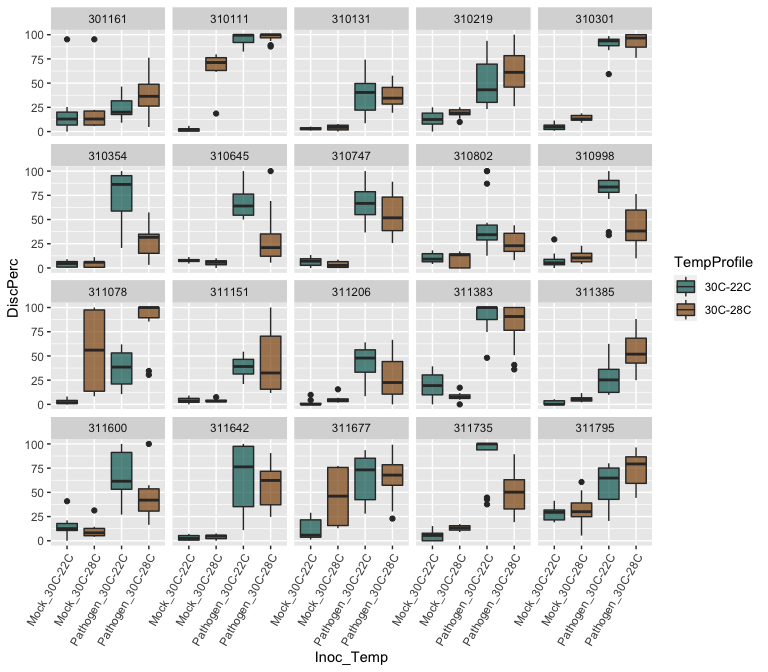

Data of 10 cultivars of rice inoculated with _B. glumae_ or mock inoculated.  Discoloration of spikelets were recorded and presented as percentage.


```r
library(tidyverse)
library(readxl)
library(ggplot2)
```


```r
rice_data <- read_excel("Spray-Data-06.18.20.xlsx", 
                        col_types = c("text", "numeric", "numeric",
                                      "numeric", "numeric","numeric"))
rice_data
```

```
## # A tibble: 320 x 6
##    Genotype   Rep `Mock_30C-22C` `Mock_30C-28C` `Pathogen_30C-2…
##    <chr>    <dbl>          <dbl>          <dbl>            <dbl>
##  1 310111       1           5.88           18.6             86.5
##  2 310111       2           2.48           79.7             82.6
##  3 310111       3           2.9            61.7            100  
##  4 310111       4           0              67.2             86.1
##  5 310111       5           1.76           75.4             98.6
##  6 310111       6           0              76.6             93.8
##  7 310111       7          NA              NA               85.7
##  8 310111       8          NA              NA              100  
##  9 310111       9          NA              NA              100  
## 10 310111      10          NA              NA              100  
## # … with 310 more rows, and 1 more variable: `Pathogen_30C-28C` <dbl>
```

We still have to "reshape" the table to make it in longer format coding a column for treatment (Mock vs Inoculated) and temperature profile (30-22 vs 30-28).


```r
(rice_data_long <- rice_data %>% 
  pivot_longer(cols = c("Mock_30C-22C", "Mock_30C-28C", 
                        "Pathogen_30C-22C", "Pathogen_30C-28C"),
               names_to = "Inoculation", 
               values_to = "DiscPerc") %>%
  separate(col = Inoculation, 
            sep = "_",
            into = c("Inoculation", "TempProfile")) %>% 
  unite("Inoc_Temp", Inoculation:TempProfile, remove = FALSE))
```

```
## # A tibble: 1,280 x 6
##    Genotype   Rep Inoc_Temp        Inoculation TempProfile DiscPerc
##    <chr>    <dbl> <chr>            <chr>       <chr>          <dbl>
##  1 310111       1 Mock_30C-22C     Mock        30C-22C         5.88
##  2 310111       1 Mock_30C-28C     Mock        30C-28C        18.6 
##  3 310111       1 Pathogen_30C-22C Pathogen    30C-22C        86.5 
##  4 310111       1 Pathogen_30C-28C Pathogen    30C-28C        93.6 
##  5 310111       2 Mock_30C-22C     Mock        30C-22C         2.48
##  6 310111       2 Mock_30C-28C     Mock        30C-28C        79.7 
##  7 310111       2 Pathogen_30C-22C Pathogen    30C-22C        82.6 
##  8 310111       2 Pathogen_30C-28C Pathogen    30C-28C       100   
##  9 310111       3 Mock_30C-22C     Mock        30C-22C         2.9 
## 10 310111       3 Mock_30C-28C     Mock        30C-28C        61.7 
## # … with 1,270 more rows
```

# Data Exploration
 
Separating mock from pathogen inoculated:


```r
ggplot(data = rice_data_long, aes(x = Genotype, y = DiscPerc)) +
  geom_boxplot(aes(fill = TempProfile)) +
  facet_grid(. ~ Inoculation) +
  coord_flip()
```

<!-- -->

Looking at genotype effect:


```r
ggplot(data = rice_data_long, aes(x = Inoc_Temp, y = DiscPerc)) +
  geom_boxplot(aes(fill = TempProfile)) +
  facet_wrap(Genotype ~ ., ncol = 5) +
  theme(axis.text.x = element_text(angle = 60, hjust = 1))
```

<!-- -->

# Clustering analysis


```r
library(FactoMineR)
library(factoextra)
```

```
## Welcome! Want to learn more? See two factoextra-related books at https://goo.gl/ve3WBa
```

