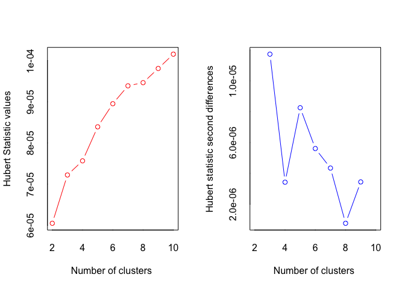

Data of 10 cultivars of rice inoculated with _B. glumae_ or mock inoculated.  Discoloration of spikelets were recorded and presented as percentage.


```r
library(tidyverse)
library(readxl)
library(ggplot2)
```


```r
rice_data <- read_excel("Spray-Data-06.18.20.xlsx", 
                        col_types = c("text", "numeric", "numeric",
                                      "numeric", "numeric","numeric"))
rice_data
```

```
## # A tibble: 320 x 6
##    Genotype   Rep `Mock_30C-22C` `Mock_30C-28C` `Pathogen_30C-2…
##    <chr>    <dbl>          <dbl>          <dbl>            <dbl>
##  1 310111       1           5.88           18.6             86.5
##  2 310111       2           2.48           79.7             82.6
##  3 310111       3           2.9            61.7            100  
##  4 310111       4           0              67.2             86.1
##  5 310111       5           1.76           75.4             98.6
##  6 310111       6           0              76.6             93.8
##  7 310111       7          NA              NA               85.7
##  8 310111       8          NA              NA              100  
##  9 310111       9          NA              NA              100  
## 10 310111      10          NA              NA              100  
## # … with 310 more rows, and 1 more variable: `Pathogen_30C-28C` <dbl>
```

We still have to "reshape" the table to make it in longer format coding a column for treatment (Mock vs Inoculated) and temperature profile (30-22 vs 30-28).


```r
rice_data_long <- rice_data %>% 
  pivot_longer(cols = c("Mock_30C-22C", "Mock_30C-28C", 
                        "Pathogen_30C-22C", "Pathogen_30C-28C"),
               names_to = "Inoculation", 
               values_to = "DiscPerc") %>%
  separate(col = Inoculation, 
            sep = "_",
            into = c("Inoculation", "TempProfile")) %>% 
  unite("Inoc_Temp", Inoculation:TempProfile, remove = FALSE)

#kableExtra::kable(rice_data_long, format = "markdown")
```

# Data Exploration
 
Separating mock from pathogen inoculated:


```r
ggplot(data = rice_data_long, aes(x = Genotype, y = DiscPerc)) +
  geom_boxplot(aes(fill = TempProfile)) +
  facet_grid(. ~ Inoculation) +
  coord_flip()
```

<!-- -->

Looking at genotype effect:


```r
ggplot(data = rice_data_long, aes(x = Inoc_Temp, y = DiscPerc)) +
  geom_boxplot(aes(fill = TempProfile)) +
  facet_wrap(Genotype ~ ., ncol = 5) +
  theme(axis.text.x = element_text(angle = 60, hjust = 1))
```

<!-- -->

# Clustering analysis

Since we are dealing with continous data on four different conditions with need to scale them to estimate their relationships.

## Kmeans


```r
library(FactoMineR)
library(factoextra)
```

```
## Welcome! Want to learn more? See two factoextra-related books at https://goo.gl/ve3WBa
```

```r
library(RColorBrewer)
```


```r
#Need to remove NAs
rice_data_NoNAs <- na.omit(rice_data)

#Scaling data
rice_matrix <- rice_data_NoNAs[,3:6]
row.names(rice_matrix) <- paste0(rice_data_NoNAs$Genotype,"_",rice_data_NoNAs$Rep)
```

```
## Warning: Setting row names on a tibble is deprecated.
```

```r
#K-means
set.seed(123)
km.res <- kmeans(scale(rice_matrix), 3, nstart = 10)

fviz_cluster(km.res, data = rice_matrix, labelsize = 8)
```

<!-- -->


```r
#Data Clusters
rice_Kcluster <- cbind(rice_data_NoNAs, km.res$cluster)

rice_Kcluster_data <- rice_Kcluster %>%
  pivot_longer(cols = c("Mock_30C-22C", "Mock_30C-28C", 
                        "Pathogen_30C-22C", "Pathogen_30C-28C"),
               names_to = "Inoculation", 
               values_to = "DiscPerc") %>%
  separate(col = Inoculation, 
            sep = "_",
            into = c("Inoculation", "TempProfile")) %>% 
  unite("Inoc_Temp", Inoculation:TempProfile, remove = FALSE) %>%
  rename(cluster = `km.res$cluster`)

ggplot(rice_Kcluster_data, aes(x = as.factor(cluster), y = DiscPerc)) + 
  geom_boxplot(aes(fill = Inoc_Temp))
```

<!-- -->


```r
(Kmeans_tolerant <- tibble(rice_Kcluster_data) %>% 
  filter(cluster == 1) %>%
  group_by(Genotype) %>%
  count(Genotype))
```

```
## # A tibble: 15 x 2
## # Groups:   Genotype [15]
##    Genotype     n
##    <chr>    <int>
##  1 301161      28
##  2 310131      24
##  3 310219      16
##  4 310354      20
##  5 310645      24
##  6 310747       8
##  7 310802      28
##  8 310998       8
##  9 311151      28
## 10 311206      32
## 11 311385      32
## 12 311600      20
## 13 311642      12
## 14 311677       8
## 15 311795       4
```


## Hierarchical clustering

```r
#Clustering
rice_hc <- hcut(rice_matrix, 3, stand = T)

#Graphical view
p <- fviz_dend(rice_hc, rect = T, cex=0.4)
p
```

<!-- -->

```r
#Data Clusters
rice_cluster <- cbind(rice_data_NoNAs, rice_hc$cluster)

rice_cluster_data <- rice_cluster %>%
  pivot_longer(cols = c("Mock_30C-22C", "Mock_30C-28C", 
                        "Pathogen_30C-22C", "Pathogen_30C-28C"),
               names_to = "Inoculation", 
               values_to = "DiscPerc") %>%
  separate(col = Inoculation, 
            sep = "_",
            into = c("Inoculation", "TempProfile")) %>% 
  unite("Inoc_Temp", Inoculation:TempProfile, remove = FALSE) %>%
  rename(cluster = `rice_hc$cluster`)

ggplot(rice_cluster_data, aes(x = as.factor(cluster), y = DiscPerc)) + 
  geom_boxplot(aes(fill = Inoc_Temp))
```

<!-- -->


```r
(cluster_tolerant <- tibble(rice_cluster_data) %>% 
  filter(cluster == 3) %>%
  group_by(Genotype) %>%
  count(Genotype))
```

```
## # A tibble: 14 x 2
## # Groups:   Genotype [14]
##    Genotype     n
##    <chr>    <int>
##  1 301161      24
##  2 310131      16
##  3 310219       8
##  4 310354      12
##  5 310645      16
##  6 310747       4
##  7 310802      28
##  8 310998       8
##  9 311151      12
## 10 311206      32
## 11 311385      28
## 12 311600      16
## 13 311642       8
## 14 311677       4
```
### Comparing hierarchical clusters and kmean clustering


```r
full_join(Kmeans_tolerant, cluster_tolerant, by = "Genotype") %>%
  rename(Kmeans = n.x, H_cluster = n.y)
```

```
## # A tibble: 15 x 3
## # Groups:   Genotype [15]
##    Genotype Kmeans H_cluster
##    <chr>     <int>     <int>
##  1 301161       28        24
##  2 310131       24        16
##  3 310219       16         8
##  4 310354       20        12
##  5 310645       24        16
##  6 310747        8         4
##  7 310802       28        28
##  8 310998        8         8
##  9 311151       28        12
## 10 311206       32        32
## 11 311385       32        28
## 12 311600       20        16
## 13 311642       12         8
## 14 311677        8         4
## 15 311795        4        NA
```


## PCA

This first one is using FactoMiner, 

```r
#Need to remove NAs
rice_data_NoNAs <- na.omit(rice_data)

#Creating Matrix for analysis
rice_matrix <- rice_data_NoNAs[,3:6]
row.names(rice_matrix) <- paste0(rice_data_NoNAs$Genotype,"_",rice_data_NoNAs$Rep)
```

```
## Warning: Setting row names on a tibble is deprecated.
```

```r
#PCA
rice_PCA <- prcomp(rice_matrix, center = T, scale. = T)


#Since we have 20 cultivars we need a palette with 20 colors
colors_n <- length(unique(rice_data_NoNAs$Genotype))
getPalette <- colorRampPalette(brewer.pal(9, "Dark2"))
```

```
## Warning in brewer.pal(9, "Dark2"): n too large, allowed maximum for palette Dark2 is 8
## Returning the palette you asked for with that many colors
```

```r
(PCA_rice <- fviz_pca_biplot(rice_PCA, col.var = "blue",
                label = "var", repel = T,
                habillage = rice_data_NoNAs$Genotype, addEllipses = TRUE, ellipse.level = 0.95,
             ellipse.type ="confidence") +
  scale_color_manual(values = getPalette(colors_n)) +
  scale_shape_manual(values = c(rep(19, 5), rep(16,5), rep(17,5), rep(18,5))))
```

```
## Scale for 'shape' is already present. Adding another scale for 'shape', which
## will replace the existing scale.
```

<!-- -->


```r
library(viridis)
```

```
## Loading required package: viridisLite
```

```r
#PCA
rice_PCA <- prcomp(rice_matrix, center = T, scale. = T)

#PCA
ggbiplot::ggbiplot(rice_PCA, obs.scale = 1, var.scale = 1) +
  geom_text(aes(label=rice_data_NoNAs$Genotype), size = 2, nudge_y = 0.2, alpha=0.5) +
  geom_point(aes(colour=rice_data_NoNAs$`Pathogen_30C-22C`)) +
  scale_color_viridis(name = "Mock_30C-22C", option = "D")
```

```
## ------------------------------------------------------------------------------
```

```
## You have loaded plyr after dplyr - this is likely to cause problems.
## If you need functions from both plyr and dplyr, please load plyr first, then dplyr:
## library(plyr); library(dplyr)
```

```
## ------------------------------------------------------------------------------
```

```
## 
## Attaching package: 'plyr'
```

```
## The following objects are masked from 'package:dplyr':
## 
##     arrange, count, desc, failwith, id, mutate, rename, summarise,
##     summarize
```

```
## The following object is masked from 'package:purrr':
## 
##     compact
```

```
## 
## Attaching package: 'scales'
```

```
## The following object is masked from 'package:viridis':
## 
##     viridis_pal
```

```
## The following object is masked from 'package:purrr':
## 
##     discard
```

```
## The following object is masked from 'package:readr':
## 
##     col_factor
```

<!-- -->


## Scratch


```r
rice_wider <- rice_data %>% pivot_wider(names_from = Rep, names_sep = "_", 
                          values_from = c("Mock_30C-22C", "Mock_30C-28C", 
                          "Pathogen_30C-22C", "Pathogen_30C-28C")) %>%
  column_to_rownames("Genotype")

rice_wider_NoNAs <- rice_data %>% 
  pivot_wider(names_from = Rep, names_sep = "_", 
                          values_from = c("Mock_30C-22C", "Mock_30C-28C", 
                          "Pathogen_30C-22C", "Pathogen_30C-28C")) %>%
  column_to_rownames("Genotype") 
```

